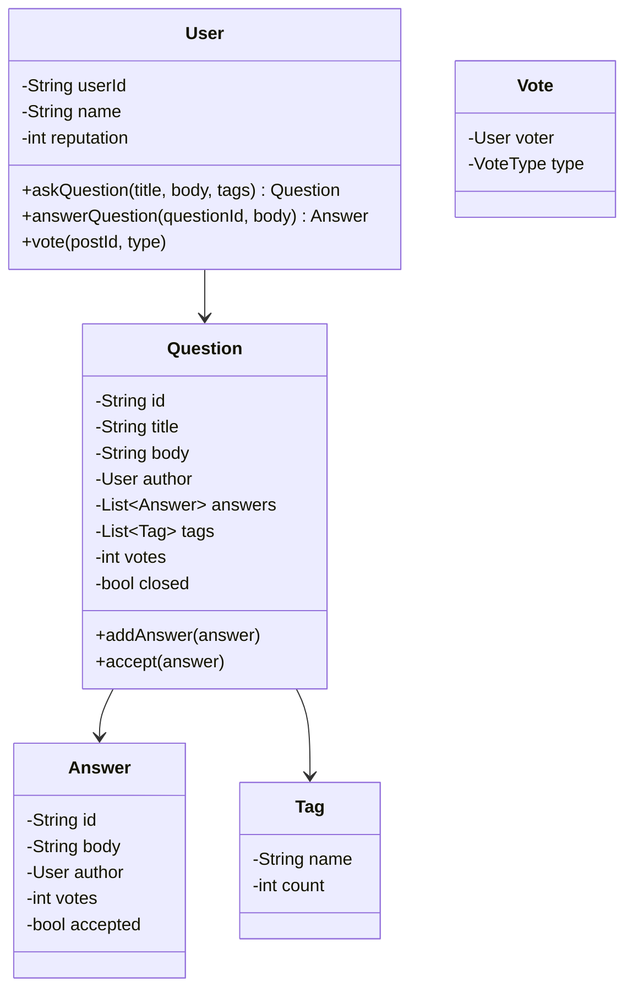
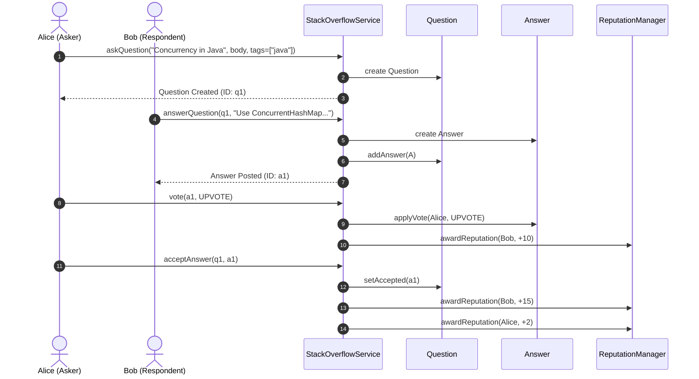

# Design Stack Overflow

## 1. Problem Statement
Design a Q&A platform like Stack Overflow with questions, answers, voting, tags, and reputation system.

## 2. Class Design



### Sequence Flow



## 3. Key Implementation (Python)

```python
from typing import List, Dict, Optional
from datetime import datetime
from enum import Enum

class VoteType(Enum):
    UPVOTE = 1
    DOWNVOTE = -1

class User:
    def __init__(self, user_id: str, name: str):
        self.user_id = user_id
        self.name = name
        self.reputation = 1

class Post:
    def __init__(self, post_id: str, body: str, author: User):
        self.post_id = post_id
        self.body = body
        self.author = author
        self.votes = 0
        self.created = datetime.now()
        self._voters: Dict[str, VoteType] = {}

    def vote(self, voter: User, vote_type: VoteType):
        if voter.user_id == self.author.user_id:
            raise ValueError("Can't vote on own post")
        prev = self._voters.get(voter.user_id)
        if prev == vote_type:
            return  # Already voted same way
        if prev:
            self.votes -= prev.value
            self.author.reputation -= (10 if prev == VoteType.UPVOTE else -2)
        self._voters[voter.user_id] = vote_type
        self.votes += vote_type.value
        self.author.reputation += (10 if vote_type == VoteType.UPVOTE else -2)

class Question(Post):
    def __init__(self, qid: str, title: str, body: str, author: User, tags: List[str]):
        super().__init__(qid, body, author)
        self.title = title
        self.tags = tags
        self.answers: List[Answer] = []
        self.accepted_answer: Optional[Answer] = None
        self.closed = False

    def add_answer(self, answer: 'Answer'):
        self.answers.append(answer)

    def accept_answer(self, answer: 'Answer'):
        if self.accepted_answer:
            self.accepted_answer.accepted = False
        answer.accepted = True
        answer.author.reputation += 15
        self.accepted_answer = answer

class Answer(Post):
    def __init__(self, aid: str, body: str, author: User):
        super().__init__(aid, body, author)
        self.accepted = False

class StackOverflow:
    def __init__(self):
        self.users: Dict[str, User] = {}
        self.questions: Dict[str, Question] = {}
        self._qid_counter = 0

    def register(self, user_id: str, name: str) -> User:
        user = User(user_id, name)
        self.users[user_id] = user
        return user

    def ask_question(self, user_id: str, title: str, body: str,
                     tags: List[str]) -> Question:
        self._qid_counter += 1
        q = Question(f"q{self._qid_counter}", title, body,
                     self.users[user_id], tags)
        self.questions[q.post_id] = q
        return q

    def answer_question(self, user_id: str, question_id: str, body: str) -> Answer:
        q = self.questions[question_id]
        a = Answer(f"a{len(q.answers)+1}", body, self.users[user_id])
        q.add_answer(a)
        return a

    def search_by_tag(self, tag: str) -> List[Question]:
        return [q for q in self.questions.values() if tag in q.tags]
```

### Java

```java
package com.lld.stackoverflow;

import java.time.Instant;
import java.util.*;
import java.util.concurrent.ConcurrentHashMap;
import java.util.concurrent.CopyOnWriteArrayList;
import java.util.concurrent.atomic.AtomicInteger;

enum VoteType {
    UPVOTE(1, 10),
    DOWNVOTE(-1, -2);

    final int delta;
    final int repChange;
    VoteType(int delta, int repChange) {
        this.delta = delta;
        this.repChange = repChange;
    }
}

class User {
    private final String userId;
    private final String name;
    private final AtomicInteger reputation = new AtomicInteger(1);

    public User(String userId, String name) {
        this.userId = userId;
        this.name = name;
    }

    public void adjustReputation(int delta) {
        reputation.addAndGet(delta);
    }

    public String getUserId() { return userId; }
    public String getName() { return name; }
    public int getReputation() { return reputation.get(); }
}

abstract class Post {
    private final String postId;
    private final String body;
    private final User author;
    private final AtomicInteger voteCount = new AtomicInteger(0);
    private final Map<String, VoteType> voters = new ConcurrentHashMap<>();
    private final Instant createdAt = Instant.now();

    public Post(String postId, String body, User author) {
        this.postId = postId;
        this.body = body;
        this.author = author;
    }

    public synchronized void vote(User voter, VoteType voteType) {
        if (voter.getUserId().equals(author.getUserId())) {
            throw new IllegalArgumentException("Cannot vote on own post");
        }
        VoteType prev = voters.get(voter.getUserId());
        if (prev == voteType) return; // Idempotent

        if (prev != null) {
            voteCount.addAndGet(-prev.delta);
            author.adjustReputation(-prev.repChange);
        }
        voters.put(voter.getUserId(), voteType);
        voteCount.addAndGet(voteType.delta);
        author.adjustReputation(voteType.repChange);
    }

    public String getPostId() { return postId; }
    public User getAuthor() { return author; }
    public int getVoteCount() { return voteCount.get(); }
}

class Question extends Post {
    private final String title;
    private final List<String> tags;
    private final List<Answer> answers = new CopyOnWriteArrayList<>();
    private volatile Answer acceptedAnswer;

    public Question(String qid, String title, String body, User author, List<String> tags) {
        super(qid, body, author);
        this.title = title;
        this.tags = tags;
    }

    public void addAnswer(Answer answer) { answers.add(answer); }

    public synchronized void acceptAnswer(Answer answer) {
        if (this.acceptedAnswer != null) {
            this.acceptedAnswer.setAccepted(false);
            this.acceptedAnswer.getAuthor().adjustReputation(-15);
        }
        this.acceptedAnswer = answer;
        answer.setAccepted(true);
        answer.getAuthor().adjustReputation(15);
        getAuthor().adjustReputation(2); // Bounty for accepting
    }

    public List<Answer> getAnswers() { return Collections.unmodifiableList(answers); }
    public List<String> getTags() { return tags; }
}

class Answer extends Post {
    private volatile boolean accepted = false;

    public Answer(String aid, String body, User author) {
        super(aid, body, author);
    }

    public void setAccepted(boolean accepted) { this.accepted = accepted; }
    public boolean isAccepted() { return accepted; }
}

public class StackOverflowService {
    private final Map<String, User> users = new ConcurrentHashMap<>();
    private final Map<String, Question> questions = new ConcurrentHashMap<>();
    private final AtomicInteger questionCounter = new AtomicInteger(0);

    public User registerUser(String id, String name) {
        User u = new User(id, name);
        users.put(id, u);
        return u;
    }

    public Question askQuestion(String userId, String title, String body, List<String> tags) {
        User user = users.get(userId);
        if (user == null) throw new IllegalArgumentException("User not registered");
        String qid = "q" + questionCounter.incrementAndGet();
        Question q = new Question(qid, title, body, user, tags);
        questions.put(qid, q);
        return q;
    }

    public Answer answerQuestion(String userId, String questionId, String body) {
        User user = users.get(userId);
        Question q = questions.get(questionId);
        if (user == null || q == null) throw new IllegalArgumentException("Invalid user or question");
        Answer a = new Answer("a" + UUID.randomUUID().toString().substring(0, 8), body, user);
        q.addAnswer(a);
        return a;
    }
}
```

---

## 4. Reputation System

| Action | Reputation Change |
|--------|------------------|
| Question upvoted | +10 |
| Question downvoted | -2 |
| Answer upvoted | +10 |
| Answer accepted | +15 |
| Accept an answer (asker) | +2 |

---

## Thread Safety Considerations

| Concern | Solution |
|---|---|
| Concurrent voting on single post | `synchronized void vote()` guarantees atomic score adjustments and eliminates double-voting |
| Reputation counter race | `AtomicInteger.addAndGet()` guarantees lock-free thread-safe reputation updates |
| Concurrent answer posting | `CopyOnWriteArrayList<Answer>` allows lock-free question reads while answers are dynamically posted |

## Extensibility & SOLID Principles

| Principle | Architectural Implementation |
|---|---|
| **S** — Single Responsibility | `Post` handles content & votes; `Question` adds taxonomy and acceptance; `ReputationManager` tracks user score |
| **O** — Open/Closed | New post subtypes (`Comment`, `WikiPost`) can inherit from `Post` without altering voting logic |
| **L** — Liskov Substitution | `Question` and `Answer` inherit cleanly from `Post`, preserving polymorphic voting mechanics |
| **D** — Dependency Inversion | Platform interacts with abstract `Post` references for moderation and voting |

---

## 5. Follow-ups
- **Search?** Full-text search with Elasticsearch. Inverted index on titles, bodies, and tags with TF-IDF/BM25 ranking.
- **Moderation?** Flagging state machine requiring reputation threshold (e.g., >3,000 rep) to access review queues.
- **Badges?** Observer pattern — listen to post upvotes, accepted answers, and award Gold/Silver/Bronze badges asynchronously.

---

**Related:** [[02 - Observer Pattern]] | [[01 - Strategy Pattern]]
