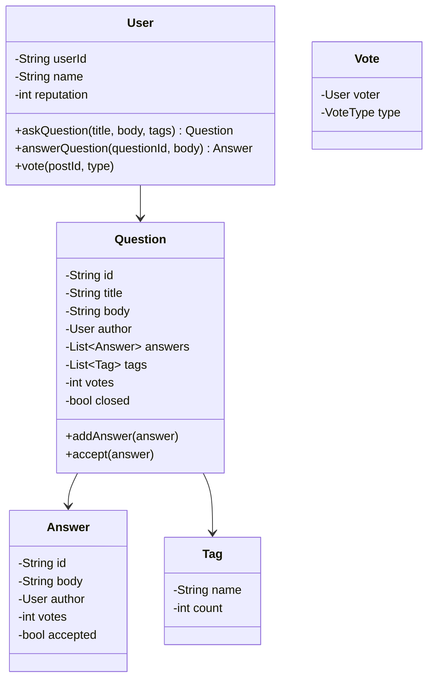

# Design Stack Overflow

## 1. Problem Statement
Design a Q&A platform like Stack Overflow with questions, answers, voting, tags, and reputation system.

## 2. Class Design



## 3. Key Implementation (Python)

```python
from typing import List, Dict, Optional
from datetime import datetime
from enum import Enum

class VoteType(Enum):
    UPVOTE = 1
    DOWNVOTE = -1

class User:
    def __init__(self, user_id: str, name: str):
        self.user_id = user_id
        self.name = name
        self.reputation = 1

class Post:
    def __init__(self, post_id: str, body: str, author: User):
        self.post_id = post_id
        self.body = body
        self.author = author
        self.votes = 0
        self.created = datetime.now()
        self._voters: Dict[str, VoteType] = {}

    def vote(self, voter: User, vote_type: VoteType):
        if voter.user_id == self.author.user_id:
            raise ValueError("Can't vote on own post")
        prev = self._voters.get(voter.user_id)
        if prev == vote_type:
            return  # Already voted same way
        if prev:
            self.votes -= prev.value
            self.author.reputation -= (10 if prev == VoteType.UPVOTE else -2)
        self._voters[voter.user_id] = vote_type
        self.votes += vote_type.value
        self.author.reputation += (10 if vote_type == VoteType.UPVOTE else -2)

class Question(Post):
    def __init__(self, qid: str, title: str, body: str, author: User, tags: List[str]):
        super().__init__(qid, body, author)
        self.title = title
        self.tags = tags
        self.answers: List[Answer] = []
        self.accepted_answer: Optional[Answer] = None
        self.closed = False

    def add_answer(self, answer: 'Answer'):
        self.answers.append(answer)

    def accept_answer(self, answer: 'Answer'):
        if self.accepted_answer:
            self.accepted_answer.accepted = False
        answer.accepted = True
        answer.author.reputation += 15
        self.accepted_answer = answer

class Answer(Post):
    def __init__(self, aid: str, body: str, author: User):
        super().__init__(aid, body, author)
        self.accepted = False

class StackOverflow:
    def __init__(self):
        self.users: Dict[str, User] = {}
        self.questions: Dict[str, Question] = {}
        self._qid_counter = 0

    def register(self, user_id: str, name: str) -> User:
        user = User(user_id, name)
        self.users[user_id] = user
        return user

    def ask_question(self, user_id: str, title: str, body: str,
                     tags: List[str]) -> Question:
        self._qid_counter += 1
        q = Question(f"q{self._qid_counter}", title, body,
                     self.users[user_id], tags)
        self.questions[q.post_id] = q
        return q

    def answer_question(self, user_id: str, question_id: str, body: str) -> Answer:
        q = self.questions[question_id]
        a = Answer(f"a{len(q.answers)+1}", body, self.users[user_id])
        q.add_answer(a)
        return a

    def search_by_tag(self, tag: str) -> List[Question]:
        return [q for q in self.questions.values() if tag in q.tags]
```

## 4. Reputation System
| Action | Reputation Change |
|--------|------------------|
| Question upvoted | +10 |
| Question downvoted | -2 |
| Answer upvoted | +10 |
| Answer accepted | +15 |
| Accept an answer (asker) | +2 |

## 5. Follow-ups
- **Search?** Full-text search with Elasticsearch. TF-IDF ranking.
- **Moderation?** Flag system, required reputation for actions.
- **Badges?** Observer pattern — check badge criteria on each action.

---

**Related:** [[02 - Observer Pattern]] | [[01 - Strategy Pattern]]
