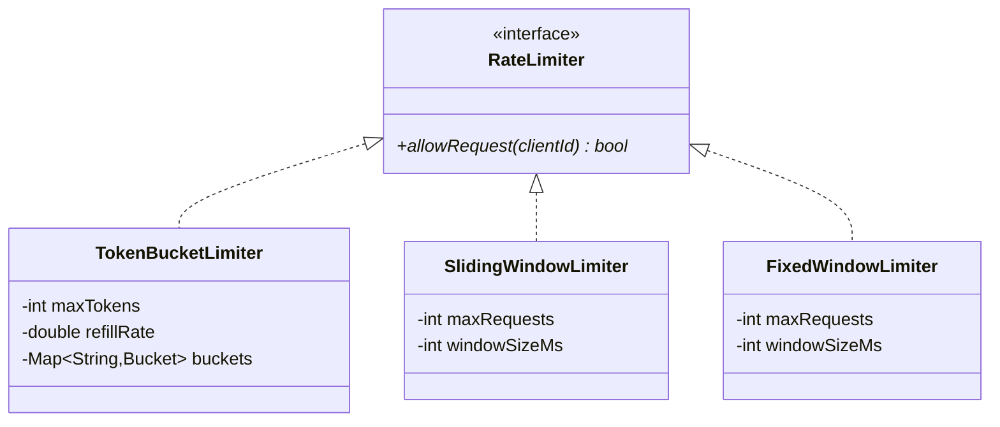

# Design a Rate Limiter

## 1. Problem Statement
Design a rate limiter that controls the number of requests per time window per client using different algorithms.

## 2. Class Design



## 3. Key Implementation (Python)

```python
import time, threading
from abc import ABC, abstractmethod
from collections import defaultdict, deque

class RateLimiter(ABC):
    @abstractmethod
    def allow_request(self, client_id: str) -> bool: pass

class TokenBucketLimiter(RateLimiter):
    def __init__(self, max_tokens: int, refill_rate: float):
        self.max_tokens = max_tokens
        self.refill_rate = refill_rate  # tokens per second
        self._buckets = {}
        self._lock = threading.Lock()

    def allow_request(self, client_id: str) -> bool:
        with self._lock:
            now = time.time()
            if client_id not in self._buckets:
                self._buckets[client_id] = [self.max_tokens, now]

            tokens, last_refill = self._buckets[client_id]
            elapsed = now - last_refill
            tokens = min(self.max_tokens, tokens + elapsed * self.refill_rate)

            if tokens >= 1:
                self._buckets[client_id] = [tokens - 1, now]
                return True
            self._buckets[client_id] = [tokens, now]
            return False

class SlidingWindowLogLimiter(RateLimiter):
    def __init__(self, max_requests: int, window_seconds: float):
        self.max_requests = max_requests
        self.window = window_seconds
        self._logs = defaultdict(deque)
        self._lock = threading.Lock()

    def allow_request(self, client_id: str) -> bool:
        with self._lock:
            now = time.time()
            log = self._logs[client_id]
            cutoff = now - self.window
            while log and log[0] < cutoff:
                log.popleft()
            if len(log) < self.max_requests:
                log.append(now)
                return True
            return False

class FixedWindowLimiter(RateLimiter):
    def __init__(self, max_requests: int, window_seconds: float):
        self.max_requests = max_requests
        self.window = window_seconds
        self._windows = {}
        self._lock = threading.Lock()

    def allow_request(self, client_id: str) -> bool:
        with self._lock:
            now = time.time()
            window_key = int(now // self.window)
            key = (client_id, window_key)
            self._windows[key] = self._windows.get(key, 0) + 1
            return self._windows[key] <= self.max_requests
```

## 4. Algorithm Comparison
| Algorithm | Pros | Cons |
|-----------|------|------|
| **Token Bucket** | Smooth, allows bursts | Memory per client |
| **Sliding Window Log** | Precise | O(N) space per window |
| **Fixed Window** | Simple, low memory | Boundary burst problem |
| **Sliding Window Counter** | Good accuracy, low memory | Approximation |

## 5. Follow-ups
- **Distributed?** Redis + Lua scripts for atomic operations.
- **Per-API-endpoint?** Composite key: `clientId:endpoint`.
- **Response headers?** `X-RateLimit-Limit`, `X-RateLimit-Remaining`, `Retry-After`.

---

**Related:** [[01 - Strategy Pattern]]
