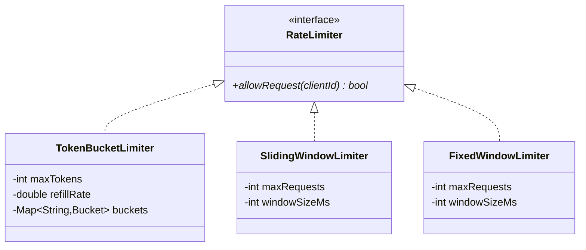
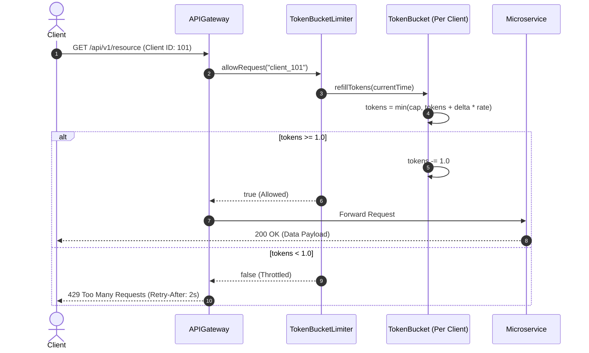

# Design a Rate Limiter

## 1. Problem Statement
Design a rate limiter that controls the number of requests per time window per client using different algorithms.

## 2. Class Design



### Sequence Flow



## 3. Key Implementation (Python)

```python
import time, threading
from abc import ABC, abstractmethod
from collections import defaultdict, deque

class RateLimiter(ABC):
    @abstractmethod
    def allow_request(self, client_id: str) -> bool: pass

class TokenBucketLimiter(RateLimiter):
    def __init__(self, max_tokens: int, refill_rate: float):
        self.max_tokens = max_tokens
        self.refill_rate = refill_rate  # tokens per second
        self._buckets = {}
        self._lock = threading.Lock()

    def allow_request(self, client_id: str) -> bool:
        with self._lock:
            now = time.time()
            if client_id not in self._buckets:
                self._buckets[client_id] = [self.max_tokens, now]

            tokens, last_refill = self._buckets[client_id]
            elapsed = now - last_refill
            tokens = min(self.max_tokens, tokens + elapsed * self.refill_rate)

            if tokens >= 1:
                self._buckets[client_id] = [tokens - 1, now]
                return True
            self._buckets[client_id] = [tokens, now]
            return False

class SlidingWindowLogLimiter(RateLimiter):
    def __init__(self, max_requests: int, window_seconds: float):
        self.max_requests = max_requests
        self.window = window_seconds
        self._logs = defaultdict(deque)
        self._lock = threading.Lock()

    def allow_request(self, client_id: str) -> bool:
        with self._lock:
            now = time.time()
            log = self._logs[client_id]
            cutoff = now - self.window
            while log and log[0] < cutoff:
                log.popleft()
            if len(log) < self.max_requests:
                log.append(now)
                return True
            return False

class FixedWindowLimiter(RateLimiter):
    def __init__(self, max_requests: int, window_seconds: float):
        self.max_requests = max_requests
        self.window = window_seconds
        self._windows = {}
        self._lock = threading.Lock()

    def allow_request(self, client_id: str) -> bool:
        with self._lock:
            now = time.time()
            window_key = int(now // self.window)
            key = (client_id, window_key)
            self._windows[key] = self._windows.get(key, 0) + 1
            return self._windows[key] <= self.max_requests
```

### Java

```java
package com.lld.ratelimiter;

import java.util.concurrent.ConcurrentHashMap;
import java.util.concurrent.locks.ReentrantLock;

public interface RateLimiter {
    boolean allowRequest(String clientId);
}

class TokenBucket {
    private final long capacity;
    private final double refillRatePerSecond;
    private double currentTokens;
    private long lastRefillTimestampNanos;
    private final ReentrantLock lock = new ReentrantLock();

    public TokenBucket(long capacity, double refillRatePerSecond) {
        this.capacity = capacity;
        this.refillRatePerSecond = refillRatePerSecond;
        this.currentTokens = capacity;
        this.lastRefillTimestampNanos = System.nanoTime();
    }

    public boolean tryConsume() {
        lock.lock();
        try {
            long now = System.nanoTime();
            double secondsElapsed = (now - lastRefillTimestampNanos) / 1_000_000_000.0;
            currentTokens = Math.min(capacity, currentTokens + secondsElapsed * refillRatePerSecond);
            lastRefillTimestampNanos = now;

            if (currentTokens >= 1.0) {
                currentTokens -= 1.0;
                return true;
            }
            return false;
        } finally {
            lock.unlock();
        }
    }
}

class TokenBucketRateLimiter implements RateLimiter {
    private final long capacity;
    private final double refillRatePerSecond;
    private final ConcurrentHashMap<String, TokenBucket> buckets = new ConcurrentHashMap<>();

    public TokenBucketRateLimiter(long capacity, double refillRatePerSecond) {
        this.capacity = capacity;
        this.refillRatePerSecond = refillRatePerSecond;
    }

    @Override
    public boolean allowRequest(String clientId) {
        TokenBucket bucket = buckets.computeIfAbsent(clientId, 
            k -> new TokenBucket(capacity, refillRatePerSecond));
        return bucket.tryConsume();
    }
}
```

---

## 4. Algorithm Comparison
| Algorithm | Pros | Cons |
|-----------|------|------|
| **Token Bucket** | Smooth, allows bursts | Memory per client |
| **Sliding Window Log** | Precise | O(N) space per window |
| **Fixed Window** | Simple, low memory | Boundary burst problem |
| **Sliding Window Counter** | Good accuracy, low memory | Approximation |

---

## Thread Safety Considerations

| Concern | Solution |
|---|---|
| Concurrent requests from same client | Per-bucket `ReentrantLock` ensures exact token deductions without locking other clients |
| Dynamic client registration | `ConcurrentHashMap.computeIfAbsent()` atomically creates client token buckets |
| High throughput clock resolution | `System.nanoTime()` provides monotonic sub-microsecond precision resistant to system clock shifts |

## Extensibility & SOLID Principles

| Principle | Architectural Implementation |
|---|---|
| **S** — Single Responsibility | `TokenBucket` handles refill math; `RateLimiter` maps clients to buckets |
| **O** — Open/Closed | Sliding Window, Leaky Bucket, and Token Bucket plug in via `RateLimiter` interface |
| **D** — Dependency Inversion | API Gateway depends on abstract `RateLimiter` interface |

---

## 5. Follow-ups
- **Distributed?** Redis + Lua scripts (`redis.call('get', key)`) for cluster-wide atomic token checks.
- **Per-API-endpoint?** Composite key: `clientId:endpoint` or tiered quotas by user subscription level.
- **Response headers?** Emit `X-RateLimit-Limit`, `X-RateLimit-Remaining`, and `Retry-After: <seconds>` on 429 rejects.

---

**Related:** [[01 - Strategy Pattern]]
