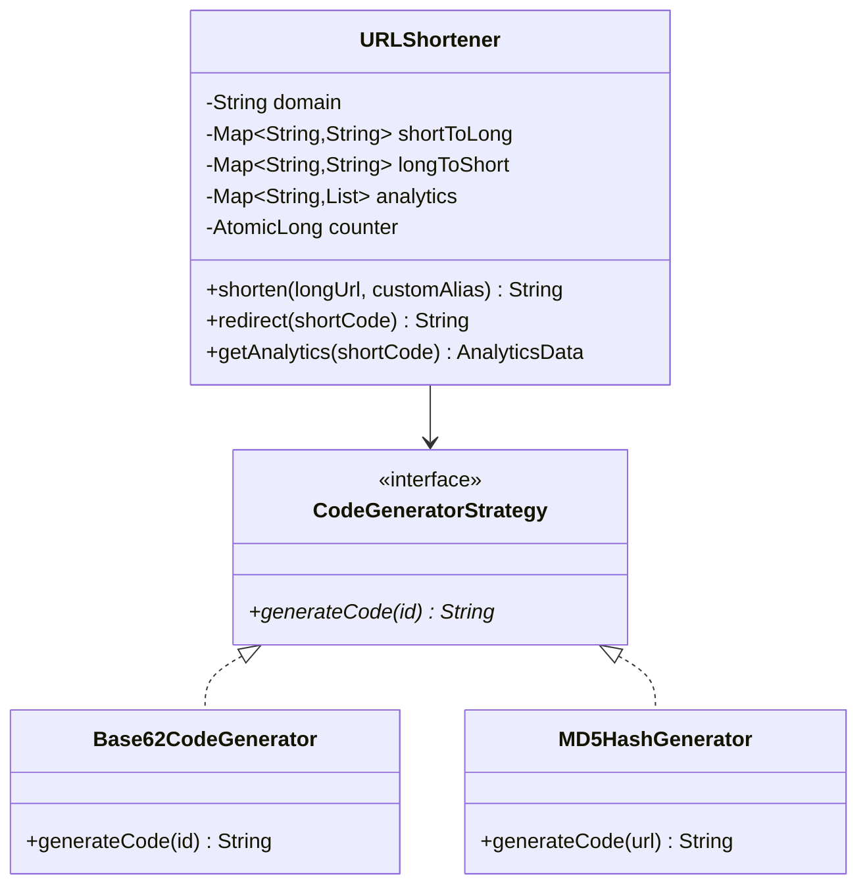
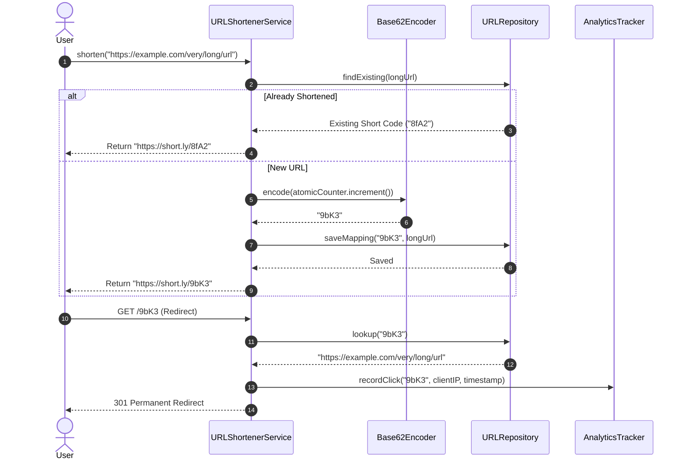

# Design a URL Shortener (LLD)

## 1. Problem Statement
Design the LLD for a URL shortener like bit.ly — creating short URLs, redirecting, tracking analytics.

## 2. Class Design



### Sequence Flow



## 3. Key Implementation (Python)

```python
import hashlib, string, time
from typing import Dict, Optional
from datetime import datetime

class URLShortener:
    BASE62 = string.ascii_letters + string.digits  # 62 chars
    
    def __init__(self, domain: str = "short.ly"):
        self.domain = domain
        self._url_map: Dict[str, str] = {}      # short → long
        self._reverse_map: Dict[str, str] = {}  # long → short
        self._analytics: Dict[str, list] = {}   # short → [click timestamps]
        self._counter = 100000  # Auto-increment counter

    def shorten(self, long_url: str, custom_alias: str = None) -> str:
        # Check if already shortened
        if long_url in self._reverse_map:
            return f"https://{self.domain}/{self._reverse_map[long_url]}"
        
        if custom_alias:
            if custom_alias in self._url_map:
                raise ValueError(f"Alias '{custom_alias}' already taken")
            short_code = custom_alias
        else:
            short_code = self._generate_code()

        self._url_map[short_code] = long_url
        self._reverse_map[long_url] = short_code
        self._analytics[short_code] = []
        return f"https://{self.domain}/{short_code}"

    def redirect(self, short_code: str) -> Optional[str]:
        long_url = self._url_map.get(short_code)
        if long_url:
            self._analytics[short_code].append(datetime.now())
        return long_url

    def get_analytics(self, short_code: str) -> dict:
        clicks = self._analytics.get(short_code, [])
        return {"total_clicks": len(clicks),
                "last_click": clicks[-1] if clicks else None}

    def _generate_code(self) -> str:
        """Base62 encode an auto-incrementing counter"""
        self._counter += 1
        return self._base62_encode(self._counter)

    def _base62_encode(self, num: int) -> str:
        if num == 0:
            return self.BASE62[0]
        result = []
        while num:
            result.append(self.BASE62[num % 62])
            num //= 62
        return ''.join(reversed(result))
```

### Java

```java
package com.lld.urlshortener;

import java.time.Instant;
import java.util.*;
import java.util.concurrent.ConcurrentHashMap;
import java.util.concurrent.CopyOnWriteArrayList;
import java.util.concurrent.atomic.AtomicLong;

public class URLShortenerService {
    private static final String BASE62 = "abcdefghijklmnopqrstuvwxyzABCDEFGHIJKLMNOPQRSTUVWXYZ0123456789";
    private final String domain;
    private final Map<String, String> shortToLong = new ConcurrentHashMap<>();
    private final Map<String, String> longToShort = new ConcurrentHashMap<>();
    private final Map<String, List<Instant>> clickAnalytics = new ConcurrentHashMap<>();
    private final AtomicLong counter = new AtomicLong(100_000L);

    public URLShortenerService(String domain) {
        this.domain = domain;
    }

    public String shorten(String longUrl, String customAlias) {
        String existing = longToShort.get(longUrl);
        if (existing != null && customAlias == null) {
            return "https://" + domain + "/" + existing;
        }

        String shortCode;
        if (customAlias != null && !customAlias.isBlank()) {
            if (shortToLong.putIfAbsent(customAlias, longUrl) != null) {
                throw new IllegalArgumentException("Alias already taken: " + customAlias);
            }
            shortCode = customAlias;
        } else {
            shortCode = encodeBase62(counter.incrementAndGet());
            shortToLong.put(shortCode, longUrl);
        }

        longToShort.put(longUrl, shortCode);
        clickAnalytics.put(shortCode, new CopyOnWriteArrayList<>());
        return "https://" + domain + "/" + shortCode;
    }

    public String redirect(String shortCode) {
        String longUrl = shortToLong.get(shortCode);
        if (longUrl != null) {
            clickAnalytics.computeIfPresent(shortCode, (k, v) -> {
                v.add(Instant.now());
                return v;
            });
        }
        return longUrl;
    }

    public int getClickCount(String shortCode) {
        List<Instant> clicks = clickAnalytics.get(shortCode);
        return (clicks != null) ? clicks.size() : 0;
    }

    private String encodeBase62(long num) {
        StringBuilder sb = new StringBuilder();
        while (num > 0) {
            sb.append(BASE62.charAt((int) (num % 62)));
            num /= 62;
        }
        return sb.reverse().toString();
    }
}
```

---

## 4. Short Code Generation Strategies

| Strategy | Approach | Pros | Cons |
|----------|----------|------|------|
| **Base62 Counter** | Auto-increment → base62 | No collision, predictable | Sequential, guessable |
| **MD5/SHA Hash** | Hash URL → take first 7 chars | Content-based | Collision possible |
| **Random** | Random 7-char string | Non-guessable | Collision check needed |
| **Snowflake ID** | Distributed unique IDs | Globally unique | Complex setup |

---

## Thread Safety Considerations

| Concern | Solution |
|---|---|
| Counter Collision | `AtomicLong.incrementAndGet()` guarantees unique collision-free ID generation |
| Custom Alias Race Condition | `ConcurrentHashMap.putIfAbsent()` atomically claims custom aliases |
| High-Throughput Redirection | Reading `shortToLong` is lock-free via `ConcurrentHashMap.get()` |

## Extensibility & SOLID Principles

| Principle | Architectural Implementation |
|---|---|
| **S** — Single Responsibility | `Base62Encoder` isolates mathematical encoding; Service manages storage & resolution |
| **O** — Open/Closed | Pluggable short-code algorithms (Hash vs Base62 vs Snowflake) via Strategy interface |
| **D** — Dependency Inversion | Service coordinates with an abstract `URLRepository` |

---

## 5. Follow-ups
- **Expiration?** TTL per URL stored in metadata; asynchronous background thread purges expired keys.
- **Rate limiting?** Token bucket per IP to prevent scraper abuse on shorten endpoint.
- **Custom domains?** Multi-tenant routing table resolving vanity subdomains (`brand.link/custom`).

---

**Related:** [[01 - Strategy Pattern]] | [[06 - Singleton Pattern]]

