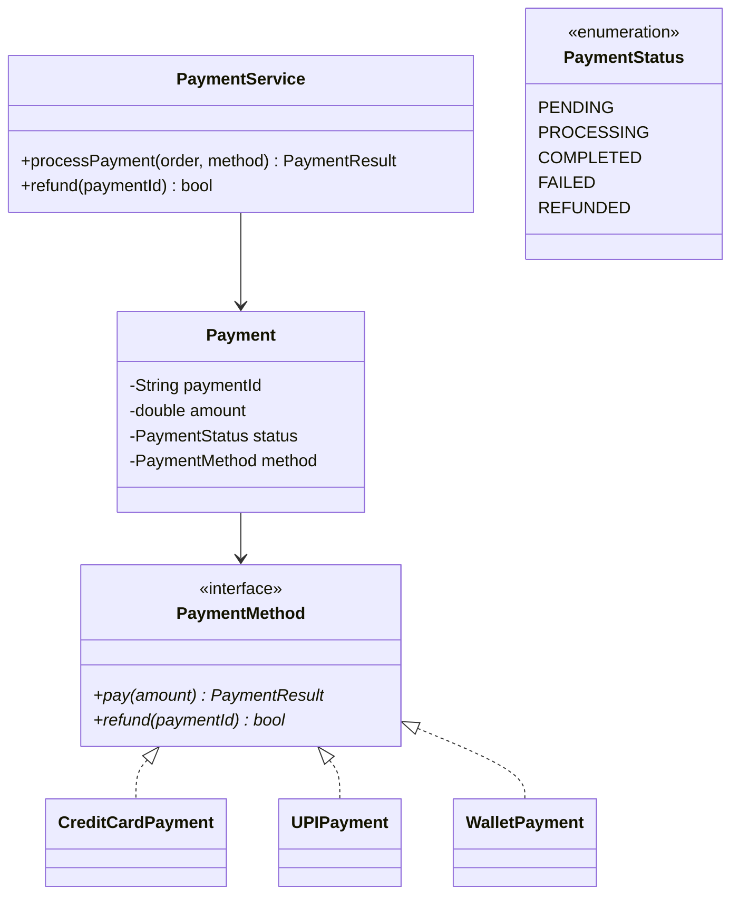
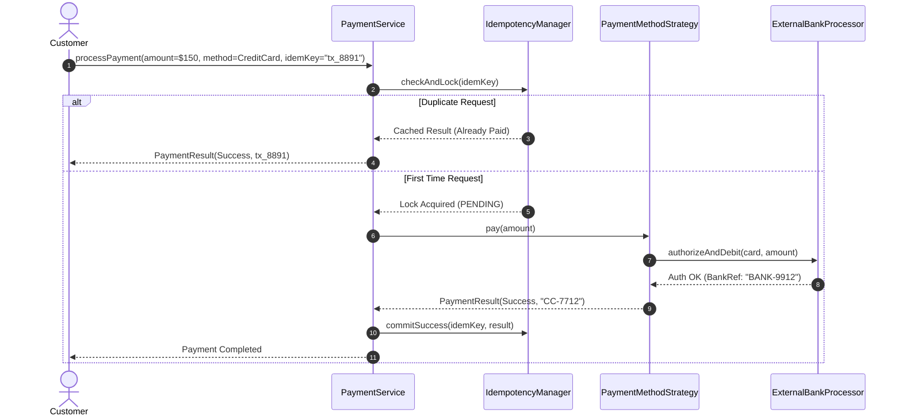

# Design a Payment Processing System

## 1. Problem Statement
Design a payment system supporting multiple payment methods (credit card, UPI, wallet), payment states, refunds, and retry logic.

## 2. Class Design



### Sequence Flow



## 3. Key Implementation (Python)

```python
from abc import ABC, abstractmethod
from enum import Enum
from typing import Optional
import uuid, time

class PaymentStatus(Enum):
    PENDING = "PENDING"
    PROCESSING = "PROCESSING"
    COMPLETED = "COMPLETED"
    FAILED = "FAILED"
    REFUNDED = "REFUNDED"

class PaymentResult:
    def __init__(self, success: bool, transaction_id: str = "", error: str = ""):
        self.success = success
        self.transaction_id = transaction_id
        self.error = error

class PaymentMethod(ABC):
    @abstractmethod
    def pay(self, amount: float) -> PaymentResult: pass
    @abstractmethod
    def refund(self, transaction_id: str) -> bool: pass

class CreditCardPayment(PaymentMethod):
    def __init__(self, card_number: str, cvv: str):
        self.card_number = card_number
    def pay(self, amount: float) -> PaymentResult:
        txn_id = f"CC-{uuid.uuid4().hex[:8]}"
        print(f"💳 Charging ${amount:.2f} to card ***{self.card_number[-4:]}")
        return PaymentResult(True, txn_id)
    def refund(self, txn_id: str) -> bool:
        print(f"↩️ Refunding transaction {txn_id}")
        return True

class UPIPayment(PaymentMethod):
    def __init__(self, upi_id: str):
        self.upi_id = upi_id
    def pay(self, amount: float) -> PaymentResult:
        txn_id = f"UPI-{uuid.uuid4().hex[:8]}"
        print(f"📱 UPI payment of ${amount:.2f} via {self.upi_id}")
        return PaymentResult(True, txn_id)
    def refund(self, txn_id: str) -> bool:
        return True

class Payment:
    def __init__(self, amount: float, method: PaymentMethod):
        self.payment_id = str(uuid.uuid4())[:8]
        self.amount = amount
        self.method = method
        self.status = PaymentStatus.PENDING
        self.transaction_id = ""

class PaymentService:
    def __init__(self, max_retries: int = 3):
        self.max_retries = max_retries
        self.payments = {}

    def process_payment(self, amount: float, method: PaymentMethod) -> Payment:
        payment = Payment(amount, method)
        payment.status = PaymentStatus.PROCESSING
        self.payments[payment.payment_id] = payment

        for attempt in range(self.max_retries):
            result = method.pay(amount)
            if result.success:
                payment.status = PaymentStatus.COMPLETED
                payment.transaction_id = result.transaction_id
                return payment
            time.sleep(0.5 * (2 ** attempt))  # Exponential backoff

        payment.status = PaymentStatus.FAILED
        return payment

    def refund(self, payment_id: str) -> bool:
        payment = self.payments.get(payment_id)
        if not payment or payment.status != PaymentStatus.COMPLETED:
            return False
        if payment.method.refund(payment.transaction_id):
            payment.status = PaymentStatus.REFUNDED
            return True
        return False
```

### Java

```java
package com.lld.payment;

import java.util.*;
import java.util.concurrent.ConcurrentHashMap;
import java.util.concurrent.locks.ReentrantLock;

enum PaymentStatus { PENDING, PROCESSING, COMPLETED, FAILED, REFUNDED }

class PaymentResult {
    private final boolean success;
    private final String transactionId;
    private final String errorMessage;

    public PaymentResult(boolean success, String transactionId, String errorMessage) {
        this.success = success;
        this.transactionId = transactionId;
        this.errorMessage = errorMessage;
    }
    public boolean isSuccess() { return success; }
    public String getTransactionId() { return transactionId; }
}

interface PaymentStrategy {
    PaymentResult pay(double amount);
    boolean refund(String transactionId);
}

class CreditCardStrategy implements PaymentStrategy {
    private final String maskedCard;
    public CreditCardStrategy(String cardNum) {
        this.maskedCard = "***" + cardNum.substring(Math.max(0, cardNum.length() - 4));
    }
    @Override
    public PaymentResult pay(double amount) {
        String txn = "CC-" + UUID.randomUUID().toString().substring(0, 8);
        return new PaymentResult(true, txn, null);
    }
    @Override
    public boolean refund(String txnId) { return true; }
}

public class PaymentService {
    private final Map<String, PaymentResult> idempotencyRecords = new ConcurrentHashMap<>();
    private final ReentrantLock lock = new ReentrantLock();

    public PaymentResult processPaymentWithIdempotency(String idempotencyKey, double amount, PaymentStrategy strategy) {
        // Fast path: idempotency cache hit
        PaymentResult existing = idempotencyRecords.get(idempotencyKey);
        if (existing != null) {
            return existing;
        }

        lock.lock();
        try {
            // Double check
            if (idempotencyRecords.containsKey(idempotencyKey)) {
                return idempotencyRecords.get(idempotencyKey);
            }
            PaymentResult result = strategy.pay(amount);
            idempotencyRecords.put(idempotencyKey, result);
            return result;
        } finally {
            lock.unlock();
        }
    }
}
```

---

## 4. Patterns: **Strategy** (payment methods) | **State** (payment lifecycle) | **Command** (transaction as command for undo)

---

## Thread Safety Considerations

| Concern | Solution |
|---|---|
| Double charge on concurrent retries | Idempotency key checked atomically via Double-Checked Locking on `ConcurrentHashMap` |
| State transition races | State mutations (`PROCESSING` $\to$ `COMPLETED` / `FAILED`) guarded under payment lock |
| Gateway timeout retries | Exponential backoff jitter prevents thundering herd on banking partner APIs |

## Extensibility & SOLID Principles

| Principle | Architectural Implementation |
|---|---|
| **S** — Single Responsibility | `PaymentStrategy` executes wire charge; `PaymentService` manages idempotency & retry state |
| **O** — Open/Closed | Apple Pay, Crypto, NetBanking plug-in as new `PaymentStrategy` implementations |
| **D** — Dependency Inversion | Core billing engine depends on abstract `PaymentStrategy` contracts |

---

## 5. Follow-ups
- **Idempotency?** Distributed idempotency store (Redis `SET NX EX 3600`) with cryptographic request payload hashing.
- **Webhook callbacks?** Asynchronous status updates via Observer pattern and Transactional Outbox pattern.
- **Multi-currency?** Decorator pattern to inject real-time FX conversion and gateway fee routing.

---

**Related:** [[01 - Strategy Pattern]] | [[13 - State Pattern]] | [[07 - Command Pattern]]

