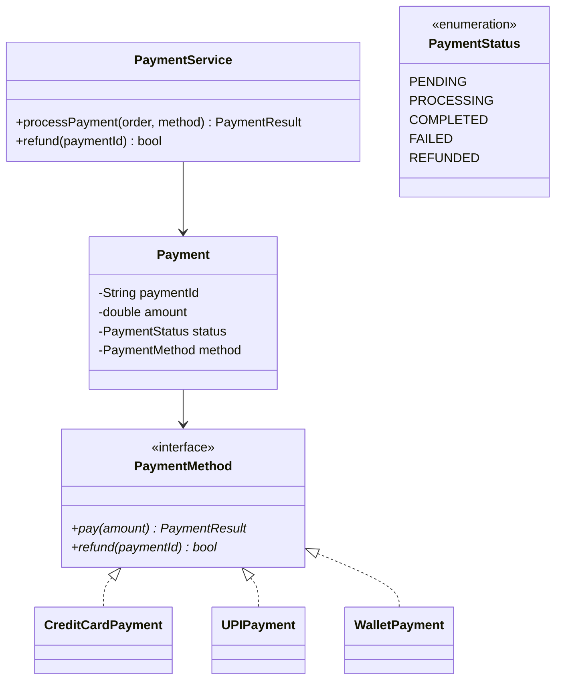

# Design a Payment Processing System

## 1. Problem Statement
Design a payment system supporting multiple payment methods (credit card, UPI, wallet), payment states, refunds, and retry logic.

## 2. Class Design



## 3. Key Implementation (Python)

```python
from abc import ABC, abstractmethod
from enum import Enum
from typing import Optional
import uuid, time

class PaymentStatus(Enum):
    PENDING = "PENDING"
    PROCESSING = "PROCESSING"
    COMPLETED = "COMPLETED"
    FAILED = "FAILED"
    REFUNDED = "REFUNDED"

class PaymentResult:
    def __init__(self, success: bool, transaction_id: str = "", error: str = ""):
        self.success = success
        self.transaction_id = transaction_id
        self.error = error

class PaymentMethod(ABC):
    @abstractmethod
    def pay(self, amount: float) -> PaymentResult: pass
    @abstractmethod
    def refund(self, transaction_id: str) -> bool: pass

class CreditCardPayment(PaymentMethod):
    def __init__(self, card_number: str, cvv: str):
        self.card_number = card_number
    def pay(self, amount: float) -> PaymentResult:
        txn_id = f"CC-{uuid.uuid4().hex[:8]}"
        print(f"💳 Charging ${amount:.2f} to card ***{self.card_number[-4:]}")
        return PaymentResult(True, txn_id)
    def refund(self, txn_id: str) -> bool:
        print(f"↩️ Refunding transaction {txn_id}")
        return True

class UPIPayment(PaymentMethod):
    def __init__(self, upi_id: str):
        self.upi_id = upi_id
    def pay(self, amount: float) -> PaymentResult:
        txn_id = f"UPI-{uuid.uuid4().hex[:8]}"
        print(f"📱 UPI payment of ${amount:.2f} via {self.upi_id}")
        return PaymentResult(True, txn_id)
    def refund(self, txn_id: str) -> bool:
        return True

class Payment:
    def __init__(self, amount: float, method: PaymentMethod):
        self.payment_id = str(uuid.uuid4())[:8]
        self.amount = amount
        self.method = method
        self.status = PaymentStatus.PENDING
        self.transaction_id = ""

class PaymentService:
    def __init__(self, max_retries: int = 3):
        self.max_retries = max_retries
        self.payments = {}

    def process_payment(self, amount: float, method: PaymentMethod) -> Payment:
        payment = Payment(amount, method)
        payment.status = PaymentStatus.PROCESSING
        self.payments[payment.payment_id] = payment

        for attempt in range(self.max_retries):
            result = method.pay(amount)
            if result.success:
                payment.status = PaymentStatus.COMPLETED
                payment.transaction_id = result.transaction_id
                return payment
            time.sleep(0.5 * (2 ** attempt))  # Exponential backoff

        payment.status = PaymentStatus.FAILED
        return payment

    def refund(self, payment_id: str) -> bool:
        payment = self.payments.get(payment_id)
        if not payment or payment.status != PaymentStatus.COMPLETED:
            return False
        if payment.method.refund(payment.transaction_id):
            payment.status = PaymentStatus.REFUNDED
            return True
        return False
```

## 4. Patterns: **Strategy** (payment methods) | **State** (payment lifecycle) | **Command** (transaction as command for undo)

## 5. Follow-ups
- **Idempotency?** Idempotency key per request to prevent double charges.
- **Webhook callbacks?** Observer pattern for async payment status updates.
- **Multi-currency?** Strategy for currency conversion and gateway selection.

---

**Related:** [[01 - Strategy Pattern]] | [[13 - State Pattern]] | [[07 - Command Pattern]]
