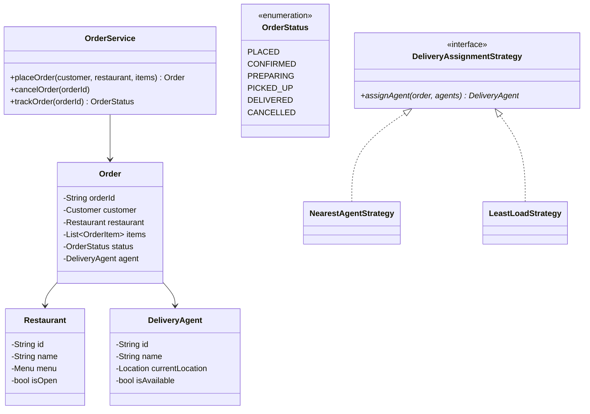
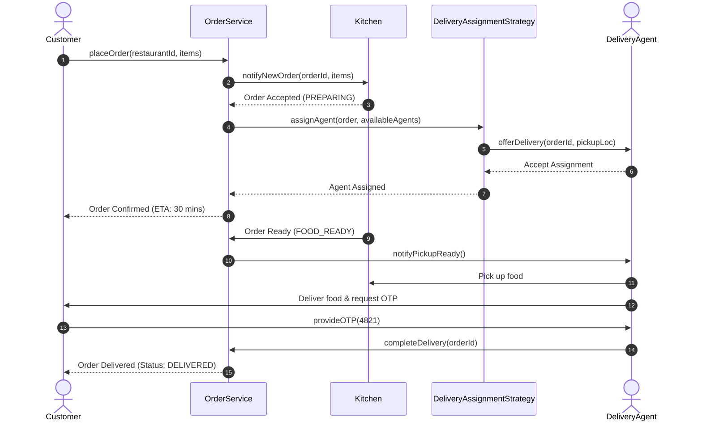

# Design a Food Delivery System (Swiggy/Zomato)

## 1. Problem Statement
Design a food delivery platform with restaurant browsing, ordering, delivery assignment, and order tracking.

## 2. Class Design



### Sequence Flow



## 3. Key Implementation (Python)

```python
from enum import Enum
from typing import List, Optional, Dict
import uuid, math

class OrderStatus(Enum):
    PLACED = "PLACED"
    CONFIRMED = "CONFIRMED"
    PREPARING = "PREPARING"
    PICKED_UP = "PICKED_UP"
    DELIVERED = "DELIVERED"
    CANCELLED = "CANCELLED"

class Location:
    def __init__(self, lat: float, lng: float):
        self.lat = lat
        self.lng = lng
    def distance_to(self, other: 'Location') -> float:
        return math.sqrt((self.lat - other.lat)**2 + (self.lng - other.lng)**2)

class MenuItem:
    def __init__(self, name: str, price: float):
        self.name = name
        self.price = price

class Restaurant:
    def __init__(self, rid: str, name: str, location: Location):
        self.id = rid
        self.name = name
        self.location = location
        self.menu: List[MenuItem] = []
        self.is_open = True

class DeliveryAgent:
    def __init__(self, agent_id: str, name: str, location: Location):
        self.id = agent_id
        self.name = name
        self.location = location
        self.is_available = True
        self.current_order: Optional[str] = None

class Order:
    def __init__(self, customer_id: str, restaurant: Restaurant, items: List[MenuItem]):
        self.order_id = str(uuid.uuid4())[:8]
        self.customer_id = customer_id
        self.restaurant = restaurant
        self.items = items
        self.total = sum(i.price for i in items)
        self.status = OrderStatus.PLACED
        self.agent: Optional[DeliveryAgent] = None

class OrderService:
    def __init__(self):
        self.orders: Dict[str, Order] = {}
        self.agents: List[DeliveryAgent] = []

    def place_order(self, customer_id: str, restaurant: Restaurant,
                   items: List[MenuItem]) -> Order:
        order = Order(customer_id, restaurant, items)
        self.orders[order.order_id] = order
        agent = self._assign_nearest_agent(restaurant.location)
        if agent:
            order.agent = agent
            agent.is_available = False
            agent.current_order = order.order_id
            order.status = OrderStatus.CONFIRMED
            print(f"✅ Order {order.order_id}: {agent.name} assigned")
        return order

    def update_status(self, order_id: str, status: OrderStatus):
        order = self.orders[order_id]
        order.status = status
        if status == OrderStatus.DELIVERED and order.agent:
            order.agent.is_available = True
            order.agent.current_order = None
        print(f"📦 Order {order_id}: {status.value}")

    def _assign_nearest_agent(self, restaurant_loc: Location) -> Optional[DeliveryAgent]:
        available = [a for a in self.agents if a.is_available]
        if not available:
            return None
        return min(available, key=lambda a: a.location.distance_to(restaurant_loc))
```

### Java

```java
package com.lld.fooddelivery;

import java.util.*;
import java.util.concurrent.ConcurrentHashMap;
import java.util.concurrent.CopyOnWriteArrayList;
import java.util.concurrent.locks.ReentrantLock;

enum OrderStatus { PLACED, CONFIRMED, PREPARING, PICKED_UP, DELIVERED, CANCELLED }

class Location {
    private final double lat;
    private final double lng;

    public Location(double lat, double lng) {
        this.lat = lat;
        this.lng = lng;
    }

    public double distanceTo(Location other) {
        return Math.hypot(this.lat - other.lat, this.lng - other.lng);
    }
}

class MenuItem {
    private final String name;
    private final double price;

    public MenuItem(String name, double price) {
        this.name = name;
        this.price = price;
    }
    public double getPrice() { return price; }
    public String getName() { return name; }
}

class DeliveryAgent {
    private final String agentId;
    private final String name;
    private volatile Location location;
    private volatile boolean available = true;

    public DeliveryAgent(String agentId, String name, Location location) {
        this.agentId = agentId;
        this.name = name;
        this.location = location;
    }

    public synchronized boolean tryAssign() {
        if (available) {
            available = false;
            return true;
        }
        return false;
    }

    public synchronized void release() { available = true; }
    public boolean isAvailable() { return available; }
    public Location getLocation() { return location; }
    public String getName() { return name; }
}

public class FoodDeliveryService {
    private final Map<String, OrderStatus> orderStatuses = new ConcurrentHashMap<>();
    private final List<DeliveryAgent> agents = new CopyOnWriteArrayList<>();
    private final ReentrantLock dispatchLock = new ReentrantLock();

    public void registerAgent(DeliveryAgent agent) {
        agents.add(agent);
    }

    public DeliveryAgent dispatchNearestAgent(Location restaurantLoc) {
        dispatchLock.lock();
        try {
            DeliveryAgent best = null;
            double minDist = Double.MAX_VALUE;

            for (DeliveryAgent agent : agents) {
                if (agent.isAvailable()) {
                    double dist = agent.getLocation().distanceTo(restaurantLoc);
                    if (dist < minDist) {
                        minDist = dist;
                        best = agent;
                    }
                }
            }
            if (best != null && best.tryAssign()) {
                return best;
            }
            return null;
        } finally {
            dispatchLock.unlock();
        }
    }
}
```

---

## 4. Patterns: **Strategy** (delivery assignment) | **State** (order status) | **Observer** (real-time tracking)

---

## Thread Safety Considerations

| Concern | Solution |
|---|---|
| Concurrent driver assignment race | `dispatchLock` and `DeliveryAgent.tryAssign()` prevent double-assigning the same courier |
| Live location updates | Volatile `Location` fields allow concurrent reads by distance algorithms |
| Status pipeline transitions | ConcurrentHashMap holds thread-safe order progression states |

## Extensibility & SOLID Principles

| Principle | Architectural Implementation |
|---|---|
| **S** — Single Responsibility | `DeliveryAssignmentStrategy` isolates routing algorithms from cart/order logic |
| **O** — Open/Closed | Pluggable dispatch algorithms (Nearest, Highest Rated, Batch Pooling) via Strategy pattern |
| **D** — Dependency Inversion | Dispatcher depends on abstract `LocationAware` interface |

---

## 5. Follow-ups
- **ETA calculation?** Factor in distance, live traffic coefficients, and historical kitchen prep time.
- **Surge pricing?** Strategy pattern dynamically recalculating delivery fees based on active demand/supply ratio.
- **Rating system?** Separate `RatingService` for decoupled restaurant and delivery partner review aggregation.
- **Cart management?** Enforce single restaurant origin per active cart session; prompt user on switch.

---

**Related:** [[01 - Strategy Pattern]] | [[13 - State Pattern]] | [[02 - Observer Pattern]]

