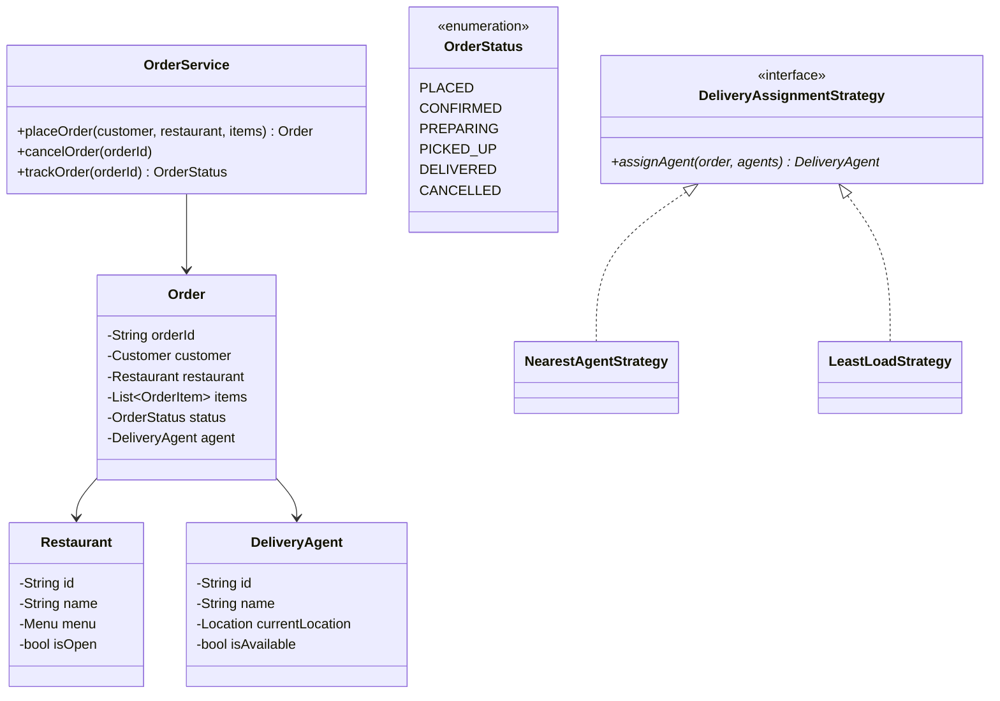

# Design a Food Delivery System (Swiggy/Zomato)

## 1. Problem Statement
Design a food delivery platform with restaurant browsing, ordering, delivery assignment, and order tracking.

## 2. Class Design



## 3. Key Implementation (Python)

```python
from enum import Enum
from typing import List, Optional, Dict
import uuid, math

class OrderStatus(Enum):
    PLACED = "PLACED"
    CONFIRMED = "CONFIRMED"
    PREPARING = "PREPARING"
    PICKED_UP = "PICKED_UP"
    DELIVERED = "DELIVERED"
    CANCELLED = "CANCELLED"

class Location:
    def __init__(self, lat: float, lng: float):
        self.lat = lat
        self.lng = lng
    def distance_to(self, other: 'Location') -> float:
        return math.sqrt((self.lat - other.lat)**2 + (self.lng - other.lng)**2)

class MenuItem:
    def __init__(self, name: str, price: float):
        self.name = name
        self.price = price

class Restaurant:
    def __init__(self, rid: str, name: str, location: Location):
        self.id = rid
        self.name = name
        self.location = location
        self.menu: List[MenuItem] = []
        self.is_open = True

class DeliveryAgent:
    def __init__(self, agent_id: str, name: str, location: Location):
        self.id = agent_id
        self.name = name
        self.location = location
        self.is_available = True
        self.current_order: Optional[str] = None

class Order:
    def __init__(self, customer_id: str, restaurant: Restaurant, items: List[MenuItem]):
        self.order_id = str(uuid.uuid4())[:8]
        self.customer_id = customer_id
        self.restaurant = restaurant
        self.items = items
        self.total = sum(i.price for i in items)
        self.status = OrderStatus.PLACED
        self.agent: Optional[DeliveryAgent] = None

class OrderService:
    def __init__(self):
        self.orders: Dict[str, Order] = {}
        self.agents: List[DeliveryAgent] = []

    def place_order(self, customer_id: str, restaurant: Restaurant,
                   items: List[MenuItem]) -> Order:
        order = Order(customer_id, restaurant, items)
        self.orders[order.order_id] = order
        agent = self._assign_nearest_agent(restaurant.location)
        if agent:
            order.agent = agent
            agent.is_available = False
            agent.current_order = order.order_id
            order.status = OrderStatus.CONFIRMED
            print(f"✅ Order {order.order_id}: {agent.name} assigned")
        return order

    def update_status(self, order_id: str, status: OrderStatus):
        order = self.orders[order_id]
        order.status = status
        if status == OrderStatus.DELIVERED and order.agent:
            order.agent.is_available = True
            order.agent.current_order = None
        print(f"📦 Order {order_id}: {status.value}")

    def _assign_nearest_agent(self, restaurant_loc: Location) -> Optional[DeliveryAgent]:
        available = [a for a in self.agents if a.is_available]
        if not available:
            return None
        return min(available, key=lambda a: a.location.distance_to(restaurant_loc))
```

## 4. Patterns: **Strategy** (delivery assignment) | **State** (order status) | **Observer** (real-time tracking)

## 5. Follow-ups
- **ETA calculation?** Factor in distance, traffic, preparation time.
- **Surge pricing?** Strategy pattern based on demand/supply ratio.
- **Rating system?** Separate `RatingService` for restaurant and agent ratings.
- **Cart management?** Single restaurant per cart, clear on restaurant switch.

---

**Related:** [[01 - Strategy Pattern]] | [[13 - State Pattern]] | [[02 - Observer Pattern]]
