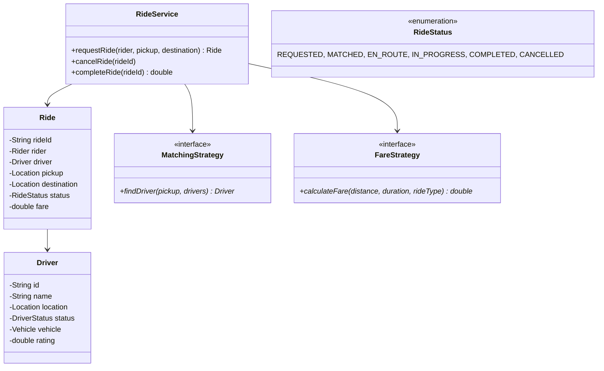

# Design a Ride-Sharing System (Uber/Ola)

## 1. Problem Statement
Design a ride-sharing platform with ride requests, driver matching, fare estimation, and ride tracking.

## 2. Class Design



## 3. Key Implementation (Python)

```python
from enum import Enum
from typing import List, Optional
import math, uuid

class RideStatus(Enum):
    REQUESTED = "REQUESTED"
    MATCHED = "MATCHED"
    EN_ROUTE = "EN_ROUTE"
    IN_PROGRESS = "IN_PROGRESS"
    COMPLETED = "COMPLETED"
    CANCELLED = "CANCELLED"

class RideType(Enum):
    ECONOMY = (1.0, "Economy")
    PREMIUM = (1.8, "Premium")
    POOL = (0.6, "Pool")

class Location:
    def __init__(self, lat: float, lng: float):
        self.lat, self.lng = lat, lng
    def distance_to(self, other: 'Location') -> float:
        return math.sqrt((self.lat - other.lat)**2 + (self.lng - other.lng)**2)

class Driver:
    def __init__(self, did: str, name: str, location: Location):
        self.id = did
        self.name = name
        self.location = location
        self.is_available = True
        self.rating = 5.0

class Ride:
    def __init__(self, rider_id: str, pickup: Location, dest: Location, ride_type: RideType):
        self.ride_id = str(uuid.uuid4())[:8]
        self.rider_id = rider_id
        self.pickup = pickup
        self.destination = dest
        self.ride_type = ride_type
        self.status = RideStatus.REQUESTED
        self.driver: Optional[Driver] = None
        self.fare = 0.0

class RideService:
    BASE_FARE = 2.0
    PER_KM_RATE = 1.5

    def __init__(self):
        self.rides = {}
        self.drivers: List[Driver] = []

    def request_ride(self, rider_id: str, pickup: Location,
                     dest: Location, ride_type: RideType = RideType.ECONOMY) -> Optional[Ride]:
        ride = Ride(rider_id, pickup, dest, ride_type)
        driver = self._find_nearest_driver(pickup)
        if not driver:
            print("❌ No drivers available")
            return None

        ride.driver = driver
        ride.status = RideStatus.MATCHED
        driver.is_available = False
        ride.fare = self._calculate_fare(pickup, dest, ride_type)
        self.rides[ride.ride_id] = ride
        print(f"🚗 Ride {ride.ride_id}: {driver.name} matched. Fare: ${ride.fare:.2f}")
        return ride

    def complete_ride(self, ride_id: str):
        ride = self.rides[ride_id]
        ride.status = RideStatus.COMPLETED
        ride.driver.is_available = True
        print(f"✅ Ride completed. Fare: ${ride.fare:.2f}")

    def _find_nearest_driver(self, pickup: Location) -> Optional[Driver]:
        available = [d for d in self.drivers if d.is_available]
        return min(available, key=lambda d: d.location.distance_to(pickup)) if available else None

    def _calculate_fare(self, pickup: Location, dest: Location, ride_type: RideType) -> float:
        distance = pickup.distance_to(dest)
        return round((self.BASE_FARE + distance * self.PER_KM_RATE) * ride_type.value[0], 2)
```

## 4. Patterns: **Strategy** (matching + fare + surge pricing) | **State** (ride lifecycle) | **Observer** (real-time tracking)

## 5. Follow-ups
- **Surge pricing?** Multiplier based on demand/supply ratio in area.
- **Ride pooling?** Match multiple riders on similar routes.
- **Driver incentives?** Bonus for completing N rides per day.

---

**Related:** [[01 - Strategy Pattern]] | [[13 - State Pattern]] | [[02 - Observer Pattern]]
