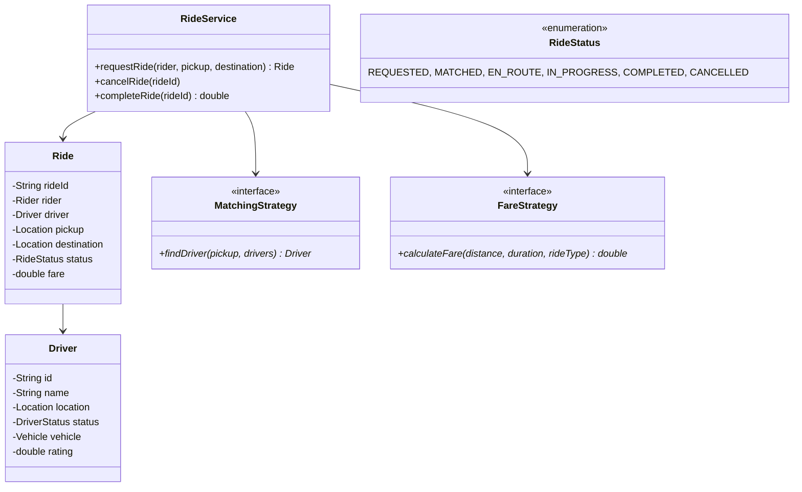
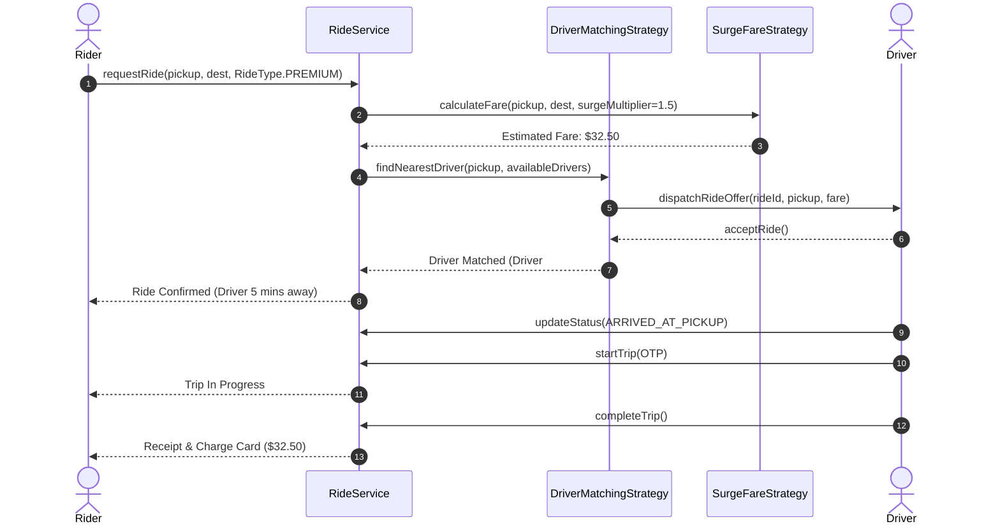

# Design a Ride-Sharing System (Uber/Ola)

## 1. Problem Statement
Design a ride-sharing platform with ride requests, driver matching, fare estimation, and ride tracking.

## 2. Class Design



### Sequence Flow



## 3. Key Implementation (Python)

```python
from enum import Enum
from typing import List, Optional
import math, uuid

class RideStatus(Enum):
    REQUESTED = "REQUESTED"
    MATCHED = "MATCHED"
    EN_ROUTE = "EN_ROUTE"
    IN_PROGRESS = "IN_PROGRESS"
    COMPLETED = "COMPLETED"
    CANCELLED = "CANCELLED"

class RideType(Enum):
    ECONOMY = (1.0, "Economy")
    PREMIUM = (1.8, "Premium")
    POOL = (0.6, "Pool")

class Location:
    def __init__(self, lat: float, lng: float):
        self.lat, self.lng = lat, lng
    def distance_to(self, other: 'Location') -> float:
        return math.sqrt((self.lat - other.lat)**2 + (self.lng - other.lng)**2)

class Driver:
    def __init__(self, did: str, name: str, location: Location):
        self.id = did
        self.name = name
        self.location = location
        self.is_available = True
        self.rating = 5.0

class Ride:
    def __init__(self, rider_id: str, pickup: Location, dest: Location, ride_type: RideType):
        self.ride_id = str(uuid.uuid4())[:8]
        self.rider_id = rider_id
        self.pickup = pickup
        self.destination = dest
        self.ride_type = ride_type
        self.status = RideStatus.REQUESTED
        self.driver: Optional[Driver] = None
        self.fare = 0.0

class RideService:
    BASE_FARE = 2.0
    PER_KM_RATE = 1.5

    def __init__(self):
        self.rides = {}
        self.drivers: List[Driver] = []

    def request_ride(self, rider_id: str, pickup: Location,
                     dest: Location, ride_type: RideType = RideType.ECONOMY) -> Optional[Ride]:
        ride = Ride(rider_id, pickup, dest, ride_type)
        driver = self._find_nearest_driver(pickup)
        if not driver:
            print("❌ No drivers available")
            return None

        ride.driver = driver
        ride.status = RideStatus.MATCHED
        driver.is_available = False
        ride.fare = self._calculate_fare(pickup, dest, ride_type)
        self.rides[ride.ride_id] = ride
        print(f"🚗 Ride {ride.ride_id}: {driver.name} matched. Fare: ${ride.fare:.2f}")
        return ride

    def complete_ride(self, ride_id: str):
        ride = self.rides[ride_id]
        ride.status = RideStatus.COMPLETED
        ride.driver.is_available = True
        print(f"✅ Ride completed. Fare: ${ride.fare:.2f}")

    def _find_nearest_driver(self, pickup: Location) -> Optional[Driver]:
        available = [d for d in self.drivers if d.is_available]
        return min(available, key=lambda d: d.location.distance_to(pickup)) if available else None

    def _calculate_fare(self, pickup: Location, dest: Location, ride_type: RideType) -> float:
        distance = pickup.distance_to(dest)
        return round((self.BASE_FARE + distance * self.PER_KM_RATE) * ride_type.value[0], 2)
```

### Java

```java
package com.lld.ridesharing;

import java.util.*;
import java.util.concurrent.ConcurrentHashMap;
import java.util.concurrent.CopyOnWriteArrayList;
import java.util.concurrent.locks.ReentrantLock;

enum RideStatus { REQUESTED, MATCHED, EN_ROUTE, IN_PROGRESS, COMPLETED, CANCELLED }

class Location {
    private final double lat;
    private final double lng;

    public Location(double lat, double lng) {
        this.lat = lat;
        this.lng = lng;
    }

    public double distanceTo(Location other) {
        return Math.hypot(this.lat - other.lat, this.lng - other.lng);
    }
}

class Driver {
    private final String driverId;
    private final String name;
    private volatile Location location;
    private volatile boolean available = true;

    public Driver(String driverId, String name, Location location) {
        this.driverId = driverId;
        this.name = name;
        this.location = location;
    }

    public synchronized boolean lockDriver() {
        if (available) {
            available = false;
            return true;
        }
        return false;
    }

    public synchronized void releaseDriver() { available = true; }
    public boolean isAvailable() { return available; }
    public Location getLocation() { return location; }
    public String getName() { return name; }
}

public class RideSharingService {
    private final List<Driver> drivers = new CopyOnWriteArrayList<>();
    private final Map<String, RideStatus> activeRides = new ConcurrentHashMap<>();
    private final ReentrantLock matchLock = new ReentrantLock();

    public void registerDriver(Driver driver) { drivers.add(driver); }

    public Driver matchNearestDriver(Location pickup) {
        matchLock.lock();
        try {
            Driver bestDriver = null;
            double minDistance = Double.MAX_VALUE;

            for (Driver driver : drivers) {
                if (driver.isAvailable()) {
                    double dist = driver.getLocation().distanceTo(pickup);
                    if (dist < minDistance) {
                        minDistance = dist;
                        bestDriver = driver;
                    }
                }
            }
            if (bestDriver != null && bestDriver.lockDriver()) {
                return bestDriver;
            }
            return null;
        } finally {
            matchLock.unlock();
        }
    }
}
```

---

## 4. Patterns: **Strategy** (matching + fare + surge pricing) | **State** (ride lifecycle) | **Observer** (real-time tracking)

---

## Thread Safety Considerations

| Concern | Solution |
|---|---|
| Race on driver assignment | `matchLock` combined with `Driver.lockDriver()` guarantees no two riders are matched with identical driver |
| Real-time driver telemetry | Volatile `Location` fields allow concurrent reads by distance proximity algorithms |
| Trip state progression | `ConcurrentHashMap` holds thread-safe ride status mutations |

## Extensibility & SOLID Principles

| Principle | Architectural Implementation |
|---|---|
| **S** — Single Responsibility | `DriverMatchingStrategy` handles spatial search; `FareStrategy` handles pricing; `Ride` tracks lifecycle |
| **O** — Open/Closed | Surge pricing, pooled rides, and VIP tiers extend via Strategy pattern without modifying core matching |
| **D** — Dependency Inversion | High-level `RideService` depends on abstract `MatchingStrategy` contracts |

---

## 5. Follow-ups
- **Surge pricing?** Multiplier based on real-time spatial H3 hexagonal demand/supply clustering.
- **Ride pooling?** Dynamic route insertion heuristic (Detour tolerance $\le 10$ minutes).
- **Driver incentives?** Observer pattern triggering daily streak bonuses on ride completions.

---

**Related:** [[01 - Strategy Pattern]] | [[13 - State Pattern]] | [[02 - Observer Pattern]]

