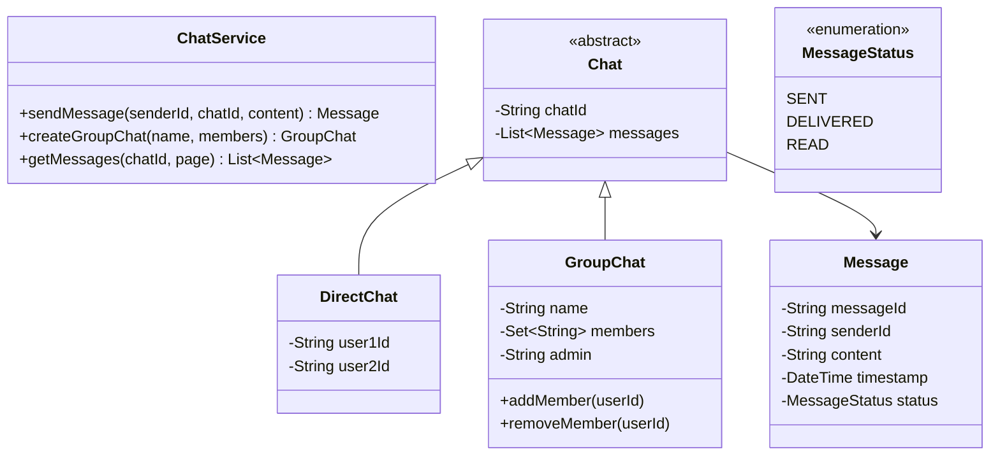
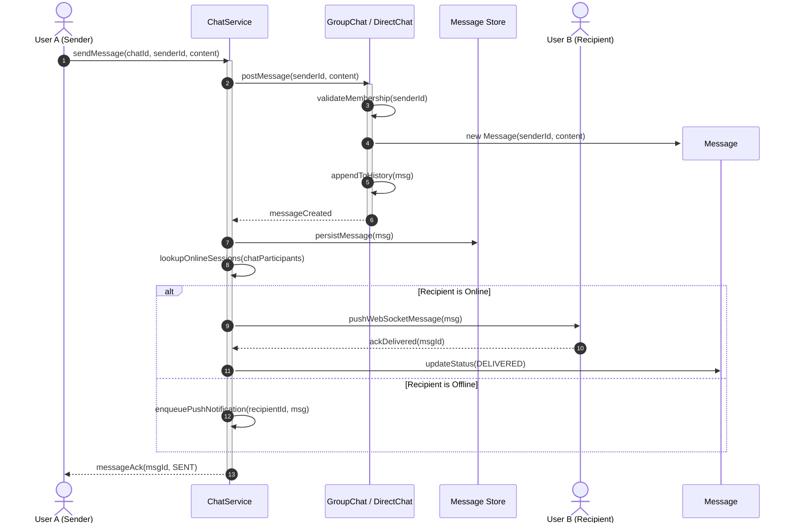

# Design a Chat Application

## 1. Problem Statement
Design a real-time chat system supporting 1:1 messaging, group chats, online status, and message delivery receipts.

## 2. Class Design



### Sequence Diagram: Sending & Delivering Message



## 3. Key Implementation

### Python

```python
from enum import Enum
from datetime import datetime
from typing import Dict, List, Set, Optional
import uuid

class MessageStatus(Enum):
    SENT = "SENT"
    DELIVERED = "DELIVERED"
    READ = "READ"

class Message:
    def __init__(self, sender_id: str, content: str):
        self.message_id = str(uuid.uuid4())[:8]
        self.sender_id = sender_id
        self.content = content
        self.timestamp = datetime.now()
        self.status = MessageStatus.SENT

class User:
    def __init__(self, user_id: str, name: str):
        self.user_id = user_id
        self.name = name
        self.is_online = False
        self.chats: Set[str] = set()

class DirectChat:
    def __init__(self, user1_id: str, user2_id: str):
        self.chat_id = f"dm-{uuid.uuid4().hex[:6]}"
        self.users = {user1_id, user2_id}
        self.messages: List[Message] = []

    def send_message(self, sender_id: str, content: str) -> Message:
        msg = Message(sender_id, content)
        self.messages.append(msg)
        return msg

class GroupChat:
    def __init__(self, name: str, admin_id: str, members: Set[str]):
        self.chat_id = f"grp-{uuid.uuid4().hex[:6]}"
        self.name = name
        self.admin_id = admin_id
        self.members = members
        self.messages: List[Message] = []

    def add_member(self, user_id: str):
        self.members.add(user_id)

    def remove_member(self, user_id: str):
        if user_id != self.admin_id:
            self.members.discard(user_id)

    def send_message(self, sender_id: str, content: str) -> Optional[Message]:
        if sender_id not in self.members:
            return None
        msg = Message(sender_id, content)
        self.messages.append(msg)
        return msg

class ChatService:
    def __init__(self):
        self.users: Dict[str, User] = {}
        self.chats: Dict[str, object] = {}

    def register(self, user_id: str, name: str):
        self.users[user_id] = User(user_id, name)

    def start_direct_chat(self, user1: str, user2: str) -> DirectChat:
        chat = DirectChat(user1, user2)
        self.chats[chat.chat_id] = chat
        self.users[user1].chats.add(chat.chat_id)
        self.users[user2].chats.add(chat.chat_id)
        return chat

    def create_group(self, name: str, admin: str, members: Set[str]) -> GroupChat:
        grp = GroupChat(name, admin, members)
        self.chats[grp.chat_id] = grp
        for m in members:
            self.users[m].chats.add(grp.chat_id)
        return grp

    def send_message(self, chat_id: str, sender_id: str, content: str) -> Message:
        chat = self.chats[chat_id]
        return chat.send_message(sender_id, content)
```

### Java

```java
package com.lld.chat;

import java.time.Instant;
import java.util.*;
import java.util.concurrent.*;
import java.util.concurrent.atomic.AtomicLong;

enum MessageStatus {
    SENT, DELIVERED, READ
}

class Message {
    private final String messageId;
    private final String senderId;
    private final String chatId;
    private final String content;
    private final Instant timestamp;
    private volatile MessageStatus status;

    public Message(String messageId, String senderId, String chatId, String content) {
        this.messageId = messageId;
        this.senderId = senderId;
        this.chatId = chatId;
        this.content = content;
        this.timestamp = Instant.now();
        this.status = MessageStatus.SENT;
    }

    public String getMessageId() { return messageId; }
    public String getSenderId() { return senderId; }
    public String getChatId() { return chatId; }
    public String getContent() { return content; }
    public Instant getTimestamp() { return timestamp; }
    public MessageStatus getStatus() { return status; }
    public void setStatus(MessageStatus status) { this.status = status; }

    @Override
    public String toString() {
        return String.format("[%s] %s: %s (%s)", timestamp, senderId, content, status);
    }
}

interface MessageObserver {
    void onMessageReceived(Message message);
}

class User implements MessageObserver {
    private final String userId;
    private final String name;
    private volatile boolean online;
    private final Set<String> chatIds = ConcurrentHashMap.newKeySet();

    public User(String userId, String name) {
        this.userId = userId;
        this.name = name;
        this.online = false;
    }

    public String getUserId() { return userId; }
    public String getName() { return name; }
    public boolean isOnline() { return online; }
    public void setOnline(boolean online) { this.online = online; }
    public Set<String> getChatIds() { return chatIds; }

    @Override
    public void onMessageReceived(Message message) {
        if (online) {
            System.out.printf("  [Push to %s] In chat %s: %s%n", name, message.getChatId(), message.getContent());
        } else {
            System.out.printf("  [Offline Push queued for %s] New message from %s%n", name, message.getSenderId());
        }
    }
}

abstract class Chat {
    protected final String chatId;
    protected final List<Message> messages = new CopyOnWriteArrayList<>();
    protected final Set<String> participantIds = ConcurrentHashMap.newKeySet();

    public Chat(String chatId, Collection<String> participants) {
        this.chatId = chatId;
        this.participantIds.addAll(participants);
    }

    public String getChatId() { return chatId; }
    public Set<String> getParticipantIds() { return Collections.unmodifiableSet(participantIds); }
    public List<Message> getMessages() { return Collections.unmodifiableList(messages); }

    public abstract Message sendMessage(String senderId, String content);
}

class DirectChat extends Chat {
    public DirectChat(String chatId, String user1, String user2) {
        super(chatId, Arrays.asList(user1, user2));
    }

    @Override
    public Message sendMessage(String senderId, String content) {
        if (!participantIds.contains(senderId)) {
            throw new IllegalArgumentException("User " + senderId + " is not a participant in DM " + chatId);
        }
        Message msg = new Message(UUID.randomUUID().toString().substring(0, 8), senderId, chatId, content);
        messages.add(msg);
        return msg;
    }
}

class GroupChat extends Chat {
    private final String groupName;
    private final String adminId;

    public GroupChat(String chatId, String groupName, String adminId, Collection<String> members) {
        super(chatId, members);
        this.groupName = groupName;
        this.adminId = adminId;
        this.participantIds.add(adminId);
    }

    public String getGroupName() { return groupName; }
    public String getAdminId() { return adminId; }

    public void addMember(String userId) {
        participantIds.add(userId);
    }

    public void removeMember(String requesterId, String userId) {
        if (!requesterId.equals(adminId) && !requesterId.equals(userId)) {
            throw new SecurityException("Only admin or the user themselves can remove member");
        }
        participantIds.remove(userId);
    }

    @Override
    public Message sendMessage(String senderId, String content) {
        if (!participantIds.contains(senderId)) {
            throw new IllegalArgumentException("User " + senderId + " is not a member of group " + groupName);
        }
        Message msg = new Message(UUID.randomUUID().toString().substring(0, 8), senderId, chatId, content);
        messages.add(msg);
        return msg;
    }
}

class ChatService {
    private final Map<String, User> users = new ConcurrentHashMap<>();
    private final Map<String, Chat> chats = new ConcurrentHashMap<>();

    public User registerUser(String userId, String name) {
        User user = new User(userId, name);
        users.put(userId, user);
        return user;
    }

    public DirectChat createDirectChat(String user1, String user2) {
        String chatId = "dm-" + UUID.randomUUID().toString().substring(0, 6);
        DirectChat chat = new DirectChat(chatId, user1, user2);
        chats.put(chatId, chat);
        users.get(user1).getChatIds().add(chatId);
        users.get(user2).getChatIds().add(chatId);
        return chat;
    }

    public GroupChat createGroupChat(String groupName, String adminId, Set<String> members) {
        String chatId = "grp-" + UUID.randomUUID().toString().substring(0, 6);
        GroupChat chat = new GroupChat(chatId, groupName, adminId, members);
        chats.put(chatId, chat);
        for (String m : chat.getParticipantIds()) {
            User u = users.get(m);
            if (u != null) u.getChatIds().add(chatId);
        }
        return chat;
    }

    public Message sendMessage(String chatId, String senderId, String content) {
        Chat chat = chats.get(chatId);
        if (chat == null) {
            throw new IllegalArgumentException("Chat not found: " + chatId);
        }
        Message msg = chat.sendMessage(senderId, content);

        // Broadcast to other participants
        for (String participantId : chat.getParticipantIds()) {
            if (!participantId.equals(senderId)) {
                User participant = users.get(participantId);
                if (participant != null) {
                    participant.onMessageReceived(msg);
                    if (participant.isOnline()) {
                        msg.setStatus(MessageStatus.DELIVERED);
                    }
                }
            }
        }
        return msg;
    }

    public void markAsRead(String chatId, String messageId, String readerId) {
        Chat chat = chats.get(chatId);
        if (chat != null) {
            for (Message msg : chat.getMessages()) {
                if (msg.getMessageId().equals(messageId)) {
                    msg.setStatus(MessageStatus.READ);
                    break;
                }
            }
        }
    }
}
```

## 4. Thread Safety Considerations

| Component | Concurrency Concern | Mitigation Strategy |
| :--- | :--- | :--- |
| **Message Ordering & History** | Concurrent writes to chat history | `CopyOnWriteArrayList` for chat message logs ensures lock-free reading for subscribers with synchronized append operations. |
| **Participant Membership** | Add/remove participants while broadcasting | `ConcurrentHashMap.newKeySet()` guarantees thread-safe membership iteration without `ConcurrentModificationException`. |
| **User Presence State** | Rapid online/offline toggling | `volatile boolean online` ensures immediate visibility across threads without synchronization overhead. |
| **Message Status Transitions** | Concurrent delivery/read ack updates | `volatile MessageStatus status` ensures visibility; compound read receipts can use CAS or atomic state machines. |

## 5. Extensibility & SOLID Principles

| Principle | Implementation in Design |
| :--- | :--- |
| **Single Responsibility (SRP)** | `Message` stores message payload; `Chat` manages conversation bounds; `ChatService` orchestrates participant registry and routing. |
| **Open/Closed (OCP)** | New chat varieties (`EphemeralChat`, `AnnouncementChannel`, `BroadcastGroup`) extend `Chat` without modifying `ChatService`. |
| **Liskov Substitution (LSP)** | Any polymorphic reference to `Chat` behaves identically when calling `sendMessage` regardless of direct or group chat semantics. |
| **Interface Segregation (ISP)** | `MessageObserver` defines clean callback contracts separate from user account or presence management interfaces. |
| **Dependency Inversion (DIP)** | `ChatService` routes notifications through observer abstractions rather than directly coupling to raw WebSocket transport sockets. |

## 6. Patterns
- **Observer**: Message delivery notifications dispatched to active user sessions.
- **Mediator**: `ChatService` decouples senders and recipients.
- **Factory / Strategy**: Media message handlers for images, video attachments, and text messages.

## 7. Follow-ups
- **End-to-end encryption?** Public/private key exchange (Signal protocol / Double Ratchet), encrypt on device before sending.
- **Read receipts?** Track per-user read watermark cursor (`last_read_message_id`) per chat to avoid writing a status record per participant.
- **File sharing?** `MediaMessage` extending `Message` with signed S3 upload URLs and CDN media thumbnails.
- **Typing indicators?** Ephemeral Redis pub/sub WebSocket events with TTL without persisting to relational storage.

---

**Related:** [[02 - Observer Pattern]] | [[07 - Command Pattern]]

