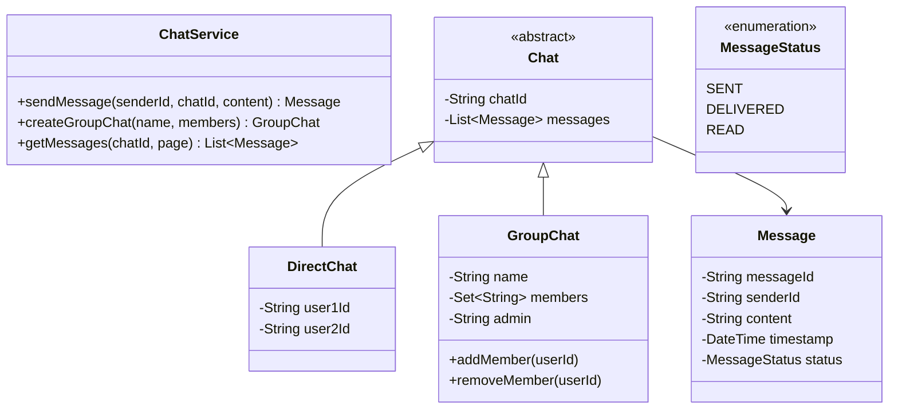

# Design a Chat Application

## 1. Problem Statement
Design a real-time chat system supporting 1:1 messaging, group chats, online status, and message delivery receipts.

## 2. Class Design



## 3. Key Implementation (Python)

```python
from enum import Enum
from datetime import datetime
from typing import Dict, List, Set, Optional
import uuid

class MessageStatus(Enum):
    SENT = "SENT"
    DELIVERED = "DELIVERED"
    READ = "READ"

class Message:
    def __init__(self, sender_id: str, content: str):
        self.message_id = str(uuid.uuid4())[:8]
        self.sender_id = sender_id
        self.content = content
        self.timestamp = datetime.now()
        self.status = MessageStatus.SENT

class User:
    def __init__(self, user_id: str, name: str):
        self.user_id = user_id
        self.name = name
        self.is_online = False
        self.chats: Set[str] = set()

class DirectChat:
    def __init__(self, user1_id: str, user2_id: str):
        self.chat_id = f"dm-{uuid.uuid4().hex[:6]}"
        self.users = {user1_id, user2_id}
        self.messages: List[Message] = []

    def send_message(self, sender_id: str, content: str) -> Message:
        msg = Message(sender_id, content)
        self.messages.append(msg)
        return msg

class GroupChat:
    def __init__(self, name: str, admin_id: str, members: Set[str]):
        self.chat_id = f"grp-{uuid.uuid4().hex[:6]}"
        self.name = name
        self.admin_id = admin_id
        self.members = members
        self.messages: List[Message] = []

    def add_member(self, user_id: str):
        self.members.add(user_id)

    def remove_member(self, user_id: str):
        if user_id != self.admin_id:
            self.members.discard(user_id)

    def send_message(self, sender_id: str, content: str) -> Optional[Message]:
        if sender_id not in self.members:
            return None
        msg = Message(sender_id, content)
        self.messages.append(msg)
        return msg

class ChatService:
    def __init__(self):
        self.users: Dict[str, User] = {}
        self.chats: Dict[str, object] = {}

    def register(self, user_id: str, name: str):
        self.users[user_id] = User(user_id, name)

    def start_direct_chat(self, user1: str, user2: str) -> DirectChat:
        chat = DirectChat(user1, user2)
        self.chats[chat.chat_id] = chat
        self.users[user1].chats.add(chat.chat_id)
        self.users[user2].chats.add(chat.chat_id)
        return chat

    def create_group(self, name: str, admin: str, members: Set[str]) -> GroupChat:
        grp = GroupChat(name, admin, members)
        self.chats[grp.chat_id] = grp
        for m in members:
            self.users[m].chats.add(grp.chat_id)
        return grp

    def send_message(self, chat_id: str, sender_id: str, content: str) -> Message:
        chat = self.chats[chat_id]
        return chat.send_message(sender_id, content)
```

## 4. Patterns: **Observer** (message delivery to online users) | **Command** (message as command for retry/undo) | **Mediator** (ChatService coordinating users)

## 5. Follow-ups
- **End-to-end encryption?** Public/private key exchange, encrypt before sending.
- **Read receipts?** Track per-user read position per chat.
- **File sharing?** `MediaMessage` extending `Message` with file URL + type.
- **Typing indicators?** WebSocket events for typing status.

---

**Related:** [[02 - Observer Pattern]] | [[07 - Command Pattern]]
