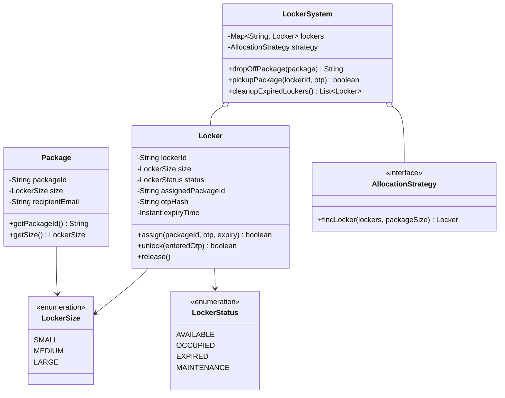
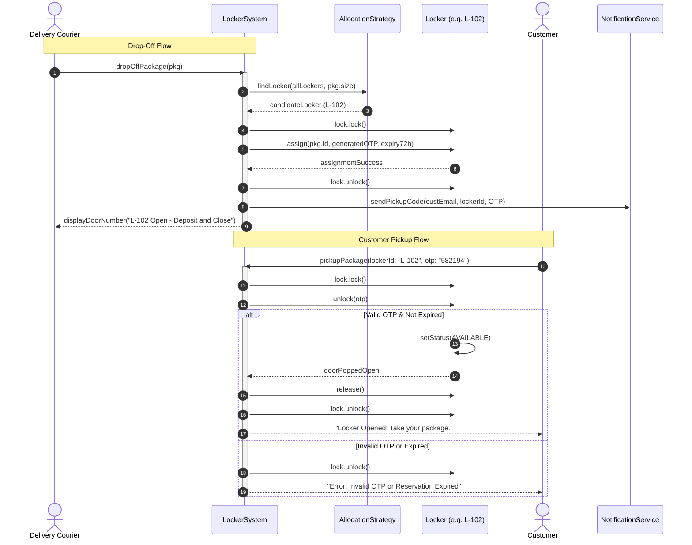

# Design Amazon Locker System

## 1. Problem Statement
Design a package locker system with locker assignment, OTP-based pickup, size-based allocation, and expiration.

## 2. Class & Sequence Design



### Sequence Diagram: Package Drop-off & Customer Pickup



## 3. Key Implementation

### Python

```python
from enum import Enum
from typing import Dict, Optional, List
import uuid, random, string
from datetime import datetime, timedelta

class LockerSize(Enum):
    SMALL = 1
    MEDIUM = 2
    LARGE = 3

class LockerStatus(Enum):
    AVAILABLE = "AVAILABLE"
    OCCUPIED = "OCCUPIED"
    EXPIRED = "EXPIRED"

class PackageSize(Enum):
    SMALL = 1
    MEDIUM = 2
    LARGE = 3

SIZE_COMPATIBILITY = {
    PackageSize.SMALL: [LockerSize.SMALL, LockerSize.MEDIUM, LockerSize.LARGE],
    PackageSize.MEDIUM: [LockerSize.MEDIUM, LockerSize.LARGE],
    PackageSize.LARGE: [LockerSize.LARGE],
}

class Locker:
    def __init__(self, locker_id: str, size: LockerSize):
        self.locker_id = locker_id
        self.size = size
        self.status = LockerStatus.AVAILABLE
        self.package_id: Optional[str] = None
        self.otp: Optional[str] = None
        self.expiry: Optional[datetime] = None

class Package:
    def __init__(self, package_id: str, size: PackageSize, recipient_id: str):
        self.package_id = package_id
        self.size = size
        self.recipient_id = recipient_id

class LockerSystem:
    EXPIRY_HOURS = 72

    def __init__(self):
        self.lockers: Dict[str, Locker] = {}
        self.packages: Dict[str, str] = {}  # package_id → locker_id

    def add_locker(self, locker_id: str, size: LockerSize):
        self.lockers[locker_id] = Locker(locker_id, size)

    def assign_locker(self, package: Package) -> Optional[str]:
        compatible = SIZE_COMPATIBILITY[package.size]
        for locker in self.lockers.values():
            if locker.status == LockerStatus.AVAILABLE and locker.size in compatible:
                locker.status = LockerStatus.OCCUPIED
                locker.package_id = package.package_id
                locker.otp = ''.join(random.choices(string.digits, k=6))
                locker.expiry = datetime.now() + timedelta(hours=self.EXPIRY_HOURS)
                self.packages[package.package_id] = locker.locker_id
                print(f"📦 Package {package.package_id} → Locker {locker.locker_id} | OTP: {locker.otp}")
                return locker.otp
        print("❌ No available locker for this package size")
        return None

    def pickup(self, locker_id: str, otp: str) -> bool:
        locker = self.lockers.get(locker_id)
        if not locker or locker.status != LockerStatus.OCCUPIED:
            return False
        if locker.otp != otp:
            print("❌ Invalid OTP")
            return False
        pkg_id = locker.package_id
        locker.status = LockerStatus.AVAILABLE
        locker.package_id = None
        locker.otp = None
        locker.expiry = None
        self.packages.pop(pkg_id, None)
        print(f"✅ Package {pkg_id} picked up from locker {locker_id}")
        return True

    def check_expired(self):
        now = datetime.now()
        for locker in self.lockers.values():
            if locker.status == LockerStatus.OCCUPIED and locker.expiry and now > locker.expiry:
                locker.status = LockerStatus.EXPIRED
                print(f"⏰ Locker {locker.locker_id} expired. Return package to warehouse.")
```

### Java

```java
package com.lld.locker;

import java.time.Duration;
import java.time.Instant;
import java.util.*;
import java.util.concurrent.ConcurrentHashMap;
import java.util.concurrent.locks.ReentrantLock;

enum LockerSize {
    SMALL(1), MEDIUM(2), LARGE(3);
    private final int value;
    LockerSize(int value) { this.value = value; }
    public boolean canFit(LockerSize packageSize) {
        return this.value >= packageSize.value;
    }
}

enum LockerStatus {
    AVAILABLE, OCCUPIED, EXPIRED, MAINTENANCE
}

class Package {
    private final String packageId;
    private final LockerSize size;
    private final String recipientEmail;

    public Package(String packageId, LockerSize size, String recipientEmail) {
        this.packageId = packageId;
        this.size = size;
        this.recipientEmail = recipientEmail;
    }

    public String getPackageId() { return packageId; }
    public LockerSize getSize() { return size; }
    public String getRecipientEmail() { return recipientEmail; }
}

class Locker {
    private final String lockerId;
    private final LockerSize size;
    private volatile LockerStatus status;
    private String packageId;
    private String otp;
    private Instant expiryTime;
    private final ReentrantLock lock = new ReentrantLock();

    public Locker(String lockerId, LockerSize size) {
        this.lockerId = lockerId;
        this.size = size;
        this.status = LockerStatus.AVAILABLE;
    }

    public String getLockerId() { return lockerId; }
    public LockerSize getSize() { return size; }
    public LockerStatus getStatus() { return status; }
    public ReentrantLock getLock() { return lock; }

    public boolean assignPackage(String packageId, String otp, Duration ttl) {
        lock.lock();
        try {
            if (status != LockerStatus.AVAILABLE) return false;
            this.packageId = packageId;
            this.otp = otp;
            this.expiryTime = Instant.now().plus(ttl);
            this.status = LockerStatus.OCCUPIED;
            return true;
        } finally {
            lock.unlock();
        }
    }

    public boolean unlockWithOtp(String enteredOtp) {
        lock.lock();
        try {
            if (status != LockerStatus.OCCUPIED) return false;
            if (Instant.now().isAfter(expiryTime)) {
                this.status = LockerStatus.EXPIRED;
                return false;
            }
            if (this.otp != null && this.otp.equals(enteredOtp)) {
                this.packageId = null;
                this.otp = null;
                this.expiryTime = null;
                this.status = LockerStatus.AVAILABLE;
                return true;
            }
            return false;
        } finally {
            lock.unlock();
        }
    }

    public void markExpiredIfOverdue() {
        lock.lock();
        try {
            if (status == LockerStatus.OCCUPIED && expiryTime != null && Instant.now().isAfter(expiryTime)) {
                status = LockerStatus.EXPIRED;
            }
        } finally {
            lock.unlock();
        }
    }
}

interface LockerAllocationStrategy {
    Optional<Locker> allocate(List<Locker> lockers, LockerSize packageSize);
}

class BestFitAllocationStrategy implements LockerAllocationStrategy {
    @Override
    public Optional<Locker> allocate(List<Locker> lockers, LockerSize packageSize) {
        return lockers.stream()
                .filter(l -> l.getStatus() == LockerStatus.AVAILABLE && l.getSize().canFit(packageSize))
                .sorted(Comparator.comparingInt(l -> l.getSize().ordinal()))
                .findFirst();
    }
}

class LockerSystem {
    private static final Duration DEFAULT_TTL = Duration.ofHours(72);
    private final Map<String, Locker> lockers = new ConcurrentHashMap<>();
    private final Map<String, String> packageToLockerMap = new ConcurrentHashMap<>();
    private final LockerAllocationStrategy allocationStrategy;

    public LockerSystem(LockerAllocationStrategy strategy) {
        this.allocationStrategy = strategy;
    }

    public void registerLocker(String lockerId, LockerSize size) {
        lockers.put(lockerId, new Locker(lockerId, size));
    }

    public synchronized Optional<String> depositPackage(Package pkg) {
        List<Locker> lockerList = new ArrayList<>(lockers.values());
        Optional<Locker> assigned = allocationStrategy.allocate(lockerList, pkg.getSize());

        if (assigned.isEmpty()) {
            return Optional.empty();
        }

        Locker locker = assigned.get();
        String generatedOtp = String.format("%06d", new Random().nextInt(1_000_000));
        boolean success = locker.assignPackage(pkg.getPackageId(), generatedOtp, DEFAULT_TTL);

        if (success) {
            packageToLockerMap.put(pkg.getPackageId(), locker.getLockerId());
            System.out.printf("[Deposit] Pkg %s assigned to Locker %s (Size: %s) with OTP: %s%n",
                    pkg.getPackageId(), locker.getLockerId(), locker.getSize(), generatedOtp);
            return Optional.of(generatedOtp);
        }
        return Optional.empty();
    }

    public boolean pickupPackage(String lockerId, String otp) {
        Locker locker = lockers.get(lockerId);
        if (locker == null) return false;

        boolean success = locker.unlockWithOtp(otp);
        if (success) {
            packageToLockerMap.values().removeIf(id -> id.equals(lockerId));
            System.out.printf("[Pickup] Door unlocked for locker %s! Customer retrieved package.%n", lockerId);
        } else {
            System.out.printf("[Pickup Failed] Invalid OTP or expired reservation for locker %s.%n", lockerId);
        }
        return success;
    }

    public void checkAndFlagExpiredLockers() {
        for (Locker locker : lockers.values()) {
            locker.markExpiredIfOverdue();
        }
    }
}
```

## 4. Thread Safety Considerations

| Component | Concurrency Hazard | Mitigation Strategy |
| :--- | :--- | :--- |
| **Locker Slot Contention** | Two couriers depositing into the same locker simultaneously | Per-locker `ReentrantLock` guards assignment, status updates, and OTP clearing. |
| **Locker Registry Lookups** | Simultaneous deposits, pickups, and monitoring queries | `ConcurrentHashMap` for locker storage; synchronized deposit block prevents double-allocating same free slot. |
| **Status Race Conditions** | Customer typing OTP at exact millisecond timer marks expired | Locker atomic lock verifies status and `Instant.now().isAfter(expiryTime)` under mutual exclusion. |
| **OTP Attack Rate Limiting** | Brute force attempts on 6-digit numeric OTP | Lockout counter per locker with incremental backoff after 3 failed tries. |

## 5. Extensibility & SOLID Principles

| Principle | Implementation in Design |
| :--- | :--- |
| **Single Responsibility (SRP)** | `Locker` controls hardware compartment state; `LockerAllocationStrategy` governs slot selection math; `LockerSystem` manages business workflows. |
| **Open/Closed (OCP)** | New allocation strategies (`RandomFit`, `LowestShelfFirstForAccessibility`) implement `LockerAllocationStrategy` without altering core locker logic. |
| **Liskov Substitution (LSP)** | Different locker sizes and allocation algorithms adhere to unified base interfaces and contracts. |
| **Interface Segregation (ISP)** | Client deposit/pickup APIs separated from technician/courier maintenance administration interfaces. |
| **Dependency Inversion (DIP)** | `LockerSystem` relies on `LockerAllocationStrategy` abstraction rather than hardcoding static allocation loops. |

## 6. Patterns
- **State**: Locker compartment lifecycle transitions (`AVAILABLE` -> `OCCUPIED` -> `EXPIRED` -> `MAINTENANCE`).
- **Strategy**: Pluggable allocation strategies (Best Fit, First Fit, Accessibility-oriented).
- **Observer**: Notification triggers sent to SMS/email upon successful deposit or pending expiry.

## 7. Follow-ups
- **Returns & drop-offs?** Reverse flow: customer reserves a locker slot via mobile app barcode, opens door, and deposits return parcel.
- **Accessibility?** Lockers on bottom tiers (height < 48 inches) reserved for users with wheelchair/accessibility flags in their user profiles.
- **Physical hardware failure?** Sensors (IR beam break + weight sensor) to verify physical package presence inside slot regardless of door latch state.
- **Overdue package collection?** Courier batch run unlocks all `EXPIRED` lockers in sequence with a master service key to return packages to fulfillment hub.

---

**Related:** [[13 - State Pattern]] | [[01 - Strategy Pattern]]

