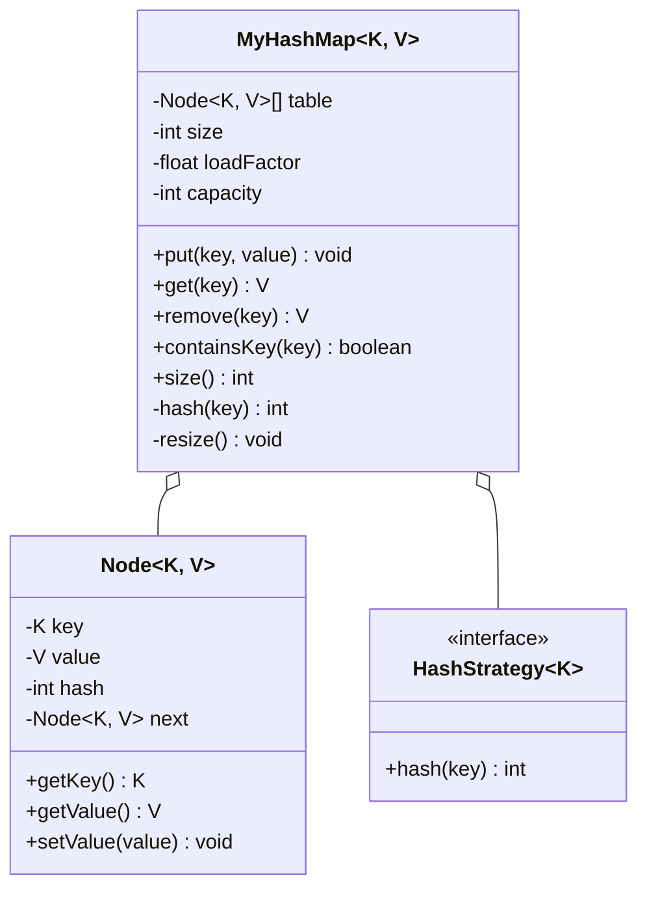
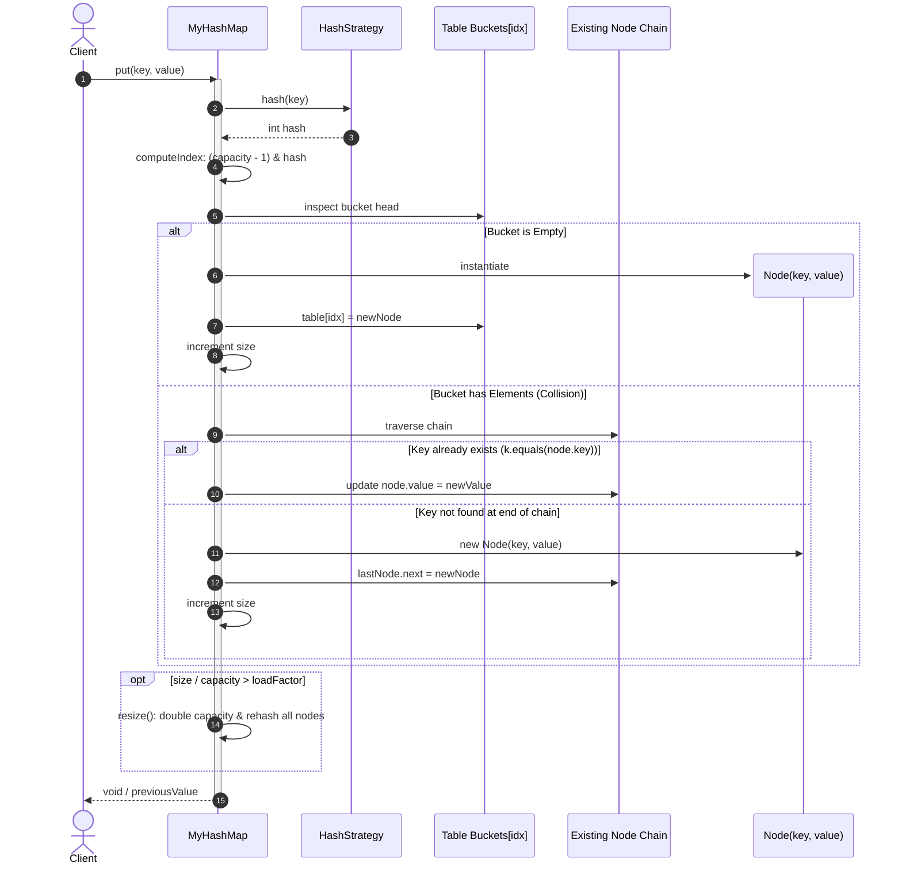

# Design a HashMap

## 1. Problem Statement
Design a HashMap from scratch with put, get, delete in O(1) average time. Handle collisions with chaining.

## 2. Class & Sequence Design



### Sequence Diagram: Put Operation & Collision Resolution with Dynamic Resize



## 3. Key Implementation

### Python

```python
class Node:
    def __init__(self, key, value):
        self.key = key
        self.value = value
        self.next = None

class MyHashMap:
    def __init__(self, capacity: int = 16, load_factor: float = 0.75):
        self.capacity = capacity
        self.load_factor = load_factor
        self.size = 0
        self.buckets = [None] * capacity

    def _hash(self, key) -> int:
        return hash(key) % self.capacity

    def put(self, key, value):
        idx = self._hash(key)
        node = self.buckets[idx]

        # Check if key exists → update
        while node:
            if node.key == key:
                node.value = value
                return
            node = node.next

        # Insert at head of chain
        new_node = Node(key, value)
        new_node.next = self.buckets[idx]
        self.buckets[idx] = new_node
        self.size += 1

        # Resize if load factor exceeded
        if self.size / self.capacity > self.load_factor:
            self._resize()

    def get(self, key):
        idx = self._hash(key)
        node = self.buckets[idx]
        while node:
            if node.key == key:
                return node.value
            node = node.next
        return None

    def remove(self, key) -> bool:
        idx = self._hash(key)
        node = self.buckets[idx]
        prev = None
        while node:
            if node.key == key:
                if prev:
                    prev.next = node.next
                else:
                    self.buckets[idx] = node.next
                self.size -= 1
                return True
            prev = node
            node = node.next
        return False

    def _resize(self):
        old_buckets = self.buckets
        self.capacity *= 2
        self.buckets = [None] * self.capacity
        self.size = 0
        for node in old_buckets:
            while node:
                self.put(node.key, node.value)
                node = node.next

    def __contains__(self, key):
        return self.get(key) is not None

    def __len__(self):
        return self.size
```

### Java

```java
package com.lld.hashmap;

import java.util.Objects;

public class MyHashMap<K, V> {
    static class Node<K, V> {
        final int hash;
        final K key;
        V value;
        Node<K, V> next;

        Node(int hash, K key, V value, Node<K, V> next) {
            this.hash = hash;
            this.key = key;
            this.value = value;
            this.next = next;
        }
    }

    private static final int DEFAULT_CAPACITY = 16;
    private static final float DEFAULT_LOAD_FACTOR = 0.75f;

    @SuppressWarnings("unchecked")
    private Node<K, V>[] table = (Node<K, V>[]) new Node[DEFAULT_CAPACITY];
    private int size = 0;
    private final float loadFactor;

    public MyHashMap() {
        this(DEFAULT_CAPACITY, DEFAULT_LOAD_FACTOR);
    }

    @SuppressWarnings("unchecked")
    public MyHashMap(int initialCapacity, float loadFactor) {
        this.loadFactor = loadFactor;
        int capacity = 1;
        while (capacity < initialCapacity) {
            capacity <<= 1;
        }
        this.table = (Node<K, V>[]) new Node[capacity];
    }

    private int hash(Object key) {
        if (key == null) return 0;
        int h = key.hashCode();
        return h ^ (h >>> 16); // Spread higher bits down
    }

    private int indexFor(int hash, int length) {
        return hash & (length - 1);
    }

    public synchronized void put(K key, V value) {
        int h = hash(key);
        int idx = indexFor(h, table.length);

        for (Node<K, V> e = table[idx]; e != null; e = e.next) {
            if (e.hash == h && Objects.equals(e.key, key)) {
                e.value = value;
                return;
            }
        }

        // Insert at head
        table[idx] = new Node<>(h, key, value, table[idx]);
        size++;

        if (size >= table.length * loadFactor) {
            resize(table.length * 2);
        }
    }

    public synchronized V get(K key) {
        int h = hash(key);
        int idx = indexFor(h, table.length);

        for (Node<K, V> e = table[idx]; e != null; e = e.next) {
            if (e.hash == h && Objects.equals(e.key, key)) {
                return e.value;
            }
        }
        return null;
    }

    public synchronized V remove(K key) {
        int h = hash(key);
        int idx = indexFor(h, table.length);

        Node<K, V> prev = null;
        Node<K, V> curr = table[idx];

        while (curr != null) {
            if (curr.hash == h && Objects.equals(curr.key, key)) {
                if (prev == null) {
                    table[idx] = curr.next;
                } else {
                    prev.next = curr.next;
                }
                size--;
                return curr.value;
            }
            prev = curr;
            curr = curr.next;
        }
        return null;
    }

    public synchronized boolean containsKey(K key) {
        return get(key) != null;
    }

    public synchronized int size() {
        return size;
    }

    @SuppressWarnings("unchecked")
    private void resize(int newCapacity) {
        Node<K, V>[] newTable = (Node<K, V>[]) new Node[newCapacity];
        for (Node<K, V> head : table) {
            Node<K, V> current = head;
            while (current != null) {
                Node<K, V> next = current.next;
                int newIdx = indexFor(current.hash, newCapacity);
                current.next = newTable[newIdx];
                newTable[newIdx] = current;
                current = next;
            }
        }
        this.table = newTable;
    }
}
```

## 4. Collision Resolution Strategies
| Strategy | How | Pros | Cons |
|----------|-----|------|------|
| **Chaining** | Linked list per bucket | Simple, handles high load | Cache unfriendly |
| **Open Addressing (Linear Probing)** | Next available slot | Cache friendly | Clustering |
| **Double Hashing** | Second hash for step | Reduces clustering | Complex |
| **Robin Hood** | Steal from rich buckets | Good variance | Complex |

## 5. Thread Safety Considerations

| Component | Concurrency Issue | Mitigation Strategy |
| :--- | :--- | :--- |
| **Concurrent Mutation** | Data corruption / lost updates when two threads write to same index | `synchronized` methods for basic monitor safety; lock-striping (e.g. `ReentrantLock` per segment) or `ConcurrentHashMap` bucket-level synchronization for high-throughput concurrency. |
| **Infinite Loop on Resize** | Race condition in legacy resizing causes cyclic next pointers | Pre-allocating nodes without circular head inserts, or using forward-only trees/lists during rehashing. |
| **Visibility of Table Reference** | Threads reading stale table pointer during active resize | `volatile` array reference ensures all threads immediately read resized bucket pointers. |
| **Size Counter Contention** | High contention on shared primitive `size` | `LongAdder` or stripe counters (similar to `Striped64`) rather than single atomic variable. |

## 6. Extensibility & SOLID Principles

| Principle | Implementation in Design |
| :--- | :--- |
| **Single Responsibility (SRP)** | `Node` encapsulates linked pair storage; `MyHashMap` manages table indexing, collision chains, and capacity scaling. |
| **Open/Closed (OCP)** | Hashing algorithm and collision resolution policies can be abstracted via `HashStrategy` or treeification plug-ins without altering base map structure. |
| **Liskov Substitution (LSP)** | Can implement `java.util.Map<K, V>` contract to cleanly substitute any standard map implementation. |
| **Interface Segregation (ISP)** | Public interface exposes essential CRUD operations; internal table management methods remain private. |
| **Dependency Inversion (DIP)** | Operates on generic abstract keys `K` and values `V` relying on standard `Object.hashCode()` and `Object.equals()` contracts. |

## 7. Follow-ups
- **Thread-safe?** `ConcurrentHashMap` — CAS for inserting bucket head, `synchronized` on bucket head node during chain traversal, volatile reads.
- **Java TreeMap buckets?** Java 8+ converts linked list chains to balanced red-black trees (`TreeNode`) when chain depth exceeds `TREEIFY_THRESHOLD = 8` and table capacity $\ge 64$.
- **Perfect hashing?** If key sets are static and known at compile time, minimal perfect hash functions (e.g., CHD algorithm) achieve $O(1)$ lookup with zero collisions.

---

**Related:** [[01 - Strategy Pattern]]

