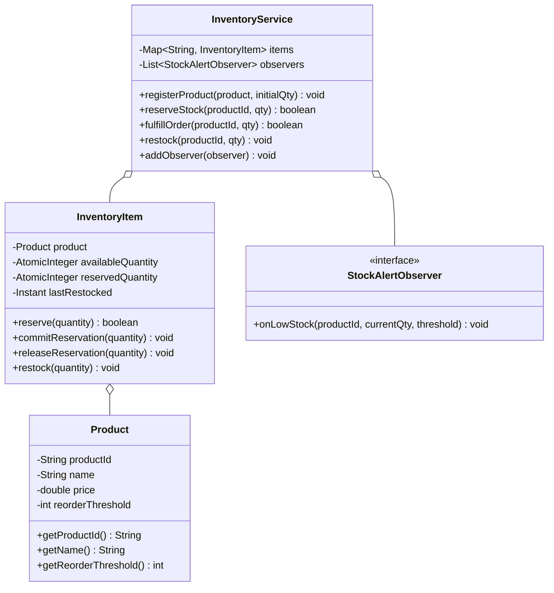
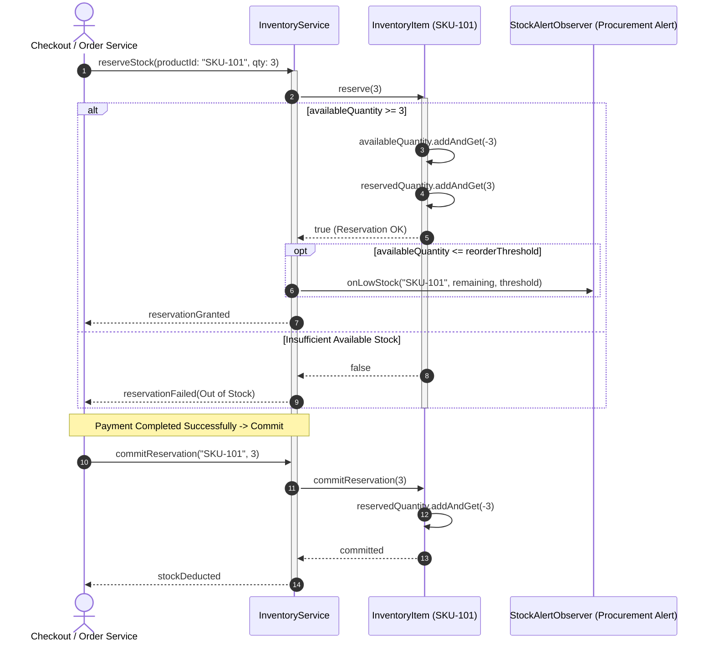

# Design an Inventory Management System

## 1. Problem Statement
Design an inventory system for a warehouse/e-commerce platform tracking products, stock levels, orders, and restocking alerts.

## 2. Class & Sequence Design



### Sequence Diagram: Order Stock Reservation & Low-Stock Trigger



## 3. Key Implementation

### Python

```python
from typing import Dict, List, Optional
from enum import Enum
from datetime import datetime
from abc import ABC, abstractmethod

class StockAlert(ABC):
    @abstractmethod
    def on_low_stock(self, product_id: str, current: int, threshold: int): pass

class EmailAlert(StockAlert):
    def on_low_stock(self, product_id, current, threshold):
        print(f"📧 LOW STOCK ALERT: {product_id} has {current} units (threshold: {threshold})")

class Product:
    def __init__(self, pid: str, name: str, price: float, reorder_threshold: int = 10):
        self.pid = pid
        self.name = name
        self.price = price
        self.reorder_threshold = reorder_threshold

class InventoryItem:
    def __init__(self, product: Product, quantity: int = 0):
        self.product = product
        self.quantity = quantity
        self.last_restocked = datetime.now()

class InventoryService:
    def __init__(self):
        self._inventory: Dict[str, InventoryItem] = {}
        self._alerts: List[StockAlert] = []

    def add_alert(self, alert: StockAlert):
        self._alerts.append(alert)

    def add_product(self, product: Product, initial_qty: int = 0):
        self._inventory[product.pid] = InventoryItem(product, initial_qty)

    def restock(self, product_id: str, quantity: int):
        item = self._inventory.get(product_id)
        if item:
            item.quantity += quantity
            item.last_restocked = datetime.now()
            print(f"📦 Restocked {item.product.name}: +{quantity} → {item.quantity}")

    def sell(self, product_id: str, quantity: int) -> bool:
        item = self._inventory.get(product_id)
        if not item or item.quantity < quantity:
            print(f"❌ Insufficient stock for {product_id}")
            return False
        item.quantity -= quantity
        print(f"🛒 Sold {quantity}x {item.product.name} → {item.quantity} remaining")

        if item.quantity <= item.product.reorder_threshold:
            for alert in self._alerts:
                alert.on_low_stock(product_id, item.quantity, item.product.reorder_threshold)
        return True

    def get_stock(self, product_id: str) -> int:
        item = self._inventory.get(product_id)
        return item.quantity if item else 0

    def get_low_stock_report(self) -> List[dict]:
        return [{"product": item.product.name, "qty": item.quantity,
                 "threshold": item.product.reorder_threshold}
                for item in self._inventory.values()
                if item.quantity <= item.product.reorder_threshold]
```

### Java

```java
package com.lld.inventory;

import java.time.Instant;
import java.util.*;
import java.util.concurrent.ConcurrentHashMap;
import java.util.concurrent.CopyOnWriteArrayList;
import java.util.concurrent.atomic.AtomicInteger;

class Product {
    private final String productId;
    private final String name;
    private final double price;
    private final int reorderThreshold;

    public Product(String productId, String name, double price, int reorderThreshold) {
        this.productId = productId;
        this.name = name;
        this.price = price;
        this.reorderThreshold = reorderThreshold;
    }

    public String getProductId() { return productId; }
    public String getName() { return name; }
    public double getPrice() { return price; }
    public int getReorderThreshold() { return reorderThreshold; }
}

interface StockAlertObserver {
    void onLowStock(String productId, int currentQty, int threshold);
}

class InventoryItem {
    private final Product product;
    private final AtomicInteger availableStock;
    private final AtomicInteger reservedStock;
    private volatile Instant lastRestocked;

    public InventoryItem(Product product, int initialQuantity) {
        this.product = product;
        this.availableStock = new AtomicInteger(initialQuantity);
        this.reservedStock = new AtomicInteger(0);
        this.lastRestocked = Instant.now();
    }

    public Product getProduct() { return product; }
    public int getAvailableStock() { return availableStock.get(); }
    public int getReservedStock() { return reservedStock.get(); }

    public boolean reserve(int quantity) {
        while (true) {
            int current = availableStock.get();
            if (current < quantity) {
                return false;
            }
            if (availableStock.compareAndSet(current, current - quantity)) {
                reservedStock.addAndGet(quantity);
                return true;
            }
        }
    }

    public void commitReservation(int quantity) {
        reservedStock.addAndGet(-quantity);
    }

    public void releaseReservation(int quantity) {
        reservedStock.addAndGet(-quantity);
        availableStock.addAndGet(quantity);
    }

    public void restock(int quantity) {
        availableStock.addAndGet(quantity);
        lastRestocked = Instant.now();
    }
}

class InventoryService {
    private final Map<String, InventoryItem> inventory = new ConcurrentHashMap<>();
    private final List<StockAlertObserver> observers = new CopyOnWriteArrayList<>();

    public void addObserver(StockAlertObserver observer) {
        observers.add(observer);
    }

    public void registerProduct(Product product, int initialStock) {
        inventory.put(product.getProductId(), new InventoryItem(product, initialStock));
    }

    public boolean reserveStock(String productId, int quantity) {
        InventoryItem item = inventory.get(productId);
        if (item == null) return false;

        boolean success = item.reserve(quantity);
        if (success) {
            int remaining = item.getAvailableStock();
            if (remaining <= item.getProduct().getReorderThreshold()) {
                notifyObservers(productId, remaining, item.getProduct().getReorderThreshold());
            }
        }
        return success;
    }

    public void commitStock(String productId, int quantity) {
        InventoryItem item = inventory.get(productId);
        if (item != null) {
            item.commitReservation(quantity);
        }
    }

    public void releaseStock(String productId, int quantity) {
        InventoryItem item = inventory.get(productId);
        if (item != null) {
            item.releaseReservation(quantity);
        }
    }

    public void restockProduct(String productId, int quantity) {
        InventoryItem item = inventory.get(productId);
        if (item != null) {
            item.restock(quantity);
            System.out.printf("[Restock] Added %d units to %s (Total available: %d)%n",
                    quantity, item.getProduct().getName(), item.getAvailableStock());
        }
    }

    private void notifyObservers(String productId, int currentQty, int threshold) {
        for (StockAlertObserver observer : observers) {
            observer.onLowStock(productId, currentQty, threshold);
        }
    }
}
```

## 4. Thread Safety Considerations

| Component | Concurrency Hazard | Mitigation Strategy |
| :--- | :--- | :--- |
| **Inventory Overselling** | Two checkout threads simultaneously claiming last remaining item | Atomic CAS loop (`compareAndSet`) on `AtomicInteger` ensures only one transaction successfully claims stock. |
| **Two-Phase Reservation Commit** | Crash/timeout between cart checkout and payment gateway webhook | Temporary reservation held in `reservedStock`; a TTL cleanup daemon rolls back uncommitted reservations. |
| **Observer Dispatch** | Observers added/removed during real-time purchase rush | `CopyOnWriteArrayList` permits lock-free traversal during stock notification dispatches. |
| **Multi-warehouse SKU lookup** | Concurrent writes to inventory catalog | `ConcurrentHashMap` ensures lock-free reads and safe concurrent SKU insertions. |

## 5. Extensibility & SOLID Principles

| Principle | Implementation in Design |
| :--- | :--- |
| **Single Responsibility (SRP)** | `Product` holds catalog metadata; `InventoryItem` manages atomic stock units; `InventoryService` coordinates reservations and alerts. |
| **Open/Closed (OCP)** | New notification channels (SMS, Webhook, ERP auto-order) implement `StockAlertObserver` without altering `InventoryService`. |
| **Liskov Substitution (LSP)** | Different warehouse fulfillment types (Local Hub, Fulfillment Center, Drop-shipper) can be treated uniformly via an inventory interface. |
| **Interface Segregation (ISP)** | Public inventory inspection APIs decoupled from procurement reordering and vendor shipment ingest methods. |
| **Dependency Inversion (DIP)** | High-level checkout flows depend on abstract inventory reservation contracts rather than physical warehouse DB tables. |

## 6. Patterns
- **Observer**: Alerting procurement and automated supplier purchasing systems when inventory drops below threshold.
- **Unit of Work / Two-Phase Commit**: Stock reservation during checkout followed by commit on payment success or release on payment failure.
- **Strategy**: Reorder calculation algorithms (Fixed Quantity, Min-Max, Economic Order Quantity - EOQ).

## 7. Follow-ups
- **Multi-warehouse fulfillment?** Inventory distributed across regional warehouses; route orders based on customer geo-proximity and stock availability.
- **Batch tracking & FIFO?** Perishables modeled with `Batch` objects containing expiration dates; reservations dequeue oldest valid batch first.
- **Flash sale spikes?** Redis-backed atomic decrement (`DECRBY`) with write-behind queue to database to survive 100k requests/sec.

---

**Related:** [[02 - Observer Pattern]] | [[01 - Strategy Pattern]]

