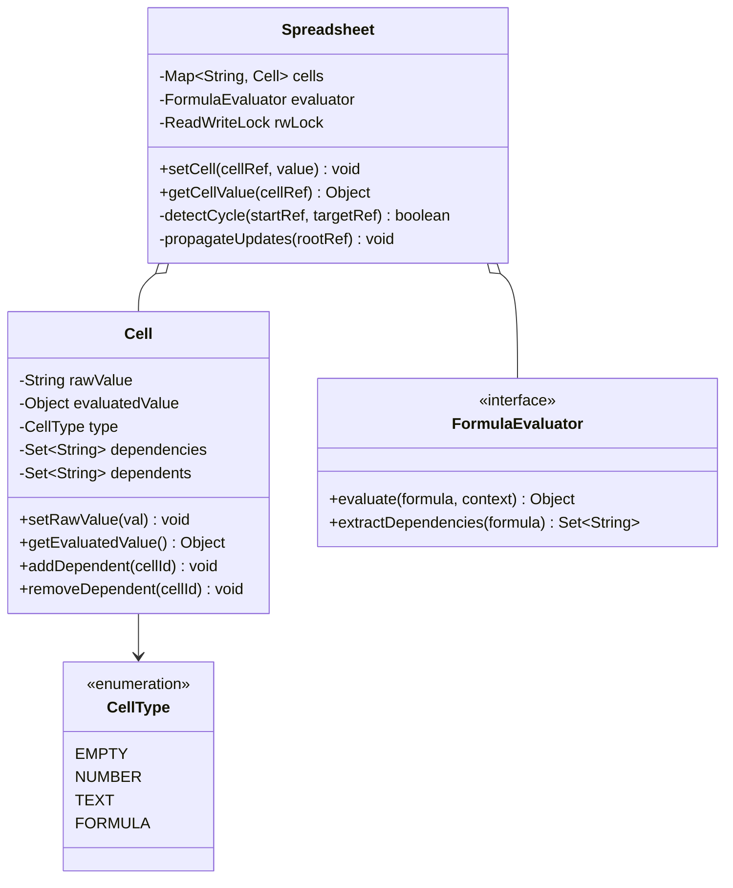
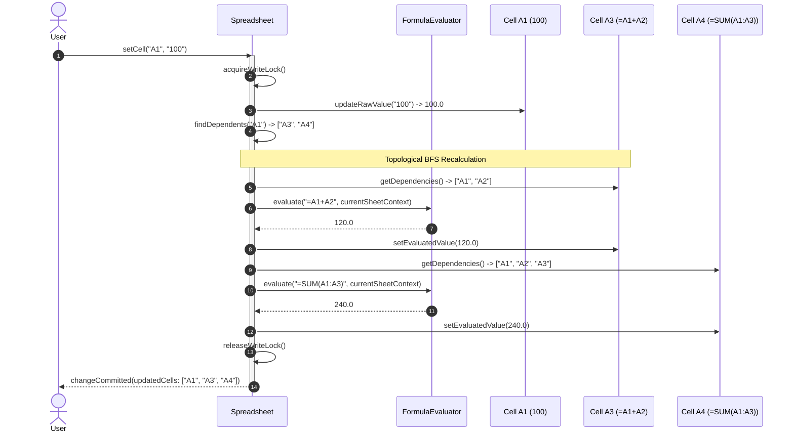

# Design a Spreadsheet (Excel)

## 1. Problem Statement
Design a spreadsheet with cells, formulas, dependency tracking, and auto-recalculation on changes.

## 2. Class & Sequence Design



### Sequence Diagram: Formula Dependency Evaluation & Change Propagation



## 3. Key Implementation

### Python

```python
from typing import Dict, Set, Optional, List
from enum import Enum
import re

class CellType(Enum):
    EMPTY = "EMPTY"
    NUMBER = "NUMBER"
    TEXT = "TEXT"
    FORMULA = "FORMULA"

class Cell:
    def __init__(self):
        self.raw_value = ""
        self.computed_value = None
        self.cell_type = CellType.EMPTY
        self.dependents: Set[str] = set()    # Cells that depend ON this cell
        self.dependencies: Set[str] = set()  # Cells THIS cell depends on

class Spreadsheet:
    def __init__(self, rows: int = 100, cols: int = 26):
        self.rows = rows
        self.cols = cols
        self._cells: Dict[str, Cell] = {}

    def set_cell(self, cell_ref: str, value: str):
        cell = self._get_or_create(cell_ref)
        
        # Remove old dependencies
        for dep in cell.dependencies:
            if dep in self._cells:
                self._cells[dep].dependents.discard(cell_ref)
        cell.dependencies.clear()

        cell.raw_value = value

        if not value:
            cell.cell_type = CellType.EMPTY
            cell.computed_value = None
        elif value.startswith('='):
            cell.cell_type = CellType.FORMULA
            refs = self._parse_references(value)
            cell.dependencies = refs
            for ref in refs:
                self._get_or_create(ref).dependents.add(cell_ref)
            
            if self._has_circular(cell_ref):
                cell.computed_value = "#CIRCULAR!"
                return
            cell.computed_value = self._evaluate(value[1:])
        elif self._is_number(value):
            cell.cell_type = CellType.NUMBER
            cell.computed_value = float(value)
        else:
            cell.cell_type = CellType.TEXT
            cell.computed_value = value

        # Recalculate dependents
        self._propagate(cell_ref)

    def get_cell(self, cell_ref: str):
        cell = self._cells.get(cell_ref)
        return cell.computed_value if cell else None

    def _evaluate(self, formula: str):
        """Evaluate formula by replacing cell refs with values"""
        def replace_ref(match):
            ref = match.group(0)
            val = self.get_cell(ref)
            return str(val) if val is not None else "0"

        expr = re.sub(r'[A-Z]+\d+', replace_ref, formula)
        try:
            expr = self._expand_functions(expr)
            return eval(expr)
        except:
            return "#ERROR!"

    def _expand_functions(self, expr: str) -> str:
        def sum_range(match):
            start, end = match.group(1), match.group(2)
            cells = self._get_range(start, end)
            values = [self.get_cell(c) or 0 for c in cells]
            return str(sum(float(v) for v in values))
        return re.sub(r'SUM\(([A-Z]\d+):([A-Z]\d+)\)', sum_range, expr)

    def _parse_references(self, formula: str) -> Set[str]:
        return set(re.findall(r'[A-Z]+\d+', formula))

    def _propagate(self, cell_ref: str):
        """BFS to recalculate all dependent cells"""
        visited = set()
        queue = list(self._cells.get(cell_ref, Cell()).dependents)
        while queue:
            ref = queue.pop(0)
            if ref in visited:
                continue
            visited.add(ref)
            cell = self._cells.get(ref)
            if cell and cell.cell_type == CellType.FORMULA:
                cell.computed_value = self._evaluate(cell.raw_value[1:])
            queue.extend(cell.dependents if cell else [])

    def _has_circular(self, start: str) -> bool:
        visited = set()
        stack = [start]
        while stack:
            ref = stack.pop()
            if ref in visited:
                return True
            visited.add(ref)
            cell = self._cells.get(ref)
            if cell:
                stack.extend(cell.dependencies)
        return False

    def _get_or_create(self, ref: str) -> Cell:
        if ref not in self._cells:
            self._cells[ref] = Cell()
        return self._cells[ref]

    def _get_range(self, start: str, end: str) -> List[str]:
        col1, row1 = start[0], int(start[1:])
        col2, row2 = end[0], int(end[1:])
        return [f"{col1}{r}" for r in range(row1, row2 + 1)]

    def _is_number(self, s: str) -> bool:
        try: float(s); return True
        except: return False
```

### Java

```java
package com.lld.spreadsheet;

import java.util.*;
import java.util.concurrent.ConcurrentHashMap;
import java.util.concurrent.locks.ReentrantReadWriteLock;
import java.util.regex.Matcher;
import java.util.regex.Pattern;

enum CellType {
    EMPTY, NUMBER, TEXT, FORMULA
}

class Cell {
    private String rawValue = "";
    private Object computedValue = null;
    private CellType cellType = CellType.EMPTY;
    private final Set<String> dependencies = ConcurrentHashMap.newKeySet();
    private final Set<String> dependents = ConcurrentHashMap.newKeySet();

    public String getRawValue() { return rawValue; }
    public void setRawValue(String rawValue) { this.rawValue = rawValue; }
    public Object getComputedValue() { return computedValue; }
    public void setComputedValue(Object computedValue) { this.computedValue = computedValue; }
    public CellType getCellType() { return cellType; }
    public void setCellType(CellType cellType) { this.cellType = cellType; }
    public Set<String> getDependencies() { return dependencies; }
    public Set<String> getDependents() { return dependents; }
}

public class Spreadsheet {
    private final Map<String, Cell> cells = new ConcurrentHashMap<>();
    private final ReentrantReadWriteLock rwLock = new ReentrantReadWriteLock();
    private static final Pattern CELL_REF_PATTERN = Pattern.compile("[A-Z]+[0-9]+");

    public void setCell(String cellRef, String value) {
        rwLock.writeLock().lock();
        try {
            Cell cell = getOrCreate(cellRef);

            // 1. Unlink existing reverse dependencies
            for (String dep : cell.getDependencies()) {
                Cell parent = cells.get(dep);
                if (parent != null) {
                    parent.getDependents().remove(cellRef);
                }
            }
            cell.getDependencies().clear();
            cell.setRawValue(value);

            // 2. Parse type and dependencies
            if (value == null || value.trim().isEmpty()) {
                cell.setCellType(CellType.EMPTY);
                cell.setComputedValue(null);
            } else if (value.startsWith("=")) {
                cell.setCellType(CellType.FORMULA);
                Set<String> refs = parseReferences(value);
                cell.getDependencies().addAll(refs);
                for (String ref : refs) {
                    getOrCreate(ref).getDependents().add(cellRef);
                }

                if (hasCircularDependency(cellRef)) {
                    cell.setComputedValue("#CIRCULAR!");
                    return;
                }
                cell.setComputedValue(evaluateFormula(value.substring(1)));
            } else if (isNumeric(value)) {
                cell.setCellType(CellType.NUMBER);
                cell.setComputedValue(Double.parseDouble(value));
            } else {
                cell.setCellType(CellType.TEXT);
                cell.setComputedValue(value);
            }

            // 3. Propagate topological updates
            propagateUpdates(cellRef);

        } finally {
            rwLock.writeLock().unlock();
        }
    }

    public Object getCellValue(String cellRef) {
        rwLock.readLock().lock();
        try {
            Cell cell = cells.get(cellRef);
            return (cell != null) ? cell.getComputedValue() : null;
        } finally {
            rwLock.readLock().unlock();
        }
    }

    private Cell getOrCreate(String ref) {
        return cells.computeIfAbsent(ref, k -> new Cell());
    }

    private Set<String> parseReferences(String formula) {
        Set<String> refs = new HashSet<>();
        Matcher matcher = CELL_REF_PATTERN.matcher(formula);
        while (matcher.find()) {
            refs.add(matcher.group());
        }
        return refs;
    }

    private boolean hasCircularDependency(String startRef) {
        Set<String> visited = new HashSet<>();
        Deque<String> stack = new ArrayDeque<>();
        stack.push(startRef);

        while (!stack.isEmpty()) {
            String curr = stack.pop();
            if (visited.contains(curr)) return true;
            visited.add(curr);

            Cell cell = cells.get(curr);
            if (cell != null) {
                for (String dep : cell.getDependencies()) {
                    stack.push(dep);
                }
            }
        }
        return false;
    }

    private Double evaluateFormula(String expression) {
        // Simple token replacement and evaluation demo
        String expr = expression;
        Matcher matcher = CELL_REF_PATTERN.matcher(expr);
        StringBuffer sb = new StringBuffer();
        while (matcher.find()) {
            String ref = matcher.group();
            Object val = getCellValue(ref);
            double num = (val instanceof Number) ? ((Number) val).doubleValue() : 0.0;
            matcher.appendReplacement(sb, String.valueOf(num));
        }
        matcher.appendTail(sb);

        // Compute basic addition expression "A1+A2"
        String[] terms = sb.toString().split("\\+");
        double sum = 0.0;
        for (String term : terms) {
            try {
                sum += Double.parseDouble(term.trim());
            } catch (NumberFormatException ignored) {}
        }
        return sum;
    }

    private void propagateUpdates(String rootRef) {
        Queue<String> queue = new LinkedList<>();
        Set<String> visited = new HashSet<>();
        Cell root = cells.get(rootRef);
        if (root != null) {
            queue.addAll(root.getDependents());
        }

        while (!queue.isEmpty()) {
            String ref = queue.poll();
            if (!visited.add(ref)) continue;

            Cell cell = cells.get(ref);
            if (cell != null && cell.getCellType() == CellType.FORMULA) {
                cell.setComputedValue(evaluateFormula(cell.getRawValue().substring(1)));
                queue.addAll(cell.getDependents());
            }
        }
    }

    private boolean isNumeric(String s) {
        try {
            Double.parseDouble(s);
            return true;
        } catch (NumberFormatException e) {
            return false;
        }
    }
}
```

## 4. Key Concepts
- **Dependency Graph**: Directed Acyclic Graph (DAG) tracking cell dependencies.
- **Circular Detection**: Cycle detection via DFS traversal before registering new formula dependencies.
- **Topological Change Propagation**: BFS/Topological sort from edited cell through dependent descendants.

## 5. Thread Safety Considerations

| Component | Concurrency Hazard | Mitigation Strategy |
| :--- | :--- | :--- |
| **Concurrent Cell Modification** | Two users writing to dependent cells creating circular dependencies | `ReentrantReadWriteLock` ensures mutual exclusion during graph cycle checks and dependent propagation. |
| **Read During Recalculation** | A thread querying a cell midway through multi-level dependency recalculation | Read locks ensure callers only observe coherent, fully propagated values. |
| **Dependency Set Mutations** | Dynamic addition/removal of edge references | `ConcurrentHashMap.newKeySet()` prevents `ConcurrentModificationException` during propagation loops. |

## 6. Extensibility & SOLID Principles

| Principle | Implementation in Design |
| :--- | :--- |
| **Single Responsibility (SRP)** | `Cell` holds state and adjacency lists; `Spreadsheet` manages the graph structure; `FormulaEvaluator` parses tokens and evaluates ASTs. |
| **Open/Closed (OCP)** | Custom functions (`VLOOKUP`, `AVERAGE`, `NPV`, `REGEXMATCH`) added to formula evaluator without touching cell storage models. |
| **Liskov Substitution (LSP)** | Different cell types (`FormulaCell`, `TextCell`, `NumericCell`) implement common evaluation interfaces. |
| **Interface Segregation (ISP)** | Separate observer interfaces for UI canvas rendering vs. recalculation engines. |
| **Dependency Inversion (DIP)** | Evaluation engine decouples from concrete storage, reading values via an abstract cell lookup context. |

## 7. Follow-ups
- **Undo/redo?** Command pattern with cell diffs (previous raw value, old dependency set) pushed onto undo stack.
- **Collaborative real-time editing?** Operational Transformation (OT) or Conflict-Free Replicated Data Types (CRDTs, e.g. LWW-Element-Set) per cell coordinates.
- **Sparse sheet memory optimization?** Store cells in compressed coordinate hash maps rather than a rigid 2D array of millions of empty objects.

---

**Related:** [[02 - Observer Pattern]] | [[12 - Composite Pattern]] | [[07 - Command Pattern]]

