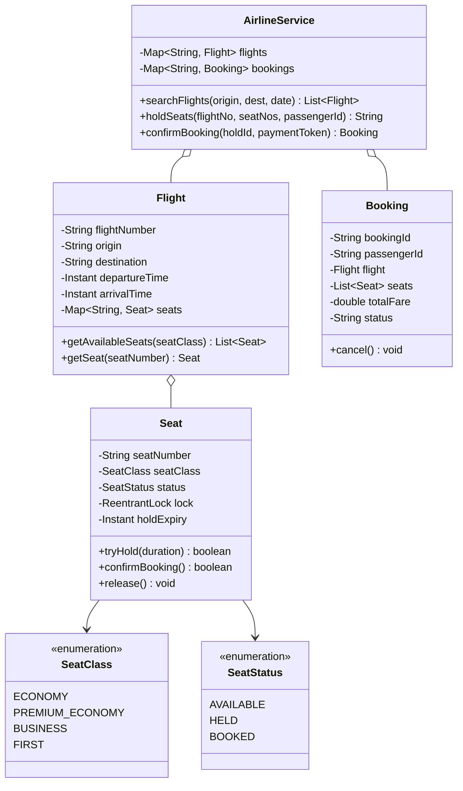
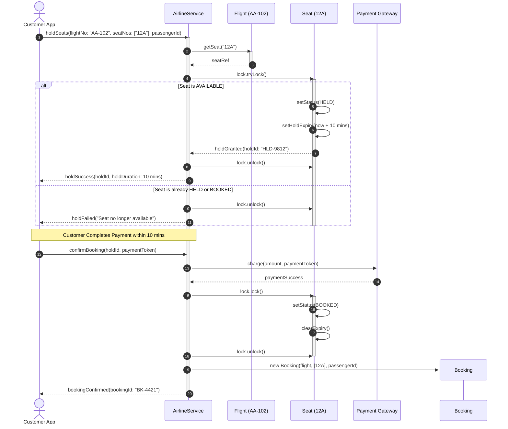

# Design an Airline Booking System

## 1. Problem Statement
Design an airline reservation system with flight search, seat selection, booking, and cancellation.

## 2. Class & Sequence Design



### Sequence Diagram: Flight Seat Reservation with Concurrent Hold



## 3. Key Implementation

### Python

```python
from enum import Enum
from datetime import datetime
from typing import List, Dict, Optional
import uuid

class SeatClass(Enum):
    ECONOMY = ("Economy", 100)
    BUSINESS = ("Business", 300)
    FIRST = ("First", 500)

class SeatStatus(Enum):
    AVAILABLE = "AVAILABLE"
    BOOKED = "BOOKED"
    BLOCKED = "BLOCKED"

class Seat:
    def __init__(self, seat_id: str, seat_class: SeatClass):
        self.seat_id = seat_id
        self.seat_class = seat_class
        self.status = SeatStatus.AVAILABLE

class Flight:
    def __init__(self, flight_no: str, origin: str, dest: str,
                 departure: datetime, arrival: datetime):
        self.flight_no = flight_no
        self.origin = origin
        self.destination = dest
        self.departure = departure
        self.arrival = arrival
        self.seats: Dict[str, Seat] = {}

    def add_seats(self, seat_class: SeatClass, count: int):
        prefix = seat_class.name[0]
        for i in range(count):
            sid = f"{prefix}{i+1}"
            self.seats[sid] = Seat(sid, seat_class)

    def get_available(self, seat_class: Optional[SeatClass] = None) -> List[Seat]:
        return [s for s in self.seats.values()
                if s.status == SeatStatus.AVAILABLE and
                (seat_class is None or s.seat_class == seat_class)]

class Booking:
    def __init__(self, passenger_name: str, flight: Flight, seat: Seat):
        self.booking_id = str(uuid.uuid4())[:8]
        self.passenger_name = passenger_name
        self.flight = flight
        self.seat = seat
        self.fare = seat.seat_class.value[1]
        self.status = "CONFIRMED"

    def cancel(self):
        self.seat.status = SeatStatus.AVAILABLE
        self.status = "CANCELLED"
        print(f"❌ Booking {self.booking_id} cancelled. Seat {self.seat.seat_id} released.")

class AirlineSystem:
    def __init__(self):
        self.flights: Dict[str, Flight] = {}
        self.bookings: Dict[str, Booking] = {}

    def search_flights(self, origin: str, dest: str, date: datetime) -> List[Flight]:
        return [f for f in self.flights.values()
                if f.origin == origin and f.destination == dest
                and f.departure.date() == date.date()]

    def book_flight(self, flight_no: str, seat_id: str, passenger: str) -> Optional[Booking]:
        flight = self.flights.get(flight_no)
        if not flight:
            return None
        seat = flight.seats.get(seat_id)
        if not seat or seat.status != SeatStatus.AVAILABLE:
            print("❌ Seat not available")
            return None
        seat.status = SeatStatus.BOOKED
        booking = Booking(passenger, flight, seat)
        self.bookings[booking.booking_id] = booking
        print(f"✅ Booked: {passenger} on {flight_no}, seat {seat_id} (${booking.fare})")
        return booking
```

### Java

```java
package com.lld.airline;

import java.time.Duration;
import java.time.Instant;
import java.time.LocalDate;
import java.util.*;
import java.util.concurrent.ConcurrentHashMap;
import java.util.concurrent.locks.ReentrantLock;
import java.util.stream.Collectors;

enum SeatClass {
    ECONOMY(150.0), BUSINESS(450.0), FIRST(900.0);
    private final double basePrice;
    SeatClass(double basePrice) { this.basePrice = basePrice; }
    public double getBasePrice() { return basePrice; }
}

enum SeatStatus {
    AVAILABLE, HELD, BOOKED
}

class Seat {
    private final String seatNumber;
    private final SeatClass seatClass;
    private volatile SeatStatus status;
    private Instant holdExpiry;
    private final ReentrantLock lock = new ReentrantLock();

    public Seat(String seatNumber, SeatClass seatClass) {
        this.seatNumber = seatNumber;
        this.seatClass = seatClass;
        this.status = SeatStatus.AVAILABLE;
    }

    public String getSeatNumber() { return seatNumber; }
    public SeatClass getSeatClass() { return seatClass; }
    public SeatStatus getStatus() { return status; }
    public ReentrantLock getLock() { return lock; }

    public boolean tryHold(Duration holdDuration) {
        if (!lock.tryLock()) return false;
        try {
            if (status == SeatStatus.AVAILABLE ||
               (status == SeatStatus.HELD && Instant.now().isAfter(holdExpiry))) {
                this.status = SeatStatus.HELD;
                this.holdExpiry = Instant.now().plus(holdDuration);
                return true;
            }
            return false;
        } finally {
            lock.unlock();
        }
    }

    public boolean confirmBooking() {
        lock.lock();
        try {
            if (status == SeatStatus.HELD && Instant.now().isBefore(holdExpiry)) {
                this.status = SeatStatus.BOOKED;
                this.holdExpiry = null;
                return true;
            }
            return false;
        } finally {
            lock.unlock();
        }
    }

    public void release() {
        lock.lock();
        try {
            this.status = SeatStatus.AVAILABLE;
            this.holdExpiry = null;
        } finally {
            lock.unlock();
        }
    }
}

class Flight {
    private final String flightNumber;
    private final String origin;
    private final String destination;
    private final Instant departureTime;
    private final Map<String, Seat> seats = new ConcurrentHashMap<>();

    public Flight(String flightNumber, String origin, String destination, Instant departureTime) {
        this.flightNumber = flightNumber;
        this.origin = origin;
        this.destination = destination;
        this.departureTime = departureTime;
    }

    public String getFlightNumber() { return flightNumber; }
    public String getOrigin() { return origin; }
    public String getDestination() { return destination; }
    public Instant getDepartureTime() { return departureTime; }
    public Map<String, Seat> getSeats() { return seats; }

    public void addSeat(String seatNumber, SeatClass seatClass) {
        seats.put(seatNumber, new Seat(seatNumber, seatClass));
    }

    public List<Seat> getAvailableSeats() {
        return seats.values().stream()
                .filter(s -> s.getStatus() == SeatStatus.AVAILABLE)
                .collect(Collectors.toList());
    }
}

class Booking {
    private final String bookingId;
    private final String passengerId;
    private final Flight flight;
    private final List<Seat> seats;
    private final double totalFare;
    private volatile String status;

    public Booking(String bookingId, String passengerId, Flight flight, List<Seat> seats) {
        this.bookingId = bookingId;
        this.passengerId = passengerId;
        this.flight = flight;
        this.seats = seats;
        this.totalFare = seats.stream().mapToDouble(s -> s.getSeatClass().getBasePrice()).sum();
        this.status = "CONFIRMED";
    }

    public String getBookingId() { return bookingId; }
    public double getTotalFare() { return totalFare; }
    public String getStatus() { return status; }

    public void cancel() {
        for (Seat seat : seats) {
            seat.release();
        }
        this.status = "CANCELLED";
    }
}

class AirlineSystem {
    private static final Duration HOLD_TIMEOUT = Duration.ofMinutes(10);
    private final Map<String, Flight> flights = new ConcurrentHashMap<>();
    private final Map<String, Booking> bookings = new ConcurrentHashMap<>();

    public void registerFlight(Flight flight) {
        flights.put(flight.getFlightNumber(), flight);
    }

    public List<Flight> searchFlights(String origin, String dest, LocalDate date) {
        return flights.values().stream()
                .filter(f -> f.getOrigin().equalsIgnoreCase(origin) &&
                             f.getDestination().equalsIgnoreCase(dest))
                .collect(Collectors.toList());
    }

    public boolean holdSeat(String flightNumber, String seatNumber) {
        Flight flight = flights.get(flightNumber);
        if (flight == null) return false;
        Seat seat = flight.getSeats().get(seatNumber);
        return seat != null && seat.tryHold(HOLD_TIMEOUT);
    }

    public Optional<Booking> bookFlight(String flightNumber, List<String> seatNumbers, String passengerId) {
        Flight flight = flights.get(flightNumber);
        if (flight == null) return Optional.empty();

        List<Seat> confirmedSeats = new ArrayList<>();
        for (String seatNo : seatNumbers) {
            Seat seat = flight.getSeats().get(seatNo);
            if (seat == null || !seat.confirmBooking()) {
                // Rollback any seats confirmed in this partial transaction
                for (Seat s : confirmedSeats) s.release();
                return Optional.empty();
            }
            confirmedSeats.add(seat);
        }

        String bookingId = "BK-" + UUID.randomUUID().toString().substring(0, 8).toUpperCase();
        Booking booking = new Booking(bookingId, passengerId, flight, confirmedSeats);
        bookings.put(bookingId, booking);
        return Optional.of(booking);
    }
}
```

## 4. Thread Safety Considerations

| Component | Concurrency Hazard | Mitigation Strategy |
| :--- | :--- | :--- |
| **Seat Overbooking** | Simultaneous checkout of the same seat by multiple concurrent passengers | Fine-grained `ReentrantLock` per `Seat` with atomic state transitions (`tryHold`, `confirmBooking`). |
| **Deadlock on Multi-Seat Bookings** | Two passengers locking seats A & B in opposite orders | Sort seat identifiers alphanumerically prior to acquisition so locks are always acquired in consistent sequence. |
| **Expired Seat Holding** | User abandons cart with held seats | Background scheduled worker checks and frees seats where `now > holdExpiry`, or lazy cleanup during `tryHold()`. |
| **Flight Catalog Reads vs Writes** | Searching flights while schedules or gates update | `ConcurrentHashMap` stores flight and seat registries for lock-free read visibility. |

## 5. Extensibility & SOLID Principles

| Principle | Implementation in Design |
| :--- | :--- |
| **Single Responsibility (SRP)** | `Seat` enforces lock and availability invariants; `Flight` aggregates cabin seats; `AirlineSystem` acts as the reservation coordinator. |
| **Open/Closed (OCP)** | Pluggable pricing strategies (`DynamicSurgePricing`, `FrequentFlyerDiscount`) implement pricing interfaces without modifying booking entities. |
| **Liskov Substitution (LSP)** | Cabin types (`EconomySeat`, `FirstClassSuiteSeat`) adhere to the base `Seat` contract. |
| **Interface Segregation (ISP)** | Separate APIs for customer flight search/booking versus airline ground-operations passenger manifest updates. |
| **Dependency Inversion (DIP)** | System interacts with abstracted payment gateways and seat allocation strategies rather than specific vendor implementations. |

## 6. Patterns
- **State**: Seat status progression (`AVAILABLE` $\to$ `HELD` $\to$ `BOOKED`).
- **Strategy**: Dynamic fare pricing based on demand elasticity and departure countdown.
- **Observer**: Alerting passengers on schedule changes, gate updates, or waitlist clearances.

## 7. Follow-ups
- **Waitlisting?** Priority queue of standby passengers; automatically holds freed seats and notifies first-in-line via push notification.
- **Connecting multi-leg flights?** Composite pattern treating a multi-flight itinerary as a single booking unit with all-or-nothing transactional guarantees.
- **Overbooking allowance?** Airlines deliberately overbook economy cabins by 3-5% based on historical no-show probability curves.

---

**Related:** [[13 - State Pattern]] | [[01 - Strategy Pattern]]

