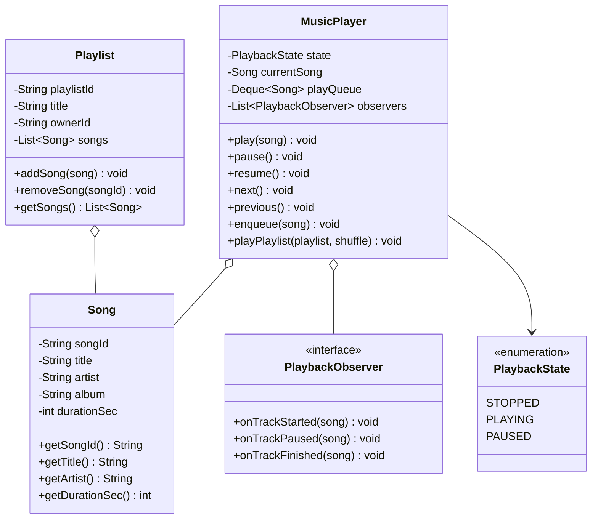
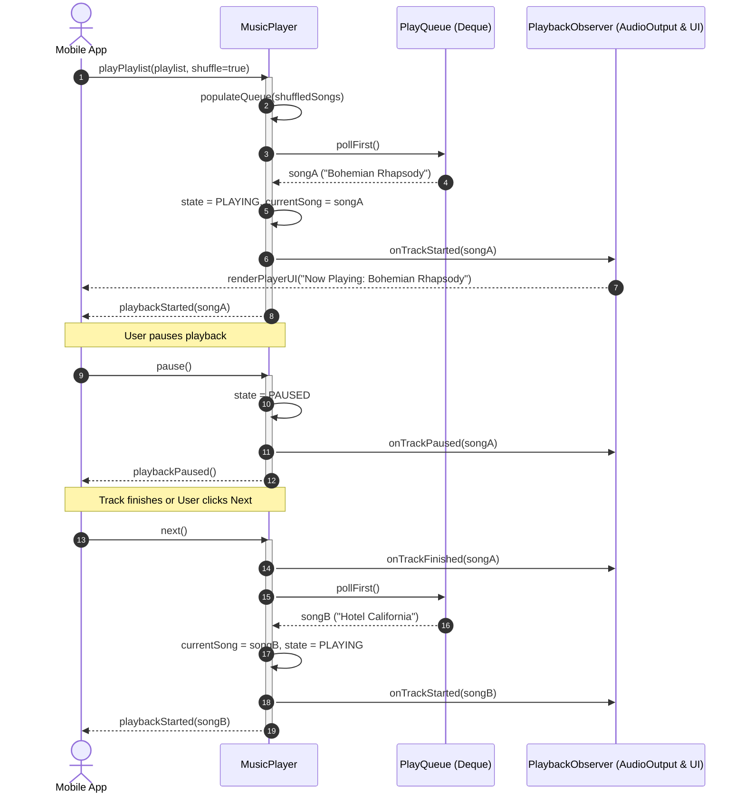

# Design a Music Streaming Service (Spotify)

## 1. Problem Statement
Design a music streaming service with playlists, search, play queue, and user subscriptions.

## 2. Class & Sequence Design



### Sequence Diagram: Track Playback & Queue Advancement



## 3. Key Implementation

### Python

```python
from enum import Enum
from typing import List, Dict, Optional
from collections import deque

class Song:
    def __init__(self, song_id: str, title: str, artist: str,
                 album: str, duration_sec: int):
        self.song_id = song_id
        self.title = title
        self.artist = artist
        self.album = album
        self.duration = duration_sec

class Playlist:
    def __init__(self, name: str, owner_id: str):
        self.name = name
        self.owner_id = owner_id
        self.songs: List[Song] = []

    def add_song(self, song: Song):
        self.songs.append(song)

    def remove_song(self, song_id: str):
        self.songs = [s for s in self.songs if s.song_id != song_id]

class PlaybackState(Enum):
    STOPPED = "STOPPED"
    PLAYING = "PLAYING"
    PAUSED = "PAUSED"

class MusicPlayer:
    def __init__(self):
        self.state = PlaybackState.STOPPED
        self.current_song: Optional[Song] = None
        self.queue: deque = deque()
        self.history: List[Song] = []

    def play(self, song: Song):
        self.current_song = song
        self.state = PlaybackState.PLAYING
        self.history.append(song)
        print(f"▶️ Playing: {song.title} — {song.artist}")

    def pause(self):
        if self.state == PlaybackState.PLAYING:
            self.state = PlaybackState.PAUSED
            print(f"⏸️ Paused: {self.current_song.title}")

    def resume(self):
        if self.state == PlaybackState.PAUSED:
            self.state = PlaybackState.PLAYING
            print(f"▶️ Resumed: {self.current_song.title}")

    def next(self):
        if self.queue:
            song = self.queue.popleft()
            self.play(song)
        else:
            self.state = PlaybackState.STOPPED
            print("⏹️ Queue empty")

    def add_to_queue(self, song: Song):
        self.queue.append(song)
        print(f"➕ Added to queue: {song.title}")

    def play_playlist(self, playlist: Playlist, shuffle: bool = False):
        songs = list(playlist.songs)
        if shuffle:
            import random
            random.shuffle(songs)
        self.queue = deque(songs[1:])
        if songs:
            self.play(songs[0])

class MusicService:
    def __init__(self):
        self.songs: Dict[str, Song] = {}
        self.playlists: Dict[str, Playlist] = {}
        self.players: Dict[str, MusicPlayer] = {}

    def search(self, query: str) -> List[Song]:
        q = query.lower()
        return [s for s in self.songs.values()
                if q in s.title.lower() or q in s.artist.lower()]

    def get_player(self, user_id: str) -> MusicPlayer:
        if user_id not in self.players:
            self.players[user_id] = MusicPlayer()
        return self.players[user_id]
```

### Java

```java
package com.lld.spotify;

import java.util.*;
import java.util.concurrent.*;
import java.util.concurrent.locks.ReentrantLock;

enum PlaybackState {
    STOPPED, PLAYING, PAUSED
}

class Song {
    private final String songId;
    private final String title;
    private final String artist;
    private final String album;
    private final int durationSec;

    public Song(String songId, String title, String artist, String album, int durationSec) {
        this.songId = songId;
        this.title = title;
        this.artist = artist;
        this.album = album;
        this.durationSec = durationSec;
    }

    public String getSongId() { return songId; }
    public String getTitle() { return title; }
    public String getArtist() { return artist; }
    public String getAlbum() { return album; }
    public int getDurationSec() { return durationSec; }

    @Override
    public String toString() {
        return title + " - " + artist + " (" + durationSec + "s)";
    }
}

class Playlist {
    private final String playlistId;
    private final String name;
    private final String ownerId;
    private final List<Song> songs = new CopyOnWriteArrayList<>();

    public Playlist(String playlistId, String name, String ownerId) {
        this.playlistId = playlistId;
        this.name = name;
        this.ownerId = ownerId;
    }

    public String getPlaylistId() { return playlistId; }
    public String getName() { return name; }
    public String getOwnerId() { return ownerId; }
    public List<Song> getSongs() { return Collections.unmodifiableList(songs); }

    public void addSong(Song song) {
        songs.add(song);
    }

    public void removeSong(String songId) {
        songs.removeIf(s -> s.getSongId().equals(songId));
    }
}

interface PlaybackObserver {
    void onTrackStarted(Song song);
    void onTrackPaused(Song song);
    void onTrackFinished(Song song);
}

class MusicPlayer {
    private volatile PlaybackState state = PlaybackState.STOPPED;
    private volatile Song currentSong = null;
    private final ConcurrentLinkedDeque<Song> queue = new ConcurrentLinkedDeque<>();
    private final List<Song> history = new CopyOnWriteArrayList<>();
    private final List<PlaybackObserver> observers = new CopyOnWriteArrayList<>();
    private final ReentrantLock playerLock = new ReentrantLock();

    public void addObserver(PlaybackObserver observer) {
        observers.add(observer);
    }

    public void play(Song song) {
        playerLock.lock();
        try {
            this.currentSong = song;
            this.state = PlaybackState.PLAYING;
            history.add(song);
            for (PlaybackObserver obs : observers) {
                obs.onTrackStarted(song);
            }
            System.out.println("▶️ Playing: " + song);
        } finally {
            playerLock.unlock();
        }
    }

    public void pause() {
        playerLock.lock();
        try {
            if (state == PlaybackState.PLAYING) {
                this.state = PlaybackState.PAUSED;
                for (PlaybackObserver obs : observers) {
                    obs.onTrackPaused(currentSong);
                }
                System.out.println("⏸️ Paused: " + currentSong.getTitle());
            }
        } finally {
            playerLock.unlock();
        }
    }

    public void resume() {
        playerLock.lock();
        try {
            if (state == PlaybackState.PAUSED && currentSong != null) {
                this.state = PlaybackState.PLAYING;
                for (PlaybackObserver obs : observers) {
                    obs.onTrackStarted(currentSong);
                }
                System.out.println("▶️ Resumed: " + currentSong.getTitle());
            }
        } finally {
            playerLock.unlock();
        }
    }

    public void next() {
        playerLock.lock();
        try {
            if (currentSong != null) {
                for (PlaybackObserver obs : observers) {
                    obs.onTrackFinished(currentSong);
                }
            }
            Song nextSong = queue.pollFirst();
            if (nextSong != null) {
                play(nextSong);
            } else {
                this.state = PlaybackState.STOPPED;
                this.currentSong = null;
                System.out.println("⏹️ Queue finished. Playback stopped.");
            }
        } finally {
            playerLock.unlock();
        }
    }

    public void enqueue(Song song) {
        queue.offerLast(song);
        System.out.println("➕ Enqueued: " + song.getTitle());
    }

    public void playPlaylist(Playlist playlist, boolean shuffle) {
        playerLock.lock();
        try {
            queue.clear();
            List<Song> songs = new ArrayList<>(playlist.getSongs());
            if (songs.isEmpty()) return;

            if (shuffle) {
                Collections.shuffle(songs);
            }
            for (int i = 1; i < songs.size(); i++) {
                queue.offerLast(songs.get(i));
            }
            play(songs.get(0));
        } finally {
            playerLock.unlock();
        }
    }

    public PlaybackState getState() { return state; }
    public Song getCurrentSong() { return currentSong; }
}

class MusicStreamingService {
    private final Map<String, Song> catalog = new ConcurrentHashMap<>();
    private final Map<String, Playlist> playlists = new ConcurrentHashMap<>();
    private final Map<String, MusicPlayer> userPlayers = new ConcurrentHashMap<>();

    public void addSong(Song song) {
        catalog.put(song.getSongId(), song);
    }

    public Playlist createPlaylist(String name, String ownerId) {
        String id = "pl-" + UUID.randomUUID().toString().substring(0, 6);
        Playlist pl = new Playlist(id, name, ownerId);
        playlists.put(id, pl);
        return pl;
    }

    public MusicPlayer getPlayerForUser(String userId) {
        return userPlayers.computeIfAbsent(userId, k -> new MusicPlayer());
    }
}
```

## 4. Thread Safety Considerations

| Component | Concurrency Hazard | Mitigation Strategy |
| :--- | :--- | :--- |
| **Playback State Mutations** | Race condition between hardware headphone disconnect (auto-pause) and UI skip-next click | `ReentrantLock` guards state transition transitions (`PLAYING` $\to$ `PAUSED` $\to$ `STOPPED`). |
| **Play Queue Modifications** | User adds songs to queue while background audio thread is polling next track | `ConcurrentLinkedDeque` ensures lock-free concurrent producer-consumer enqueue and dequeue. |
| **Active Observers Dispatch** | Attaching or detaching UI listeners during active track transitions | `CopyOnWriteArrayList` guarantees safe concurrent iteration during event dispatch. |
| **User Session Isolation** | Independent playback state across multiple authenticated devices | Per-user player instances mapped in `ConcurrentHashMap`; active device handoff governed by device coordinator token. |

## 5. Extensibility & SOLID Principles

| Principle | Implementation in Design |
| :--- | :--- |
| **Single Responsibility (SRP)** | `Song` holds audio metadata; `MusicPlayer` coordinates playback states and queue; `MusicStreamingService` indexes catalogs and user sessions. |
| **Open/Closed (OCP)** | Pluggable audio decoders (FLAC, MP3, AAC) and recommendation engines implement strategy interfaces without altering playback control loops. |
| **Liskov Substitution (LSP)** | Different playable media (`PodcastEpisode`, `AudiobookChapter`, `LiveStream`) extend a shared `PlayableItem` abstraction cleanly. |
| **Interface Segregation (ISP)** | Separate callback interfaces for audio decoders, UI state listeners, and analytics telemetry dispatchers. |
| **Dependency Inversion (DIP)** | Player dispatches events to `PlaybackObserver` contracts rather than coupling directly to specific OS audio output APIs. |

## 6. Patterns
- **State**: Playback state machine (`STOPPED`, `PLAYING`, `PAUSED`).
- **Observer**: Notifying UI, lock-screen widget, scrobbler, and analytics upon playback events.
- **Strategy**: Shuffle algorithms (Fisher-Yates, Smart Non-Repeating Artist Shuffle).
- **Iterator**: Queue forward and backward traversal.

## 7. Follow-ups
- **Offline DRM playback?** Encrypted local file cache with license token check prior to playback (Proxy pattern).
- **Spotify Connect (Multi-Device Handover)?** WebSocket state sync where remote device acts as controller sending commands to active playback speaker.
- **Real-time lyrics sync?** Sub-second timeline observer matching current playback millisecond offset against timed lyric tokens.

---

**Related:** [[13 - State Pattern]] | [[02 - Observer Pattern]] | [[11 - Iterator Pattern]]

