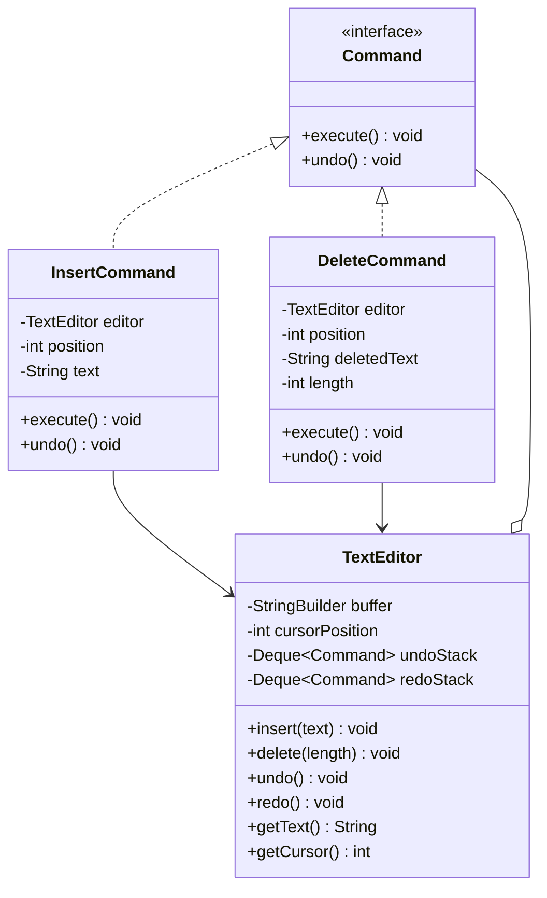
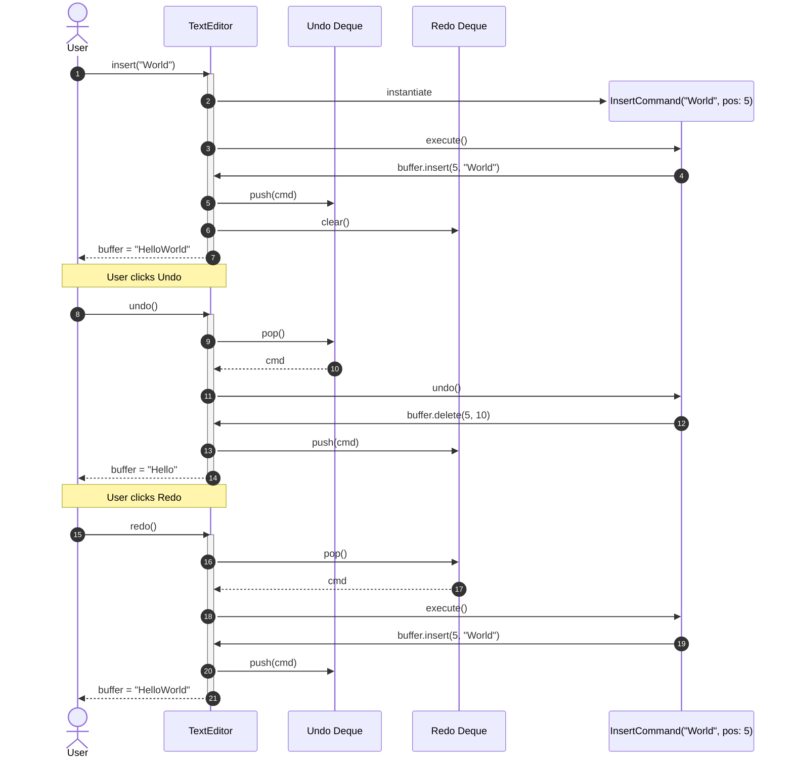

# Design a Text Editor (Undo/Redo)

## 1. Problem Statement
Design a text editor with insert, delete, cursor movement, and undo/redo functionality using the Command pattern.

## 2. Class & Sequence Design



### Sequence Diagram: Insert, Undo, and Redo Operations



## 3. Key Implementation

### Python

```python
from abc import ABC, abstractmethod
from typing import List

class Command(ABC):
    @abstractmethod
    def execute(self): pass
    @abstractmethod
    def undo(self): pass

class InsertCommand(Command):
    def __init__(self, editor: 'TextEditor', position: int, text: str):
        self._editor = editor
        self._position = position
        self._text = text

    def execute(self):
        self._editor.buffer = (self._editor.buffer[:self._position] +
                                self._text +
                                self._editor.buffer[self._position:])
        self._editor.cursor = self._position + len(self._text)

    def undo(self):
        self._editor.buffer = (self._editor.buffer[:self._position] +
                                self._editor.buffer[self._position + len(self._text):])
        self._editor.cursor = self._position

class DeleteCommand(Command):
    def __init__(self, editor: 'TextEditor', position: int, length: int):
        self._editor = editor
        self._position = position
        self._length = length
        self._deleted_text = ""

    def execute(self):
        self._deleted_text = self._editor.buffer[self._position:self._position + self._length]
        self._editor.buffer = (self._editor.buffer[:self._position] +
                                self._editor.buffer[self._position + self._length:])
        self._editor.cursor = self._position

    def undo(self):
        self._editor.buffer = (self._editor.buffer[:self._position] +
                                self._deleted_text +
                                self._editor.buffer[self._position:])
        self._editor.cursor = self._position + len(self._deleted_text)

class TextEditor:
    def __init__(self):
        self.buffer = ""
        self.cursor = 0
        self._undo_stack: List[Command] = []
        self._redo_stack: List[Command] = []

    def insert(self, text: str):
        cmd = InsertCommand(self, self.cursor, text)
        cmd.execute()
        self._undo_stack.append(cmd)
        self._redo_stack.clear()

    def delete(self, length: int = 1):
        if self.cursor > 0:
            pos = max(0, self.cursor - length)
            actual_len = self.cursor - pos
            cmd = DeleteCommand(self, pos, actual_len)
            cmd.execute()
            self._undo_stack.append(cmd)
            self._redo_stack.clear()

    def undo(self):
        if self._undo_stack:
            cmd = self._undo_stack.pop()
            cmd.undo()
            self._redo_stack.append(cmd)

    def redo(self):
        if self._redo_stack:
            cmd = self._redo_stack.pop()
            cmd.execute()
            self._undo_stack.append(cmd)

    def __str__(self):
        return f"'{self.buffer}' (cursor: {self.cursor})"
```

### Java

```java
package com.lld.texteditor;

import java.util.ArrayDeque;
import java.util.Deque;
import java.util.concurrent.locks.ReentrantLock;

interface Command {
    void execute();
    void undo();
}

class TextEditor {
    private final StringBuilder buffer = new StringBuilder();
    private int cursorPosition = 0;
    private final Deque<Command> undoStack = new ArrayDeque<>();
    private final Deque<Command> redoStack = new ArrayDeque<>();
    private final ReentrantLock lock = new ReentrantLock();

    public void insert(String text) {
        lock.lock();
        try {
            Command cmd = new InsertCommand(this, cursorPosition, text);
            cmd.execute();
            undoStack.push(cmd);
            redoStack.clear();
        } finally {
            lock.unlock();
        }
    }

    public void delete(int length) {
        lock.lock();
        try {
            if (cursorPosition == 0 || length <= 0) return;
            int start = Math.max(0, cursorPosition - length);
            int actualLength = cursorPosition - start;
            Command cmd = new DeleteCommand(this, start, actualLength);
            cmd.execute();
            undoStack.push(cmd);
            redoStack.clear();
        } finally {
            lock.unlock();
        }
    }

    public void undo() {
        lock.lock();
        try {
            if (!undoStack.isEmpty()) {
                Command cmd = undoStack.pop();
                cmd.undo();
                redoStack.push(cmd);
            }
        } finally {
            lock.unlock();
        }
    }

    public void redo() {
        lock.lock();
        try {
            if (!redoStack.isEmpty()) {
                Command cmd = redoStack.pop();
                cmd.execute();
                undoStack.push(cmd);
            }
        } finally {
            lock.unlock();
        }
    }

    // Package-private buffer mutators for commands
    void internalInsert(int pos, String text) {
        buffer.insert(pos, text);
        this.cursorPosition = pos + text.length();
    }

    String internalDelete(int pos, int len) {
        String deleted = buffer.substring(pos, pos + len);
        buffer.delete(pos, pos + len);
        this.cursorPosition = pos;
        return deleted;
    }

    public String getText() {
        lock.lock();
        try {
            return buffer.toString();
        } finally {
            lock.unlock();
        }
    }

    public int getCursorPosition() {
        lock.lock();
        try {
            return cursorPosition;
        } finally {
            lock.unlock();
        }
    }
}

class InsertCommand implements Command {
    private final TextEditor editor;
    private final int position;
    private final String text;

    public InsertCommand(TextEditor editor, int position, String text) {
        this.editor = editor;
        this.position = position;
        this.text = text;
    }

    @Override
    public void execute() {
        editor.internalInsert(position, text);
    }

    @Override
    public void undo() {
        editor.internalDelete(position, text.length());
    }
}

class DeleteCommand implements Command {
    private final TextEditor editor;
    private final int position;
    private final int length;
    private String deletedText;

    public DeleteCommand(TextEditor editor, int position, int length) {
        this.editor = editor;
        this.position = position;
        this.length = length;
    }

    @Override
    public void execute() {
        this.deletedText = editor.internalDelete(position, length);
    }

    @Override
    public void undo() {
        editor.internalInsert(position, deletedText);
    }
}
```

## 4. Thread Safety Considerations

| Component | Concurrency Hazard | Mitigation Strategy |
| :--- | :--- | :--- |
| **Buffer Mutation vs Undo/Redo** | Concurrent keystrokes corrupting `StringBuilder` offset positions | `ReentrantLock` synchronizes all editing actions and undo/redo evaluations. |
| **Undo Stack Interleaving** | Two typing threads popping and pushing simultaneously onto the undo stack | Stack mutations happen inside the same critical section as text manipulation. |
| **Cursor Alignment Drift** | Inconsistent cursor position if read concurrently with character insertion | Cursor position is updated atomically inside the locked editor methods. |

## 5. Extensibility & SOLID Principles

| Principle | Implementation in Design |
| :--- | :--- |
| **Single Responsibility (SRP)** | `TextEditor` manages the text buffer and history stacks; each `Command` handles its specific execution and inverse logic. |
| **Open/Closed (OCP)** | New editing commands (`ReplaceCommand`, `FormatBoldCommand`, `IndentCommand`) implement `Command` without changing the editor core. |
| **Liskov Substitution (LSP)** | All command implementations adhere strictly to the reversible `execute()` and `undo()` contract. |
| **Interface Segregation (ISP)** | Command interface specifies minimal necessary methods (`execute`, `undo`) without polluting callers with buffer management. |
| **Dependency Inversion (DIP)** | `TextEditor` relies on abstract `Command` objects rather than hardcoded text action conditionals. |

## 6. Patterns
- **Command**: Encapsulating edits as command objects with inverse operations for reversible history.
- **Memento**: Alternative snapshot approach capturing whole buffer states for complex multi-cursor edits.
- **Composite**: `MacroCommand` grouping multiple sub-commands (e.g. Find and Replace across document).

## 7. Follow-ups
- **Large file performance?** Gap Buffer, Piece Table, or Rope data structures instead of `StringBuilder` to avoid $O(N)$ memory copies.
- **Macro recording?** Record a list of commands executed by user and replay them sequentially on different selections.
- **Collaborative multi-user editing?** Operational Transformation (OT) or Conflict-Free Replicated Data Types (CRDTs) to resolve concurrent conflicting offsets.

---

**Related:** [[07 - Command Pattern]] | [[02 - Observer Pattern]]

