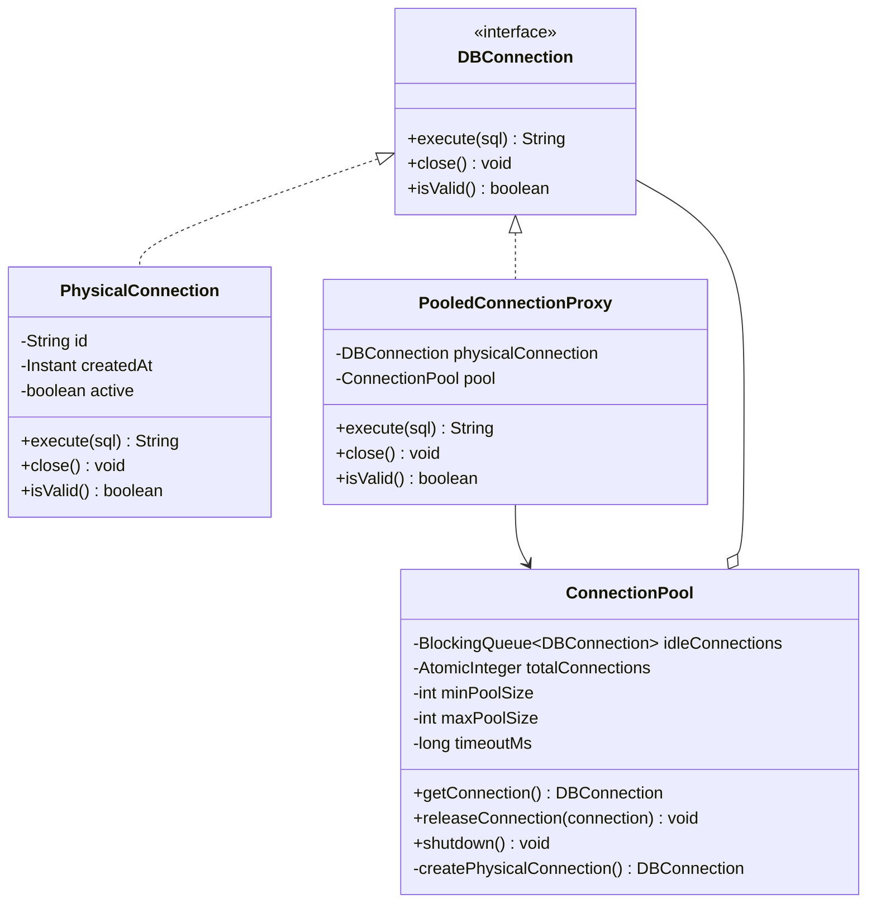
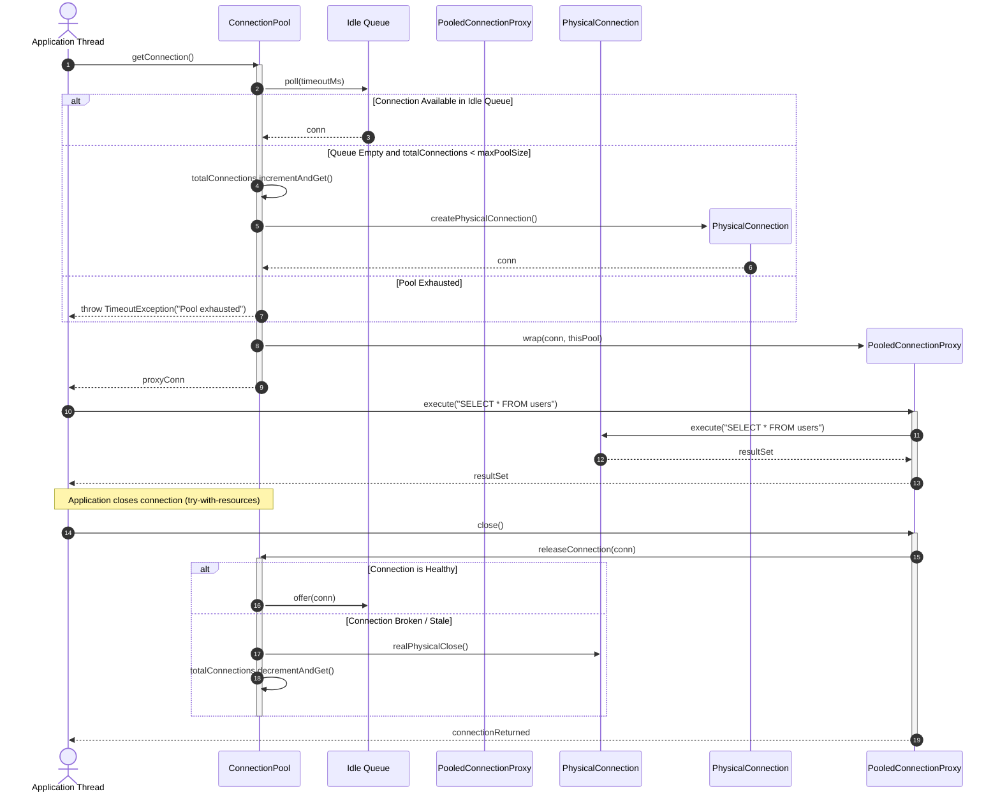

# Design a Database Connection Pool

## 1. Problem Statement
Design a thread-safe connection pool that manages reusable database connections with configurable min/max size, timeout, and health checks.

## 2. Class & Sequence Design



### Sequence Diagram: Connection Borrow, Query Execution, and Return



## 3. Key Implementation

### Python

```python
import threading, time, queue
from typing import Optional

class Connection:
    """Simulated database connection"""
    _counter = 0
    def __init__(self):
        Connection._counter += 1
        self.id = Connection._counter
        self.created_at = time.time()
        self.is_valid = True

    def execute(self, sql: str) -> str:
        return f"[Conn-{self.id}] Executed: {sql}"

    def close(self):
        self.is_valid = False

class ConnectionPool:
    def __init__(self, min_size: int = 2, max_size: int = 10,
                 timeout: float = 5.0, max_idle_time: float = 300):
        self.min_size = min_size
        self.max_size = max_size
        self.timeout = timeout
        self.max_idle_time = max_idle_time
        self._pool = queue.Queue(maxsize=max_size)
        self._active_count = 0
        self._lock = threading.Lock()

        # Pre-populate with min connections
        for _ in range(min_size):
            self._pool.put(Connection())
            self._active_count += 1

    def get_connection(self) -> Optional[Connection]:
        """Get a connection from the pool (blocking with timeout)"""
        try:
            conn = self._pool.get(timeout=0.1)
            if conn.is_valid:
                return conn
            return self._create_connection()
        except queue.Empty:
            return self._create_connection()

    def release_connection(self, conn: Connection):
        """Return connection to the pool"""
        if conn.is_valid:
            try:
                self._pool.put_nowait(conn)
            except queue.Full:
                conn.close()
                with self._lock:
                    self._active_count -= 1
        else:
            with self._lock:
                self._active_count -= 1

    def _create_connection(self) -> Optional[Connection]:
        with self._lock:
            if self._active_count < self.max_size:
                conn = Connection()
                self._active_count += 1
                return conn
        try:
            return self._pool.get(timeout=self.timeout)
        except queue.Empty:
            raise TimeoutError("Connection pool exhausted")

    @property
    def available(self) -> int:
        return self._pool.qsize()

    @property
    def active(self) -> int:
        return self._active_count

    def shutdown(self):
        while not self._pool.empty():
            conn = self._pool.get()
            conn.close()

class PooledConnection:
    """Context manager for auto-release"""
    def __init__(self, pool: ConnectionPool):
        self._pool = pool
        self._conn = None

    def __enter__(self) -> Connection:
        self._conn = self._pool.get_connection()
        return self._conn

    def __exit__(self, *args):
        if self._conn:
            self._pool.release_connection(self._conn)
```

### Java

```java
package com.lld.connectionpool;

import java.sql.SQLException;
import java.time.Instant;
import java.util.concurrent.*;
import java.util.concurrent.atomic.AtomicBoolean;
import java.util.concurrent.atomic.AtomicInteger;

interface DBConnection extends AutoCloseable {
    String execute(String sql);
    boolean isValid();
    void realClose();
    @Override
    void close();
}

class PhysicalConnection implements DBConnection {
    private static final AtomicInteger ID_GEN = new AtomicInteger(0);
    private final int id = ID_GEN.incrementAndGet();
    private final Instant createdAt = Instant.now();
    private final AtomicBoolean open = new AtomicBoolean(true);

    @Override
    public String execute(String sql) {
        if (!open.get()) throw new IllegalStateException("Connection is closed!");
        return "[Conn-" + id + "] Executed: " + sql;
    }

    @Override
    public boolean isValid() {
        return open.get();
    }

    @Override
    public void realClose() {
        open.set(false);
    }

    @Override
    public void close() {
        realClose();
    }

    public int getId() { return id; }
}

class PooledConnectionProxy implements DBConnection {
    private final DBConnection target;
    private final ConnectionPool pool;
    private final AtomicBoolean isClosed = new AtomicBoolean(false);

    public PooledConnectionProxy(DBConnection target, ConnectionPool pool) {
        this.target = target;
        this.pool = pool;
    }

    @Override
    public String execute(String sql) {
        if (isClosed.get()) throw new IllegalStateException("Connection handle was closed!");
        return target.execute(sql);
    }

    @Override
    public boolean isValid() {
        return !isClosed.get() && target.isValid();
    }

    @Override
    public void realClose() {
        target.realClose();
    }

    @Override
    public void close() {
        if (isClosed.compareAndSet(false, true)) {
            pool.releaseConnection(target);
        }
    }
}

public class ConnectionPool {
    private final int minSize;
    private final int maxSize;
    private final long timeoutMs;
    private final BlockingQueue<DBConnection> idlePool;
    private final AtomicInteger totalConnections = new AtomicInteger(0);
    private final AtomicBoolean isShutdown = new AtomicBoolean(false);

    public ConnectionPool(int minSize, int maxSize, long timeoutMs) {
        this.minSize = minSize;
        this.maxSize = maxSize;
        this.timeoutMs = timeoutMs;
        this.idlePool = new LinkedBlockingQueue<>(maxSize);

        // Prewarm pool with min connections
        for (int i = 0; i < minSize; i++) {
            PhysicalConnection conn = new PhysicalConnection();
            totalConnections.incrementAndGet();
            idlePool.offer(conn);
        }
    }

    public DBConnection getConnection() throws SQLException, InterruptedException {
        if (isShutdown.get()) throw new SQLException("Connection pool is shut down!");

        // 1. Try to take existing idle connection
        DBConnection conn = idlePool.poll();
        if (conn != null && conn.isValid()) {
            return new PooledConnectionProxy(conn, this);
        }

        // 2. Expand pool if below capacity
        while (true) {
            int currentTotal = totalConnections.get();
            if (currentTotal < maxSize) {
                if (totalConnections.compareAndSet(currentTotal, currentTotal + 1)) {
                    PhysicalConnection newConn = new PhysicalConnection();
                    return new PooledConnectionProxy(newConn, this);
                }
            } else {
                break;
            }
        }

        // 3. Wait on blocking queue until timeout
        conn = idlePool.poll(timeoutMs, TimeUnit.MILLISECONDS);
        if (conn == null) {
            throw new SQLException("Timed out waiting for available connection after " + timeoutMs + "ms");
        }
        return new PooledConnectionProxy(conn, this);
    }

    public void releaseConnection(DBConnection physicalConn) {
        if (isShutdown.get()) {
            physicalConn.realClose();
            totalConnections.decrementAndGet();
            return;
        }

        if (physicalConn.isValid()) {
            boolean offered = idlePool.offer(physicalConn);
            if (!offered) {
                // Excess beyond max pool capacity
                physicalConn.realClose();
                totalConnections.decrementAndGet();
            }
        } else {
            // Broken connection, discard and decrement
            physicalConn.realClose();
            totalConnections.decrementAndGet();
        }
    }

    public void shutdown() {
        if (isShutdown.compareAndSet(false, true)) {
            DBConnection conn;
            while ((conn = idlePool.poll()) != null) {
                conn.realClose();
            }
            totalConnections.set(0);
        }
    }

    public int getIdleCount() { return idlePool.size(); }
    public int getTotalCount() { return totalConnections.get(); }
}
```

## 4. Thread Safety Considerations

| Component | Concurrency Hazard | Mitigation Strategy |
| :--- | :--- | :--- |
| **Max Capacity Limit Invariant** | Multiple threads attempting to create new connections simultaneously | `AtomicInteger` CAS loop controls pool expansion so `totalConnections` never exceeds `maxSize`. |
| **Connection Handoff Synchronization** | Race conditions between loaning and returning connections | `LinkedBlockingQueue` ensures wait/notify thread safety with fair or bounded blocking semantics. |
| **Double Close / Multiple Return** | User calling `close()` multiple times on the same checked-out connection | `AtomicBoolean` on `PooledConnectionProxy` ensures only first `close()` invokes `pool.releaseConnection()`. |
| **Graceful Shutdown** | Active transactions executing while pool shutdown is requested | `AtomicBoolean isShutdown` flag rejects new `getConnection()` requests while allowing current transactions to return and terminate. |

## 5. Extensibility & SOLID Principles

| Principle | Implementation in Design |
| :--- | :--- |
| **Single Responsibility (SRP)** | `PhysicalConnection` communicates with database driver; `PooledConnectionProxy` intercepts lifecycle events; `ConnectionPool` manages lifecycle and capacity limits. |
| **Open/Closed (OCP)** | Pluggable validation strategies (`ConnectionValidator`, e.g., `SELECT 1` or TCP ping) without modifying pooling queues. |
| **Liskov Substitution (LSP)** | `PooledConnectionProxy` and `PhysicalConnection` implement standard `DBConnection` / `java.sql.Connection` contracts interchangeably. |
| **Interface Segregation (ISP)** | Public client interface exposes standard `AutoCloseable` SQL operations; maintenance methods (`realClose`) remain encapsulated. |
| **Dependency Inversion (DIP)** | Pool coordinates against abstract connection interfaces rather than direct proprietary DBMS socket drivers. |

## 6. Patterns
- **Object Pool**: Reusing expensive-to-create database connections across short-lived requests.
- **Proxy**: Wrapping underlying physical connections to intercept `close()` and divert back to the pool rather than terminating the socket.
- **Singleton / Factory**: Connection factory instantiating and configuring driver connections with timeouts.

## 7. Follow-ups
- **Connection leak tracking?** Record stack trace of calling thread upon `getConnection()`; if unreturned after 60s, log warning and forcefully reclaim.
- **Dynamic resizing?** Shrink idle connections back down to `minSize` when idle time exceeds threshold.
- **Read/Write splitting?** Dual pools routing `SELECT` queries to replica pools and `INSERT/UPDATE` to primary pool.

---

**Related:** [[06 - Singleton Pattern]] | [[14 - Proxy Pattern]]

