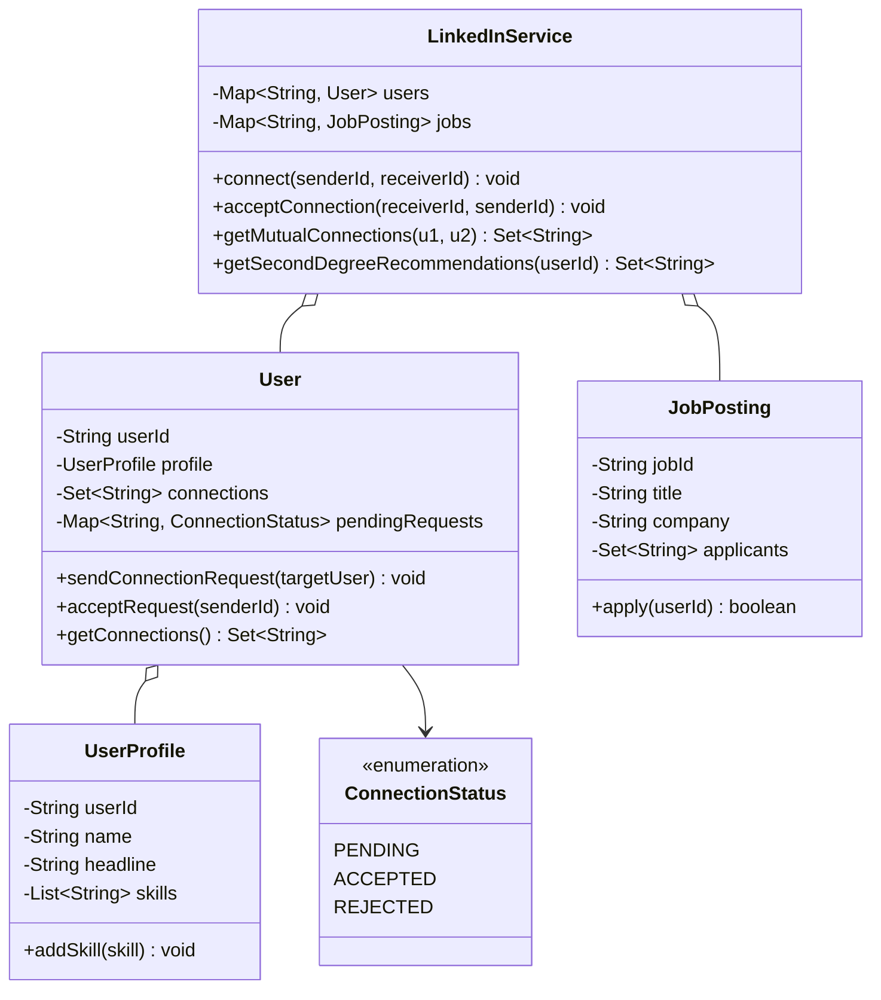
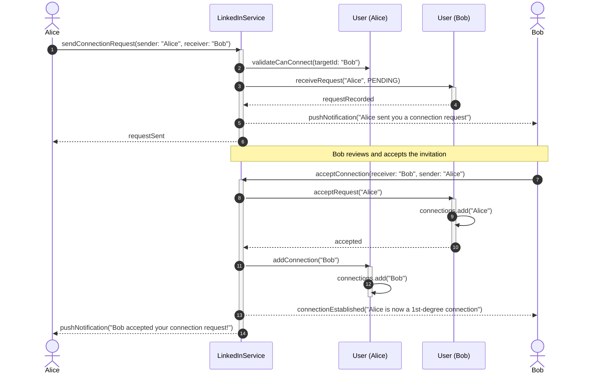

# Design LinkedIn

## 1. Problem Statement
Design LLD for a professional networking platform with profiles, connections, messaging, job postings, and feed.

## 2. Class & Sequence Design



### Sequence Diagram: Connection Request, Acceptance, and Graph Edge Formation



## 3. Key Implementation

### Python

```python
from typing import Dict, List, Set, Optional
from datetime import datetime
from enum import Enum

class ConnectionStatus(Enum):
    PENDING = "PENDING"
    ACCEPTED = "ACCEPTED"
    REJECTED = "REJECTED"

class Profile:
    def __init__(self, user_id: str, name: str, headline: str):
        self.user_id = user_id
        self.name = name
        self.headline = headline
        self.experiences: List[dict] = []
        self.skills: List[str] = []
        self.education: List[dict] = []

class User:
    def __init__(self, user_id: str, name: str, headline: str = ""):
        self.user_id = user_id
        self.profile = Profile(user_id, name, headline)
        self.connections: Set[str] = set()
        self.pending_requests: Dict[str, ConnectionStatus] = {}

    def send_connection_request(self, other: 'User'):
        if other.user_id not in self.connections:
            other.pending_requests[self.user_id] = ConnectionStatus.PENDING
            print(f"📤 {self.profile.name} → {other.profile.name}: Connection request sent")

    def accept_request(self, from_user: 'User'):
        if from_user.user_id in self.pending_requests:
            self.connections.add(from_user.user_id)
            from_user.connections.add(self.user_id)
            self.pending_requests[from_user.user_id] = ConnectionStatus.ACCEPTED
            print(f"✅ {self.profile.name} accepted {from_user.profile.name}")

class JobPosting:
    def __init__(self, job_id: str, company: str, title: str,
                 description: str, skills_required: List[str]):
        self.job_id = job_id
        self.company = company
        self.title = title
        self.description = description
        self.skills_required = skills_required
        self.applicants: List[str] = []

    def apply(self, user: User):
        self.applicants.append(user.user_id)
        print(f"📋 {user.profile.name} applied for {self.title} at {self.company}")

class LinkedInService:
    def __init__(self):
        self.users: Dict[str, User] = {}
        self.jobs: Dict[str, JobPosting] = []

    def register(self, user_id: str, name: str, headline: str = "") -> User:
        user = User(user_id, name, headline)
        self.users[user_id] = user
        return user

    def search_users(self, query: str) -> List[User]:
        q = query.lower()
        return [u for u in self.users.values()
                if q in u.profile.name.lower() or q in u.profile.headline.lower()]

    def search_jobs(self, skill: str) -> List[JobPosting]:
        return [j for j in self.jobs if skill.lower() in [s.lower() for s in j.skills_required]]

    def get_mutual_connections(self, user1_id: str, user2_id: str) -> Set[str]:
        return self.users[user1_id].connections & self.users[user2_id].connections

    def get_recommendations(self, user_id: str) -> List[str]:
        user = self.users[user_id]
        recommendations = set()
        for conn_id in user.connections:
            conn = self.users.get(conn_id)
            if conn:
                recommendations.update(conn.connections)
        recommendations.discard(user_id)
        recommendations -= user.connections
        return list(recommendations)
```

### Java

```java
package com.lld.linkedin;

import java.util.*;
import java.util.concurrent.ConcurrentHashMap;
import java.util.concurrent.CopyOnWriteArrayList;
import java.util.stream.Collectors;

enum ConnectionStatus {
    PENDING, ACCEPTED, REJECTED
}

class UserProfile {
    private final String userId;
    private final String name;
    private final String headline;
    private final List<String> skills = new CopyOnWriteArrayList<>();

    public UserProfile(String userId, String name, String headline) {
        this.userId = userId;
        this.name = name;
        this.headline = headline;
    }

    public String getUserId() { return userId; }
    public String getName() { return name; }
    public String getHeadline() { return headline; }
    public List<String> getSkills() { return Collections.unmodifiableList(skills); }
    public void addSkill(String skill) { skills.add(skill); }
}

class User {
    private final String userId;
    private final UserProfile profile;
    private final Set<String> connections = ConcurrentHashMap.newKeySet();
    private final Map<String, ConnectionStatus> pendingRequests = new ConcurrentHashMap<>();

    public User(String userId, String name, String headline) {
        this.userId = userId;
        this.profile = new UserProfile(userId, name, headline);
    }

    public String getUserId() { return userId; }
    public UserProfile getProfile() { return profile; }
    public Set<String> getConnections() { return Collections.unmodifiableSet(connections); }
    public Map<String, ConnectionStatus> getPendingRequests() { return pendingRequests; }

    public void receiveConnectionRequest(String senderId) {
        if (!connections.contains(senderId)) {
            pendingRequests.put(senderId, ConnectionStatus.PENDING);
        }
    }

    public synchronized boolean acceptConnectionRequest(String senderId) {
        if (pendingRequests.get(senderId) == ConnectionStatus.PENDING) {
            pendingRequests.put(senderId, ConnectionStatus.ACCEPTED);
            connections.add(senderId);
            return true;
        }
        return false;
    }

    public synchronized void addConnection(String friendId) {
        connections.add(friendId);
    }
}

class JobPosting {
    private final String jobId;
    private final String company;
    private final String title;
    private final List<String> requiredSkills;
    private final Set<String> applicants = ConcurrentHashMap.newKeySet();

    public JobPosting(String jobId, String company, String title, List<String> requiredSkills) {
        this.jobId = jobId;
        this.company = company;
        this.title = title;
        this.requiredSkills = new ArrayList<>(requiredSkills);
    }

    public String getJobId() { return jobId; }
    public String getCompany() { return company; }
    public String getTitle() { return title; }
    public List<String> getRequiredSkills() { return Collections.unmodifiableList(requiredSkills); }
    public Set<String> getApplicants() { return Collections.unmodifiableSet(applicants); }

    public boolean apply(String userId) {
        return applicants.add(userId);
    }
}

public class LinkedInService {
    private final Map<String, User> users = new ConcurrentHashMap<>();
    private final Map<String, JobPosting> jobs = new ConcurrentHashMap<>();

    public User registerUser(String userId, String name, String headline) {
        User user = new User(userId, name, headline);
        users.put(userId, user);
        return user;
    }

    public void sendConnectionRequest(String fromUserId, String toUserId) {
        User recipient = users.get(toUserId);
        if (recipient != null && !recipient.getConnections().contains(fromUserId)) {
            recipient.receiveConnectionRequest(fromUserId);
            System.out.printf("[Invite] %s -> %s connection request sent.%n", fromUserId, toUserId);
        }
    }

    public void acceptConnectionRequest(String receiverId, String senderId) {
        User receiver = users.get(receiverId);
        User sender = users.get(senderId);
        if (receiver != null && sender != null) {
            boolean accepted = receiver.acceptConnectionRequest(senderId);
            if (accepted) {
                sender.addConnection(receiverId);
                System.out.printf("[Connected] %s and %s are now 1st-degree connections.%n", senderId, receiverId);
            }
        }
    }

    public Set<String> getMutualConnections(String user1Id, String user2Id) {
        User u1 = users.get(user1Id);
        User u2 = users.get(user2Id);
        if (u1 == null || u2 == null) return Collections.emptySet();

        Set<String> mutual = new HashSet<>(u1.getConnections());
        mutual.retainAll(u2.getConnections());
        return mutual;
    }

    public Set<String> getSecondDegreeRecommendations(String userId) {
        User user = users.get(userId);
        if (user == null) return Collections.emptySet();

        Set<String> firstDegree = user.getConnections();
        Set<String> secondDegree = new HashSet<>();

        for (String friendId : firstDegree) {
            User friend = users.get(friendId);
            if (friend != null) {
                secondDegree.addAll(friend.getConnections());
            }
        }
        secondDegree.remove(userId);
        secondDegree.removeAll(firstDegree);
        return secondDegree;
    }

    public void postJob(JobPosting job) {
        jobs.put(job.getJobId(), job);
    }

    public List<JobPosting> searchJobsBySkill(String skill) {
        return jobs.values().stream()
                .filter(j -> j.getRequiredSkills().stream().anyMatch(s -> s.equalsIgnoreCase(skill)))
                .collect(Collectors.toList());
    }
}
```

## 4. Thread Safety Considerations

| Component | Concurrency Hazard | Mitigation Strategy |
| :--- | :--- | :--- |
| **Bi-directional Edge Creation** | Partial state if one thread crashes during 2-way friendship insertion | Synchronized connection addition ensuring both user adjacency lists record the edge concurrently. |
| **Pending Request State Races** | User accepts and rejects same invitation concurrently | Map state checked with atomic compare/update (`pendingRequests.put` under lock). |
| **Job Applications Idempotency** | Double submission of job application on button double-click | `ConcurrentHashMap.newKeySet().add()` guarantees idempotent insertion of applicant IDs. |
| **Graph Traversal under Churn** | Calculating 2nd-degree connections while users are actively connecting | Copy-on-read defensive snapshots of connection sets prevent `ConcurrentModificationException`. |

## 5. Extensibility & SOLID Principles

| Principle | Implementation in Design |
| :--- | :--- |
| **Single Responsibility (SRP)** | `UserProfile` handles identity/skills; `User` manages social network edges; `JobPosting` coordinates recruitment pipelines. |
| **Open/Closed (OCP)** | Pluggable recommendation engines (Mutual Count, Common Industry, Graph Neural Network score) implement `ConnectionRecommender` interface. |
| **Liskov Substitution (LSP)** | Different account tiers (`StandardUser`, `PremiumUser`, `RecruiterUser`) inherit from base `User` with consistent messaging contracts. |
| **Interface Segregation (ISP)** | Job seeker interfaces separated from Recruiter candidate search and posting APIs. |
| **Dependency Inversion (DIP)** | Feed distribution and notifications triggered through pub/sub event bus rather than direct user object linkage. |

## 6. Patterns
- **Observer**: Connection events triggering newsfeed posts and notifications.
- **Strategy**: Social graph search and "People You May Know" recommendation algorithms.
- **State**: Connection request lifecycle transitions (`PENDING` $\to$ `ACCEPTED` / `REJECTED`).

## 7. Follow-ups
- **Skill endorsements?** Endorsement model mapping `(endorserId, candidateId, skillId)` with social proof counts.
- **Multi-degree connection distance?** Bidirectional BFS to find shortest path (1st, 2nd, 3rd degree) between any two profiles.
- **Feed ranking algorithm?** Engagement scoring: $Score = \alpha \cdot \text{affinity} + \beta \cdot \text{weight} - \gamma \cdot \text{decay}$.

---

**Related:** [[02 - Observer Pattern]] | [[01 - Strategy Pattern]] | [[13 - State Pattern]]

