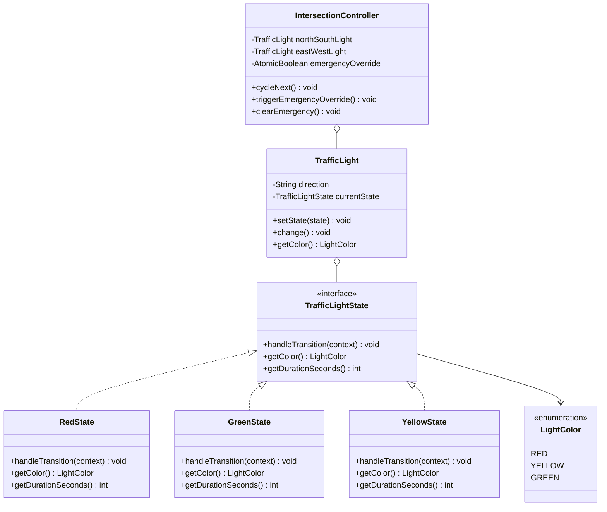
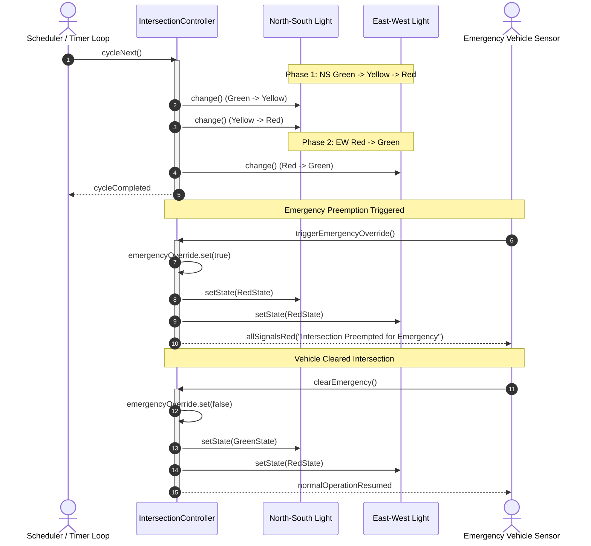

# Design a Traffic Light System

## 1. Problem Statement
Design a traffic light control system for an intersection with timed transitions, pedestrian crossings, and emergency override.

## 2. Class & Sequence Design



### Sequence Diagram: Regular Phase Transition & Emergency Override



## 3. Key Implementation

### Python

```python
from enum import Enum
from abc import ABC, abstractmethod
import time, threading

class LightColor(Enum):
    RED = ("RED", 30)
    YELLOW = ("YELLOW", 5)
    GREEN = ("GREEN", 25)

class TrafficLightState(ABC):
    @abstractmethod
    def next(self, light: 'TrafficLight'): pass
    @abstractmethod
    def display(self) -> str: pass

class RedState(TrafficLightState):
    def next(self, light):
        print(f"  {light.direction}: 🔴 → 🟢")
        light.set_state(GreenState())
    def display(self): return "🔴 RED"

class GreenState(TrafficLightState):
    def next(self, light):
        print(f"  {light.direction}: 🟢 → 🟡")
        light.set_state(YellowState())
    def display(self): return "🟢 GREEN"

class YellowState(TrafficLightState):
    def next(self, light):
        print(f"  {light.direction}: 🟡 → 🔴")
        light.set_state(RedState())
    def display(self): return "🟡 YELLOW"

class TrafficLight:
    def __init__(self, direction: str, initial_state: TrafficLightState):
        self.direction = direction
        self._state = initial_state

    def set_state(self, state: TrafficLightState):
        self._state = state

    def transition(self):
        self._state.next(self)

    def display(self) -> str:
        return f"{self.direction}: {self._state.display()}"

class Intersection:
    def __init__(self):
        self.ns_light = TrafficLight("North-South", GreenState())
        self.ew_light = TrafficLight("East-West", RedState())
        self.emergency_mode = False

    def cycle(self):
        """One full cycle: NS green → yellow → red, then EW green → yellow → red"""
        if self.emergency_mode:
            print("🚨 Emergency: All RED")
            return

        print(f"\nCycle: {self.ns_light.display()} | {self.ew_light.display()}")
        
        # NS: Green → Yellow → Red
        self.ns_light.transition()  # Green → Yellow
        self.ns_light.transition()  # Yellow → Red

        # EW: Red → Green
        self.ew_light.transition()  # Red → Green

        print(f"After: {self.ns_light.display()} | {self.ew_light.display()}")

    def emergency_override(self):
        """All lights turn red for emergency vehicles"""
        self.emergency_mode = True
        self.ns_light.set_state(RedState())
        self.ew_light.set_state(RedState())
        print("🚨 EMERGENCY: All lights RED")

    def resume_normal(self):
        self.emergency_mode = False
        self.ns_light.set_state(GreenState())
        self.ew_light.set_state(RedState())
        print("✅ Normal operation resumed")
```

### Java

```java
package com.lld.trafficlight;

import java.util.concurrent.atomic.AtomicBoolean;
import java.util.concurrent.locks.ReentrantLock;

enum LightColor {
    RED(30), YELLOW(5), GREEN(25);
    private final int defaultDurationSec;
    LightColor(int defaultDurationSec) { this.defaultDurationSec = defaultDurationSec; }
    public int getDefaultDurationSec() { return defaultDurationSec; }
}

interface TrafficLightState {
    void handleTransition(TrafficLight context);
    LightColor getColor();
    int getDurationSeconds();
}

class RedState implements TrafficLightState {
    @Override
    public void handleTransition(TrafficLight context) {
        context.setState(new GreenState());
    }
    @Override
    public LightColor getColor() { return LightColor.RED; }
    @Override
    public int getDurationSeconds() { return LightColor.RED.getDefaultDurationSec(); }
}

class GreenState implements TrafficLightState {
    @Override
    public void handleTransition(TrafficLight context) {
        context.setState(new YellowState());
    }
    @Override
    public LightColor getColor() { return LightColor.GREEN; }
    @Override
    public int getDurationSeconds() { return LightColor.GREEN.getDefaultDurationSec(); }
}

class YellowState implements TrafficLightState {
    @Override
    public void handleTransition(TrafficLight context) {
        context.setState(new RedState());
    }
    @Override
    public LightColor getColor() { return LightColor.YELLOW; }
    @Override
    public int getDurationSeconds() { return LightColor.YELLOW.getDefaultDurationSec(); }
}

class TrafficLight {
    private final String direction;
    private volatile TrafficLightState currentState;
    private final ReentrantLock lock = new ReentrantLock();

    public TrafficLight(String direction, TrafficLightState initialState) {
        this.direction = direction;
        this.currentState = initialState;
    }

    public void setState(TrafficLightState state) {
        lock.lock();
        try {
            this.currentState = state;
            System.out.printf("  [%s] Switched to %s (%ds)%n", direction, state.getColor(), state.getDurationSeconds());
        } finally {
            lock.unlock();
        }
    }

    public void change() {
        lock.lock();
        try {
            currentState.handleTransition(this);
        } finally {
            lock.unlock();
        }
    }

    public LightColor getColor() { return currentState.getColor(); }
    public String getDirection() { return direction; }
}

public class IntersectionController {
    private final TrafficLight northSouthLight;
    private final TrafficLight eastWestLight;
    private final AtomicBoolean emergencyOverride = new AtomicBoolean(false);
    private final ReentrantLock cycleLock = new ReentrantLock();

    public IntersectionController() {
        this.northSouthLight = new TrafficLight("North-South", new GreenState());
        this.eastWestLight = new TrafficLight("East-West", new RedState());
    }

    public void cycleNext() {
        cycleLock.lock();
        try {
            if (emergencyOverride.get()) {
                System.out.println("🚨 Cycle skipped: Emergency override active (ALL RED)");
                return;
            }

            if (northSouthLight.getColor() == LightColor.GREEN) {
                northSouthLight.change(); // Green -> Yellow
            } else if (northSouthLight.getColor() == LightColor.YELLOW) {
                northSouthLight.change(); // Yellow -> Red
                eastWestLight.change();   // Red -> Green
            } else if (eastWestLight.getColor() == LightColor.GREEN) {
                eastWestLight.change();   // Green -> Yellow
            } else if (eastWestLight.getColor() == LightColor.YELLOW) {
                eastWestLight.change();   // Yellow -> Red
                northSouthLight.change(); // Red -> Green
            }
        } finally {
            cycleLock.unlock();
        }
    }

    public void triggerEmergencyOverride() {
        cycleLock.lock();
        try {
            emergencyOverride.set(true);
            northSouthLight.setState(new RedState());
            eastWestLight.setState(new RedState());
            System.out.println("🚨 EMERGENCY PREEMPTION: All signals locked to RED.");
        } finally {
            cycleLock.unlock();
        }
    }

    public void clearEmergency() {
        cycleLock.lock();
        try {
            emergencyOverride.set(false);
            northSouthLight.setState(new GreenState());
            eastWestLight.setState(new RedState());
            System.out.println("✅ Normal intersection cycle restored (NS GREEN, EW RED).");
        } finally {
            cycleLock.unlock();
        }
    }
}
```

## 4. Thread Safety Considerations

| Component | Concurrency Hazard | Mitigation Strategy |
| :--- | :--- | :--- |
| **Conflicting Green Signals** | Both NS and EW directions displaying GREEN simultaneously | `ReentrantLock` guards the entire intersection phase transition, preserving mutual exclusion invariant. |
| **Asynchronous Emergency Override** | Preemption signal arriving during an active yellow/green state change | `AtomicBoolean emergencyOverride` with master `cycleLock` immediately halts transition and forces all signals to `RedState`. |
| **Sensor/Pedestrian Trigger** | Multiple crosswalk buttons pressed in rapid parallel bursts | Rate-limited atomic request flag with insertion into the next suitable transition window. |

## 5. Extensibility & SOLID Principles

| Principle | Implementation in Design |
| :--- | :--- |
| **Single Responsibility (SRP)** | Each state (`RedState`, `GreenState`, `YellowState`) encapsulates only its transition target; `IntersectionController` manages coordinated multi-way flow. |
| **Open/Closed (OCP)** | Adding a `FlashingYellow` or `ProtectedLeftTurn` state requires creating a new `TrafficLightState` without rewriting intersection core. |
| **Liskov Substitution (LSP)** | All color state implementations can be invoked interchangeably via the `TrafficLightState` interface. |
| **Interface Segregation (ISP)** | Controller exposes basic cycle operations to automated timers and dedicated override endpoints to emergency responder radios. |
| **Dependency Inversion (DIP)** | Intersection controller depends on the `TrafficLightState` abstraction rather than hardcoded string switch-cases. |

## 6. Patterns
- **State**: Encapsulating color states (`Red`, `Yellow`, `Green`) and valid transition paths.
- **Observer**: Pedestrian walk buttons and induction loop vehicle sensors publishing event triggers.
- **Command**: Emergency preemption vehicle broadcast messages as dispatchable priority commands.

## 7. Follow-ups
- **Pedestrian push buttons?** Extends cycle to inject a dedicated pedestrian crossing phase before turning orthogonal traffic green.
- **Green wave coordination?** Synchronizing multiple consecutive intersections along an arterial boulevard using central timing offset offsets.
- **Computer vision / inductive loop sensor timing?** Adaptive duration timers extending green time dynamically when queue length is detected.

---

**Related:** [[13 - State Pattern]] | [[02 - Observer Pattern]]

