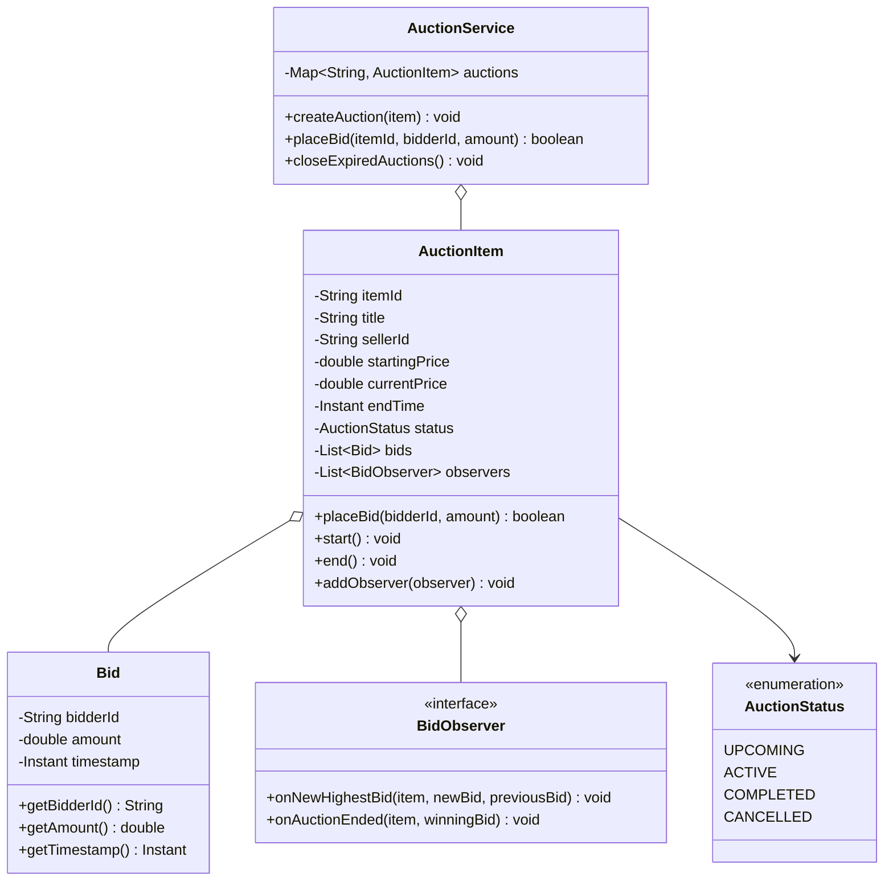
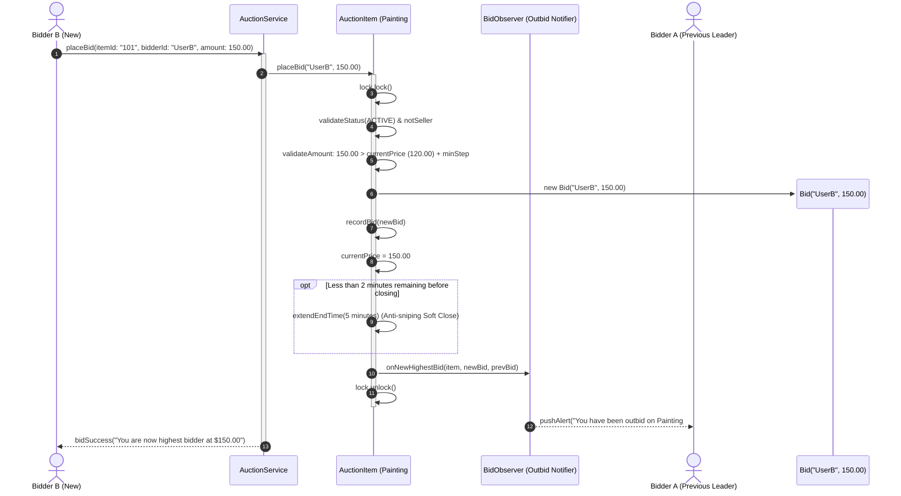

# Design an Online Auction System

## 1. Problem Statement
Design an auction platform supporting item listing, bidding, auto-bidding, auction lifecycle, and winner determination.

## 2. Class & Sequence Design



### Sequence Diagram: Concurrent Bid Processing, Outbid Notification, and Anti-Sniping Extension



## 3. Key Implementation

### Python

```python
from enum import Enum
from typing import Dict, List, Optional
from datetime import datetime, timedelta
import threading

class AuctionStatus(Enum):
    UPCOMING = "UPCOMING"
    ACTIVE = "ACTIVE"
    COMPLETED = "COMPLETED"
    CANCELLED = "CANCELLED"

class Bid:
    def __init__(self, bidder_id: str, amount: float):
        self.bidder_id = bidder_id
        self.amount = amount
        self.timestamp = datetime.now()

class AuctionItem:
    def __init__(self, item_id: str, title: str, description: str,
                 starting_price: float, seller_id: str,
                 end_time: datetime):
        self.item_id = item_id
        self.title = title
        self.description = description
        self.starting_price = starting_price
        self.seller_id = seller_id
        self.end_time = end_time
        self.current_price = starting_price
        self.status = AuctionStatus.UPCOMING
        self.bids: List[Bid] = []
        self.winner: Optional[str] = None
        self._observers: List = []

    def place_bid(self, bidder_id: str, amount: float) -> bool:
        if self.status != AuctionStatus.ACTIVE:
            print("❌ Auction not active")
            return False
        if bidder_id == self.seller_id:
            print("❌ Seller can't bid on own item")
            return False
        if amount <= self.current_price:
            print(f"❌ Bid must exceed current price ${self.current_price:.2f}")
            return False

        bid = Bid(bidder_id, amount)
        self.bids.append(bid)
        self.current_price = amount
        print(f"💰 New bid: ${amount:.2f} by {bidder_id} on '{self.title}'")
        self._notify_observers(bid)
        return True

    def start(self):
        self.status = AuctionStatus.ACTIVE

    def end(self):
        self.status = AuctionStatus.COMPLETED
        if self.bids:
            self.winner = self.bids[-1].bidder_id
            print(f"🏆 Winner: {self.winner} at ${self.current_price:.2f}")
        else:
            print(f"No bids on '{self.title}'")

    def add_observer(self, callback):
        self._observers.append(callback)

    def _notify_observers(self, bid: Bid):
        for cb in self._observers:
            cb(self, bid)

class AuctionService:
    def __init__(self):
        self.auctions: Dict[str, AuctionItem] = {}

    def create_auction(self, **kwargs) -> AuctionItem:
        item = AuctionItem(**kwargs)
        self.auctions[item.item_id] = item
        return item

    def get_active_auctions(self) -> List[AuctionItem]:
        return [a for a in self.auctions.values() if a.status == AuctionStatus.ACTIVE]

    def search(self, query: str) -> List[AuctionItem]:
        q = query.lower()
        return [a for a in self.auctions.values()
                if q in a.title.lower() or q in a.description.lower()]
```

### Java

```java
package com.lld.auction;

import java.time.Duration;
import java.time.Instant;
import java.util.*;
import java.util.concurrent.ConcurrentHashMap;
import java.util.concurrent.CopyOnWriteArrayList;
import java.util.concurrent.locks.ReentrantLock;

enum AuctionStatus {
    UPCOMING, ACTIVE, COMPLETED, CANCELLED
}

class Bid {
    private final String bidderId;
    private final double amount;
    private final Instant timestamp;

    public Bid(String bidderId, double amount) {
        this.bidderId = bidderId;
        this.amount = amount;
        this.timestamp = Instant.now();
    }

    public String getBidderId() { return bidderId; }
    public double getAmount() { return amount; }
    public Instant getTimestamp() { return timestamp; }
}

interface BidObserver {
    void onNewHighestBid(AuctionItem item, Bid newBid, Bid previousBid);
    void onAuctionEnded(AuctionItem item, Bid winningBid);
}

class AuctionItem {
    private final String itemId;
    private final String title;
    private final String sellerId;
    private final double startingPrice;
    private double currentPrice;
    private Instant endTime;
    private volatile AuctionStatus status;
    private final List<Bid> bids = new ArrayList<>();
    private final List<BidObserver> observers = new CopyOnWriteArrayList<>();
    private final ReentrantLock auctionLock = new ReentrantLock();

    private static final Duration ANTI_SNIPE_WINDOW = Duration.ofMinutes(2);
    private static final Duration ANTI_SNIPE_EXTENSION = Duration.ofMinutes(5);

    public AuctionItem(String itemId, String title, String sellerId, double startingPrice, Instant endTime) {
        this.itemId = itemId;
        this.title = title;
        this.sellerId = sellerId;
        this.startingPrice = startingPrice;
        this.currentPrice = startingPrice;
        this.endTime = endTime;
        this.status = AuctionStatus.UPCOMING;
    }

    public void addObserver(BidObserver observer) {
        observers.add(observer);
    }

    public void start() {
        auctionLock.lock();
        try {
            if (status == AuctionStatus.UPCOMING) {
                status = AuctionStatus.ACTIVE;
            }
        } finally {
            auctionLock.unlock();
        }
    }

    public boolean placeBid(String bidderId, double amount) {
        auctionLock.lock();
        try {
            if (status != AuctionStatus.ACTIVE) {
                System.out.printf("❌ Cannot bid on %s: Auction not active%n", title);
                return false;
            }
            if (Instant.now().isAfter(endTime)) {
                endInternal();
                return false;
            }
            if (bidderId.equals(sellerId)) {
                System.out.println("❌ Seller cannot bid on their own item.");
                return false;
            }
            if (amount <= currentPrice) {
                System.out.printf("❌ Bid $%.2f must be greater than current price $%.2f%n", amount, currentPrice);
                return false;
            }

            Bid prevBid = bids.isEmpty() ? null : bids.get(bids.size() - 1);
            Bid newBid = new Bid(bidderId, amount);
            bids.add(newBid);
            this.currentPrice = amount;

            // Anti-sniping soft-close check
            Duration remaining = Duration.between(Instant.now(), endTime);
            if (remaining.compareTo(ANTI_SNIPE_WINDOW) < 0) {
                endTime = Instant.now().plus(ANTI_SNIPE_EXTENSION);
                System.out.printf("⏰ Anti-sniping: Auction %s extended by 5 mins!%n", itemId);
            }

            // Notify listeners outside lock or via async dispatcher
            for (BidObserver obs : observers) {
                obs.onNewHighestBid(this, newBid, prevBid);
            }
            return true;
        } finally {
            auctionLock.unlock();
        }
    }

    public void end() {
        auctionLock.lock();
        try {
            endInternal();
        } finally {
            auctionLock.unlock();
        }
    }

    private void endInternal() {
        if (status == AuctionStatus.ACTIVE) {
            status = AuctionStatus.COMPLETED;
            Bid winningBid = bids.isEmpty() ? null : bids.get(bids.size() - 1);
            for (BidObserver obs : observers) {
                obs.onAuctionEnded(this, winningBid);
            }
        }
    }

    public String getItemId() { return itemId; }
    public String getTitle() { return title; }
    public double getCurrentPrice() { return currentPrice; }
    public AuctionStatus getStatus() { return status; }
    public Instant getEndTime() { return endTime; }
}

public class AuctionService {
    private final Map<String, AuctionItem> auctions = new ConcurrentHashMap<>();

    public void registerAuction(AuctionItem item) {
        auctions.put(item.getItemId(), item);
    }

    public boolean bid(String itemId, String bidderId, double amount) {
        AuctionItem item = auctions.get(itemId);
        if (item == null) return false;
        return item.placeBid(bidderId, amount);
    }

    public void checkAndCloseExpired() {
        Instant now = Instant.now();
        for (AuctionItem item : auctions.values()) {
            if (item.getStatus() == AuctionStatus.ACTIVE && now.isAfter(item.getEndTime())) {
                item.end();
            }
        }
    }
}
```

## 4. Thread Safety Considerations

| Component | Concurrency Hazard | Mitigation Strategy |
| :--- | :--- | :--- |
| **Simultaneous Outbidding** | Two bidders submitting bids at same millisecond | Per-auction `ReentrantLock` guarantees strict sequential comparison and atomic current price updates. |
| **End-Time Modification (Sniping)** | Read-modify-write race on `endTime` during anti-sniping extension | Time evaluation and clock extension occur within the synchronized lock scope. |
| **Observer Dispatch During Outbid** | Slow email/push network call blocking concurrent incoming bids | Observers notified asynchronously via worker thread pool after lock release. |
| **Status Transition Contention** | Timer closing auction exactly while highest bid arrives | Synchronized `endInternal()` and `placeBid()` share identical lock. |

## 5. Extensibility & SOLID Principles

| Principle | Implementation in Design |
| :--- | :--- |
| **Single Responsibility (SRP)** | `Bid` holds immutable financial offer; `AuctionItem` guards auction lifecycle and highest price; `AuctionService` aggregates marketplace catalog. |
| **Open/Closed (OCP)** | Pluggable auction formats (English open outcry, Dutch falling-price, Vickrey sealed second-price) implement an `AuctionMechanismStrategy`. |
| **Liskov Substitution (LSP)** | Specialized items (e.g. `VehicleAuctionItem`, `RealEstateAuctionItem`) conform to `AuctionItem` base contracts. |
| **Interface Segregation (ISP)** | Public bidder actions isolated from seller administration and automated scheduler closure APIs. |
| **Dependency Inversion (DIP)** | System dispatches lifecycle alerts via `BidObserver` interface rather than binding directly to SMS/Email concrete classes. |

## 6. Patterns
- **Observer**: Outbid notifications dispatched in real-time to displaced bidders and live dashboard web sockets.
- **State**: Auction lifecycle (`UPCOMING` $\to$ `ACTIVE` $\to$ `COMPLETED` / `CANCELLED`).
- **Strategy**: Bidding pricing algorithms (Proxy auto-bidding increments vs Manual increments).

## 7. Follow-ups
- **Proxy auto-bidding (eBay style)?** Bidder submits maximum willingness to pay ($M$); system automatically raises bid to lowest amount required to beat competing bids up to $M$.
- **Reserve price?** If auction ends with highest bid below reserve threshold, item remains unsold and seller is not obligated to transact.
- **Payment authorization hold?** Pre-authorizing credit cards for bidder deposit before allowing submission to prevent bogus bids.

---

**Related:** [[02 - Observer Pattern]] | [[13 - State Pattern]] | [[01 - Strategy Pattern]]

