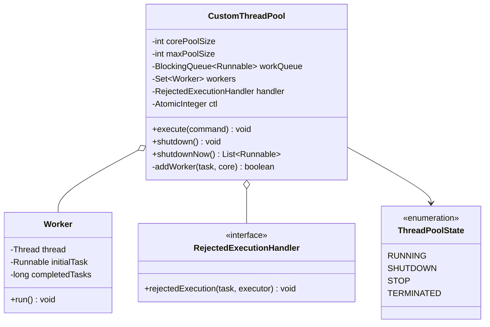
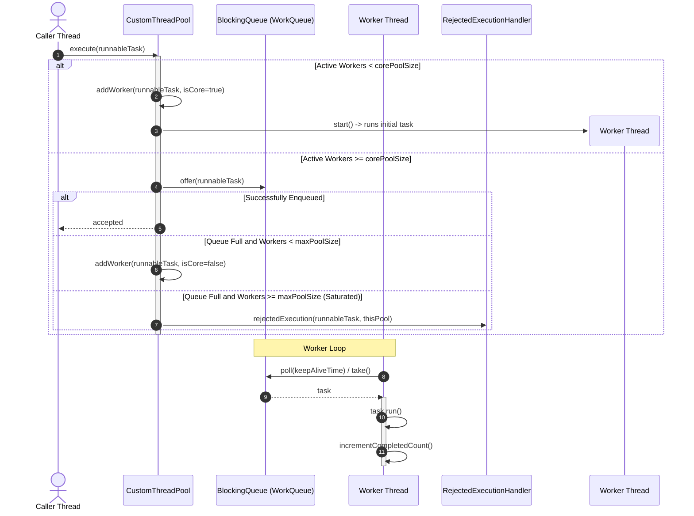

# Design a Thread Pool

## 1. Problem Statement
Design a thread pool executor supporting task submission, fixed/dynamic thread count, and graceful shutdown.

## 2. Class & Sequence Design



### Sequence Diagram: Task Submission, Queue Enqueue, and Worker Thread Execution



## 3. Key Implementation

### Python

```python
import threading, queue, time
from typing import Callable, Optional
from enum import Enum

class ThreadPoolState(Enum):
    RUNNING = "RUNNING"
    SHUTTING_DOWN = "SHUTTING_DOWN"
    TERMINATED = "TERMINATED"

class ThreadPool:
    def __init__(self, num_threads: int, queue_size: int = 100):
        self.num_threads = num_threads
        self._task_queue = queue.Queue(maxsize=queue_size)
        self._threads = []
        self._state = ThreadPoolState.RUNNING
        self._lock = threading.Lock()
        self._completed = 0

        for i in range(num_threads):
            t = threading.Thread(target=self._worker, name=f"Worker-{i}", daemon=True)
            t.start()
            self._threads.append(t)

    def submit(self, task: Callable, *args, **kwargs):
        if self._state != ThreadPoolState.RUNNING:
            raise RuntimeError("ThreadPool is shut down")
        self._task_queue.put((task, args, kwargs))

    def _worker(self):
        while True:
            try:
                task, args, kwargs = self._task_queue.get(timeout=1)
            except queue.Empty:
                if self._state == ThreadPoolState.SHUTTING_DOWN:
                    break
                continue
            try:
                task(*args, **kwargs)
            except Exception as e:
                print(f"Task error: {e}")
            finally:
                with self._lock:
                    self._completed += 1
                self._task_queue.task_done()

    def shutdown(self, wait: bool = True):
        self._state = ThreadPoolState.SHUTTING_DOWN
        if wait:
            self._task_queue.join()
        for t in self._threads:
            t.join(timeout=5)
        self._state = ThreadPoolState.TERMINATED
        print(f"ThreadPool terminated. {self._completed} tasks completed.")

    @property
    def pending_tasks(self) -> int:
        return self._task_queue.qsize()

    @property
    def completed_tasks(self) -> int:
        return self._completed
```

### Java

```java
package com.lld.threadpool;

import java.util.*;
import java.util.concurrent.*;
import java.util.concurrent.atomic.AtomicBoolean;
import java.util.concurrent.atomic.AtomicInteger;
import java.util.concurrent.locks.ReentrantLock;

interface RejectedExecutionHandler {
    void rejectedExecution(Runnable r, CustomThreadPool executor);
}

class AbortPolicy implements RejectedExecutionHandler {
    @Override
    public void rejectedExecution(Runnable r, CustomThreadPool executor) {
        throw new RejectedExecutionException("Task " + r.toString() + " rejected from " + executor.toString());
    }
}

class CallerRunsPolicy implements RejectedExecutionHandler {
    @Override
    public void rejectedExecution(Runnable r, CustomThreadPool executor) {
        if (!executor.isShutdown()) {
            r.run();
        }
    }
}

class DiscardPolicy implements RejectedExecutionHandler {
    @Override
    public void rejectedExecution(Runnable r, CustomThreadPool executor) {
        // Silently drop task
    }
}

public class CustomThreadPool {
    private final int corePoolSize;
    private final int maxPoolSize;
    private final long keepAliveTimeMs;
    private final BlockingQueue<Runnable> workQueue;
    private final RejectedExecutionHandler handler;
    private final Set<Worker> workers = ConcurrentHashMap.newKeySet();
    private final AtomicInteger activeThreads = new AtomicInteger(0);
    private final AtomicBoolean isShutdown = new AtomicBoolean(false);
    private final AtomicInteger completedTasks = new AtomicInteger(0);

    public CustomThreadPool(int corePoolSize, int maxPoolSize, long keepAliveTimeMs,
                            BlockingQueue<Runnable> workQueue, RejectedExecutionHandler handler) {
        this.corePoolSize = corePoolSize;
        this.maxPoolSize = maxPoolSize;
        this.keepAliveTimeMs = keepAliveTimeMs;
        this.workQueue = workQueue;
        this.handler = handler;
    }

    public void execute(Runnable task) {
        if (task == null) throw new NullPointerException("Task cannot be null");
        if (isShutdown.get()) {
            handler.rejectedExecution(task, this);
            return;
        }

        // 1. If fewer than corePoolSize workers, spawn core worker
        if (activeThreads.get() < corePoolSize) {
            if (addWorker(task, true)) return;
        }

        // 2. Try enqueueing to bounded workQueue
        if (!isShutdown.get() && workQueue.offer(task)) {
            // Recheck state after enqueuing to prevent race with shutdown
            if (isShutdown.get() && workQueue.remove(task)) {
                handler.rejectedExecution(task, this);
            }
            return;
        }

        // 3. Queue is full, attempt to spawn non-core worker up to maxPoolSize
        if (!addWorker(task, false)) {
            // 4. Maximum capacity saturated, execute rejection policy
            handler.rejectedExecution(task, this);
        }
    }

    private boolean addWorker(Runnable firstTask, boolean isCore) {
        while (true) {
            int currentCount = activeThreads.get();
            int limit = isCore ? corePoolSize : maxPoolSize;
            if (currentCount >= limit || isShutdown.get()) {
                return false;
            }
            if (activeThreads.compareAndSet(currentCount, currentCount + 1)) {
                Worker w = new Worker(firstTask);
                workers.add(w);
                w.thread.start();
                return true;
            }
        }
    }

    public void shutdown() {
        if (isShutdown.compareAndSet(false, true)) {
            for (Worker w : workers) {
                w.thread.interrupt();
            }
        }
    }

    public boolean isShutdown() { return isShutdown.get(); }
    public int getCompletedTaskCount() { return completedTasks.get(); }

    private class Worker implements Runnable {
        final Thread thread;
        Runnable initialTask;

        Worker(Runnable initialTask) {
            this.initialTask = initialTask;
            this.thread = new Thread(this);
        }

        @Override
        public void run() {
            Runnable task = initialTask;
            initialTask = null;
            try {
                while (task != null || (task = getTask()) != null) {
                    try {
                        task.run();
                    } catch (Throwable ex) {
                        System.err.println("Uncaught exception in task: " + ex.getMessage());
                    } finally {
                        completedTasks.incrementAndGet();
                        task = null;
                    }
                }
            } finally {
                processWorkerExit(this);
            }
        }

        private Runnable getTask() {
            try {
                if (isShutdown.get() && workQueue.isEmpty()) return null;
                boolean timed = activeThreads.get() > corePoolSize;
                return timed ? workQueue.poll(keepAliveTimeMs, TimeUnit.MILLISECONDS)
                             : workQueue.take();
            } catch (InterruptedException e) {
                return null;
            }
        }

        private void processWorkerExit(Worker w) {
            workers.remove(w);
            activeThreads.decrementAndGet();
        }
    }
}
```

## 4. Rejection Policies
| Policy | Behavior | Best Use Case |
|---|---|---|
| **AbortPolicy** | Throws `RejectedExecutionException` | Default; alerts callers immediately of saturation. |
| **CallerRunsPolicy** | Executes the runnable directly in caller's thread | Natural backpressure by slowing down the producer. |
| **DiscardPolicy** | Silently drops the rejected task | High-volume non-critical metrics or loss-tolerant logs. |
| **DiscardOldestPolicy** | Evicts head of queue and retries execution | Real-time sensor telemetry where newest data is strictly favored. |

## 5. Thread Safety Considerations

| Component | Concurrency Hazard | Mitigation Strategy |
| :--- | :--- | :--- |
| **Worker Count CAS Control** | Multiple threads attempting to spawn threads beyond core/max boundaries | `AtomicInteger activeThreads` CAS increment/decrement loop ensures thread creation counts stay within caps. |
| **WorkQueue Saturation Race** | Worker dying while items sit pending in the queue | Double-check on enqueue and worker exit recovery (`processWorkerExit`) to prevent orphan tasks. |
| **Thread Idle Expiration** | Non-core threads consuming system resources when idle | `BlockingQueue.poll(keepAliveTime)` cleanly times out threads when pool depth drops back to `corePoolSize`. |
| **Orderly Shutdown vs Tasks** | Tasks submitted while pool is shutting down | `isShutdown` atomic flag rejects new tasks while allowing previously enqueued items to complete. |

## 6. Extensibility & SOLID Principles

| Principle | Implementation in Design |
| :--- | :--- |
| **Single Responsibility (SRP)** | `Worker` manages worker thread loop; `CustomThreadPool` controls pool sizing and queue dispatch; `RejectedExecutionHandler` implements saturation logic. |
| **Open/Closed (OCP)** | Custom saturation behaviors implement `RejectedExecutionHandler` without altering the executor's internal worker logic. |
| **Liskov Substitution (LSP)** | Can implement standard `java.util.concurrent.Executor` interface to seamlessly drop into Java concurrency frameworks. |
| **Interface Segregation (ISP)** | Public interface exposes `execute` and `shutdown` without exposing worker thread internals. |
| **Dependency Inversion (DIP)** | Pool relies on generic `BlockingQueue<Runnable>` abstractions rather than a single coupled queue class. |

## 7. Follow-ups
- **Work-stealing pool?** `ForkJoinPool` with double-ended deques per thread where idle threads steal work from heads of other threads' queues.
- **Dynamic queue capacity?** Variable queue depth adjustment based on system CPU and memory load pressures.
- **Future / Promise return?** Wrap submitted `Callable<V>` into `FutureTask<V>` and return `Future<V>` handle for asynchronous result retrieval.

---

**Related:** [[07 - Command Pattern]] | [[01 - Strategy Pattern]]

