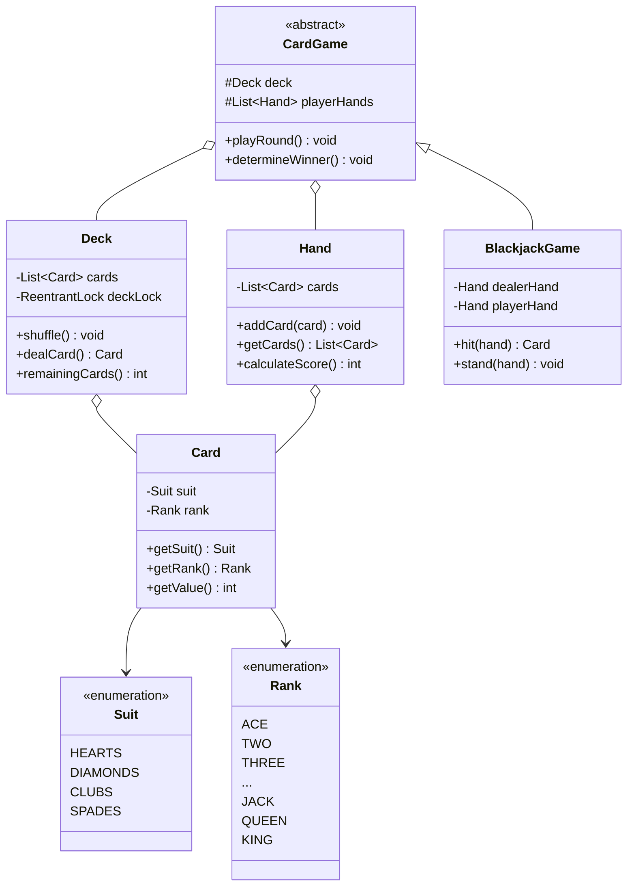
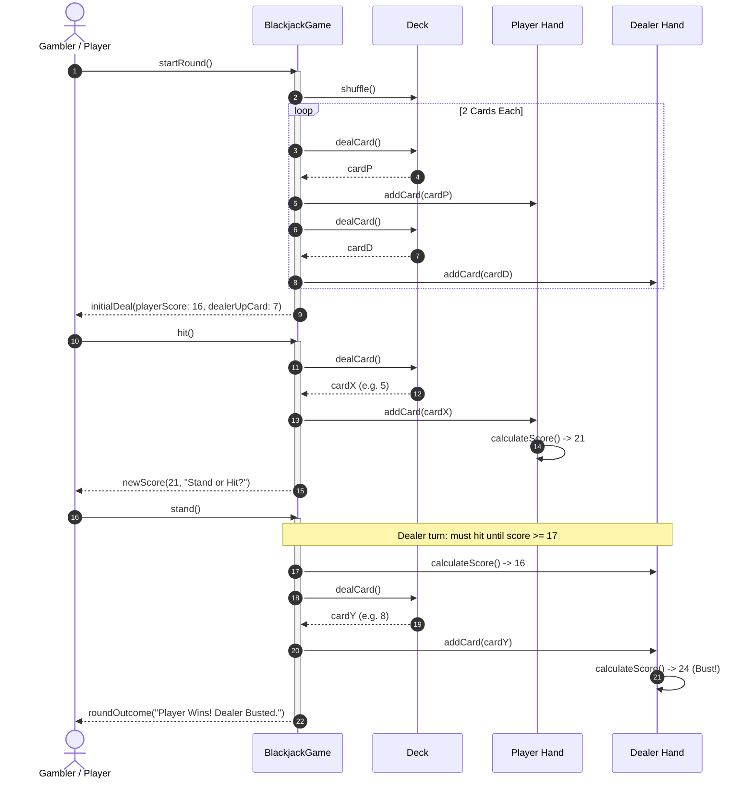

# Design a Deck of Cards

## 1. Problem Statement
Design an OOP model for a standard deck of cards supporting shuffling, dealing, and games like Blackjack.

## 2. Class & Sequence Design



### Sequence Diagram: Dealing & Blackjack Turn Progression



## 3. Key Implementation

### Python

```python
from enum import Enum
from typing import List, Optional
import random

class Suit(Enum):
    HEARTS = "♥"
    DIAMONDS = "♦"
    CLUBS = "♣"
    SPADES = "♠"

class Rank(Enum):
    ACE = (1, "A")
    TWO = (2, "2"); THREE = (3, "3"); FOUR = (4, "4"); FIVE = (5, "5")
    SIX = (6, "6"); SEVEN = (7, "7"); EIGHT = (8, "8"); NINE = (9, "9")
    TEN = (10, "10"); JACK = (10, "J"); QUEEN = (10, "Q"); KING = (10, "K")

class Card:
    def __init__(self, suit: Suit, rank: Rank):
        self.suit = suit
        self.rank = rank
    def __str__(self):
        return f"{self.rank.value[1]}{self.suit.value}"

class Deck:
    def __init__(self):
        self.cards: List[Card] = [Card(s, r) for s in Suit for r in Rank]

    def shuffle(self):
        random.shuffle(self.cards)

    def deal(self) -> Optional[Card]:
        return self.cards.pop() if self.cards else None

    def deal_hand(self, count: int) -> List[Card]:
        return [self.deal() for _ in range(min(count, len(self.cards)))]

    def remaining(self) -> int:
        return len(self.cards)

class Hand:
    def __init__(self):
        self.cards: List[Card] = []

    def add_card(self, card: Card):
        self.cards.append(card)

    def score(self) -> int:
        """Blackjack scoring — Aces are 1 or 11"""
        total = sum(c.rank.value[0] for c in self.cards)
        aces = sum(1 for c in self.cards if c.rank == Rank.ACE)
        while total <= 11 and aces > 0:
            total += 10; aces -= 1
        return total

    def __str__(self):
        return ' '.join(str(c) for c in self.cards) + f" (score: {self.score()})"

class BlackjackGame:
    def __init__(self):
        self.deck = Deck()
        self.deck.shuffle()
        self.player = Hand()
        self.dealer = Hand()

    def deal_initial(self):
        for _ in range(2):
            self.player.add_card(self.deck.deal())
            self.dealer.add_card(self.deck.deal())

    def hit(self, hand: Hand):
        hand.add_card(self.deck.deal())

    def is_bust(self, hand: Hand) -> bool:
        return hand.score() > 21
```

### Java

```java
package com.lld.cards;

import java.util.*;
import java.util.concurrent.CopyOnWriteArrayList;
import java.util.concurrent.locks.ReentrantLock;

enum Suit {
    HEARTS("♥"), DIAMONDS("♦"), CLUBS("♣"), SPADES("♠");
    private final String symbol;
    Suit(String symbol) { this.symbol = symbol; }
    public String getSymbol() { return symbol; }
}

enum Rank {
    ACE(1, "A"), TWO(2, "2"), THREE(3, "3"), FOUR(4, "4"), FIVE(5, "5"),
    SIX(6, "6"), SEVEN(7, "7"), EIGHT(8, "8"), NINE(9, "9"), TEN(10, "10"),
    JACK(10, "J"), QUEEN(10, "Q"), KING(10, "K");

    private final int value;
    private final String display;
    Rank(int value, String display) { this.value = value; this.display = display; }
    public int getValue() { return value; }
    public String getDisplay() { return display; }
}

class Card {
    private final Suit suit;
    private final Rank rank;

    public Card(Suit suit, Rank rank) {
        this.suit = suit;
        this.rank = rank;
    }

    public Suit getSuit() { return suit; }
    public Rank getRank() { return rank; }

    @Override
    public String toString() {
        return rank.getDisplay() + suit.getSymbol();
    }
}

class Deck {
    private final List<Card> cards = new ArrayList<>();
    private final ReentrantLock lock = new ReentrantLock();

    public Deck() {
        reset();
    }

    public void reset() {
        lock.lock();
        try {
            cards.clear();
            for (Suit s : Suit.values()) {
                for (Rank r : Rank.values()) {
                    cards.add(new Card(s, r));
                }
            }
        } finally {
            lock.unlock();
        }
    }

    public void shuffle() {
        lock.lock();
        try {
            Collections.shuffle(cards);
        } finally {
            lock.unlock();
        }
    }

    public Card dealCard() {
        lock.lock();
        try {
            if (cards.isEmpty()) {
                throw new NoSuchElementException("Deck is empty!");
            }
            return cards.remove(cards.size() - 1);
        } finally {
            lock.unlock();
        }
    }

    public int remainingCards() {
        lock.lock();
        try {
            return cards.size();
        } finally {
            lock.unlock();
        }
    }
}

class Hand {
    private final List<Card> cards = new CopyOnWriteArrayList<>();

    public void addCard(Card card) {
        if (card != null) cards.add(card);
    }

    public List<Card> getCards() {
        return Collections.unmodifiableList(cards);
    }

    public int getBlackjackScore() {
        int total = 0;
        int aceCount = 0;

        for (Card c : cards) {
            total += c.getRank().getValue();
            if (c.getRank() == Rank.ACE) {
                aceCount++;
            }
        }

        // Promote Ace from 1 to 11 if possible without busting
        while (total <= 11 && aceCount > 0) {
            total += 10;
            aceCount--;
        }
        return total;
    }

    public boolean isBusted() {
        return getBlackjackScore() > 21;
    }

    @Override
    public String toString() {
        return cards.toString() + " -> Score: " + getBlackjackScore();
    }
}

public class BlackjackGame {
    private final Deck deck = new Deck();
    private final Hand playerHand = new Hand();
    private final Hand dealerHand = new Hand();

    public void startNewGame() {
        deck.reset();
        deck.shuffle();
        for (int i = 0; i < 2; i++) {
            playerHand.addCard(deck.dealCard());
            dealerHand.addCard(deck.dealCard());
        }
        System.out.println("Player Hand: " + playerHand);
        System.out.println("Dealer Visible Card: " + dealerHand.getCards().get(0));
    }

    public Card playerHit() {
        Card c = deck.dealCard();
        playerHand.addCard(c);
        return c;
    }

    public void playDealerTurn() {
        while (dealerHand.getBlackjackScore() < 17) {
            dealerHand.addCard(deck.dealCard());
        }
    }

    public String evaluateWinner() {
        int pScore = playerHand.getBlackjackScore();
        int dScore = dealerHand.getBlackjackScore();

        if (pScore > 21) return "Player Busted! Dealer Wins.";
        if (dScore > 21) return "Dealer Busted! Player Wins.";
        if (pScore > dScore) return "Player Wins with " + pScore + " vs " + dScore + "!";
        if (dScore > pScore) return "Dealer Wins with " + dScore + " vs " + pScore + "!";
        return "Push (Tie) at " + pScore + ".";
    }
}
```

## 4. Thread Safety Considerations

| Component | Concurrency Hazard | Mitigation Strategy |
| :--- | :--- | :--- |
| **Card Dealing Race** | Multiple dealer threads dealing simultaneously from the same shoe | `ReentrantLock` around `dealCard()` prevents index collisions or dealing the same card twice. |
| **Concurrent Shoe Reshuffling** | Background shuffler mixing cards while a live hand is drawing | Critical section lock ensures deck manipulation is atomic with respect to card draws. |
| **Player Hand Inspection** | Auditing or UI telemetry querying player hand while dealer appends card | `CopyOnWriteArrayList` permits lock-free traversal during real-time UI rendering. |

## 5. Extensibility & SOLID Principles

| Principle | Implementation in Design |
| :--- | :--- |
| **Single Responsibility (SRP)** | `Card` is immutable value object; `Deck` manages card pool; `Hand` aggregates cards; `CardGame` governs game rules and turn states. |
| **Open/Closed (OCP)** | Pluggable game rules (`TexasHoldem`, `Blackjack`, `Baccarat`) implement `CardGame` without altering `Card` or `Deck` abstractions. |
| **Liskov Substitution (LSP)** | Card games use standard `Deck` and `Hand` contracts interchangeably. |
| **Interface Segregation (ISP)** | Hand score evaluation separated from betting chips or wallet balances. |
| **Dependency Inversion (DIP)** | Game engines rely on abstract `HandEvaluator` strategies rather than hardcoded hand-scoring rules. |

## 6. Patterns
- **Factory**: Standard deck generation factory initializing 52-card or multi-deck casino shoes.
- **Strategy**: Pluggable scoring strategies (Blackjack 21 with dual Ace values vs Poker 5-card hand rankings).
- **Template Method**: Card game loop structure (`setup`, `dealInitialCards`, `takeTurns`, `resolveWinner`).

## 7. Follow-ups
- **Casino 6-Deck Shoe with Cut Card?** Shoe containing multiple decks merged together; insert cut card 75% into the stack to trigger reshuffle before exhaustion.
- **Poker hand ranking?** Implement high-card, pairs, straight, flush, full house, and straight flush evaluators via bitmasking.
- **Card counting resilience?** Continuous shuffling machines (CSMs) returning dealt cards back into the shoe after every round.

---

**Related:** [[01 - Strategy Pattern]] | [[10 - Template Method Pattern]]

