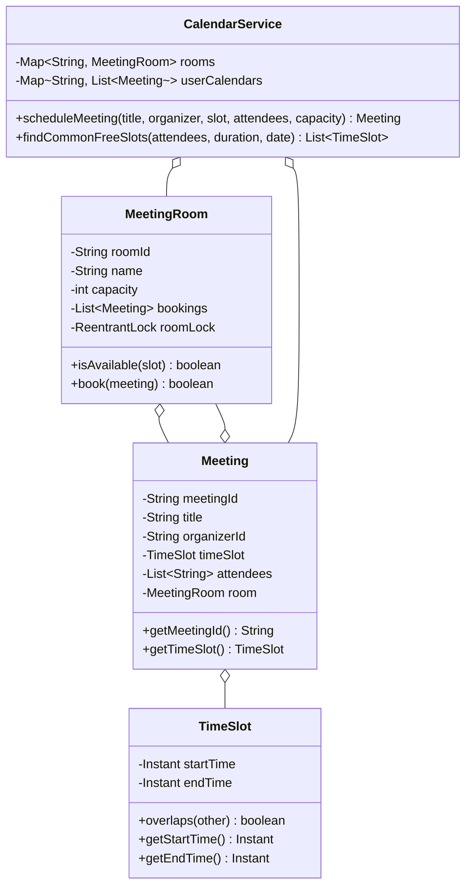
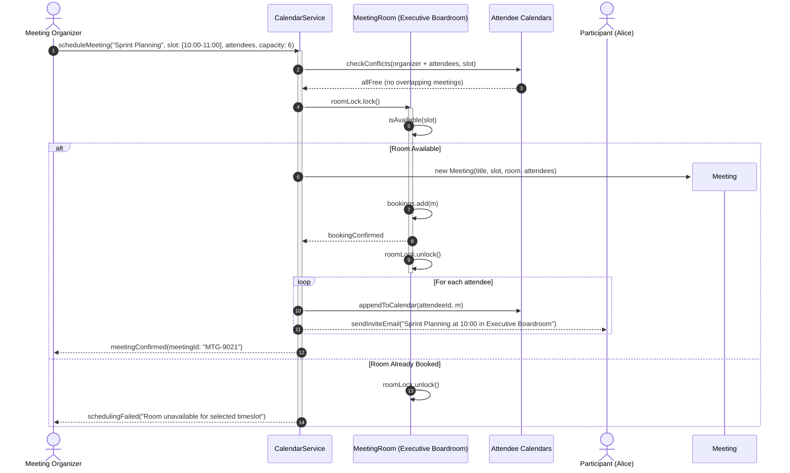

# Design a Meeting Scheduler

## 1. Problem Statement
Design a calendar meeting scheduler supporting room booking, conflict detection, and recurring meetings.

## 2. Class & Sequence Design



### Sequence Diagram: Meeting Conflict Checking, Room Reservation, and Notification



## 3. Key Implementation

### Python

```python
from datetime import datetime, timedelta
from typing import List, Dict, Optional
import uuid

class TimeSlot:
    def __init__(self, start: datetime, end: datetime):
        self.start = start
        self.end = end

    def overlaps(self, other: 'TimeSlot') -> bool:
        return self.start < other.end and other.start < self.end

class MeetingRoom:
    def __init__(self, room_id: str, name: str, capacity: int):
        self.room_id = room_id
        self.name = name
        self.capacity = capacity
        self._bookings: List['Meeting'] = []

    def is_available(self, slot: TimeSlot) -> bool:
        return not any(m.time_slot.overlaps(slot) for m in self._bookings)

    def book(self, meeting: 'Meeting') -> bool:
        if self.is_available(meeting.time_slot):
            self._bookings.append(meeting)
            return True
        return False

class Meeting:
    def __init__(self, title: str, organizer: str, time_slot: TimeSlot,
                 participants: List[str], room: Optional[MeetingRoom] = None):
        self.meeting_id = str(uuid.uuid4())[:8]
        self.title = title
        self.organizer = organizer
        self.time_slot = time_slot
        self.participants = participants
        self.room = room

class CalendarService:
    def __init__(self):
        self.rooms: Dict[str, MeetingRoom] = {}
        self.user_meetings: Dict[str, List[Meeting]] = {}

    def add_room(self, room: MeetingRoom):
        self.rooms[room.room_id] = room

    def schedule_meeting(self, title: str, organizer: str, slot: TimeSlot,
                         participants: List[str], capacity: int) -> Optional[Meeting]:
        # Check participant conflicts
        for p in participants + [organizer]:
            for m in self.user_meetings.get(p, []):
                if m.time_slot.overlaps(slot):
                    print(f"❌ Conflict: {p} busy during {m.title}")
                    return None

        # Find available room
        room = next((r for r in self.rooms.values()
                     if r.capacity >= capacity and r.is_available(slot)), None)
        if not room:
            print("❌ No room available")
            return None

        meeting = Meeting(title, organizer, slot, participants, room)
        room.book(meeting)
        for p in participants + [organizer]:
            self.user_meetings.setdefault(p, []).append(meeting)
        print(f"✅ Scheduled: {title} in {room.name}")
        return meeting

    def find_available_slots(self, participants: List[str], duration_min: int,
                             date: datetime) -> List[TimeSlot]:
        slots = []
        start = date.replace(hour=9, minute=0)
        end_of_day = date.replace(hour=18, minute=0)
        while start + timedelta(minutes=duration_min) <= end_of_day:
            slot = TimeSlot(start, start + timedelta(minutes=duration_min))
            free = all(not any(m.time_slot.overlaps(slot) for m in self.user_meetings.get(p, []))
                       for p in participants)
            if free:
                slots.append(slot)
            start += timedelta(minutes=30)
        return slots
```

### Java

```java
package com.lld.scheduler;

import java.time.Instant;
import java.time.temporal.ChronoUnit;
import java.util.*;
import java.util.concurrent.ConcurrentHashMap;
import java.util.concurrent.CopyOnWriteArrayList;
import java.util.concurrent.locks.ReentrantLock;

class TimeSlot {
    private final Instant startTime;
    private final Instant endTime;

    public TimeSlot(Instant startTime, Instant endTime) {
        if (!startTime.isBefore(endTime)) {
            throw new IllegalArgumentException("Start time must precede end time");
        }
        this.startTime = startTime;
        this.endTime = endTime;
    }

    public Instant getStartTime() { return startTime; }
    public Instant getEndTime() { return endTime; }

    public boolean overlaps(TimeSlot other) {
        return this.startTime.isBefore(other.endTime) && other.startTime.isBefore(this.endTime);
    }
}

class Meeting {
    private final String meetingId;
    private final String title;
    private final String organizerId;
    private final TimeSlot timeSlot;
    private final List<String> attendeeIds;
    private final MeetingRoom room;

    public Meeting(String meetingId, String title, String organizerId,
                   TimeSlot timeSlot, List<String> attendeeIds, MeetingRoom room) {
        this.meetingId = meetingId;
        this.title = title;
        this.organizerId = organizerId;
        this.timeSlot = timeSlot;
        this.attendeeIds = new ArrayList<>(attendeeIds);
        this.room = room;
    }

    public String getMeetingId() { return meetingId; }
    public String getTitle() { return title; }
    public TimeSlot getTimeSlot() { return timeSlot; }
    public List<String> getAttendeeIds() { return attendeeIds; }
    public MeetingRoom getRoom() { return room; }
}

class MeetingRoom {
    private final String roomId;
    private final String name;
    private final int capacity;
    private final List<Meeting> bookings = new ArrayList<>();
    private final ReentrantLock roomLock = new ReentrantLock();

    public MeetingRoom(String roomId, String name, int capacity) {
        this.roomId = roomId;
        this.name = name;
        this.capacity = capacity;
    }

    public String getRoomId() { return roomId; }
    public String getName() { return name; }
    public int getCapacity() { return capacity; }
    public ReentrantLock getRoomLock() { return roomLock; }

    public boolean isAvailable(TimeSlot slot) {
        for (Meeting m : bookings) {
            if (m.getTimeSlot().overlaps(slot)) {
                return false;
            }
        }
        return true;
    }

    public boolean book(Meeting meeting) {
        roomLock.lock();
        try {
            if (isAvailable(meeting.getTimeSlot())) {
                bookings.add(meeting);
                return true;
            }
            return false;
        } finally {
            roomLock.unlock();
        }
    }
}

public class CalendarService {
    private final Map<String, MeetingRoom> rooms = new ConcurrentHashMap<>();
    private final Map<String, List<Meeting>> userCalendars = new ConcurrentHashMap<>();
    private final ReentrantLock globalScheduleLock = new ReentrantLock();

    public void addRoom(MeetingRoom room) {
        rooms.put(room.getRoomId(), room);
    }

    public Optional<Meeting> scheduleMeeting(String title, String organizerId,
                                            TimeSlot slot, List<String> attendees, int requiredCapacity) {
        globalScheduleLock.lock();
        try {
            List<String> allParticipants = new ArrayList<>(attendees);
            allParticipants.add(organizerId);

            // 1. Validate attendees have no conflicting overlaps
            for (String participant : allParticipants) {
                List<Meeting> calendar = userCalendars.getOrDefault(participant, Collections.emptyList());
                for (Meeting m : calendar) {
                    if (m.getTimeSlot().overlaps(slot)) {
                        System.out.printf("❌ Participant %s is busy during %s%n", participant, m.getTitle());
                        return Optional.empty();
                    }
                }
            }

            // 2. Locate and lock suitable conference room
            MeetingRoom selectedRoom = null;
            for (MeetingRoom room : rooms.values()) {
                if (room.getCapacity() >= requiredCapacity && room.isAvailable(slot)) {
                    selectedRoom = room;
                    break;
                }
            }

            if (selectedRoom == null) {
                System.out.println("❌ No available meeting room matching capacity.");
                return Optional.empty();
            }

            String meetingId = "MTG-" + UUID.randomUUID().toString().substring(0, 6).toUpperCase();
            Meeting meeting = new Meeting(meetingId, title, organizerId, slot, attendees, selectedRoom);

            boolean booked = selectedRoom.book(meeting);
            if (!booked) {
                return Optional.empty();
            }

            // 3. Update participant personal calendars
            for (String p : allParticipants) {
                userCalendars.computeIfAbsent(p, k -> new CopyOnWriteArrayList<>()).add(meeting);
            }

            System.out.printf("✅ Scheduled '%s' in %s for %d attendees%n", title, selectedRoom.getName(), allParticipants.size());
            return Optional.of(meeting);

        } finally {
            globalScheduleLock.unlock();
        }
    }
}
```

## 4. Thread Safety Considerations

| Component | Concurrency Hazard | Mitigation Strategy |
| :--- | :--- | :--- |
| **Room Double Booking** | Two organizers claiming the same room for overlapping slots simultaneously | Per-room `ReentrantLock` guards slot overlap validation and booking append. |
| **Participant Calendar Collision** | Attendee booked concurrently into two different meetings across separate rooms | Atomic schedule lock or synchronized participant interval reservations. |
| **Calendar Iteration During Bookings** | Finding available slots while new meetings are actively being committed | `CopyOnWriteArrayList` on user calendars allows safe, lock-free conflict reads. |

## 5. Extensibility & SOLID Principles

| Principle | Implementation in Design |
| :--- | :--- |
| **Single Responsibility (SRP)** | `TimeSlot` calculates interval intersections; `MeetingRoom` guards room capacity and schedule; `CalendarService` orchestrates participant booking. |
| **Open/Closed (OCP)** | Recurring meeting engines (Daily, Weekly, Monthly with RRULE specification) expand the scheduling interface without modifying base `Meeting`. |
| **Liskov Substitution (LSP)** | Different room types (`VirtualMeetingRoom` via Zoom URL, `PhysicalMeetingRoom` with AV hardware) substitute cleanly. |
| **Interface Segregation (ISP)** | Public client calendar inspection APIs separated from facility room administration endpoints. |
| **Dependency Inversion (DIP)** | Scheduler relies on `TimeSlot` abstraction and meeting room interfaces rather than database specific date models. |

## 6. Patterns
- **Strategy**: Room selection strategies (Best-Fit capacity, Lowest Floor First, Most Tech Equipment).
- **Observer**: Automated calendar invites, cancellations, and meeting room updates sent to attendees.
- **Composite**: Recurring meeting series modeled as parent composite holding individual single-instance meetings.

## 7. Follow-ups
- **Recurring meetings (RRULE)?** Store recurring rule definition; lazily generate individual meeting instances across a rolling 90-day window.
- **Timezone support?** Persist all `TimeSlot` timestamps in UTC Instant; transform to participant local timezone (`ZoneId`) at the rendering tier.
- **Google / Outlook Calendar integration?** Adapter pattern translating internal meeting events to iCalendar (.ics) format or direct CalDAV synchronization.

---

**Related:** [[01 - Strategy Pattern]] | [[02 - Observer Pattern]]

