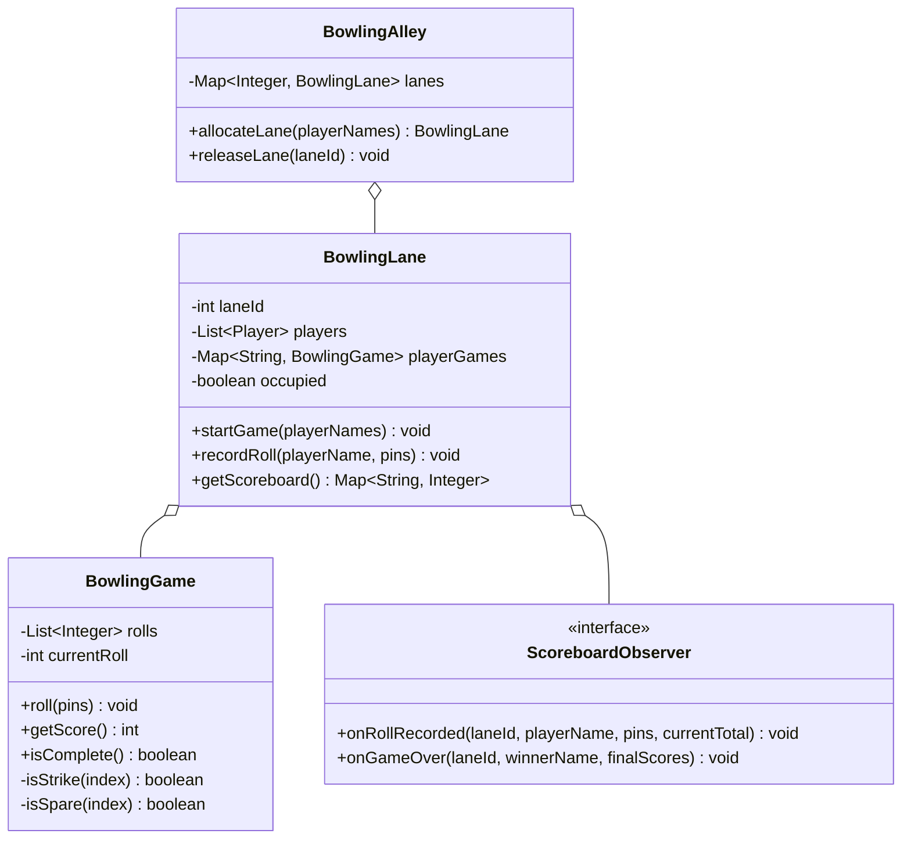
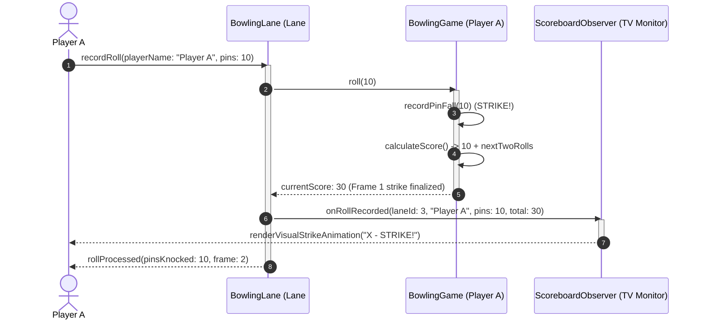

# Design a Bowling Alley

## 1. Problem Statement
Design a bowling scoring system following standard rules: 10 frames, strikes, spares, and the 10th frame bonus.

## 2. Class & Sequence Design



### Sequence Diagram: Player Roll, Score Calculation, and Scoreboard Update



## 3. Key Implementation

### Python

```python
class BowlingGame:
    def __init__(self):
        self.rolls = []

    def roll(self, pins: int):
        self.rolls.append(pins)

    def score(self) -> int:
        total = 0
        roll_idx = 0
        for frame in range(10):
            if roll_idx >= len(self.rolls):
                break
            if self._is_strike(roll_idx):
                total += 10 + self._strike_bonus(roll_idx)
                roll_idx += 1
            elif self._is_spare(roll_idx):
                total += 10 + self._spare_bonus(roll_idx)
                roll_idx += 2
            else:
                total += self.rolls[roll_idx] + self._safe_get(roll_idx + 1)
                roll_idx += 2
        return total

    def _is_strike(self, idx: int) -> bool:
        return self._safe_get(idx) == 10

    def _is_spare(self, idx: int) -> bool:
        return self._safe_get(idx) + self._safe_get(idx + 1) == 10

    def _strike_bonus(self, idx: int) -> int:
        return self._safe_get(idx + 1) + self._safe_get(idx + 2)

    def _spare_bonus(self, idx: int) -> int:
        return self._safe_get(idx + 2)

    def _safe_get(self, idx: int) -> int:
        return self.rolls[idx] if idx < len(self.rolls) else 0

class BowlingAlley:
    def __init__(self, num_lanes: int):
        self.lanes = {i: BowlingLane(i) for i in range(1, num_lanes + 1)}

class BowlingLane:
    def __init__(self, lane_id: int):
        self.lane_id = lane_id
        self.game: BowlingGame = None
        self.players = []

    def start_game(self, player_names):
        self.players = player_names
        self.game = BowlingGame()
```

### Java

```java
package com.lld.bowling;

import java.util.*;
import java.util.concurrent.ConcurrentHashMap;
import java.util.concurrent.CopyOnWriteArrayList;
import java.util.concurrent.locks.ReentrantLock;

interface ScoreboardObserver {
    void onRollRecorded(int laneId, String playerName, int pins, int currentScore);
    void onGameOver(int laneId, String winnerName, Map<String, Integer> finalScores);
}

class BowlingGame {
    private final List<Integer> rolls = new ArrayList<>();
    private final ReentrantLock lock = new ReentrantLock();

    public void roll(int pins) {
        if (pins < 0 || pins > 10) {
            throw new IllegalArgumentException("Invalid pins: " + pins);
        }
        lock.lock();
        try {
            rolls.add(pins);
        } finally {
            lock.unlock();
        }
    }

    public int getScore() {
        lock.lock();
        try {
            int score = 0;
            int rollIdx = 0;
            for (int frame = 0; frame < 10; frame++) {
                if (rollIdx >= rolls.size()) break;

                if (isStrike(rollIdx)) {
                    score += 10 + strikeBonus(rollIdx);
                    rollIdx += 1;
                } else if (isSpare(rollIdx)) {
                    score += 10 + spareBonus(rollIdx);
                    rollIdx += 2;
                } else {
                    score += getRoll(rollIdx) + getRoll(rollIdx + 1);
                    rollIdx += 2;
                }
            }
            return score;
        } finally {
            lock.unlock();
        }
    }

    private boolean isStrike(int idx) {
        return getRoll(idx) == 10;
    }

    private boolean isSpare(int idx) {
        return getRoll(idx) + getRoll(idx + 1) == 10;
    }

    private int strikeBonus(int idx) {
        return getRoll(idx + 1) + getRoll(idx + 2);
    }

    private int spareBonus(int idx) {
        return getRoll(idx + 2);
    }

    private int getRoll(int idx) {
        return (idx < rolls.size()) ? rolls.get(idx) : 0;
    }
}

class BowlingLane {
    private final int laneId;
    private final Map<String, BowlingGame> playerGames = new ConcurrentHashMap<>();
    private final List<String> players = new CopyOnWriteArrayList<>();
    private final List<ScoreboardObserver> observers = new CopyOnWriteArrayList<>();
    private volatile boolean inUse = false;
    private final ReentrantLock laneLock = new ReentrantLock();

    public BowlingLane(int laneId) {
        this.laneId = laneId;
    }

    public void addObserver(ScoreboardObserver observer) {
        observers.add(observer);
    }

    public boolean assignPlayers(List<String> playerNames) {
        laneLock.lock();
        try {
            if (inUse) return false;
            players.clear();
            playerGames.clear();
            players.addAll(playerNames);
            for (String p : playerNames) {
                playerGames.put(p, new BowlingGame());
            }
            inUse = true;
            return true;
        } finally {
            laneLock.unlock();
        }
    }

    public void recordRoll(String playerName, int pins) {
        laneLock.lock();
        try {
            BowlingGame game = playerGames.get(playerName);
            if (game == null) throw new IllegalArgumentException("Player not in game: " + playerName);

            game.roll(pins);
            int currentScore = game.getScore();

            for (ScoreboardObserver obs : observers) {
                obs.onRollRecorded(laneId, playerName, pins, currentScore);
            }
        } finally {
            laneLock.unlock();
        }
    }

    public int getPlayerScore(String playerName) {
        BowlingGame game = playerGames.get(playerName);
        return (game != null) ? game.getScore() : 0;
    }

    public void releaseLane() {
        laneLock.lock();
        try {
            inUse = false;
            players.clear();
            playerGames.clear();
        } finally {
            laneLock.unlock();
        }
    }

    public int getLaneId() { return laneId; }
    public boolean isInUse() { return inUse; }
}

public class BowlingAlley {
    private final Map<Integer, BowlingLane> lanes = new ConcurrentHashMap<>();

    public BowlingAlley(int numLanes) {
        for (int i = 1; i <= numLanes; i++) {
            lanes.put(i, new BowlingLane(i));
        }
    }

    public Optional<BowlingLane> allocateLane(List<String> playerNames) {
        for (BowlingLane lane : lanes.values()) {
            if (!lane.isInUse() && lane.assignPlayers(playerNames)) {
                return Optional.of(lane);
            }
        }
        return Optional.empty();
    }

    public BowlingLane getLane(int laneId) {
        return lanes.get(laneId);
    }
}
```

## 4. Thread Safety Considerations

| Component | Concurrency Hazard | Mitigation Strategy |
| :--- | :--- | :--- |
| **Simultaneous Lane Allocation** | Two parties being allocated to the same bowling lane | `ReentrantLock` around lane assignment ensures mutually exclusive lane reservation. |
| **Roll and Scoring Integrity** | Querying partial score while next roll bonus is appended | Lock guards `BowlingGame` list mutations and frame sum evaluations. |
| **Scoreboard Display Decoupling** | Slow UI rendering delaying ball detection hardware sensors | `ScoreboardObserver` callbacks dispatched to async thread pool executor. |

## 5. Extensibility & SOLID Principles

| Principle | Implementation in Design |
| :--- | :--- |
| **Single Responsibility (SRP)** | `BowlingGame` computes mathematical scores for standard 10-pin frames; `BowlingLane` manages player rotation; `BowlingAlley` orchestrates physical lane fleet. |
| **Open/Closed (OCP)** | Variations like Candlepins or Duckpins implement a `ScoringRulesStrategy` without changing lane hardware coordination. |
| **Liskov Substitution (LSP)** | Specialized lanes (`VIPBoutiqueLane`, `KidsBumperLane`) extend `BowlingLane` with transparent behavior. |
| **Interface Segregation (ISP)** | Score reporting observer separated from mechanical ball return and pinsetter reset controllers. |
| **Dependency Inversion (DIP)** | High-level lane management depends on abstract `ScoreboardObserver` rather than physical CRT monitors. |

## 6. Patterns
- **Strategy**: Pluggable scoring rules (Standard 10-pin, 9-pin European, Candlepin).
- **Observer**: Lane event dispatches to digital scoreboard screens and sound/animation systems.
- **Factory**: Lane setup and game initialization factory.

## 7. Follow-ups
- **Tenth Frame Bonus logic?** If strike or spare in frame 10, allocate 1 or 2 bonus fill balls; maximum possible game score is 300 (12 consecutive strikes).
- **Foul line sensors?** Optical sensor tripping roll to 0 pins even if pins knocked down.
- **Multi-lane league tournaments?** Aggregate team scores across concurrent lanes with handicap adjustments.

---

**Related:** [[01 - Strategy Pattern]] | [[02 - Observer Pattern]]

