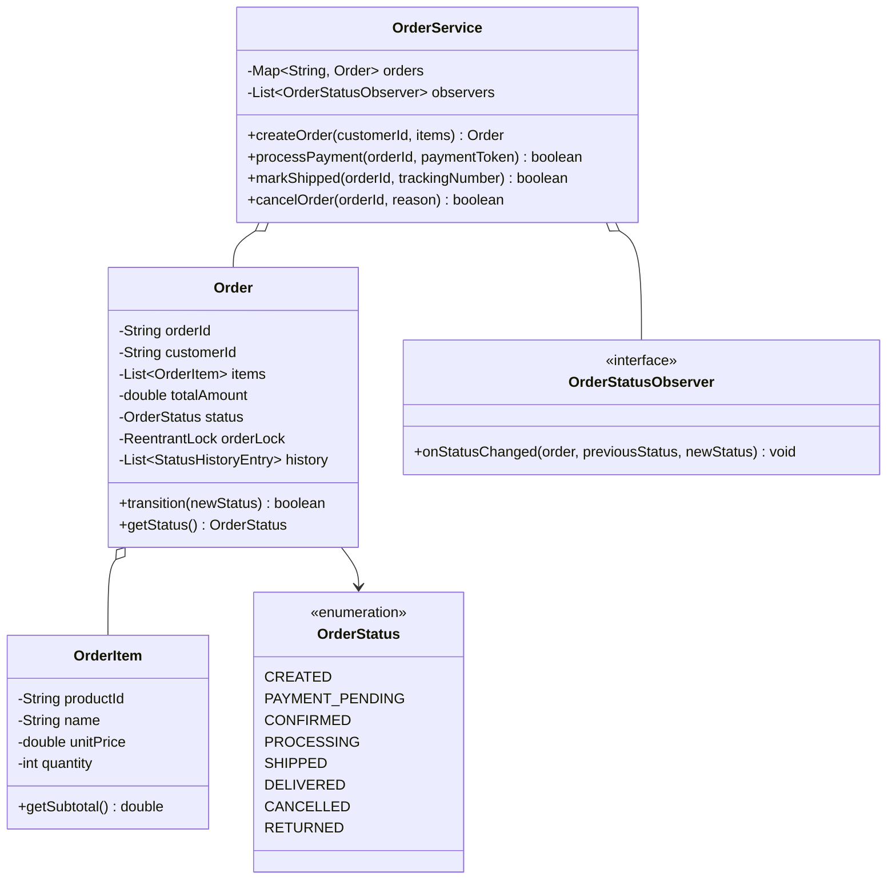
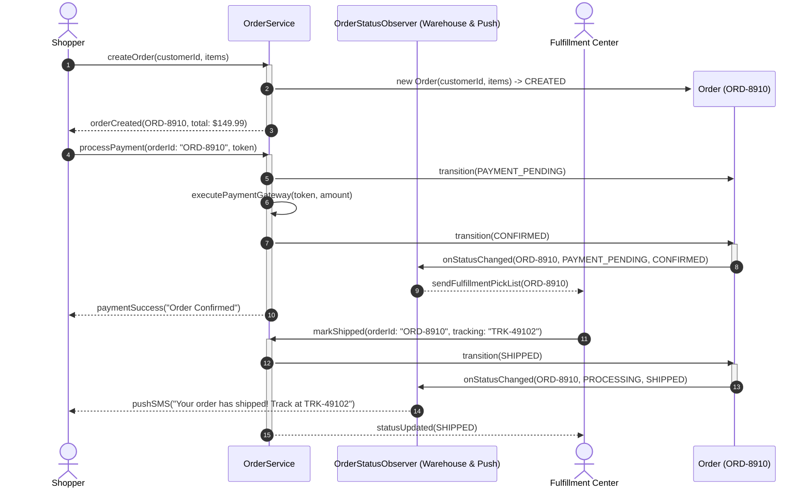

# Design an Order Management System

## 1. Problem Statement
Design an OMS for an e-commerce platform tracking orders through their full lifecycle with state transitions.

## 2. Class & Sequence Design



### Sequence Diagram: Order Lifecycle & State Machine Transitions



## 3. Key Implementation

### Python

```python
from enum import Enum
from datetime import datetime
from typing import List, Dict, Optional
import uuid

class OrderStatus(Enum):
    CREATED = "CREATED"
    PAYMENT_PENDING = "PAYMENT_PENDING"
    CONFIRMED = "CONFIRMED"
    PROCESSING = "PROCESSING"
    SHIPPED = "SHIPPED"
    DELIVERED = "DELIVERED"
    CANCELLED = "CANCELLED"
    RETURNED = "RETURNED"

TRANSITIONS = {
    OrderStatus.CREATED: [OrderStatus.PAYMENT_PENDING, OrderStatus.CANCELLED],
    OrderStatus.PAYMENT_PENDING: [OrderStatus.CONFIRMED, OrderStatus.CANCELLED],
    OrderStatus.CONFIRMED: [OrderStatus.PROCESSING, OrderStatus.CANCELLED],
    OrderStatus.PROCESSING: [OrderStatus.SHIPPED, OrderStatus.CANCELLED],
    OrderStatus.SHIPPED: [OrderStatus.DELIVERED],
    OrderStatus.DELIVERED: [OrderStatus.RETURNED],
    OrderStatus.CANCELLED: [],
    OrderStatus.RETURNED: [],
}

class OrderItem:
    def __init__(self, product_id: str, name: str, price: float, qty: int):
        self.product_id = product_id
        self.name = name
        self.price = price
        self.quantity = qty

class Order:
    def __init__(self, customer_id: str, items: List[OrderItem]):
        self.order_id = str(uuid.uuid4())[:8]
        self.customer_id = customer_id
        self.items = items
        self.total = sum(i.price * i.quantity for i in items)
        self.status = OrderStatus.CREATED
        self.status_history: List[tuple] = [(OrderStatus.CREATED, datetime.now())]
        self.tracking_id: Optional[str] = None

    def transition(self, new_status: OrderStatus) -> bool:
        if new_status in TRANSITIONS.get(self.status, []):
            self.status = new_status
            self.status_history.append((new_status, datetime.now()))
            print(f"📦 Order {self.order_id}: {self.status.value}")
            return True
        print(f"❌ Cannot transition from {self.status.value} to {new_status.value}")
        return False

class OrderService:
    def __init__(self):
        self.orders: Dict[str, Order] = {}

    def create_order(self, customer_id: str, items: List[OrderItem]) -> Order:
        order = Order(customer_id, items)
        self.orders[order.order_id] = order
        print(f"✅ Order {order.order_id} created: ${order.total:.2f}")
        return order

    def process_payment(self, order_id: str) -> bool:
        order = self.orders[order_id]
        order.transition(OrderStatus.PAYMENT_PENDING)
        return order.transition(OrderStatus.CONFIRMED)

    def ship_order(self, order_id: str, tracking_id: str):
        order = self.orders[order_id]
        order.transition(OrderStatus.PROCESSING)
        order.tracking_id = tracking_id
        order.transition(OrderStatus.SHIPPED)

    def get_order_history(self, order_id: str) -> List[tuple]:
        return self.orders[order_id].status_history
```

### Java

```java
package com.lld.oms;

import java.time.Instant;
import java.util.*;
import java.util.concurrent.ConcurrentHashMap;
import java.util.concurrent.CopyOnWriteArrayList;
import java.util.concurrent.locks.ReentrantLock;

enum OrderStatus {
    CREATED, PAYMENT_PENDING, CONFIRMED, PROCESSING, SHIPPED, DELIVERED, CANCELLED, RETURNED;

    private static final Map<OrderStatus, Set<OrderStatus>> VALID_TRANSITIONS = new EnumMap<>(OrderStatus.class);

    static {
        VALID_TRANSITIONS.put(CREATED, EnumSet.of(PAYMENT_PENDING, CANCELLED));
        VALID_TRANSITIONS.put(PAYMENT_PENDING, EnumSet.of(CONFIRMED, CANCELLED));
        VALID_TRANSITIONS.put(CONFIRMED, EnumSet.of(PROCESSING, CANCELLED));
        VALID_TRANSITIONS.put(PROCESSING, EnumSet.of(SHIPPED, CANCELLED));
        VALID_TRANSITIONS.put(SHIPPED, EnumSet.of(DELIVERED));
        VALID_TRANSITIONS.put(DELIVERED, EnumSet.of(RETURNED));
        VALID_TRANSITIONS.put(CANCELLED, EnumSet.noneOf(OrderStatus.class));
        VALID_TRANSITIONS.put(RETURNED, EnumSet.noneOf(OrderStatus.class));
    }

    public boolean canTransitionTo(OrderStatus next) {
        Set<OrderStatus> allowed = VALID_TRANSITIONS.get(this);
        return allowed != null && allowed.contains(next);
    }
}

class OrderItem {
    private final String productId;
    private final String name;
    private final double unitPrice;
    private final int quantity;

    public OrderItem(String productId, String name, double unitPrice, int quantity) {
        this.productId = productId;
        this.name = name;
        this.unitPrice = unitPrice;
        this.quantity = quantity;
    }

    public double getSubtotal() { return unitPrice * quantity; }
    public String getProductId() { return productId; }
    public String getName() { return name; }
    public int getQuantity() { return quantity; }
}

interface OrderStatusObserver {
    void onStatusChanged(Order order, OrderStatus prev, OrderStatus next);
}

class Order {
    private final String orderId;
    private final String customerId;
    private final List<OrderItem> items;
    private final double totalAmount;
    private volatile OrderStatus status;
    private String trackingNumber;
    private final List<String> auditLog = new CopyOnWriteArrayList<>();
    private final ReentrantLock lock = new ReentrantLock();

    public Order(String orderId, String customerId, List<OrderItem> items) {
        this.orderId = orderId;
        this.customerId = customerId;
        this.items = Collections.unmodifiableList(new ArrayList<>(items));
        this.totalAmount = items.stream().mapToDouble(OrderItem::getSubtotal).sum();
        this.status = OrderStatus.CREATED;
        this.auditLog.add(String.format("[%s] Status initialized to %s", Instant.now(), status));
    }

    public boolean transitionTo(OrderStatus newStatus) {
        lock.lock();
        try {
            if (!status.canTransitionTo(newStatus)) {
                System.out.printf("❌ Illegal transition from %s to %s for Order %s%n", status, newStatus, orderId);
                return false;
            }
            OrderStatus prev = this.status;
            this.status = newStatus;
            this.auditLog.add(String.format("[%s] Transitioned %s -> %s", Instant.now(), prev, newStatus));
            System.out.printf("📦 Order %s transitioned: %s -> %s%n", orderId, prev, newStatus);
            return true;
        } finally {
            lock.unlock();
        }
    }

    public String getOrderId() { return orderId; }
    public String getCustomerId() { return customerId; }
    public OrderStatus getStatus() { return status; }
    public double getTotalAmount() { return totalAmount; }
    public List<OrderItem> getItems() { return items; }
    public void setTrackingNumber(String trackingNumber) { this.trackingNumber = trackingNumber; }
    public String getTrackingNumber() { return trackingNumber; }
    public List<String> getAuditLog() { return Collections.unmodifiableList(auditLog); }
}

public class OrderService {
    private final Map<String, Order> orders = new ConcurrentHashMap<>();
    private final List<OrderStatusObserver> observers = new CopyOnWriteArrayList<>();

    public void addObserver(OrderStatusObserver observer) {
        observers.add(observer);
    }

    public Order createOrder(String customerId, List<OrderItem> items) {
        String orderId = "ORD-" + UUID.randomUUID().toString().substring(0, 8).toUpperCase();
        Order order = new Order(orderId, customerId, items);
        orders.put(orderId, order);
        notifyObservers(order, null, OrderStatus.CREATED);
        return order;
    }

    public boolean processPayment(String orderId) {
        Order order = orders.get(orderId);
        if (order == null) return false;

        if (order.transitionTo(OrderStatus.PAYMENT_PENDING)) {
            notifyObservers(order, OrderStatus.CREATED, OrderStatus.PAYMENT_PENDING);

            // Mock gateway capture
            boolean paymentCaptured = true;
            if (paymentCaptured && order.transitionTo(OrderStatus.CONFIRMED)) {
                notifyObservers(order, OrderStatus.PAYMENT_PENDING, OrderStatus.CONFIRMED);
                return true;
            }
        }
        return false;
    }

    public boolean shipOrder(String orderId, String trackingNumber) {
        Order order = orders.get(orderId);
        if (order == null) return false;

        if (order.transitionTo(OrderStatus.PROCESSING)) {
            notifyObservers(order, OrderStatus.CONFIRMED, OrderStatus.PROCESSING);
            order.setTrackingNumber(trackingNumber);
            if (order.transitionTo(OrderStatus.SHIPPED)) {
                notifyObservers(order, OrderStatus.PROCESSING, OrderStatus.SHIPPED);
                return true;
            }
        }
        return false;
    }

    public boolean cancelOrder(String orderId) {
        Order order = orders.get(orderId);
        if (order == null) return false;
        OrderStatus prev = order.getStatus();
        if (order.transitionTo(OrderStatus.CANCELLED)) {
            notifyObservers(order, prev, OrderStatus.CANCELLED);
            return true;
        }
        return false;
    }

    private void notifyObservers(Order order, OrderStatus prev, OrderStatus next) {
        for (OrderStatusObserver obs : observers) {
            obs.onStatusChanged(order, prev, next);
        }
    }
}
```

## 4. Thread Safety Considerations

| Component | Concurrency Hazard | Mitigation Strategy |
| :--- | :--- | :--- |
| **Invalid State Skipping** | User triggers Cancel at same millisecond Warehouse marks Shipped | Per-order `ReentrantLock` serializes state transitions; checks `canTransitionTo()` under lock. |
| **Audit Trail Ordering** | Concurrent background events writing out-of-sequence logs | `CopyOnWriteArrayList` for audit entries within the locked state change block. |
| **Observer Dispatch Overhead** | Webhook notifications blocking critical state machine execution | Non-blocking dispatcher or async thread pool dispatches state events outside lock. |

## 5. Extensibility & SOLID Principles

| Principle | Implementation in Design |
| :--- | :--- |
| **Single Responsibility (SRP)** | `OrderStatus` validates transition legality; `Order` maintains financial items and status history; `OrderService` coordinates fulfillment pipelines. |
| **Open/Closed (OCP)** | New status listeners (Analytics, Tax, Fraud Detection) implement `OrderStatusObserver` without changing core transition code. |
| **Liskov Substitution (LSP)** | Order subtypes (`DigitalDownloadOrder`, `SubscriptionOrder`, `PhysicalShippedOrder`) adhere to the base `Order` lifecycle contract. |
| **Interface Segregation (ISP)** | Public client status inspection separated from warehouse package scanning APIs. |
| **Dependency Inversion (DIP)** | Order processing depends on abstract payment and inventory interfaces rather than specific ERP database drivers. |

## 6. Patterns
- **State**: Strict finite state machine governing valid order lifecycle progressions.
- **Observer**: Status changes fan out notifications to email, warehouse pickers, and inventory reconciliation.
- **Command / Memento**: Order cancellation and return workflows executing compensating transactions (refund payment, restock inventory).

## 7. Follow-ups
- **Partial fulfillment & split shipments?** Decouple `Order` from `Shipment`; one order contains multiple shipments with separate tracking numbers and delivery states.
- **Event Sourcing?** Instead of mutating status, append `OrderCreated`, `PaymentCaptured`, `PackageDispatched` events to an append-only log.
- **Saga Pattern for distributed checkout?** Choreographed or orchestrated saga coordinating Order, Payment, and Inventory microservices with compensating rollbacks.

---

**Related:** [[13 - State Pattern]] | [[07 - Command Pattern]] | [[02 - Observer Pattern]]

