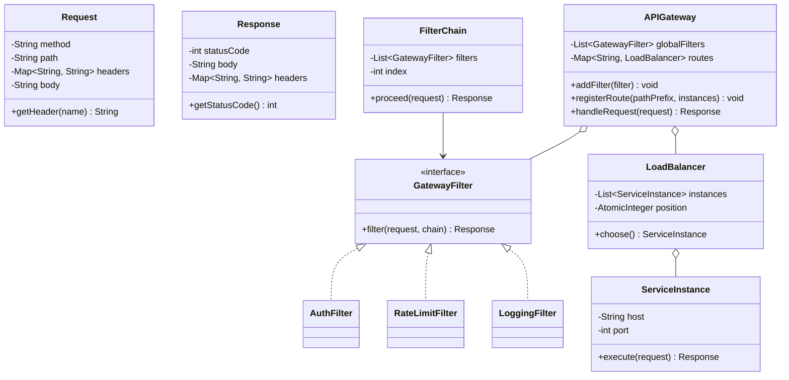
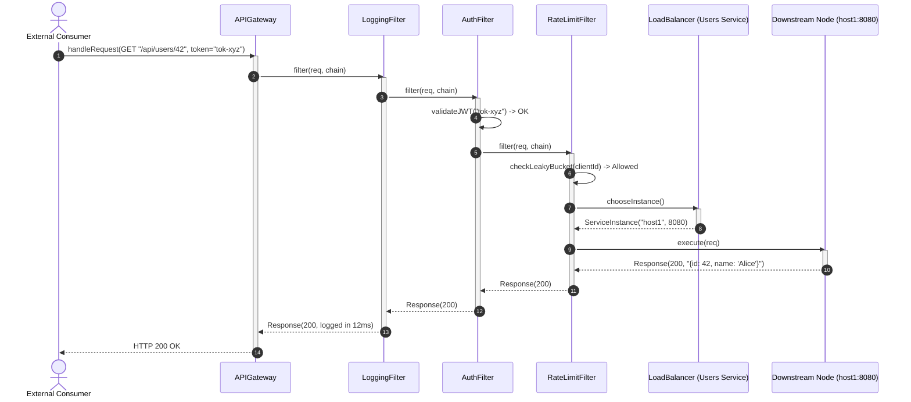

# Design an API Gateway

## 1. Problem Statement
Design an API gateway handling routing, authentication, rate limiting, request transformation, and load balancing.

## 2. Class & Sequence Design



### Sequence Diagram: Middleware Filter Chain Execution and Downstream Routing



## 3. Key Implementation

### Python

```python
from abc import ABC, abstractmethod
from typing import Dict, List, Callable, Optional
import random

class Request:
    def __init__(self, method: str, path: str, headers: Dict = None, body: str = ""):
        self.method = method
        self.path = path
        self.headers = headers or {}
        self.body = body

class Response:
    def __init__(self, status: int, body: str, headers: Dict = None):
        self.status = status
        self.body = body
        self.headers = headers or {}

class Middleware(ABC):
    @abstractmethod
    def process(self, request: Request, next_handler: Callable) -> Response: pass

class AuthMiddleware(Middleware):
    def __init__(self, valid_tokens: set):
        self._tokens = valid_tokens

    def process(self, request, next_handler) -> Response:
        token = request.headers.get("Authorization", "")
        if token not in self._tokens:
            return Response(401, "Unauthorized")
        return next_handler(request)

class RateLimitMiddleware(Middleware):
    def __init__(self, max_rps: int = 100):
        self._counts: Dict[str, int] = {}
        self._max = max_rps

    def process(self, request, next_handler) -> Response:
        client = request.headers.get("X-Client-ID", "unknown")
        self._counts[client] = self._counts.get(client, 0) + 1
        if self._counts[client] > self._max:
            return Response(429, "Too Many Requests")
        return next_handler(request)

class LoggingMiddleware(Middleware):
    def process(self, request, next_handler) -> Response:
        print(f"→ {request.method} {request.path}")
        response = next_handler(request)
        print(f"← {response.status}")
        return response

class ServiceInstance:
    def __init__(self, host: str, port: int):
        self.host = host
        self.port = port

    def handle(self, request: Request) -> Response:
        return Response(200, f"Handled by {self.host}:{self.port}")

class LoadBalancer:
    def __init__(self, instances: List[ServiceInstance]):
        self._instances = instances
        self._idx = 0

    def round_robin(self) -> ServiceInstance:
        instance = self._instances[self._idx % len(self._instances)]
        self._idx += 1
        return instance

class APIGateway:
    def __init__(self):
        self._routes: Dict[str, LoadBalancer] = {}
        self._middlewares: List[Middleware] = []

    def add_route(self, path_prefix: str, instances: List[ServiceInstance]):
        self._routes[path_prefix] = LoadBalancer(instances)

    def add_middleware(self, middleware: Middleware):
        self._middlewares.append(middleware)

    def handle(self, request: Request) -> Response:
        def final_handler(req: Request) -> Response:
            for prefix, lb in self._routes.items():
                if req.path.startswith(prefix):
                    instance = lb.round_robin()
                    return instance.handle(req)
            return Response(404, "Not Found")

        handler = final_handler
        for mw in reversed(self._middlewares):
            prev = handler
            handler = lambda req, m=mw, p=prev: m.process(req, p)

        return handler(request)
```

### Java

```java
package com.lld.apigateway;

import java.time.Instant;
import java.util.*;
import java.util.concurrent.ConcurrentHashMap;
import java.util.concurrent.CopyOnWriteArrayList;
import java.util.concurrent.atomic.AtomicInteger;

class Request {
    private final String method;
    private final String path;
    private final Map<String, String> headers;
    private final String body;

    public Request(String method, String path, Map<String, String> headers, String body) {
        this.method = method;
        this.path = path;
        this.headers = (headers != null) ? new HashMap<>(headers) : new HashMap<>();
        this.body = body;
    }

    public String getMethod() { return method; }
    public String getPath() { return path; }
    public String getHeader(String key) { return headers.get(key); }
    public String getBody() { return body; }
}

class Response {
    private final int statusCode;
    private final String body;
    private final Map<String, String> headers;

    public Response(int statusCode, String body) {
        this(statusCode, body, Collections.emptyMap());
    }

    public Response(int statusCode, String body, Map<String, String> headers) {
        this.statusCode = statusCode;
        this.body = body;
        this.headers = new HashMap<>(headers);
    }

    public int getStatusCode() { return statusCode; }
    public String getBody() { return body; }
    public Map<String, String> getHeaders() { return headers; }

    @Override
    public String toString() {
        return "HTTP " + statusCode + ": " + body;
    }
}

interface GatewayFilter {
    Response filter(Request request, FilterChain chain);
}

class FilterChain {
    private final List<GatewayFilter> filters;
    private final APIGateway gateway;
    private int currentPosition = 0;

    public FilterChain(List<GatewayFilter> filters, APIGateway gateway) {
        this.filters = filters;
        this.gateway = gateway;
    }

    public Response proceed(Request request) {
        if (currentPosition < filters.size()) {
            GatewayFilter currentFilter = filters.get(currentPosition++);
            return currentFilter.filter(request, this);
        }
        return gateway.routeToDownstream(request);
    }
}

class AuthFilter implements GatewayFilter {
    private final Set<String> validTokens;

    public AuthFilter(Set<String> validTokens) {
        this.validTokens = validTokens;
    }

    @Override
    public Response filter(Request request, FilterChain chain) {
        String token = request.getHeader("Authorization");
        if (token == null || !validTokens.contains(token)) {
            return new Response(401, "Unauthorized: Invalid or missing bearer token");
        }
        return chain.proceed(request);
    }
}

class RateLimitFilter implements GatewayFilter {
    private final int maxRequestsPerClient;
    private final Map<String, AtomicInteger> requestCounts = new ConcurrentHashMap<>();

    public RateLimitFilter(int maxRequestsPerClient) {
        this.maxRequestsPerClient = maxRequestsPerClient;
    }

    @Override
    public Response filter(Request request, FilterChain chain) {
        String clientId = request.getHeader("X-Client-ID");
        if (clientId == null) clientId = "anonymous";

        AtomicInteger counter = requestCounts.computeIfAbsent(clientId, k -> new AtomicInteger(0));
        if (counter.incrementAndGet() > maxRequestsPerClient) {
            return new Response(429, "Too Many Requests: Rate limit exceeded");
        }
        return chain.proceed(request);
    }
}

class ServiceInstance {
    private final String host;
    private final int port;

    public ServiceInstance(String host, int port) {
        this.host = host;
        this.port = port;
    }

    public Response execute(Request request) {
        return new Response(200, String.format("Proxied [%s %s] successfully via %s:%d",
                request.getMethod(), request.getPath(), host, port));
    }
}

class LoadBalancer {
    private final List<ServiceInstance> instances;
    private final AtomicInteger roundRobinIdx = new AtomicInteger(0);

    public LoadBalancer(List<ServiceInstance> instances) {
        this.instances = new ArrayList<>(instances);
    }

    public ServiceInstance choose() {
        if (instances.isEmpty()) return null;
        int idx = Math.abs(roundRobinIdx.getAndIncrement() % instances.size());
        return instances.get(idx);
    }
}

public class APIGateway {
    private final List<GatewayFilter> filters = new CopyOnWriteArrayList<>();
    private final Map<String, LoadBalancer> routes = new ConcurrentHashMap<>();

    public void addFilter(GatewayFilter filter) {
        filters.add(filter);
    }

    public void registerRoute(String pathPrefix, List<ServiceInstance> instances) {
        routes.put(pathPrefix, new LoadBalancer(instances));
    }

    public Response handleRequest(Request request) {
        FilterChain chain = new FilterChain(new ArrayList<>(filters), this);
        return chain.proceed(request);
    }

    Response routeToDownstream(Request request) {
        for (Map.Entry<String, LoadBalancer> entry : routes.entrySet()) {
            if (request.getPath().startsWith(entry.getKey())) {
                ServiceInstance instance = entry.getValue().choose();
                if (instance != null) {
                    return instance.execute(request);
                }
            }
        }
        return new Response(404, "Not Found: No upstream route configured for " + request.getPath());
    }
}
```

## 4. Thread Safety Considerations

| Component | Concurrency Hazard | Mitigation Strategy |
| :--- | :--- | :--- |
| **Round Robin Index Contention** | Multiple threads incrementing load balancer index simultaneously | `AtomicInteger.getAndIncrement()` ensures lock-free atomic circular counter increments. |
| **Rate Limiting Race Conditions** | Token bucket / window counter under heavy concurrent load | `ConcurrentHashMap.computeIfAbsent` with `AtomicInteger` ensures thread-safe atomic counters. |
| **Dynamic Route Reconfiguration** | Modifying routes or service instance topology during live traffic | `ConcurrentHashMap` for route maps allows concurrent lookups while routing table updates occur. |
| **Filter Pipeline State Isolation** | Independent request execution states in concurrent filter chains | `FilterChain` instantiated per request with local pointer cursor index, avoiding shared mutable state. |

## 5. Extensibility & SOLID Principles

| Principle | Implementation in Design |
| :--- | :--- |
| **Single Responsibility (SRP)** | `GatewayFilter` handles one aspect (Auth, Logging, Rate Limiting); `LoadBalancer` chooses backend nodes; `APIGateway` routes traffic. |
| **Open/Closed (OCP)** | New capabilities (Circuit Breakers, CORS, Request Transformations) implement `GatewayFilter` without altering the core gateway dispatcher. |
| **Liskov Substitution (LSP)** | All filters implement the unified `GatewayFilter.filter()` contract and can be plugged in arbitrary order. |
| **Interface Segregation (ISP)** | Downstream HTTP proxy execution isolated from administrative configuration endpoints. |
| **Dependency Inversion (DIP)** | Gateway routes depend on abstract `LoadBalancer` and `ServiceInstance` contracts rather than physical DNS/IP socket connections. |

## 6. Patterns
- **Chain of Responsibility / Decorator**: Filter chain intercepting inbound requests and outbound responses.
- **Proxy**: API Gateway acts as a reverse proxy disguising downstream microservice topology.
- **Strategy**: Pluggable load balancing algorithms (Round Robin, Weighted Least Connection, Hash Ring).

## 7. Follow-ups
- **Circuit Breaker Integration?** Wrap downstream calls in a `CircuitBreaker` (Closed, Open, Half-Open) to fail fast when error rates surpass thresholds.
- **Response Caching?** Cache idempotently matching `GET` requests using Redis with `Cache-Control` TTL tags.
- **Request Aggregation (BFF - Backend for Frontend)?** Gateway issues concurrent asynchronous HTTP calls to multiple microservices and combines JSON payloads.

---

**Related:** [[14 - Proxy Pattern]] | [[03 - Decorator Pattern]] | [[01 - Strategy Pattern]]

