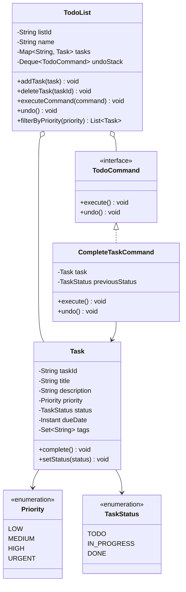
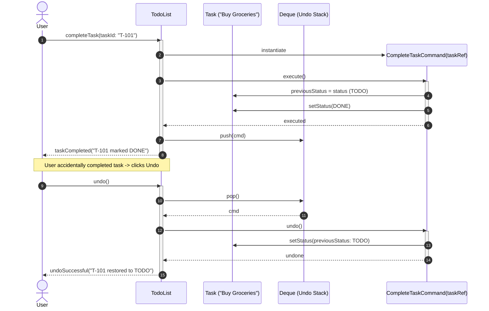

# Design a Todo List Application

## 1. Problem Statement
Design a task management app with CRUD, priorities, due dates, labels, filtering, and undo support.

## 2. Class & Sequence Design



### Sequence Diagram: Task Completion & Command Undo Flow



## 3. Key Implementation

### Python

```python
from enum import Enum
from datetime import datetime, date
from typing import List, Dict, Optional, Set
import uuid

class Priority(Enum):
    LOW = 1
    MEDIUM = 2
    HIGH = 3
    URGENT = 4

class TaskStatus(Enum):
    TODO = "TODO"
    IN_PROGRESS = "IN_PROGRESS"
    DONE = "DONE"

class Task:
    def __init__(self, title: str, description: str = "",
                 priority: Priority = Priority.MEDIUM, due_date: date = None):
        self.task_id = str(uuid.uuid4())[:8]
        self.title = title
        self.description = description
        self.priority = priority
        self.due_date = due_date
        self.status = TaskStatus.TODO
        self.labels: Set[str] = set()
        self.created_at = datetime.now()
        self.completed_at = None

    def complete(self):
        self.status = TaskStatus.DONE
        self.completed_at = datetime.now()

class TodoList:
    def __init__(self, name: str, owner: str):
        self.name = name
        self.owner = owner
        self.tasks: Dict[str, Task] = {}

    def add_task(self, task: Task) -> str:
        self.tasks[task.task_id] = task
        return task.task_id

    def remove_task(self, task_id: str):
        self.tasks.pop(task_id, None)

    def complete_task(self, task_id: str):
        if task_id in self.tasks:
            self.tasks[task_id].complete()

    def get_by_priority(self, priority: Priority) -> List[Task]:
        return [t for t in self.tasks.values() if t.priority == priority]

    def get_by_label(self, label: str) -> List[Task]:
        return [t for t in self.tasks.values() if label in t.labels]

    def get_overdue(self) -> List[Task]:
        today = date.today()
        return [t for t in self.tasks.values()
                if t.due_date and t.due_date < today and t.status != TaskStatus.DONE]

    def get_sorted(self, by: str = "priority") -> List[Task]:
        if by == "priority":
            return sorted(self.tasks.values(), key=lambda t: t.priority.value, reverse=True)
        elif by == "due_date":
            return sorted(self.tasks.values(), key=lambda t: t.due_date or date.max)
        return list(self.tasks.values())
```

### Java

```java
package com.lld.todolist;

import java.time.Instant;
import java.util.*;
import java.util.concurrent.ConcurrentHashMap;
import java.util.concurrent.locks.ReentrantLock;
import java.util.stream.Collectors;

enum Priority {
    LOW(1), MEDIUM(2), HIGH(3), URGENT(4);
    private final int level;
    Priority(int level) { this.level = level; }
    public int getLevel() { return level; }
}

enum TaskStatus {
    TODO, IN_PROGRESS, DONE
}

class Task {
    private final String taskId;
    private String title;
    private String description;
    private Priority priority;
    private volatile TaskStatus status;
    private Instant dueDate;
    private final Set<String> tags = ConcurrentHashMap.newKeySet();
    private final Instant createdAt;
    private volatile Instant completedAt;

    public Task(String taskId, String title, String description, Priority priority, Instant dueDate) {
        this.taskId = taskId;
        this.title = title;
        this.description = description;
        this.priority = priority;
        this.dueDate = dueDate;
        this.status = TaskStatus.TODO;
        this.createdAt = Instant.now();
    }

    public String getTaskId() { return taskId; }
    public String getTitle() { return title; }
    public Priority getPriority() { return priority; }
    public TaskStatus getStatus() { return status; }
    public void setStatus(TaskStatus status) {
        this.status = status;
        if (status == TaskStatus.DONE) {
            this.completedAt = Instant.now();
        } else {
            this.completedAt = null;
        }
    }
    public Instant getDueDate() { return dueDate; }
    public Set<String> getTags() { return tags; }

    @Override
    public String toString() {
        return String.format("[%s] %s (Priority: %s, Status: %s)", taskId, title, priority, status);
    }
}

interface TodoCommand {
    void execute();
    void undo();
}

class CompleteTaskCommand implements TodoCommand {
    private final Task task;
    private TaskStatus previousStatus;

    public CompleteTaskCommand(Task task) {
        this.task = task;
    }

    @Override
    public void execute() {
        this.previousStatus = task.getStatus();
        task.setStatus(TaskStatus.DONE);
    }

    @Override
    public void undo() {
        task.setStatus(previousStatus);
    }
}

public class TodoList {
    private final String listId;
    private final String name;
    private final Map<String, Task> tasks = new ConcurrentHashMap<>();
    private final Deque<TodoCommand> undoStack = new ArrayDeque<>();
    private final Deque<TodoCommand> redoStack = new ArrayDeque<>();
    private final ReentrantLock commandLock = new ReentrantLock();

    public TodoList(String listId, String name) {
        this.listId = listId;
        this.name = name;
    }

    public void addTask(Task task) {
        tasks.put(task.getTaskId(), task);
    }

    public void removeTask(String taskId) {
        tasks.remove(taskId);
    }

    public void completeTask(String taskId) {
        Task task = tasks.get(taskId);
        if (task != null) {
            CompleteTaskCommand cmd = new CompleteTaskCommand(task);
            executeCommand(cmd);
        }
    }

    public void executeCommand(TodoCommand command) {
        commandLock.lock();
        try {
            command.execute();
            undoStack.push(command);
            redoStack.clear();
        } finally {
            commandLock.unlock();
        }
    }

    public void undo() {
        commandLock.lock();
        try {
            if (!undoStack.isEmpty()) {
                TodoCommand cmd = undoStack.pop();
                cmd.undo();
                redoStack.push(cmd);
            }
        } finally {
            commandLock.unlock();
        }
    }

    public void redo() {
        commandLock.lock();
        try {
            if (!redoStack.isEmpty()) {
                TodoCommand cmd = redoStack.pop();
                cmd.execute();
                undoStack.push(cmd);
            }
        } finally {
            commandLock.unlock();
        }
    }

    public List<Task> getOverdueTasks() {
        Instant now = Instant.now();
        return tasks.values().stream()
                .filter(t -> t.getDueDate() != null && t.getDueDate().isBefore(now) && t.getStatus() != TaskStatus.DONE)
                .sorted(Comparator.comparing(Task::getDueDate))
                .collect(Collectors.toList());
    }

    public List<Task> getTasksSortedByPriority() {
        return tasks.values().stream()
                .sorted(Comparator.comparingInt((Task t) -> t.getPriority().getLevel()).reversed())
                .collect(Collectors.toList());
    }
}
```

## 4. Thread Safety Considerations

| Component | Concurrency Hazard | Mitigation Strategy |
| :--- | :--- | :--- |
| **Undo/Redo Stack Interleaving** | Race condition between multiple undo/redo command executions | `ReentrantLock` guards the undo and redo stack pop/push invocations. |
| **Task Status Visibility** | Thread marking task DONE while another thread evaluates overdue query | `volatile TaskStatus status` ensures immediate cross-thread visibility. |
| **Tag Mutation Races** | Concurrently adding labels/tags while filtering tasks | `ConcurrentHashMap.newKeySet()` prevents `ConcurrentModificationException`. |

## 5. Extensibility & SOLID Principles

| Principle | Implementation in Design |
| :--- | :--- |
| **Single Responsibility (SRP)** | `Task` holds item details and deadlines; `TodoCommand` encapsulates single mutations; `TodoList` aggregates collections. |
| **Open/Closed (OCP)** | New actions (`UpdateDueDateCommand`, `ChangePriorityCommand`) implement `TodoCommand` without altering list containers. |
| **Liskov Substitution (LSP)** | All command objects fulfill reversible `execute()` and `undo()` contracts symmetrically. |
| **Interface Segregation (ISP)** | Filter/Sort query contracts decoupled from state modification command contracts. |
| **Dependency Inversion (DIP)** | User undo/redo engine interacts with abstract `TodoCommand` interface rather than concrete task classes. |

## 6. Patterns
- **Command**: Encapsulating task actions into objects enabling full undo/redo stacks.
- **Observer**: Reminder alerts fired when deadlines approach without completion.
- **Composite**: Subtask hierarchy where a parent task's completion status is derived from children.

## 7. Follow-ups
- **Hierarchical subtasks?** Composite pattern where a `Task` can contain subtasks; parent automatically marked DONE when all children are completed.
- **Recurring tasks?** Cron-like scheduling rule that generates a new clone task upon current task completion.
- **Collaborative lists?** Shared workspace with role-based access control (Viewer, Editor, Admin).

---

**Related:** [[07 - Command Pattern]] | [[12 - Composite Pattern]]

