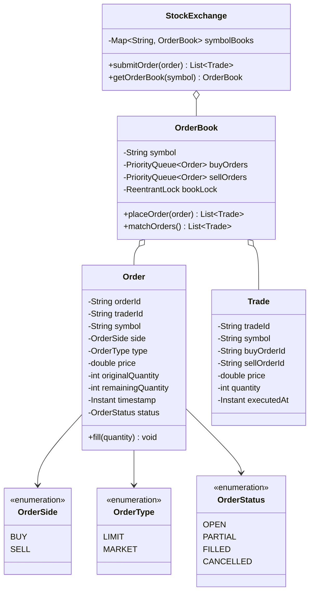
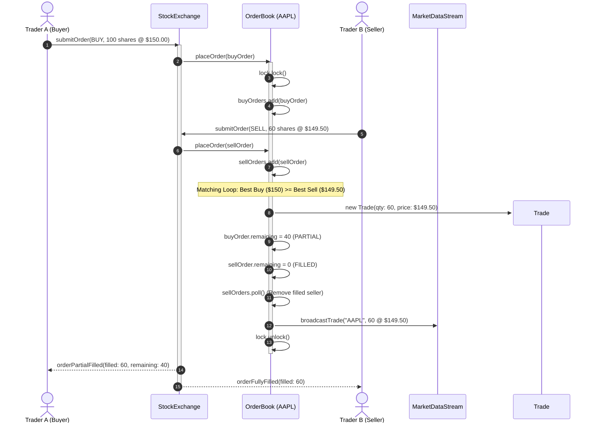

# Design a Stock Exchange System

## 1. Problem Statement
Design a stock trading system with order placement (market/limit), order matching engine, and real-time price updates.

## 2. Class & Sequence Design



### Sequence Diagram: Price-Time Priority Matching Engine



## 3. Key Implementation

### Python

```python
from enum import Enum
from typing import Dict, List, Optional
from collections import defaultdict
import heapq, uuid
from datetime import datetime

class OrderType(Enum):
    MARKET = "MARKET"
    LIMIT = "LIMIT"

class OrderSide(Enum):
    BUY = "BUY"
    SELL = "SELL"

class OrderStatus(Enum):
    OPEN = "OPEN"
    PARTIAL = "PARTIAL"
    FILLED = "FILLED"
    CANCELLED = "CANCELLED"

class Order:
    def __init__(self, trader_id: str, symbol: str, side: OrderSide,
                 order_type: OrderType, quantity: int, price: float = 0):
        self.order_id = str(uuid.uuid4())[:8]
        self.trader_id = trader_id
        self.symbol = symbol
        self.side = side
        self.order_type = order_type
        self.quantity = quantity
        self.remaining = quantity
        self.price = price
        self.status = OrderStatus.OPEN
        self.timestamp = datetime.now()

class Trade:
    def __init__(self, buy_order: Order, sell_order: Order, qty: int, price: float):
        self.trade_id = str(uuid.uuid4())[:8]
        self.buy_order_id = buy_order.order_id
        self.sell_order_id = sell_order.order_id
        self.quantity = qty
        self.price = price
        self.timestamp = datetime.now()

class OrderBook:
    def __init__(self, symbol: str):
        self.symbol = symbol
        self.buy_orders = []   # max-heap (negated price)
        self.sell_orders = []  # min-heap
        self.trades: List[Trade] = []

    def add_order(self, order: Order):
        if order.side == OrderSide.BUY:
            heapq.heappush(self.buy_orders, (-order.price, order.timestamp, order))
        else:
            heapq.heappush(self.sell_orders, (order.price, order.timestamp, order))
        self._match()

    def _match(self):
        while self.buy_orders and self.sell_orders:
            best_buy = self.buy_orders[0][2]
            best_sell = self.sell_orders[0][2]

            if -self.buy_orders[0][0] < self.sell_orders[0][0]:
                break

            trade_qty = min(best_buy.remaining, best_sell.remaining)
            trade_price = best_sell.price

            trade = Trade(best_buy, best_sell, trade_qty, trade_price)
            self.trades.append(trade)
            print(f"⚡ Trade: {trade_qty} {self.symbol} @ ${trade_price:.2f}")

            best_buy.remaining -= trade_qty
            best_sell.remaining -= trade_qty

            if best_buy.remaining == 0:
                best_buy.status = OrderStatus.FILLED
                heapq.heappop(self.buy_orders)
            else:
                best_buy.status = OrderStatus.PARTIAL

            if best_sell.remaining == 0:
                best_sell.status = OrderStatus.FILLED
                heapq.heappop(self.sell_orders)
            else:
                best_sell.status = OrderStatus.PARTIAL

class StockExchange:
    def __init__(self):
        self.order_books: Dict[str, OrderBook] = {}

    def place_order(self, order: Order):
        if order.symbol not in self.order_books:
            self.order_books[order.symbol] = OrderBook(order.symbol)
        self.order_books[order.symbol].add_order(order)

    def get_order_book(self, symbol: str) -> Optional[OrderBook]:
        return self.order_books.get(symbol)
```

### Java

```java
package com.lld.stockexchange;

import java.time.Instant;
import java.util.*;
import java.util.concurrent.ConcurrentHashMap;
import java.util.concurrent.locks.ReentrantLock;

enum OrderSide { BUY, SELL }
enum OrderType { LIMIT, MARKET }
enum OrderStatus { OPEN, PARTIAL, FILLED, CANCELLED }

class Order {
    private final String orderId;
    private final String traderId;
    private final String symbol;
    private final OrderSide side;
    private final OrderType type;
    private final double price;
    private final int originalQuantity;
    private int remainingQuantity;
    private final Instant timestamp;
    private volatile OrderStatus status;

    public Order(String orderId, String traderId, String symbol, OrderSide side,
                 OrderType type, double price, int quantity) {
        this.orderId = orderId;
        this.traderId = traderId;
        this.symbol = symbol;
        this.side = side;
        this.type = type;
        this.price = price;
        this.originalQuantity = quantity;
        this.remainingQuantity = quantity;
        this.timestamp = Instant.now();
        this.status = OrderStatus.OPEN;
    }

    public void fill(int quantity) {
        this.remainingQuantity -= quantity;
        this.status = (this.remainingQuantity == 0) ? OrderStatus.FILLED : OrderStatus.PARTIAL;
    }

    public String getOrderId() { return orderId; }
    public String getTraderId() { return traderId; }
    public String getSymbol() { return symbol; }
    public OrderSide getSide() { return side; }
    public OrderType getType() { return type; }
    public double getPrice() { return price; }
    public int getRemainingQuantity() { return remainingQuantity; }
    public Instant getTimestamp() { return timestamp; }
    public OrderStatus getStatus() { return status; }
}

class Trade {
    private final String tradeId;
    private final String symbol;
    private final String buyOrderId;
    private final String sellOrderId;
    private final double price;
    private final int quantity;
    private final Instant executedAt;

    public Trade(String buyOrderId, String sellOrderId, String symbol, double price, int quantity) {
        this.tradeId = "TRD-" + UUID.randomUUID().toString().substring(0, 8).toUpperCase();
        this.buyOrderId = buyOrderId;
        this.sellOrderId = sellOrderId;
        this.symbol = symbol;
        this.price = price;
        this.quantity = quantity;
        this.executedAt = Instant.now();
    }

    public double getPrice() { return price; }
    public int getQuantity() { return quantity; }

    @Override
    public String toString() {
        return String.format("[Trade %s] %d %s @ $%.2f (Buyer: %s, Seller: %s)",
                tradeId, quantity, symbol, price, buyOrderId, sellOrderId);
    }
}

class OrderBook {
    private final String symbol;
    // Bids: Highest price first, then earliest timestamp
    private final PriorityQueue<Order> buyOrders = new PriorityQueue<>(
            Comparator.comparingDouble(Order::getPrice).reversed()
                    .thenComparing(Order::getTimestamp)
    );
    // Asks: Lowest price first, then earliest timestamp
    private final PriorityQueue<Order> sellOrders = new PriorityQueue<>(
            Comparator.comparingDouble(Order::getPrice)
                    .thenComparing(Order::getTimestamp)
    );
    private final List<Trade> trades = new ArrayList<>();
    private final ReentrantLock bookLock = new ReentrantLock();

    public OrderBook(String symbol) {
        this.symbol = symbol;
    }

    public List<Trade> placeOrder(Order order) {
        bookLock.lock();
        try {
            if (order.getSide() == OrderSide.BUY) {
                buyOrders.add(order);
            } else {
                sellOrders.add(order);
            }
            return matchOrders();
        } finally {
            bookLock.unlock();
        }
    }

    private List<Trade> matchOrders() {
        List<Trade> executedTrades = new ArrayList<>();

        while (!buyOrders.isEmpty() && !sellOrders.isEmpty()) {
            Order bestBuy = buyOrders.peek();
            Order bestSell = sellOrders.peek();

            // Match condition: Buy price >= Sell price
            if (bestBuy.getPrice() < bestSell.getPrice()) {
                break; // No cross in order book
            }

            int matchQty = Math.min(bestBuy.getRemainingQuantity(), bestSell.getRemainingQuantity());
            // Maker-taker price determination: earliest resting order establishes execution price
            double executionPrice = bestBuy.getTimestamp().isBefore(bestSell.getTimestamp())
                    ? bestBuy.getPrice() : bestSell.getPrice();

            bestBuy.fill(matchQty);
            bestSell.fill(matchQty);

            Trade trade = new Trade(bestBuy.getOrderId(), bestSell.getOrderId(), symbol, executionPrice, matchQty);
            trades.add(trade);
            executedTrades.add(trade);
            System.out.println("⚡ " + trade);

            if (bestBuy.getStatus() == OrderStatus.FILLED) {
                buyOrders.poll();
            }
            if (bestSell.getStatus() == OrderStatus.FILLED) {
                sellOrders.poll();
            }
        }
        return executedTrades;
    }
}

public class StockExchange {
    private final Map<String, OrderBook> orderBooks = new ConcurrentHashMap<>();

    public List<Trade> submitOrder(Order order) {
        OrderBook book = orderBooks.computeIfAbsent(order.getSymbol(), OrderBook::new);
        return book.placeOrder(order);
    }

    public OrderBook getOrderBook(String symbol) {
        return orderBooks.get(symbol);
    }
}
```

## 4. Thread Safety Considerations

| Component | Concurrency Hazard | Mitigation Strategy |
| :--- | :--- | :--- |
| **Order Book Cross Isolation** | Concurrent buy/sell orders executing on the same book creating race conditions | Fine-grained `ReentrantLock` per `OrderBook` symbol; prevents contention across different tickers (e.g. AAPL lock does not block MSFT). |
| **Priority Queue Heap Invariant** | Priority queues are not thread-safe; concurrent mutations lead to heap corruption | All additions, peek, and poll operations are confined within the order book's critical section. |
| **Symbol Map Partitioning** | Dynamic listing of new stocks | `ConcurrentHashMap.computeIfAbsent` guarantees thread-safe, single-instance instantiation of ticker books. |

## 5. Extensibility & SOLID Principles

| Principle | Implementation in Design |
| :--- | :--- |
| **Single Responsibility (SRP)** | `Order` represents an immutable financial intent; `OrderBook` enforces price-time priority matching; `StockExchange` serves as the ticker router. |
| **Open/Closed (OCP)** | Advanced order types (`StopLossOrder`, `IcebergOrder`, `FillOrKill`) implement matching extensions without modifying base limit matching algorithms. |
| **Liskov Substitution (LSP)** | All specialized order variants adhere to the generic `Order` contract. |
| **Interface Segregation (ISP)** | Market data feed subscriber interfaces separated from order entry gateway and risk checking filters. |
| **Dependency Inversion (DIP)** | Exchange dispatches trade fill confirmations through an abstract `TradeExecutionListener` pub/sub interface. |

## 6. Patterns
- **Strategy**: Pluggable matching algorithms (Continuous Price-Time FIFO, Pro-Rata allocation, Periodic Batch Auction).
- **Observer**: Real-time Level 1 / Level 2 market data quotes broadcast to external subscribers.
- **Command**: Order cancellations and modifications encapsulated as commands with idempotency keys.

## 7. Follow-ups
- **Low latency optimizations?** LMAX Disruptor ring buffer architecture with single-threaded mechanical sympathy pinned to CPU cores, eliminating locks.
- **Iceberg Orders?** Only expose a fraction ($V_{\text{visible}}$) of total order volume on the public L2 book; replenish upon execution.
- **Circuit Breakers / LULD (Limit Up Limit Down)?** Halt trading on ticker for 5 minutes if prices swing $> 10\%$ in a 5-minute rolling window.

---

**Related:** [[02 - Observer Pattern]] | [[01 - Strategy Pattern]] | [[07 - Command Pattern]]

