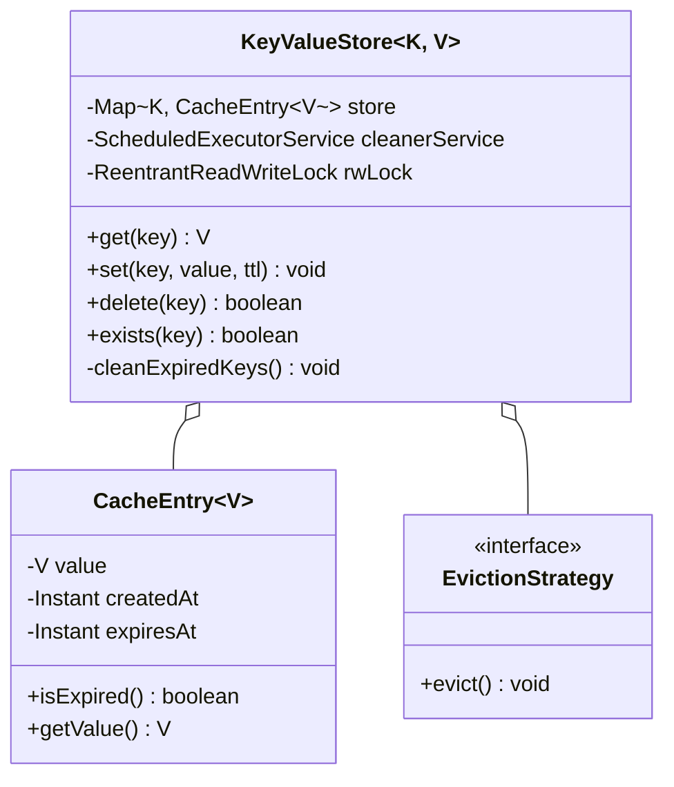
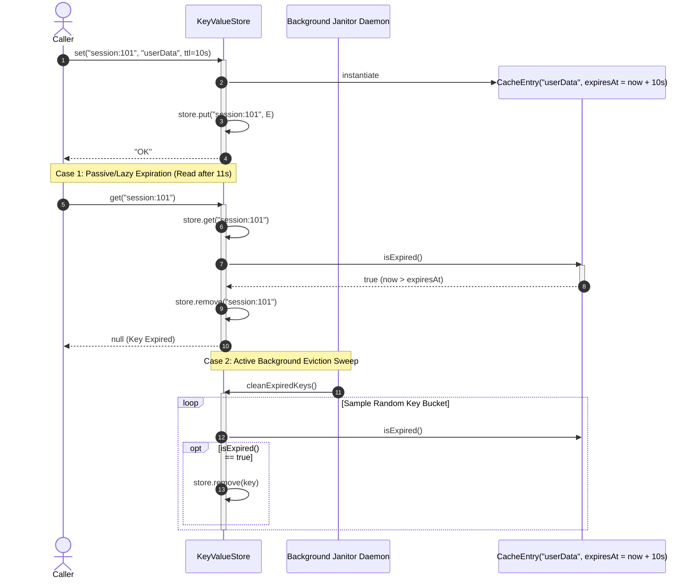

# Design a Key-Value Store

## 1. Problem Statement
Design an in-memory key-value store with TTL, persistence, and basic data types (string, list, hash).

## 2. Class & Sequence Design



### Sequence Diagram: Lazy & Active TTL Expiration Flow



## 3. Key Implementation

### Python

```python
import time, json, threading
from typing import Any, Optional, Dict

class Entry:
    def __init__(self, value: Any, ttl_seconds: float = None):
        self.value = value
        self.created_at = time.time()
        self.expiry = time.time() + ttl_seconds if ttl_seconds else None

    def is_expired(self) -> bool:
        return self.expiry is not None and time.time() > self.expiry

class KeyValueStore:
    def __init__(self):
        self._store: Dict[str, Entry] = {}
        self._lock = threading.Lock()

    def get(self, key: str) -> Optional[Any]:
        with self._lock:
            entry = self._store.get(key)
            if entry is None:
                return None
            if entry.is_expired():
                del self._store[key]
                return None
            return entry.value

    def set(self, key: str, value: Any, ttl: float = None):
        with self._lock:
            self._store[key] = Entry(value, ttl)

    def delete(self, key: str) -> bool:
        with self._lock:
            return self._store.pop(key, None) is not None

    def exists(self, key: str) -> bool:
        return self.get(key) is not None

    def keys(self, pattern: str = "*") -> list:
        with self._lock:
            self._cleanup_expired()
            if pattern == "*":
                return list(self._store.keys())
            import fnmatch
            return [k for k in self._store.keys() if fnmatch.fnmatch(k, pattern)]

    def lpush(self, key: str, *values):
        with self._lock:
            entry = self._store.get(key)
            if entry is None:
                self._store[key] = Entry(list(values))
            else:
                entry.value = list(values) + entry.value

    def rpush(self, key: str, *values):
        with self._lock:
            entry = self._store.get(key)
            if entry is None:
                self._store[key] = Entry(list(values))
            else:
                entry.value.extend(values)

    def lrange(self, key: str, start: int, end: int) -> list:
        val = self.get(key)
        if val is None: return []
        return val[start:end + 1] if end >= 0 else val[start:]

    def hset(self, key: str, field: str, value: Any):
        with self._lock:
            entry = self._store.get(key)
            if entry is None:
                self._store[key] = Entry({field: value})
            else:
                entry.value[field] = value

    def hget(self, key: str, field: str) -> Optional[Any]:
        val = self.get(key)
        return val.get(field) if isinstance(val, dict) else None

    def save(self, filepath: str):
        with self._lock:
            data = {k: {"value": e.value, "expiry": e.expiry}
                    for k, e in self._store.items() if not e.is_expired()}
            with open(filepath, 'w') as f:
                json.dump(data, f)

    def load(self, filepath: str):
        with open(filepath) as f:
            data = json.load(f)
        with self._lock:
            for k, v in data.items():
                ttl = v["expiry"] - time.time() if v["expiry"] else None
                if ttl is None or ttl > 0:
                    self._store[k] = Entry(v["value"], ttl)

    def _cleanup_expired(self):
        expired = [k for k, e in self._store.items() if e.is_expired()]
        for k in expired:
            del self._store[k]
```

### Java

```java
package com.lld.kvstore;

import java.time.Duration;
import java.time.Instant;
import java.util.*;
import java.util.concurrent.*;
import java.util.concurrent.locks.ReentrantReadWriteLock;

class CacheEntry<V> {
    private final V value;
    private final Instant createdAt;
    private final Instant expiresAt;

    public CacheEntry(V value, Duration ttl) {
        this.value = value;
        this.createdAt = Instant.now();
        this.expiresAt = (ttl != null) ? this.createdAt.plus(ttl) : null;
    }

    public boolean isExpired() {
        return expiresAt != null && Instant.now().isAfter(expiresAt);
    }

    public V getValue() { return value; }
    public Instant getExpiresAt() { return expiresAt; }
}

public class KeyValueStore<K, V> {
    private final Map<K, CacheEntry<V>> store = new ConcurrentHashMap<>();
    private final ScheduledExecutorService janitorService = Executors.newSingleThreadScheduledExecutor();
    private final ReentrantReadWriteLock rwLock = new ReentrantReadWriteLock();

    public KeyValueStore() {
        // Active purge daemon runs every 5 seconds (Redis-style sample sweep)
        janitorService.scheduleAtFixedRate(this::activeExpireSweep, 5, 5, TimeUnit.SECONDS);
    }

    public void set(K key, V value, Duration ttl) {
        rwLock.writeLock().lock();
        try {
            store.put(key, new CacheEntry<>(value, ttl));
        } finally {
            rwLock.writeLock().unlock();
        }
    }

    public void set(K key, V value) {
        set(key, value, null);
    }

    public V get(K key) {
        rwLock.readLock().lock();
        try {
            CacheEntry<V> entry = store.get(key);
            if (entry == null) return null;

            // 1. Passive / Lazy Expiration check
            if (entry.isExpired()) {
                // Elevate to write lock to evict
                rwLock.readLock().unlock();
                rwLock.writeLock().lock();
                try {
                    CacheEntry<V> current = store.get(key);
                    if (current != null && current.isExpired()) {
                        store.remove(key);
                    }
                    return null;
                } finally {
                    rwLock.readLock().lock();
                    rwLock.writeLock().unlock();
                }
            }
            return entry.getValue();
        } finally {
            rwLock.readLock().unlock();
        }
    }

    public boolean delete(K key) {
        rwLock.writeLock().lock();
        try {
            return store.remove(key) != null;
        } finally {
            rwLock.writeLock().unlock();
        }
    }

    public boolean exists(K key) {
        return get(key) != null;
    }

    public int size() {
        rwLock.readLock().lock();
        try {
            return store.size();
        } finally {
            rwLock.readLock().unlock();
        }
    }

    private void activeExpireSweep() {
        rwLock.writeLock().lock();
        try {
            Instant now = Instant.now();
            store.entrySet().removeIf(entry -> entry.getValue().isExpired());
        } finally {
            rwLock.writeLock().unlock();
        }
    }

    public void shutdown() {
        janitorService.shutdownNow();
    }
}
```

## 4. Thread Safety Considerations

| Component | Concurrency Hazard | Mitigation Strategy |
| :--- | :--- | :--- |
| **Read-Heavy Throughput** | Monitor lock saturation during frequent reads | `ReentrantReadWriteLock` allows unlimited concurrent non-blocking reads while serializing writes. |
| **Lazy Expiration Lock Upgrade** | Deadlock when promoting read lock to write lock upon detecting an expired key | Release read lock before acquiring write lock, then verify expiration under double-checked locking. |
| **Active Sweeper Interleaving** | Sweeper daemon interfering with client transactional updates | Sweeper executes inside short write locks, or uses lock-free `ConcurrentHashMap.entrySet().removeIf()`. |

## 5. Extensibility & SOLID Principles

| Principle | Implementation in Design |
| :--- | :--- |
| **Single Responsibility (SRP)** | `CacheEntry` tracks value and timestamp bounds; `KeyValueStore` coordinates memory hash indexing; `janitorService` purges stale keys. |
| **Open/Closed (OCP)** | Pluggable eviction policies (LRU, LFU, FIFO, Random) implement `EvictionStrategy` without modifying the core key-value map. |
| **Liskov Substitution (LSP)** | Generic parameters `<K, V>` allow storage of arbitrary serializable objects cleanly. |
| **Interface Segregation (ISP)** | Key-value basic CRUD interface separated from administrative diagnostic and persistence operations. |
| **Dependency Inversion (DIP)** | Memory persistence backends (AOF Append-Only File, RDB Snapshotting) implement an abstract `PersistenceEngine` contract. |

## 6. Patterns
- **Proxy**: Client wrapper handling connection pooling and automatic serialization/deserialization.
- **Strategy**: Cache eviction policies (LRU via `LinkedHashMap`, LFU, TTL expiration).
- **Observer**: Keyspace notifications publishing events (e.g. `key:set`, `key:expired`) to registered pub/sub subscribers.

## 7. Follow-ups
- **LRU Memory Eviction when RAM is full?** Maintain doubly linked list of accessed keys; evict tail node when memory threshold is reached.
- **Redis AOF (Append Only File) vs RDB (Snapshot)?** Append every mutating command to a sequential disk log with background `fsync` and periodic rewrite compaction.
- **Distributed Sharding?** Consistent hashing ring with virtual nodes (e.g. 256 tokens per server) to distribute keys across cluster instances.

---

**Related:** [[06 - Singleton Pattern]] | [[02 - Observer Pattern]]

