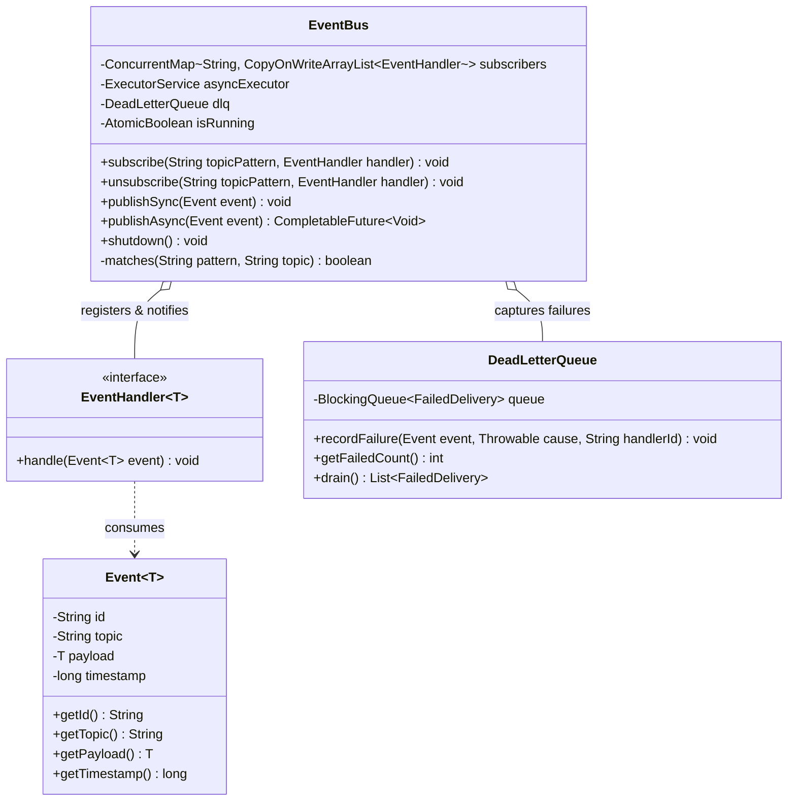
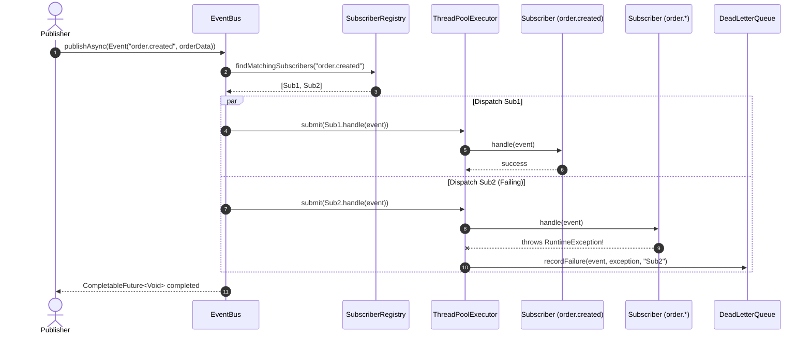

# Design an Event / Message Bus

## 1. Problem Statement
Design a high-throughput, in-process Event Bus for decoupled component communication supporting:
- Synchronous and asynchronous event dispatching.
- Exact topic matching and wildcard topic subscriptions (e.g., `order.*`, `inventory.#`).
- Custom event filtering and dead-letter queue (DLQ) for failed event deliveries.
- Thread-safe subscriber registration, deregistration, and isolated failure domains (one faulty subscriber must not crash others or the bus).

---

## 2. Architecture & Class Diagram



---

## 3. Dynamic Sequence Diagram (Publish & Dispatch Flow)



---

## 4. Implementation

### Python 3

```python
import threading
from typing import Callable, Dict, List, Any, Optional
from collections import defaultdict
from concurrent.futures import ThreadPoolExecutor
import fnmatch
import time
import uuid

class Event:
    def __init__(self, topic: str, data: Any = None):
        self.id = str(uuid.uuid4())
        self.topic = topic
        self.data = data
        self.timestamp = time.time()

    def __repr__(self):
        return f"Event(id={self.id[:8]}, topic='{self.topic}', data={self.data})"

class DeadLetterQueue:
    def __init__(self):
        self._failures: List[Dict[str, Any]] = []
        self._lock = threading.Lock()

    def record_failure(self, event: Event, error: Exception, handler_name: str):
        with self._lock:
            self._failures.append({
                "event": event,
                "error": str(error),
                "handler": handler_name,
                "failed_at": time.time()
            })

    def get_failures(self) -> List[Dict[str, Any]]:
        with self._lock:
            return list(self._failures)

class EventBus:
    def __init__(self, async_mode: bool = False, workers: int = 4):
        self._subscribers: Dict[str, List[Callable[[Event], None]]] = defaultdict(list)
        self._lock = threading.RLock()
        self._async = async_mode
        self._executor = ThreadPoolExecutor(max_workers=workers) if async_mode else None
        self.dlq = DeadLetterQueue()
        self._is_running = True

    def subscribe(self, topic_pattern: str, handler: Callable[[Event], None]):
        """Subscribe to a topic. Supports wildcards: 'order.*' matches 'order.created'"""
        with self._lock:
            if not self._is_running:
                raise RuntimeError("EventBus is shut down")
            self._subscribers[topic_pattern].append(handler)

    def unsubscribe(self, topic_pattern: str, handler: Callable[[Event], None]):
        with self._lock:
            if topic_pattern in self._subscribers and handler in self._subscribers[topic_pattern]:
                self._subscribers[topic_pattern].remove(handler)

    def _matches(self, pattern: str, topic: str) -> bool:
        return pattern == topic or fnmatch.fnmatch(topic, pattern)

    def publish(self, event: Event):
        with self._lock:
            if not self._is_running:
                raise RuntimeError("EventBus is shut down")
            matching_handlers: List[Callable[[Event], None]] = []
            for pattern, handlers in self._subscribers.items():
                if self._matches(pattern, event.topic):
                    matching_handlers.extend(handlers)

        for handler in matching_handlers:
            if self._async and self._executor:
                self._executor.submit(self._safe_invoke, handler, event)
            else:
                self._safe_invoke(handler, event)

    def _safe_invoke(self, handler: Callable[[Event], None], event: Event):
        try:
            handler(event)
        except Exception as ex:
            handler_name = getattr(handler, "__name__", str(handler))
            self.dlq.record_failure(event, ex, handler_name)

    def shutdown(self):
        with self._lock:
            self._is_running = False
        if self._executor:
            self._executor.shutdown(wait=True)

if __name__ == "__main__":
    bus = EventBus(async_mode=True, workers=2)

    def on_order_created(event: Event):
        print(f"📦 [OrderCreatedHandler] Received: {event}")

    def on_all_orders(event: Event):
        print(f"🔔 [OrderAuditLogger] Received: {event}")

    def on_faulty_sub(event: Event):
        raise ValueError("Simulated database timeout in consumer")

    bus.subscribe("order.created", on_order_created)
    bus.subscribe("order.*", on_all_orders)
    bus.subscribe("order.created", on_faulty_sub)

    bus.publish(Event("order.created", {"id": "ORD-101", "amount": 149.99}))
    bus.publish(Event("order.cancelled", {"id": "ORD-102"}))

    time.sleep(0.5)
    print(f"DLQ Failures captured: {len(bus.dlq.get_failures())}")
    for fail in bus.dlq.get_failures():
        print(f"  DLQ Record -> Handler: {fail['handler']}, Error: {fail['error']}")

    bus.shutdown()
```

---

### Java (Production-Grade with Concurrency)

```java
package com.system.lld.eventbus;

import java.util.*;
import java.util.concurrent.*;
import java.util.concurrent.atomic.AtomicBoolean;
import java.util.regex.Pattern;

public class EventBusSystem {

    // -------------------------------------------------------------
    // Generic Event
    // -------------------------------------------------------------
    public static class Event<T> {
        private final String id;
        private final String topic;
        private final T payload;
        private final long timestamp;

        public Event(String topic, T payload) {
            this.id = UUID.randomUUID().toString();
            this.topic = Objects.requireNonNull(topic, "Topic cannot be null");
            this.payload = payload;
            this.timestamp = System.currentTimeMillis();
        }

        public String getId() { return id; }
        public String getTopic() { return topic; }
        public T getPayload() { return payload; }
        public long getTimestamp() { return timestamp; }

        @Override
        public String toString() {
            return String.format("Event[id=%s, topic='%s', payload=%s]", id.substring(0, 8), topic, payload);
        }
    }

    // -------------------------------------------------------------
    // Subscriber Interface
    // -------------------------------------------------------------
    @FunctionalInterface
    public interface EventHandler<T> {
        void handle(Event<T> event) throws Exception;
    }

    // -------------------------------------------------------------
    // Dead Letter Queue (DLQ)
    // -------------------------------------------------------------
    public static class FailedDelivery {
        private final Event<?> event;
        private final Throwable cause;
        private final String handlerName;
        private final long failedAt;

        public FailedDelivery(Event<?> event, Throwable cause, String handlerName) {
            this.event = event;
            this.cause = cause;
            this.handlerName = handlerName;
            this.failedAt = System.currentTimeMillis();
        }

        public Event<?> getEvent() { return event; }
        public Throwable getCause() { return cause; }
        public String getHandlerName() { return handlerName; }
        public long getFailedAt() { return failedAt; }

        @Override
        public String toString() {
            return String.format("FailedDelivery[handler=%s, error=%s, event=%s]",
                    handlerName, cause.getMessage(), event);
        }
    }

    public static class DeadLetterQueue {
        private final ConcurrentLinkedQueue<FailedDelivery> failures = new ConcurrentLinkedQueue<>();

        public void recordFailure(Event<?> event, Throwable cause, String handlerName) {
            failures.add(new FailedDelivery(event, cause, handlerName));
        }

        public List<FailedDelivery> getFailures() {
            return new ArrayList<>(failures);
        }

        public int size() {
            return failures.size();
        }
    }

    // -------------------------------------------------------------
    // Event Bus Engine
    // -------------------------------------------------------------
    public static class EventBus {
        private final ConcurrentMap<String, CopyOnWriteArrayList<EventHandler<?>>> subscribers = new ConcurrentHashMap<>();
        private final ConcurrentMap<String, Pattern> patternCache = new ConcurrentHashMap<>();
        private final ExecutorService asyncExecutor;
        private final DeadLetterQueue dlq;
        private final AtomicBoolean isRunning = new AtomicBoolean(true);

        public EventBus(int threadPoolSize) {
            this.asyncExecutor = Executors.newFixedThreadPool(threadPoolSize, r -> {
                Thread t = new Thread(r);
                t.setName("event-bus-worker-" + t.getId());
                t.setDaemon(true);
                return t;
            });
            this.dlq = new DeadLetterQueue();
        }

        public <T> void subscribe(String topicPattern, EventHandler<T> handler) {
            checkRunning();
            Objects.requireNonNull(topicPattern, "topicPattern cannot be null");
            Objects.requireNonNull(handler, "handler cannot be null");

            subscribers.computeIfAbsent(topicPattern, k -> new CopyOnWriteArrayList<>()).add(handler);
        }

        public <T> void unsubscribe(String topicPattern, EventHandler<T> handler) {
            CopyOnWriteArrayList<EventHandler<?>> list = subscribers.get(topicPattern);
            if (list != null) {
                list.remove(handler);
                if (list.isEmpty()) {
                    subscribers.remove(topicPattern, Collections.emptyList());
                }
            }
        }

        /**
         * Synchronous publishing: blocks caller until all matching subscribers finish.
         */
        @SuppressWarnings("unchecked")
        public <T> void publishSync(Event<T> event) {
            checkRunning();
            List<EventHandler<T>> matched = resolveHandlers(event.getTopic());
            for (EventHandler<T> handler : matched) {
                invokeSafely(handler, event);
            }
        }

        /**
         * Asynchronous publishing: submits handler executions to the worker pool.
         */
        @SuppressWarnings("unchecked")
        public <T> CompletableFuture<Void> publishAsync(Event<T> event) {
            checkRunning();
            List<EventHandler<T>> matched = resolveHandlers(event.getTopic());
            if (matched.isEmpty()) {
                return CompletableFuture.completedFuture(null);
            }

            List<CompletableFuture<Void>> futures = new ArrayList<>(matched.size());
            for (EventHandler<T> handler : matched) {
                futures.add(CompletableFuture.runAsync(() -> invokeSafely(handler, event), asyncExecutor));
            }
            return CompletableFuture.allOf(futures.toArray(new CompletableFuture[0]));
        }

        @SuppressWarnings("unchecked")
        private <T> List<EventHandler<T>> resolveHandlers(String topic) {
            List<EventHandler<T>> result = new ArrayList<>();
            for (Map.Entry<String, CopyOnWriteArrayList<EventHandler<?>>> entry : subscribers.entrySet()) {
                String patternStr = entry.getKey();
                if (matches(patternStr, topic)) {
                    for (EventHandler<?> h : entry.getValue()) {
                        result.add((EventHandler<T>) h);
                    }
                }
            }
            return result;
        }

        private boolean matches(String patternStr, String topic) {
            if (patternStr.equals(topic)) return true;
            Pattern regex = patternCache.computeIfAbsent(patternStr, p -> {
                // Convert ant-style / glob wildcards: * matches single token, # or ** matches multi
                String r = p.replace(".", "\\.")
                            .replace("*", "[^.]+")
                            .replace("#", ".*");
                return Pattern.compile("^" + r + "$");
            });
            return regex.matcher(topic).matches();
        }

        private <T> void invokeSafely(EventHandler<T> handler, Event<T> event) {
            try {
                handler.handle(event);
            } catch (Throwable t) {
                dlq.recordFailure(event, t, handler.getClass().getSimpleName());
            }
        }

        public DeadLetterQueue getDeadLetterQueue() {
            return dlq;
        }

        public void shutdown() {
            if (isRunning.compareAndSet(true, false)) {
                asyncExecutor.shutdown();
                try {
                    if (!asyncExecutor.awaitTermination(3, TimeUnit.SECONDS)) {
                        asyncExecutor.shutdownNow();
                    }
                } catch (InterruptedException e) {
                    asyncExecutor.shutdownNow();
                    Thread.currentThread().interrupt();
                }
            }
        }

        private void checkRunning() {
            if (!isRunning.get()) {
                throw new IllegalStateException("EventBus has been shut down");
            }
        }
    }

    // -------------------------------------------------------------
    // Demo Execution
    // -------------------------------------------------------------
    public static void main(String[] args) throws Exception {
        EventBus bus = new EventBus(4);

        // 1. Subscribe exact topic
        bus.subscribe("order.created", event -> {
            System.out.println("📦 [Exact Sub] Processed order: " + event.getPayload());
        });

        // 2. Subscribe wildcard topic
        bus.subscribe("order.*", event -> {
            System.out.println("🔔 [Audit Wildcard Sub] Logged event: " + event.getTopic() + " -> " + event.getPayload());
        });

        // 3. Faulty Subscriber
        bus.subscribe("order.created", event -> {
            throw new RuntimeException("Simulated external notification API timeout");
        });

        // Publish events
        System.out.println("--- Publishing Events Asynchronously ---");
        CompletableFuture<Void> f1 = bus.publishAsync(new Event<>("order.created", "Order #9001 ($199.99)"));
        CompletableFuture<Void> f2 = bus.publishAsync(new Event<>("order.cancelled", "Order #9002"));

        CompletableFuture.allOf(f1, f2).join();

        Thread.sleep(200);
        System.out.println("\n--- Dead Letter Queue Inspection ---");
        System.out.println("Total Failures in DLQ: " + bus.getDeadLetterQueue().size());
        for (FailedDelivery fail : bus.getDeadLetterQueue().getFailures()) {
            System.out.println("Captured: " + fail);
        }

        bus.shutdown();
        System.out.println("EventBus shut down gracefully.");
    }
}
```

---

## 5. Thread Safety Considerations

| Component / Action | Mechanism | Concurrency Concern & Mitigation |
| :--- | :--- | :--- |
| **Subscriber Registry** | `ConcurrentHashMap<String, CopyOnWriteArrayList<EventHandler>>` | Registrations and unregistrations can occur concurrently with active event dispatches without throwing `ConcurrentModificationException`. |
| **Pattern Compilation Cache** | `ConcurrentHashMap.computeIfAbsent` | Thread-safe caching avoids repeated regular expression compiling overhead across high publishing throughput. |
| **Event Delivery Isolation** | Individual `try/catch` per handler invocation | A rogue consumer throwing an unhandled exception or error cannot prevent subsequent or concurrent handlers from executing. |
| **Dead-Letter Queue** | `ConcurrentLinkedQueue<FailedDelivery>` | Lock-free, non-blocking queue ensures failure recording does not bottleneck worker threads or publisher latency. |
| **Lifecycle State** | `AtomicBoolean isRunning` | CAS prevents publishing or registering after shutdown initiation, ensuring graceful drainage of executing tasks. |

---

## 6. Extensibility & SOLID Principles

| Principle | Adherence in This Design |
| :--- | :--- |
| **Single Responsibility (SRP)** | `EventBus` routes events; `EventHandler` processes business logic; `DeadLetterQueue` holds failures; `Pattern` handles matching. |
| **Open/Closed (OCP)** | New event types and consumer handlers can be added without modifying existing bus infrastructure or core routing engines. |
| **Liskov Substitution (LSP)** | Any class implementing `EventHandler<T>` can be substituted wherever consumer callbacks are required without behavioral side-effects. |
| **Interface Segregation (ISP)** | `EventHandler<T>` is a single-method functional interface compatible with standard Java lambdas and method references. |
| **Dependency Inversion (DIP)** | Publishers and subscribers do not know about each other; both depend strictly on decoupled `Event<T>` abstractions and the `EventBus` mediator. |

---

## 7. Design Patterns Used
- **Mediator Pattern**: Decouples event producers and consumers; neither knows about the other's existence or location.
- **Observer Pattern**: Core publish-subscribe mechanism allowing multiple observers to react dynamically to published topics.
- **Strategy Pattern / Matching Strategy**: Glob wildcard and exact matching algorithms resolve handler dispatch dynamically.
- **Circuit Breaker / DLQ (Fault Tolerance Pattern)**: Diverts repeated subscriber failures into a resilient collection for inspection and offline replay.

---

## 8. Real-World Follow-Up Interview Questions

1. **How do you prevent an asynchronous consumer queue from causing Out-Of-Memory (OOM) errors?**
   - Use a bounded `BlockingQueue` (e.g., `ArrayBlockingQueue`) in the thread pool and apply backpressure via `RejectedExecutionHandler` (such as `CallerRunsPolicy`).
2. **How would you support subscriber priority and ordering guarantees?**
   - Maintain a `PriorityBlockingQueue` for handlers annotated with `@Order(int)` or group events by partitioned key hashing (similar to Kafka partition keys).
3. **How do you transition from an in-memory Event Bus to a distributed event broker?**
   - Abstract the `EventBus` interface; replace the in-memory `ConcurrentHashMap` with Apache Kafka, RabbitMQ, or AWS SNS/SQS, and wrap network serialization into the event payload adapter.
4. **How do you handle event replay?**
   - Store incoming events into an append-only commit log (e.g., SQLite, RocksDB, or Kafka) before handler dispatch, enabling subscribers to rewind their consumer offset.

---
**Related:** [[02 - Observer Pattern]] | [[Design a Pub-Sub Messaging System]] | [[Design a Task Scheduler]]

