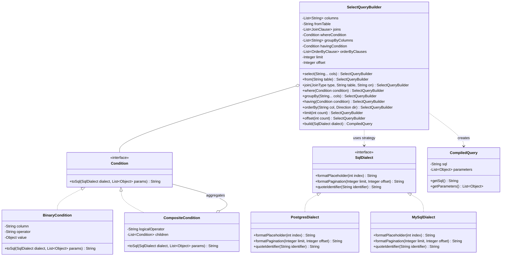
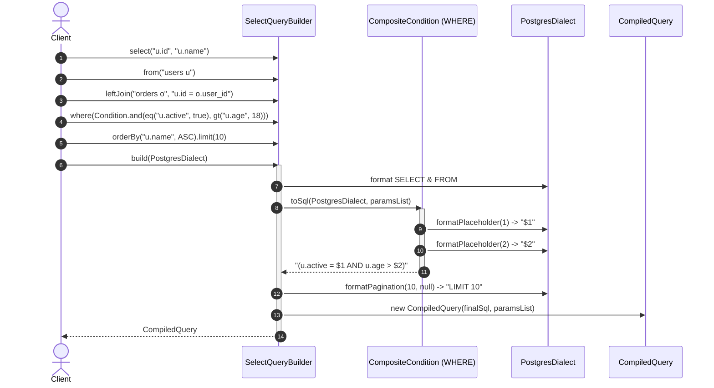

# Design a Database Query Builder

## 1. Problem Statement
Design a type-safe, fluent SQL Query Builder supporting:
- Expressive method chaining for `SELECT`, `FROM`, `JOIN`, `WHERE`, `GROUP BY`, `HAVING`, `ORDER BY`, and pagination (`LIMIT`/`OFFSET`).
- A **Composite Expression Tree** for arbitrarily nested logical conditions (`(a = 1 AND b = 2) OR (c = 3)`).
- Safe, parameterized query compilation preventing SQL injection attacks.
- Multi-dialect SQL rendering via the **Strategy Pattern** (e.g., PostgreSQL `$1, $2` vs. MySQL/SQLite `?` parameter syntax).
- Immutability of compiled query objects ensuring safe concurrent execution.

---

## 2. Architecture & Class Diagram



---

## 3. Dynamic Sequence Diagram (Fluent Query Construction & Dialect Compilation)



---

## 4. Implementation

### Python 3

```python
from abc import ABC, abstractmethod
from typing import List, Optional, Tuple, Any

# -------------------------------------------------------------
# Dialect Strategy
# -------------------------------------------------------------
class SqlDialect(ABC):
    @abstractmethod
    def placeholder(self, index: int) -> str:
        pass

    @abstractmethod
    def pagination(self, limit: Optional[int], offset: Optional[int]) -> str:
        pass

class PostgresDialect(SqlDialect):
    def placeholder(self, index: int) -> str:
        return f"${index}"

    def pagination(self, limit: Optional[int], offset: Optional[int]) -> str:
        parts = []
        if limit is not None:
            parts.append(f"LIMIT {limit}")
        if offset is not None:
            parts.append(f"OFFSET {offset}")
        return " ".join(parts)

class MySqlDialect(SqlDialect):
    def placeholder(self, index: int) -> str:
        return "?"

    def pagination(self, limit: Optional[int], offset: Optional[int]) -> str:
        if limit is not None and offset is not None:
            return f"LIMIT {offset}, {limit}"
        elif limit is not None:
            return f"LIMIT {limit}"
        return ""

# -------------------------------------------------------------
# Composite Conditions
# -------------------------------------------------------------
class Condition(ABC):
    @abstractmethod
    def to_sql(self, dialect: SqlDialect, params: List[Any]) -> str:
        pass

    def __and__(self, other: 'Condition') -> 'Condition':
        return CompositeCondition("AND", [self, other])

    def __or__(self, other: 'Condition') -> 'Condition':
        return CompositeCondition("OR", [self, other])

class BinaryCondition(Condition):
    def __init__(self, column: str, operator: str, value: Any):
        self.column = column
        self.operator = operator
        self.value = value

    def to_sql(self, dialect: SqlDialect, params: List[Any]) -> str:
        params.append(self.value)
        return f"{self.column} {self.operator} {dialect.placeholder(len(params))}"

class CompositeCondition(Condition):
    def __init__(self, logical_op: str, conditions: List[Condition]):
        self.logical_op = logical_op
        self.conditions = conditions

    def to_sql(self, dialect: SqlDialect, params: List[Any]) -> str:
        rendered = [c.to_sql(dialect, params) for c in self.conditions if c]
        if not rendered:
            return ""
        if len(rendered) == 1:
            return rendered[0]
        joined = f" {self.logical_op} ".join(rendered)
        return f"({joined})"

# Convenience Condition helpers
def eq(col: str, val: Any) -> Condition: return BinaryCondition(col, "=", val)
def gt(col: str, val: Any) -> Condition: return BinaryCondition(col, ">", val)
def lt(col: str, val: Any) -> Condition: return BinaryCondition(col, "<", val)

# -------------------------------------------------------------
# Query Builder
# -------------------------------------------------------------
class SelectQueryBuilder:
    def __init__(self):
        self._select_cols: List[str] = ["*"]
        self._from_table: str = ""
        self._joins: List[str] = []
        self._where: Optional[Condition] = None
        self._group_by: List[str] = []
        self._order_by: List[str] = []
        self._limit: Optional[int] = None
        self._offset: Optional[int] = None

    def select(self, *columns: str) -> 'SelectQueryBuilder':
        self._select_cols = list(columns)
        return self

    def from_table(self, table: str) -> 'SelectQueryBuilder':
        self._from_table = table
        return self

    def join(self, table: str, on: str, join_type: str = "INNER") -> 'SelectQueryBuilder':
        self._joins.append(f"{join_type} JOIN {table} ON {on}")
        return self

    def left_join(self, table: str, on: str) -> 'SelectQueryBuilder':
        return self.join(table, on, "LEFT")

    def where(self, condition: Condition) -> 'SelectQueryBuilder':
        self._where = condition if self._where is None else (self._where & condition)
        return self

    def group_by(self, *columns: str) -> 'SelectQueryBuilder':
        self._group_by.extend(columns)
        return self

    def order_by(self, column: str, direction: str = "ASC") -> 'SelectQueryBuilder':
        self._order_by.append(f"{column} {direction.upper()}")
        return self

    def limit(self, count: int) -> 'SelectQueryBuilder':
        self._limit = count
        return self

    def offset(self, count: int) -> 'SelectQueryBuilder':
        self._offset = count
        return self

    def build(self, dialect: Optional[SqlDialect] = None) -> Tuple[str, List[Any]]:
        dialect = dialect or PostgresDialect()
        params: List[Any] = []
        parts = [f"SELECT {', '.join(self._select_cols)}", f"FROM {self._from_table}"]

        for j in self._joins:
            parts.append(j)

        if self._where:
            where_sql = self._where.to_sql(dialect, params)
            if where_sql:
                parts.append(f"WHERE {where_sql}")

        if self._group_by:
            parts.append(f"GROUP BY {', '.join(self._group_by)}")

        if self._order_by:
            parts.append(f"ORDER BY {', '.join(self._order_by)}")

        pagination = dialect.pagination(self._limit, self._offset)
        if pagination:
            parts.append(pagination)

        return "\n".join(parts), params

if __name__ == "__main__":
    builder = (SelectQueryBuilder()
        .select("u.id", "u.email", "COUNT(o.id) as order_count")
        .from_table("users u")
        .left_join("orders o", "u.id = o.user_id")
        .where((eq("u.status", "ACTIVE") & gt("u.age", 21)) | eq("u.is_admin", True))
        .group_by("u.id", "u.email")
        .order_by("order_count", "DESC")
        .limit(20)
        .offset(40))

    pg_sql, pg_params = builder.build(PostgresDialect())
    print("--- Postgres Output ---")
    print(pg_sql)
    print(f"Bound Params: {pg_params}\n")

    mysql_sql, mysql_params = builder.build(MySqlDialect())
    print("--- MySQL Output ---")
    print(mysql_sql)
    print(f"Bound Params: {mysql_params}")
```

---

### Java (Production-Grade with Type Safety & Dialects)

```java
package com.system.lld.querybuilder;

import java.util.*;

public class QueryBuilderSystem {

    // -------------------------------------------------------------
    // SQL Dialect Strategy
    // -------------------------------------------------------------
    public interface SqlDialect {
        String formatPlaceholder(int paramIndex);
        String formatPagination(Integer limit, Integer offset);
        String quote(String identifier);
    }

    public static class PostgresDialect implements SqlDialect {
        @Override
        public String formatPlaceholder(int paramIndex) {
            return "$" + paramIndex;
        }

        @Override
        public String formatPagination(Integer limit, Integer offset) {
            StringBuilder sb = new StringBuilder();
            if (limit != null) sb.append("LIMIT ").append(limit);
            if (offset != null) {
                if (sb.length() > 0) sb.append(" ");
                sb.append("OFFSET ").append(offset);
            }
            return sb.toString();
        }

        @Override
        public String quote(String identifier) {
            return "\"" + identifier + "\"";
        }
    }

    public static class MySqlDialect implements SqlDialect {
        @Override
        public String formatPlaceholder(int paramIndex) {
            return "?";
        }

        @Override
        public String formatPagination(Integer limit, Integer offset) {
            if (limit != null && offset != null) {
                return "LIMIT " + offset + ", " + limit;
            } else if (limit != null) {
                return "LIMIT " + limit;
            }
            return "";
        }

        @Override
        public String quote(String identifier) {
            return "`" + identifier + "`";
        }
    }

    // -------------------------------------------------------------
    // Immutable Compiled Query Result
    // -------------------------------------------------------------
    public static class CompiledQuery {
        private final String sql;
        private final List<Object> parameters;

        public CompiledQuery(String sql, List<Object> parameters) {
            this.sql = sql;
            this.parameters = Collections.unmodifiableList(new ArrayList<>(parameters));
        }

        public String getSql() { return sql; }
        public List<Object> getParameters() { return parameters; }

        @Override
        public String toString() {
            return "SQL:\n" + sql + "\nParameters: " + parameters;
        }
    }

    // -------------------------------------------------------------
    // Composite Condition Tree
    // -------------------------------------------------------------
    public interface Condition {
        String toSql(SqlDialect dialect, List<Object> params);

        default Condition and(Condition other) {
            return new CompositeCondition("AND", Arrays.asList(this, other));
        }

        default Condition or(Condition other) {
            return new CompositeCondition("OR", Arrays.asList(this, other));
        }
    }

    public static class BinaryCondition implements Condition {
        private final String column;
        private final String operator;
        private final Object value;

        public BinaryCondition(String column, String operator, Object value) {
            this.column = Objects.requireNonNull(column);
            this.operator = Objects.requireNonNull(operator);
            this.value = value;
        }

        @Override
        public String toSql(SqlDialect dialect, List<Object> params) {
            params.add(value);
            return column + " " + operator + " " + dialect.formatPlaceholder(params.size());
        }
    }

    public static class CompositeCondition implements Condition {
        private final String logicalOperator;
        private final List<Condition> children;

        public CompositeCondition(String logicalOperator, List<Condition> children) {
            this.logicalOperator = logicalOperator;
            this.children = new ArrayList<>(children);
        }

        @Override
        public String toSql(SqlDialect dialect, List<Object> params) {
            List<String> rendered = new ArrayList<>();
            for (Condition child : children) {
                if (child != null) {
                    rendered.add(child.toSql(dialect, params));
                }
            }
            if (rendered.isEmpty()) return "";
            if (rendered.size() == 1) return rendered.get(0);
            return "(" + String.join(" " + logicalOperator + " ", rendered) + ")";
        }
    }

    // Static DSL Factory methods
    public static Condition eq(String col, Object val) { return new BinaryCondition(col, "=", val); }
    public static Condition gt(String col, Object val) { return new BinaryCondition(col, ">", val); }
    public static Condition lt(String col, Object val) { return new BinaryCondition(col, "<", val); }
    public static Condition in(String col, List<Object> values) {
        return (dialect, params) -> {
            List<String> placeholders = new ArrayList<>();
            for (Object v : values) {
                params.add(v);
                placeholders.add(dialect.formatPlaceholder(params.size()));
            }
            return col + " IN (" + String.join(", ", placeholders) + ")";
        };
    }

    // -------------------------------------------------------------
    // Select Query Builder
    // -------------------------------------------------------------
    public static class SelectQueryBuilder {
        private final List<String> selectColumns = new ArrayList<>();
        private String fromTable;
        private final List<String> joins = new ArrayList<>();
        private Condition whereCondition;
        private final List<String> groupByColumns = new ArrayList<>();
        private Condition havingCondition;
        private final List<String> orderByClauses = new ArrayList<>();
        private Integer limit;
        private Integer offset;

        public SelectQueryBuilder select(String... columns) {
            Collections.addAll(selectColumns, columns);
            return this;
        }

        public SelectQueryBuilder from(String table) {
            this.fromTable = table;
            return this;
        }

        public SelectQueryBuilder join(String table, String onCondition) {
            joins.add("INNER JOIN " + table + " ON " + onCondition);
            return this;
        }

        public SelectQueryBuilder leftJoin(String table, String onCondition) {
            joins.add("LEFT JOIN " + table + " ON " + onCondition);
            return this;
        }

        public SelectQueryBuilder where(Condition condition) {
            this.whereCondition = (this.whereCondition == null) ? condition : this.whereCondition.and(condition);
            return this;
        }

        public SelectQueryBuilder groupBy(String... columns) {
            Collections.addAll(groupByColumns, columns);
            return this;
        }

        public SelectQueryBuilder having(Condition condition) {
            this.havingCondition = (this.havingCondition == null) ? condition : this.havingCondition.and(condition);
            return this;
        }

        public SelectQueryBuilder orderBy(String column, String direction) {
            orderByClauses.add(column + " " + direction.toUpperCase());
            return this;
        }

        public SelectQueryBuilder limit(int limit) {
            this.limit = limit;
            return this;
        }

        public SelectQueryBuilder offset(int offset) {
            this.offset = offset;
            return this;
        }

        public CompiledQuery build(SqlDialect dialect) {
            if (fromTable == null || fromTable.trim().isEmpty()) {
                throw new IllegalStateException("FROM table must be specified");
            }

            List<Object> params = new ArrayList<>();
            StringBuilder sql = new StringBuilder();

            // SELECT
            sql.append("SELECT ");
            if (selectColumns.isEmpty()) {
                sql.append("*");
            } else {
                sql.append(String.join(", ", selectColumns));
            }

            // FROM
            sql.append("\nFROM ").append(fromTable);

            // JOINS
            for (String join : joins) {
                sql.append("\n").append(join);
            }

            // WHERE
            if (whereCondition != null) {
                String whereSql = whereCondition.toSql(dialect, params);
                if (!whereSql.isEmpty()) {
                    sql.append("\nWHERE ").append(whereSql);
                }
            }

            // GROUP BY
            if (!groupByColumns.isEmpty()) {
                sql.append("\nGROUP BY ").append(String.join(", ", groupByColumns));
            }

            // HAVING
            if (havingCondition != null) {
                String havingSql = havingCondition.toSql(dialect, params);
                if (!havingSql.isEmpty()) {
                    sql.append("\nHAVING ").append(havingSql);
                }
            }

            // ORDER BY
            if (!orderByClauses.isEmpty()) {
                sql.append("\nORDER BY ").append(String.join(", ", orderByClauses));
            }

            // PAGINATION
            String pagination = dialect.formatPagination(limit, offset);
            if (!pagination.isEmpty()) {
                sql.append("\n").append(pagination);
            }

            return new CompiledQuery(sql.toString(), params);
        }
    }

    // -------------------------------------------------------------
    // Demo Execution
    // -------------------------------------------------------------
    public static void main(String[] args) {
        SelectQueryBuilder qb = new SelectQueryBuilder()
                .select("u.id", "u.name", "u.email", "COUNT(o.id) AS total_orders")
                .from("users u")
                .leftJoin("orders o", "u.id = o.user_id")
                .where(eq("u.status", "ACTIVE")
                        .and(gt("u.age", 18).or(eq("u.is_vip", true))))
                .groupBy("u.id", "u.name", "u.email")
                .having(gt("COUNT(o.id)", 5))
                .orderBy("total_orders", "DESC")
                .limit(10)
                .offset(20);

        System.out.println("=== PostgreSQL Query Compilation ===");
        CompiledQuery pgQuery = qb.build(new PostgresDialect());
        System.out.println(pgQuery);

        System.out.println("\n=== MySQL Query Compilation ===");
        CompiledQuery mySqlQuery = qb.build(new MySqlDialect());
        System.out.println(mySqlQuery);
    }
}
```

---

## 5. Thread Safety Considerations

| Component / Phase | Mechanism | Concurrency Concern & Mitigation |
| :--- | :--- | :--- |
| **Builder Chaining** | Thread-confined / Stack-allocated | `SelectQueryBuilder` is intentionally mutable for fluent composition. Instances should be created per-request and confined to a single thread. |
| **AST Compilation** | Fresh Parameter Accumulator | Calling `build(dialect)` initializes a local `new ArrayList<Object>()` on each call, ensuring idempotent builds even if invoked multiple times. |
| **Compiled Query Result** | `Collections.unmodifiableList` & immutable String | The resulting `CompiledQuery` is strictly immutable and can be safely shared, cached, or passed across arbitrary worker threads. |
| **Dialect Singletons** | Stateless Strategy classes | `PostgresDialect` and `MySqlDialect` contain no mutable instance state and can be safely instantiated as shared static singletons. |

---

## 6. Extensibility & SOLID Principles

| Principle | Adherence in This Design |
| :--- | :--- |
| **Single Responsibility (SRP)** | `SelectQueryBuilder` accumulates query clauses; `Condition` compiles boolean expressions; `SqlDialect` formats dialect tokens; `CompiledQuery` holds results. |
| **Open/Closed (OCP)** | New SQL dialects (Oracle, MS SQL Server, Presto) and new expressions (`BETWEEN`, `EXISTS`, subqueries) are added without touching existing builder methods. |
| **Liskov Substitution (LSP)** | `BinaryCondition`, `CompositeCondition`, and custom conditions seamlessly substitute for any `Condition` node in the expression tree. |
| **Interface Segregation (ISP)** | Clean, minimal interfaces (`SqlDialect`, `Condition`) prevent unnecessary bloat in consumer and dialect implementations. |
| **Dependency Inversion (DIP)** | The query builder depends on the `SqlDialect` and `Condition` abstractions rather than hardcoding vendor SQL strings or concrete classes. |

---

## 7. Design Patterns Used
- **Builder Pattern**: Provides a fluent, intuitive API for constructing complex, multi-clause SQL queries step-by-step.
- **Composite Pattern**: Structures nested boolean logic (`AND`/`OR`) as a recursive condition tree that evaluates uniformly.
- **Strategy Pattern**: Abstracts vendor SQL variations (`SqlDialect`) for parameter placeholders (`$n` vs `?`) and pagination semantics.
- **Factory Method**: Static helper functions (`eq()`, `gt()`, `in()`) create concrete condition instances cleanly.

---

## 8. Real-World Follow-Up Interview Questions

1. **How does this design protect against SQL injection attacks?**
   - User inputs are never concatenated directly into the SQL string. Values are added to a parameterized `List<Object>` and replaced with positional placeholders (`$1`, `?`), allowing `PreparedStatement` binding at execution time.
2. **How would you support subqueries (e.g., `WHERE u.id IN (SELECT user_id FROM banned_users)`)?**
   - Create a `SubqueryCondition` class implementing `Condition` that accepts another `SelectQueryBuilder` instance and recursively compiles its nested SQL and parameters.
3. **How do you handle schema-level type safety and compile-time column checking?**
   - Use code generation (like JOOQ or JPA Criteria API / metamodel generators) where table columns are represented as strongly-typed objects (`USER.EMAIL.eq("...")`) instead of raw strings.
4. **How would you extend this builder to support INSERT, UPDATE, and DELETE statements?**
   - Introduce an overarching `QueryBuilder` interface or dedicated `InsertQueryBuilder`, `UpdateQueryBuilder`, and `DeleteQueryBuilder` classes sharing common clause building blocks (`WhereClause`, `SqlDialect`).

---
**Related:** [[03 - Decorator Pattern]] | [[01 - Strategy Pattern]] | [[Design a Database Connection Pool]]

