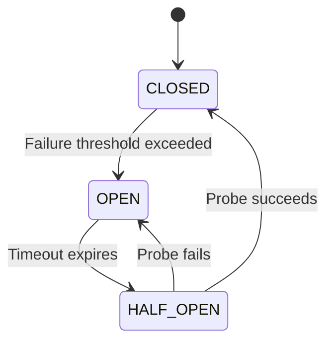

# Design a Circuit Breaker

## 1. Problem Statement
Design a circuit breaker pattern implementation for handling failures in distributed systems with automatic recovery.

## 2. State Machine



## 3. Key Implementation (Python)

```python
import time, threading
from enum import Enum
from typing import Callable, Any, Optional
from functools import wraps

class CircuitState(Enum):
    CLOSED = "CLOSED"      # Normal — requests flow through
    OPEN = "OPEN"          # Tripped — requests fail fast
    HALF_OPEN = "HALF_OPEN" # Testing — allow one request

class CircuitBreakerError(Exception):
    pass

class CircuitBreaker:
    def __init__(self, failure_threshold: int = 5,
                 recovery_timeout: float = 30.0,
                 success_threshold: int = 3):
        self.failure_threshold = failure_threshold
        self.recovery_timeout = recovery_timeout
        self.success_threshold = success_threshold

        self._state = CircuitState.CLOSED
        self._failure_count = 0
        self._success_count = 0
        self._last_failure_time: Optional[float] = None
        self._lock = threading.Lock()

    @property
    def state(self) -> CircuitState:
        if self._state == CircuitState.OPEN:
            if time.time() - self._last_failure_time >= self.recovery_timeout:
                self._state = CircuitState.HALF_OPEN
                self._success_count = 0
        return self._state

    def call(self, func: Callable, *args, **kwargs) -> Any:
        with self._lock:
            current_state = self.state

            if current_state == CircuitState.OPEN:
                raise CircuitBreakerError(
                    f"Circuit is OPEN. Retry after {self.recovery_timeout}s")

        try:
            result = func(*args, **kwargs)
            self._on_success()
            return result
        except Exception as e:
            self._on_failure()
            raise

    def _on_success(self):
        with self._lock:
            self._failure_count = 0
            if self._state == CircuitState.HALF_OPEN:
                self._success_count += 1
                if self._success_count >= self.success_threshold:
                    self._state = CircuitState.CLOSED
                    print("✅ Circuit CLOSED — service recovered")

    def _on_failure(self):
        with self._lock:
            self._failure_count += 1
            self._last_failure_time = time.time()
            if self._state == CircuitState.HALF_OPEN:
                self._state = CircuitState.OPEN
                print("❌ Circuit OPEN — probe failed")
            elif self._failure_count >= self.failure_threshold:
                self._state = CircuitState.OPEN
                print(f"❌ Circuit OPEN — {self._failure_count} failures")

# ──── Decorator usage ────

def circuit_breaker(failure_threshold=5, recovery_timeout=30):
    cb = CircuitBreaker(failure_threshold, recovery_timeout)
    def decorator(func):
        @wraps(func)
        def wrapper(*args, **kwargs):
            return cb.call(func, *args, **kwargs)
        wrapper.circuit_breaker = cb
        return wrapper
    return decorator

@circuit_breaker(failure_threshold=3, recovery_timeout=10)
def call_external_service():
    import random
    if random.random() < 0.7:
        raise ConnectionError("Service unavailable")
    return "Success!"

if __name__ == "__main__":
    for i in range(10):
        try:
            result = call_external_service()
            print(f"  Attempt {i+1}: {result}")
        except CircuitBreakerError as e:
            print(f"  Attempt {i+1}: FAST FAIL — {e}")
        except ConnectionError:
            print(f"  Attempt {i+1}: Service error (counted)")
        time.sleep(1)
```

## 4. Configuration Parameters
| Parameter | Description | Typical Value |
|-----------|------------|---------------|
| `failure_threshold` | Failures before tripping | 5 |
| `recovery_timeout` | Seconds before trying again | 30s |
| `success_threshold` | Successes in HALF_OPEN to close | 3 |
| `monitoring_window` | Time window for counting failures | 60s |

## 5. Patterns: **State** (CLOSED → OPEN → HALF_OPEN) | **Proxy** (wraps service calls) | **Decorator** (Python decorator syntax)

## 6. Real-World: Netflix Hystrix, resilience4j, Python `pybreaker`, Spring Cloud Circuit Breaker.

## 7. Follow-ups: **Bulkhead?** Isolate thread pools per service | **Fallback?** Default response when circuit open | **Metrics?** Track failure rate, latency percentiles.

---
**Related:** [[13 - State Pattern]] | [[14 - Proxy Pattern]] | [[03 - Decorator Pattern]]
