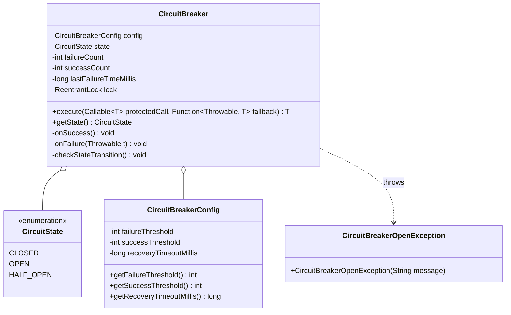
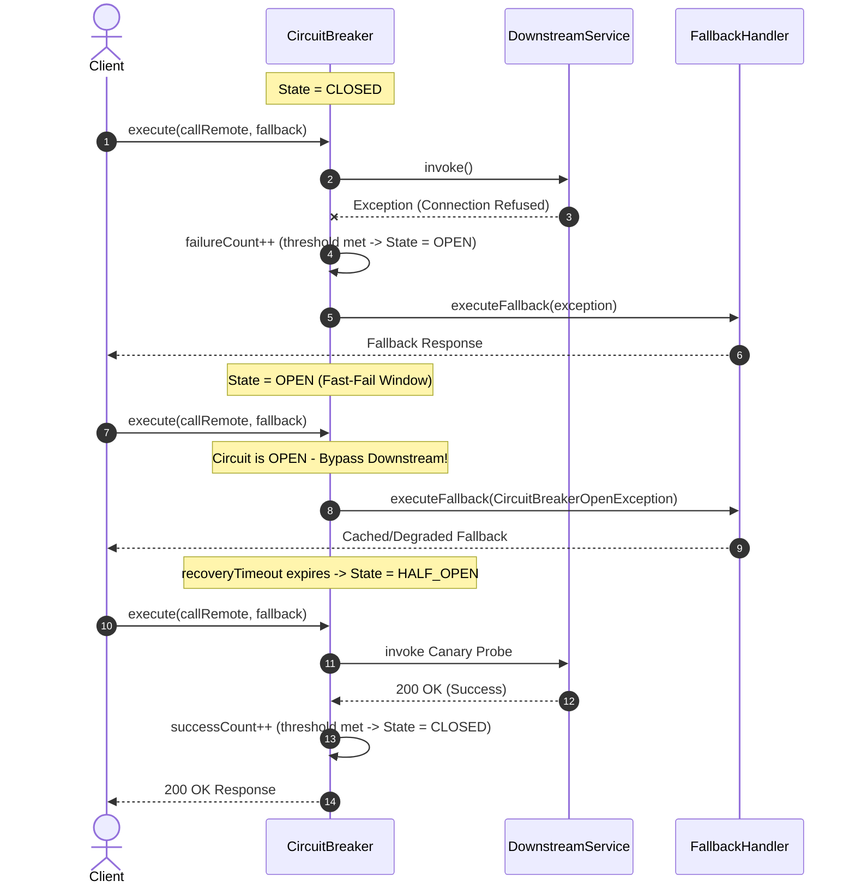
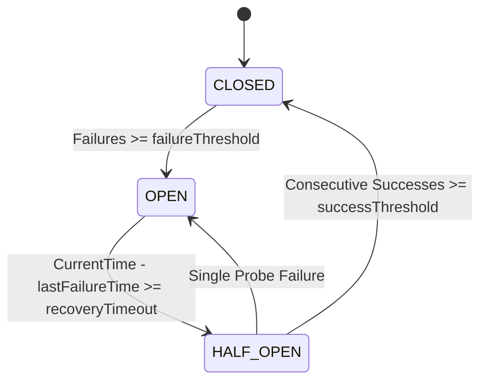

# Design a Circuit Breaker

## 1. Problem Statement
Design an in-process Circuit Breaker for distributed systems to prevent cascading service failures, featuring:
- **Three Core States**: `CLOSED` (normal traffic flow), `OPEN` (fast-fail without calling downstream), and `HALF_OPEN` (controlled canary probes).
- Configurable failure threshold, recovery timeout, and consecutive success threshold for full recovery.
- Fallback execution support when calls fail or the circuit is tripped.
- High-concurrency thread safety preventing race conditions during state transitions.

---

## 2. Architecture & Class Diagram



---

## 3. Dynamic Sequence Diagram (State Transitions & Fast-Fail)



---

## 4. State Machine Transition



---

## 5. Implementation

### Python 3

```python
import time
import threading
from enum import Enum
from typing import Callable, Any, Optional
from functools import wraps

class CircuitState(Enum):
    CLOSED = "CLOSED"        # Normal — requests flow through
    OPEN = "OPEN"            # Tripped — requests fail fast
    HALF_OPEN = "HALF_OPEN"  # Testing — allow probe requests

class CircuitBreakerOpenException(Exception):
    """Raised when an operation is attempted while circuit is open."""
    pass

class CircuitBreaker:
    def __init__(self, failure_threshold: int = 3,
                 recovery_timeout: float = 5.0,
                 success_threshold: int = 2):
        self.failure_threshold = failure_threshold
        self.recovery_timeout = recovery_timeout
        self.success_threshold = success_threshold

        self._state = CircuitState.CLOSED
        self._failure_count = 0
        self._success_count = 0
        self._last_failure_time: Optional[float] = None
        self._lock = threading.RLock()

    @property
    def state(self) -> CircuitState:
        with self._lock:
            if self._state == CircuitState.OPEN:
                if self._last_failure_time and (time.time() - self._last_failure_time >= self.recovery_timeout):
                    self._state = CircuitState.HALF_OPEN
                    self._success_count = 0
            return self._state

    def call(self, func: Callable, *args, fallback: Optional[Callable[[Exception], Any]] = None, **kwargs) -> Any:
        with self._lock:
            current_state = self.state
            if current_state == CircuitState.OPEN:
                ex = CircuitBreakerOpenException(f"Circuit is OPEN. Fast-failing; retry after {self.recovery_timeout}s")
                if fallback:
                    return fallback(ex)
                raise ex

        try:
            result = func(*args, **kwargs)
            self._on_success()
            return result
        except Exception as e:
            self._on_failure()
            if fallback:
                return fallback(e)
            raise

    def _on_success(self):
        with self._lock:
            self._failure_count = 0
            if self._state == CircuitState.HALF_OPEN:
                self._success_count += 1
                if self._success_count >= self.success_threshold:
                    self._state = CircuitState.CLOSED
                    print("✅ [CircuitBreaker] Circuit transitioned to CLOSED — service healthy")

    def _on_failure(self):
        with self._lock:
            self._failure_count += 1
            self._last_failure_time = time.time()
            if self._state == CircuitState.HALF_OPEN:
                self._state = CircuitState.OPEN
                print("❌ [CircuitBreaker] Probe failed. Circuit back to OPEN")
            elif self._failure_count >= self.failure_threshold:
                self._state = CircuitState.OPEN
                print(f"❌ [CircuitBreaker] Failure threshold reached ({self._failure_count}). Circuit tripped to OPEN")

# Decorator pattern
def circuit_breaker(failure_threshold=3, recovery_timeout=2.0, success_threshold=2):
    cb = CircuitBreaker(failure_threshold, recovery_timeout, success_threshold)
    def decorator(func):
        @wraps(func)
        def wrapper(*args, **kwargs):
            return cb.call(func, *args, **kwargs)
        wrapper.circuit_breaker = cb
        return wrapper
    return decorator

if __name__ == "__main__":
    import random

    cb = CircuitBreaker(failure_threshold=3, recovery_timeout=1.0, success_threshold=2)

    def flaky_service(call_id: int):
        if call_id <= 4:
            raise ConnectionError("Remote database unreachable")
        return f"Response payload for call #{call_id}"

    def fallback_handler(ex: Exception):
        return f"Degraded cached response (Reason: {type(ex).__name__})"

    for i in range(1, 9):
        res = cb.call(flaky_service, i, fallback=fallback_handler)
        print(f"Call #{i} -> State: {cb.state.value} | Result: {res}")
        time.sleep(0.4)
```

---

### Java (Production-Grade with Concurrency & Fallbacks)

```java
package com.system.lld.circuitbreaker;

import java.util.Objects;
import java.util.concurrent.Callable;
import java.util.concurrent.TimeUnit;
import java.util.concurrent.locks.ReentrantLock;
import java.util.function.Function;

public class CircuitBreakerSystem {

    public enum CircuitState {
        CLOSED,
        OPEN,
        HALF_OPEN
    }

    public static class CircuitBreakerOpenException extends RuntimeException {
        public CircuitBreakerOpenException(String message) {
            super(message);
        }
    }

    // -------------------------------------------------------------
    // Immutable Configuration
    // -------------------------------------------------------------
    public static class CircuitBreakerConfig {
        private final int failureThreshold;
        private final int successThreshold;
        private final long recoveryTimeoutMillis;

        public CircuitBreakerConfig(int failureThreshold, int successThreshold, long recoveryTimeoutMillis) {
            this.failureThreshold = failureThreshold;
            this.successThreshold = successThreshold;
            this.recoveryTimeoutMillis = recoveryTimeoutMillis;
        }

        public int getFailureThreshold() { return failureThreshold; }
        public int getSuccessThreshold() { return successThreshold; }
        public long getRecoveryTimeoutMillis() { return recoveryTimeoutMillis; }
    }

    // -------------------------------------------------------------
    // Core Circuit Breaker
    // -------------------------------------------------------------
    public static class CircuitBreaker {
        private final CircuitBreakerConfig config;
        private final ReentrantLock lock = new ReentrantLock();

        private CircuitState state = CircuitState.CLOSED;
        private int failureCount = 0;
        private int successCount = 0;
        private long lastFailureTimeMillis = 0;

        public CircuitBreaker(CircuitBreakerConfig config) {
            this.config = Objects.requireNonNull(config);
        }

        public CircuitState getState() {
            lock.lock();
            try {
                checkStateTransition();
                return state;
            } finally {
                lock.unlock();
            }
        }

        /**
         * Executes the protected supplier call with an optional fallback.
         */
        public <T> T execute(Callable<T> protectedCall, Function<Throwable, T> fallback) throws Exception {
            lock.lock();
            try {
                checkStateTransition();
                if (state == CircuitState.OPEN) {
                    CircuitBreakerOpenException openEx = new CircuitBreakerOpenException(
                            "Circuit is OPEN. Fast-failing downstream call.");
                    if (fallback != null) {
                        return fallback.apply(openEx);
                    }
                    throw openEx;
                }
            } finally {
                lock.unlock();
            }

            try {
                T result = protectedCall.call();
                onSuccess();
                return result;
            } catch (Throwable t) {
                onFailure();
                if (fallback != null) {
                    return fallback.apply(t);
                }
                if (t instanceof Exception) {
                    throw (Exception) t;
                }
                throw new RuntimeException(t);
            }
        }

        private void checkStateTransition() {
            if (state == CircuitState.OPEN) {
                long elapsed = System.currentTimeMillis() - lastFailureTimeMillis;
                if (elapsed >= config.getRecoveryTimeoutMillis()) {
                    state = CircuitState.HALF_OPEN;
                    successCount = 0;
                    System.out.println("🟡 [CircuitBreaker] Timeout expired -> State transitioned to HALF_OPEN");
                }
            }
        }

        private void onSuccess() {
            lock.lock();
            try {
                failureCount = 0;
                if (state == CircuitState.HALF_OPEN) {
                    successCount++;
                    if (successCount >= config.getSuccessThreshold()) {
                        state = CircuitState.CLOSED;
                        System.out.println("✅ [CircuitBreaker] Canary probes succeeded -> State transitioned to CLOSED");
                    }
                }
            } finally {
                lock.unlock();
            }
        }

        private void onFailure() {
            lock.lock();
            try {
                failureCount++;
                lastFailureTimeMillis = System.currentTimeMillis();

                if (state == CircuitState.HALF_OPEN) {
                    state = CircuitState.OPEN;
                    System.out.println("❌ [CircuitBreaker] Canary probe failed -> State transitioned to OPEN");
                } else if (failureCount >= config.getFailureThreshold()) {
                    state = CircuitState.OPEN;
                    System.out.println("❌ [CircuitBreaker] Failure threshold reached (" + failureCount + ") -> State transitioned to OPEN");
                }
            } finally {
                lock.unlock();
            }
        }
    }

    // -------------------------------------------------------------
    // Demo Execution
    // -------------------------------------------------------------
    public static void main(String[] args) throws Exception {
        CircuitBreakerConfig config = new CircuitBreakerConfig(3, 2, 1000);
        CircuitBreaker cb = new CircuitBreaker(config);

        Callable<String> failingService = () -> {
            throw new RuntimeException("503 Service Unavailable");
        };

        Callable<String> healthyService = () -> "200 OK: Data processed successfully";

        Function<Throwable, String> fallback = t -> "Fallback: Cached Response (Error: " + t.getClass().getSimpleName() + ")";

        System.out.println("=== Phase 1: Triggering Failures until Circuit Trips ===");
        for (int i = 1; i <= 4; i++) {
            String res = cb.execute(failingService, fallback);
            System.out.println("Request #" + i + " [State: " + cb.getState() + "] -> " + res);
        }

        System.out.println("\n=== Phase 2: Instant Fast-Fail in OPEN state ===");
        String fastFailResult = cb.execute(failingService, fallback);
        System.out.println("Fast-fail call [State: " + cb.getState() + "] -> " + fastFailResult);

        System.out.println("\n=== Phase 3: Waiting for Recovery Timeout (1200ms) ===");
        Thread.sleep(1200);

        System.out.println("\n=== Phase 4: Probing in HALF_OPEN state with Healthy Service ===");
        for (int i = 1; i <= 2; i++) {
            String probeResult = cb.execute(healthyService, fallback);
            System.out.println("Probe #" + i + " [State: " + cb.getState() + "] -> " + probeResult);
        }

        System.out.println("\nFinal Circuit State: " + cb.getState());
    }
}
```

---

## 6. Configuration Parameters

| Parameter | Description | Typical Value |
| :--- | :--- | :--- |
| `failureThreshold` | Number of consecutive failures before tripping from `CLOSED` to `OPEN` | 5 |
| `recoveryTimeoutMillis` | Milliseconds to wait before transitioning from `OPEN` to `HALF_OPEN` canary mode | 10,000 – 30,000 ms |
| `successThreshold` | Number of consecutive canary probe successes to transition from `HALF_OPEN` to `CLOSED` | 2 – 3 |
| `slidingWindowType` | Count-based or time-based window for calculating error percentage | Time-window (e.g. 60s) |
| `slowCallDurationThreshold` | Execution duration threshold after which a call is marked as slow | 2,000 ms |

---

## 7. Thread Safety Considerations

| Component / Action | Mechanism | Concurrency Concern & Mitigation |
| :--- | :--- | :--- |
| **State Inspection & Transitions** | `ReentrantLock` | Coordinates reading timestamps and updating `state`, `failureCount`, and `successCount` atomically without race conditions. |
| **Bypassing Downstream (Fast-Fail)** | Early check inside lock | Guarantees downstream remote calls are aborted immediately without consuming network sockets or thread pool threads when `OPEN`. |
| **Half-Open Concurrency Limit** | Controlled execution | Prevents stampeding herd where thousands of concurrent threads overwhelm the recovering downstream during `HALF_OPEN`. |
| **Configuration Immutability** | `final` fields in `CircuitBreakerConfig` | Eliminates memory visibility bugs across concurrent worker threads without synchronization overhead. |

---

## 8. Extensibility & SOLID Principles

| Principle | Adherence in This Design |
| :--- | :--- |
| **Single Responsibility (SRP)** | `CircuitBreaker` manages state and failure counting; `CircuitBreakerConfig` holds immutable thresholds; `fallback` lambda supplies recovery logic. |
| **Open/Closed (OCP)** | Custom metrics registries (Prometheus, Micrometer) or event listeners can be hooked without modifying internal state machine logic. |
| **Liskov Substitution (LSP)** | Abstracting `CircuitBreaker` into an interface allows substituting in-memory implementations with distributed Redis-backed breakers. |
| **Interface Segregation (ISP)** | Execution contracts rely on standard Java functional interfaces (`Callable<T>`, `Function<Throwable, T>`). |
| **Dependency Inversion (DIP)** | Callers depend on protected closures and fallbacks rather than direct coupling to downstream client implementations. |

---

## 9. Design Patterns Used
- **State Pattern**: The Circuit Breaker transitions cleanly between `CLOSED`, `OPEN`, and `HALF_OPEN` states with distinct invocation rules.
- **Proxy / Decorator Pattern**: Wraps around dangerous remote operations to add resilience and telemetry transparently.
- **Fallback Pattern**: Provides graceful degradation instead of unhandled exceptions cascading upstream.

---

## 10. Real-World Follow-Up Interview Questions

1. **How do production libraries like Resilience4j and Netflix Hystrix compute failure thresholds?**
   - Instead of simple consecutive counters, production systems utilize a **Sliding Window** (count-based ring buffer or time-based bucketed ring buffer) to calculate failure rate percentages (e.g., trip when failure rate exceeds 50% over the last 100 requests).
2. **How does a Circuit Breaker interact with the Bulkhead Pattern?**
   - The Bulkhead pattern isolates resources (limiting thread pools or concurrent semaphores per downstream service). While the Bulkhead limits blast radius and prevents thread starvation, the Circuit Breaker trips to stop executing calls entirely.
3. **How do you implement a distributed Circuit Breaker across a cluster of 50 microservice pods?**
   - Local in-memory circuit breakers are generally preferred for performance (zero network overhead on the hot path). Alternatively, service pods report metrics to a Redis cluster or service mesh control plane (Envoy) which dynamically trips circuits globally.
4. **How do you handle half-open traffic spikes?**
   - In `HALF_OPEN`, only a fixed number of permits (canary calls, e.g., 1 to 3) are allowed through concurrently; all other incoming requests immediately fail fast or execute fallbacks until the probe results are recorded.

---
**Related:** [[13 - State Pattern]] | [[14 - Proxy Pattern]] | [[03 - Decorator Pattern]] | [[Design a Rate Limiter]]

