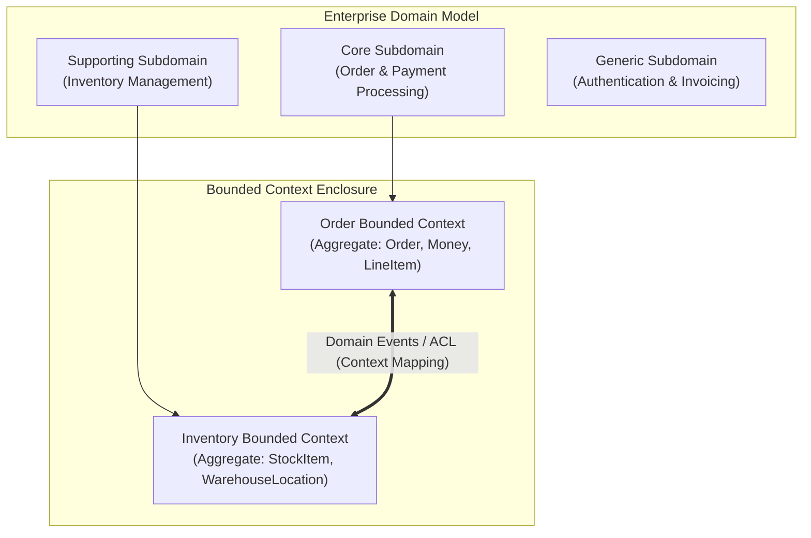

# Chapter 01: Decomposition, Bounded Contexts & Monolith Migration

> "If you do a big-bang rewrite, the only guarantee is big-bang failure. Microservices are not a goal in themselves; they are an organizational mechanism to allow multiple autonomous teams to deliver value rapidly without stepping on each other."  
> — *Sam Newman, Monolith to Microservices (O'Reilly)*
>
> "A bounded context is an explicit boundary within which a domain model exists. Inside the boundary, all terms in the ubiquitous language have a specific, unambiguous meaning."  
> — *Eric Evans, Domain-Driven Design: Tackling Complexity in the Heart of Software (Addison-Wesley)*
>
> "Organizations which design systems are constrained to produce designs which are copies of the communication structures of these organizations."  
> — *Melvin Conway, Conway's Law (1968)*

---

## 🧭 1. Foundational Architecture & The Decomposition Dilemma

Virtually every successful internet platform—from Netflix and Amazon to Uber and Twitter—began its existence as a **Monolith**: a single deployable artifact executing inside a unified runtime memory space, backed by a single relational database.

In the nascent stages of an enterprise, the monolith is strictly superior:
1. **Zero Network Latency:** Method invocations execute via CPU registers and memory pointers in nanoseconds ($< 10\text{ns}$).
2. **ACID Guarantees:** Cross-entity modifications execute inside a single local database transaction with atomic rollback.
3. **Operational Simplicity:** Single CI/CD pipeline, trivial local debugging, and centralized logs.

However, as headcount scales beyond 50–100 engineers across multiple teams, the monolith suffers organizational and architectural collapse:

```
===================================================================================================
                                  THE MONOLITH COLLAPSE THRESHOLD
===================================================================================================

    Deployment Queue Congestion          Coupled Scaling Bottleneck            Cognitive Overload
   +---------------------------+        +---------------------------+       +---------------------+
   | Team A (Payments) blocks  |        | ML Recommendations spike  |       | 2,000,000 LOC.      |
   | on Team B (Catalog) test  | -----> | CPU to 100%. Entire 64GB  | ----> | No single engineer  |
   | suite failure. Daily      |        | Monolith cluster must be  |       | can reason about    |
   | deployments drop to zero. |        | scaled up at 10x cost.    |       | system side effects.|
   +---------------------------+        +---------------------------+       +---------------------+
```

### 1.1 Conway's Law & The Inverse Conway Maneuver
Conway's Law dictates that system architecture mirrors team communication structures. Attempting to deploy 15 decentralized, autonomous product teams against a tightly coupled monolithic codebase creates constant merge conflicts, synchronization overhead, and organizational friction.

Under the **Inverse Conway Maneuver** (*Sam Newman, Building Microservices 2nd Ed*), leadership first defines desired architectural boundaries around business capabilities and then reorganizes engineering teams into cross-functional **"Two-Pizza Teams"** (6–8 engineers) dedicated to those specific boundaries.

---

## 🏛️ 2. Strategic Domain-Driven Design (DDD) & Bounded Contexts

Decomposing a system by technical layers (`Controllers`, `Services`, `Repositories`) creates a **Distributed Monolith**. True microservices decompose along **Domain Boundaries**.

```
===================================================================================================
                                STRATEGIC DDD CONTEXT TOPOLOGY
===================================================================================================

                                     [ Enterprise Domain ]
                                               │
                   +---------------------------+---------------------------+
                   v                                                       v
        [ Core Domain: Checkout ]                             [ Supporting: Notifications ]
        (Differentiator / High Value)                         (Commodity Utility Service)
                   │                                                       │
                   v                                                       v
        +--------------------------------------+              +----------------------------------+
        |        Order Bounded Context         |              |   Notification Bounded Context   |
        |  Ubiquitous Language:                |              |  Ubiquitous Language:            |
        |  - Order (Aggregate Root)            |              |  - NotificationRequest (Entity)  |
        |  - LineItem (Entity)                 |              |  - Channel (Email/SMS/Push)      |
        |  - Money (Value Object)              |              |  - Template (Value Object)       |
        |  - CustomerId (Value Object)         |              |  - RecipientAddress (Value Object|
        +--------------------------------------+              +----------------------------------+
```



### 2.1 Strategic Context Mapping Patterns
When distinct Bounded Contexts interact, their relationships fall into canonical **Context Mapping Patterns** (*Vaughn Vernon, Implementing Domain-Driven Design*):

1. **Shared Kernel:** Two bounded contexts share a subset of the domain model and database tables. *Warning: High coupling risk!*
2. **Customer-Supplier:** Upstream (Supplier) must deliver data needed by Downstream (Customer); downstream priorities influence upstream planning.
3. **Conformist:** Downstream eliminates translation and conforms directly to the upstream model.
4. **Open Host Service / Published Language (OHS/PL):** Upstream provides a stable, versioned protocol (e.g., REST OpenAPI or gRPC Protobuf) for public consumption.
5. **Anti-Corruption Layer (ACL):** Downstream creates an isolating translation layer to convert external models into its own clean ubiquitous language, shielding its domain logic from upstream volatility.

---

## 🔄 3. Monolith Migration Strategies: Strangler Fig & ACL

A "big-bang" migration—rewriting the entire monolith from scratch and attempting a single weekend cutover—almost universally fails. The canonical pattern for evolutionary decomposition is the **Strangler Fig Pattern** (*Martin Fowler*).

```
===================================================================================================
                                  THE STRANGLER FIG ARCHITECTURE
===================================================================================================

  [ Phase 1: Intercept All Traffic via Edge Proxy / API Gateway ]
  Client ──► [ API Gateway / Reverse Proxy ] ──(100% Traffic)──► [ Legacy Monolith ]

  [ Phase 2: Carve Out First Bounded Context (e.g., Order Processing) ]
                             +── /api/v1/orders ──► [ Order Microservice ] (New Clean DB)
  Client ──► [ API Gateway ] |                             │ (Async Sync / Dual-write)
                             |                             ▼
                             +── /api/v1/* ───────► [ Legacy Monolith ] (Legacy DB)

  [ Phase 3: Monolith Decommissioned ]
  All routes intercepted; the legacy monolith code and database are safely deleted.
```

### 3.1 The Anti-Corruption Layer (ACL) Architecture
When the new microservice must consume data from the legacy monolith, allowing legacy database tables or legacy DTOs to penetrate the new service pollutes its domain model. The ACL acts as a bidirectional translator:

```
===================================================================================================
                               ANTI-CORRUPTION LAYER (ACL) DATA FLOW
===================================================================================================

  +-----------------------+              +------------------------+              +-----------------------+
  |   Legacy Monolith     |              | Anti-Corruption Layer  |              |   New Microservice    |
  |                       |              |       (Adapter)        |              |    (Clean Domain)     |
  |  TABLE: T_ORD_HDR     |              |                        |              |                       |
  |  - O_ID: 98124        | --(Raw SQL)->| - Parses raw fields    | -(Typed DO)->| OrderAggregate:       |
  |  - C_STAT: 3          |              | - Maps status 3 -> PAID|              | - id: OrderId("98124")|
  |  - TOT_AMT: 15400     |              | - Converts 15400 cents |              | - status: PAID        |
  |  - CR_DT: 17112026    |              |   to Money($154.00)    |              | - total: Money(154.00)|
  +-----------------------+              +------------------------+              +-----------------------+
```

---

## 💻 4. Inline Implementations: Bounded Contexts & Anti-Corruption Layers

To demonstrate concrete production engineering across modern runtimes, we implement an **Order Bounded Context** with strict value object invariants and an **Anti-Corruption Layer (ACL)** translating legacy database payloads in:
1. **Java / Spring Boot 3 (Java 21 Virtual Threads)**
2. **Go / Golang (Idiomatic Domain Clean Architecture)**
3. **Python / FastAPI (Pydantic v2 + Asyncio)**

---

### 4.1 Spring Boot 3 Implementation (Java 21)

```java
package com.enterprise.order.domain;

import java.math.BigDecimal;
import java.util.Currency;
import java.util.Objects;
import java.util.UUID;

// 1. Value Object: Money with immutability and invariant enforcement
public record Money(BigDecimal amount, Currency currency) {
    public Money {
        Objects.requireNonNull(amount, "Amount cannot be null");
        Objects.requireNonNull(currency, "Currency cannot be null");
        if (amount.compareTo(BigDecimal.ZERO) < 0) {
            throw new IllegalArgumentException("Money amount cannot be negative");
        }
    }

    public static Money of(String amount, String currencyCode) {
        return new Money(new BigDecimal(amount), Currency.getInstance(currencyCode));
    }

    public Money add(Money other) {
        if (!this.currency.equals(other.currency)) {
            throw new IllegalArgumentException("Cannot add distinct currencies: " + this.currency + " vs " + other.currency);
        }
        return new Money(this.amount.add(other.amount), this.currency);
    }
}
```

```java
package com.enterprise.order.domain;

import java.util.Collections;
import java.util.List;
import java.util.Objects;
import java.util.UUID;

// 2. Aggregate Root: Order Aggregate within Order Bounded Context
public class Order {
    public enum Status { PENDING_PAYMENT, PAID, CANCELLED, SHIPPED }

    private final UUID id;
    private final UUID customerId;
    private final List<OrderLineItem> lineItems;
    private Status status;

    public Order(UUID id, UUID customerId, List<OrderLineItem> items) {
        this.id = Objects.requireNonNull(id);
        this.customerId = Objects.requireNonNull(customerId);
        if (items == null || items.isEmpty()) {
            throw new IllegalArgumentException("An order must contain at least one line item");
        }
        this.lineItems = List.copyOf(items);
        this.status = Status.PENDING_PAYMENT;
    }

    public void markAsPaid() {
        if (this.status != Status.PENDING_PAYMENT) {
            throw new IllegalStateException("Only pending orders can be marked as paid");
        }
        this.status = Status.PAID;
    }

    public Money calculateTotal() {
        return lineItems.stream()
                .map(OrderLineItem::subtotal)
                .reduce(Money.of("0.00", "USD"), Money::add);
    }

    public UUID getId() { return id; }
    public UUID getCustomerId() { return customerId; }
    public Status getStatus() { return status; }
    public List<OrderLineItem> getLineItems() { return lineItems; }
}

public record OrderLineItem(String sku, Money unitPrice, int quantity) {
    public OrderLineItem {
        if (quantity <= 0) throw new IllegalArgumentException("Quantity must be positive");
    }
    public Money subtotal() {
        return new Money(unitPrice.amount().multiply(BigDecimal.valueOf(quantity)), unitPrice.currency());
    }
}
```

```java
package com.enterprise.order.infrastructure.acl;

import com.enterprise.order.domain.Money;
import com.enterprise.order.domain.Order;
import com.enterprise.order.domain.OrderLineItem;
import org.springframework.stereotype.Component;

import java.math.BigDecimal;
import java.util.List;
import java.util.Map;
import java.util.UUID;

// 3. Anti-Corruption Layer (ACL): Translates legacy monolith payload into clean Domain Aggregate
@Component
public class LegacyOrderAntiCorruptionLayer {

    public Order translateFromLegacy(Map<String, Object> legacyRow, List<Map<String, Object>> legacyItems) {
        // Legacy system uses integer primary key 'O_ID', integer cents 'TOT_CENTS', and status codes
        String legacyId = String.valueOf(legacyRow.get("O_ID"));
        UUID orderUuid = UUID.nameUUIDFromBytes(legacyId.getBytes()); // Deterministic UUID translation
        UUID customerUuid = UUID.fromString((String) legacyRow.get("C_UUID"));

        List<OrderLineItem> items = legacyItems.stream().map(item -> {
            String sku = (String) item.get("SKU_CODE");
            int quantity = ((Number) item.get("QTY")).intValue();
            long priceCents = ((Number) item.get("PRICE_CENTS")).longValue();
            Money unitPrice = new Money(BigDecimal.valueOf(priceCents, 2), java.util.Currency.getInstance("USD"));
            return new OrderLineItem(sku, unitPrice, quantity);
        }).toList();

        Order order = new Order(orderUuid, customerUuid, items);
        int legacyStatusCode = ((Number) legacyRow.get("STAT_CD")).intValue();
        if (legacyStatusCode == 2) {
            order.markAsPaid();
        }
        return order;
    }
}
```

---

### 4.2 Golang Implementation (Go 1.22+)

```go
package domain

import (
	"errors"
	"fmt"
	"time"
)

// 1. Value Object: Money with unexported fields guaranteeing immutability
type Currency string

const (
	USD Currency = "USD"
	EUR Currency = "EUR"
)

type Money struct {
	amount   int64 // Stored in cents (e.g., $15.50 = 1550) to prevent floating-point inaccuracy
	currency Currency
}

func NewMoney(cents int64, cur Currency) (Money, error) {
	if cents < 0 {
		return Money{}, errors.New("money amount cannot be negative")
	}
	if cur != USD && cur != EUR {
		return Money{}, fmt.Errorf("unsupported currency: %s", cur)
	}
	return Money{amount: cents, currency: cur}, nil
}

func (m Money) Amount() int64    { return m.amount }
func (m Money) Currency() Currency { return m.currency }

func (m Money) Add(other Money) (Money, error) {
	if m.currency != other.currency {
		return Money{}, fmt.Errorf("currency mismatch: %s vs %s", m.currency, other.currency)
	}
	return Money{amount: m.amount + other.amount, currency: m.currency}, nil
}

// 2. Domain Entity: Order Aggregate Root
type OrderStatus string

const (
	StatusPendingPaid OrderStatus = "PENDING_PAYMENT"
	StatusPaid        OrderStatus = "PAID"
	StatusCancelled   OrderStatus = "CANCELLED"
)

type Order struct {
	id         string
	customerID string
	items      []LineItem
	status     OrderStatus
	createdAt  time.Time
}

type LineItem struct {
	SKU       string
	UnitPrice Money
	Quantity  int
}

func NewOrder(id, customerID string, items []LineItem) (*Order, error) {
	if id == "" || customerID == "" {
		return nil, errors.New("id and customerID are mandatory")
	}
	if len(items) == 0 {
		return nil, errors.New("order must contain at least one line item")
	}
	for _, item := range items {
		if item.Quantity <= 0 {
			return nil, errors.New("line item quantity must be positive")
		}
	}
	return &Order{
		id:         id,
		customerID: customerID,
		items:      items,
		status:     StatusPendingPaid,
		createdAt:  time.Now().UTC(),
	}, nil
}

func (o *Order) MarkAsPaid() error {
	if o.status != StatusPendingPaid {
		return errors.New("only pending orders can be marked as paid")
	}
	o.status = StatusPaid
	return nil
}

func (o *Order) ID() string         { return o.id }
func (o *Order) Status() OrderStatus { return o.status }
```

```go
package acl

import (
	"encoding/json"
	"fmt"
	"myproject/domain"
)

// 3. Anti-Corruption Layer (ACL): Translates legacy database raw JSON into Clean Domain Model
type LegacyMonolithOrderDTO struct {
	OrderID     int64  `json:"O_ID"`
	CustGUID    string `json:"C_GUID"`
	StatusCode  int    `json:"STATUS_FLAG"` // 1: Pending, 2: Settled/Paid, 3: Aborted
	TotalCents  int64  `json:"TOTAL_CENTS"`
	RawItems    []struct {
		SKUCode string `json:"SKU"`
		Price   int64  `json:"UNIT_CENTS"`
		Qty     int    `json:"COUNT"`
	} `json:"ITEMS"`
}

type OrderAntiCorruptionAdapter struct{}

func (a *OrderAntiCorruptionAdapter) AdaptLegacyJSON(rawJSON []byte) (*domain.Order, error) {
	var dto LegacyMonolithOrderDTO
	if err := json.Unmarshal(rawJSON, &dto); err != nil {
		return nil, fmt.Errorf("acl failed to unmarshal legacy payload: %w", err)
	}

	cleanItems := make([]domain.LineItem, 0, len(dto.RawItems))
	for _, r := range dto.RawItems {
		price, err := domain.NewMoney(r.Price, domain.USD)
		if err != nil {
			return nil, fmt.Errorf("acl invariant violation on price: %w", err)
		}
		cleanItems = append(cleanItems, domain.LineItem{
			SKU:       r.SKUCode,
			UnitPrice: price,
			Quantity:  r.Qty,
		})
	}

	cleanID := fmt.Sprintf("ORD-%d", dto.OrderID)
	order, err := domain.NewOrder(cleanID, dto.CustGUID, cleanItems)
	if err != nil {
		return nil, fmt.Errorf("acl failed to construct clean order aggregate: %w", err)
	}

	if dto.StatusCode == 2 {
		if err := order.MarkAsPaid(); err != nil {
			return nil, err
		}
	}
	return order, nil
}
```

---

### 4.3 Python / FastAPI Implementation (Pydantic v2)

```python
"""
Order Bounded Context & Anti-Corruption Layer in Python with FastAPI & Pydantic v2.
"""

from decimal import Decimal
from enum import Enum
from typing import Any, Dict, List
from uuid import UUID, uuid4
from fastapi import APIRouter, Depends, HTTPException, status
from pydantic import BaseModel, Field, field_validator, model_validator


# 1. Value Object: Money with Pydantic v2 validation
class Currency(str, Enum):
    USD = "USD"
    EUR = "EUR"
    GBP = "GBP"


class Money(BaseModel):
    amount: Decimal = Field(..., ge=0, decimal_places=2, description="Monetary quantity")
    currency: Currency = Currency.USD

    model_config = {"frozen": True}  # Enforces Value Object immutability


class OrderLineItem(BaseModel):
    sku: str = Field(..., min_length=3)
    unit_price: Money
    quantity: int = Field(..., gt=0)

    @property
    def subtotal(self) -> Decimal:
        return self.unit_price.amount * Decimal(self.quantity)


class OrderStatus(str, Enum):
    PENDING_PAYMENT = "PENDING_PAYMENT"
    PAID = "PAID"
    CANCELLED = "CANCELLED"


# 2. Domain Aggregate: Order Domain Model
class OrderAggregate(BaseModel):
    id: UUID = Field(default_factory=uuid4)
    customer_id: UUID
    items: List[OrderLineItem] = Field(..., min_length=1)
    status: OrderStatus = OrderStatus.PENDING_PAYMENT

    @property
    def total_amount(self) -> Money:
        total = sum((item.subtotal for item in self.items), Decimal("0.00"))
        first_currency = self.items[0].unit_price.currency
        return Money(amount=total, currency=first_currency)

    def mark_as_paid(self) -> None:
        if self.status != OrderStatus.PENDING_PAYMENT:
            raise ValueError("Only pending orders can be marked as paid")
        self.status = OrderStatus.PAID


# 3. Anti-Corruption Layer (ACL)
class LegacyOrderAdapter:
    """Translates legacy monolithic relational schemas into typed domain aggregates."""

    @staticmethod
    def from_legacy_db_row(row: Dict[str, Any], items: List[Dict[str, Any]]) -> OrderAggregate:
        try:
            # Map legacy integer status codes to clean domain enums
            status_map = {1: OrderStatus.PENDING_PAYMENT, 2: OrderStatus.PAID, 3: OrderStatus.CANCELLED}
            mapped_status = status_map.get(row.get("STAT_ID", 1), OrderStatus.PENDING_PAYMENT)

            clean_items = [
                OrderLineItem(
                    sku=item["PROD_SKU"],
                    unit_price=Money(
                        amount=Decimal(item["PRICE_CENTS"]) / Decimal(100),
                        currency=Currency(item.get("CURR", "USD")),
                    ),
                    quantity=int(item["QTY"]),
                )
                for item in items
            ]

            return OrderAggregate(
                id=UUID(row["SYS_UUID"]),
                customer_id=UUID(row["CUST_UUID"]),
                items=clean_items,
                status=mapped_status,
            )
        except Exception as err:
            raise ValueError(f"Anti-Corruption Layer translation error: {err}") from err


# FastAPI REST Route Exposing the Order Domain
router = APIRouter(prefix="/api/v1/orders", tags=["Orders"])


@router.post("/legacy-sync", status_code=status.HTTP_201_CREATED)
async def sync_from_legacy_monolith(legacy_payload: Dict[str, Any]):
    header = legacy_payload.get("header", {})
    raw_items = legacy_payload.get("items", [])
    try:
        clean_order = LegacyOrderAdapter.from_legacy_db_row(header, raw_items)
        return {
            "order_id": clean_order.id,
            "status": clean_order.status,
            "total": clean_order.total_amount.amount,
            "currency": clean_order.total_amount.currency,
        }
    except ValueError as e:
        raise HTTPException(status_code=400, detail=str(e))
```

---

## 🚨 5. Failure Modes, Concurrency Anomalies & Production Triage

```
===================================================================================================
                               PRODUCTION ANOMALY TRIAGE RUNBOOK
===================================================================================================

  Anomaly: The Distributed Monolith Trap
  ├── Symptom: Deploying Service A requires simultaneous coordinated release of Service B and C.
  ├── Root Cause: Shared database tables or tight synchronous REST chaining across context boundaries.
  └── Triage: Decouple persistence via Database-per-Service; replace synchronous RPC with Domain Events.

  Anomaly: Anemic Entity Services ("CRUD Service Explosion")
  ├── Symptom: 40+ microservices each containing 1 table and 4 CRUD endpoints; 20 network hops per request.
  ├── Root Cause: Decomposing by database table instead of DDD Bounded Contexts.
  └── Triage: Merge anemic services back into a cohesive Aggregate Bounded Context.

  Anomaly: The Strangler Fig Double-Write Synchronization Drift
  ├── Symptom: Data in legacy DB diverges from data in new microservice DB during migration.
  ├── Root Cause: Dual-writes from application code failing intermittently without 2PC.
  └── Triage: Deploy Change Data Capture (CDC via Debezium) tailing database transaction log (WAL).
===================================================================================================
```
