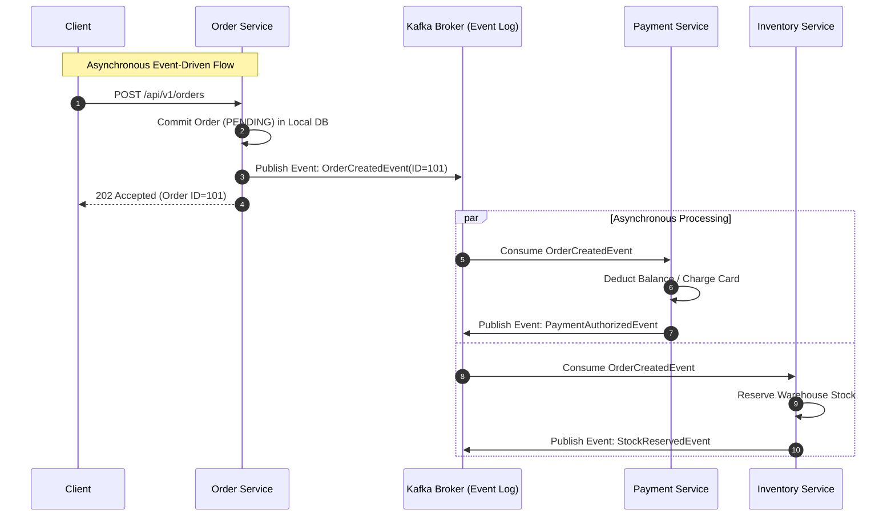

# Chapter 02: Inter-Service Communication — REST, gRPC & Messaging

> "In a monolith, components communicate via memory pointers and function calls in nanoseconds with 100% reliability. In microservices, every inter-service call is an unpredictable network hop subject to latency spikes, packet loss, and partition failures."  
> — *Chris Richardson, Microservice Patterns (Manning)*
>
> "Beware of synchronous RPC chains. If Service A calls B, which calls C, which calls D, you have coupled their runtimes, multiplied their failure rates, and converted a distributed system into a distributed bottleneck."  
> — *Sam Newman, Building Microservices (2nd Ed, O'Reilly)*
>
> "The First Fallacy of Distributed Computing is: The network is reliable."  
> — *L. Peter Deutsch (1994)*

---

## 🌐 1. Theoretical Foundations & The Fallacies of Distributed Computing

When transitioning from monolithic in-memory method invocations to network-based **Inter-Process Communication (IPC)**, engineers must confront the **8 Fallacies of Distributed Computing**:

```
===================================================================================================
                                THE 8 DISTRIBUTED COMPUTING FALLACIES
===================================================================================================

  1. The network is reliable.           5. Topology doesn't change.
  2. Latency is zero.                   6. There is one administrator.
  3. Bandwidth is infinite.             7. Transport cost is zero.
  4. The network is secure.             8. The network is homogeneous.
===================================================================================================
```

### 1.1 The Mathematical Penalty of Synchronous Coupling
Consider a user checkout transaction requiring 4 microservices chained synchronously:

$$\text{Client} \longrightarrow \text{Gateway} \longrightarrow \text{Order Service} \longrightarrow \text{Payment Service} \longrightarrow \text{Inventory Service}$$

#### 1. Latency Accumulation:
The total user latency is the sum of every sequential processing step plus network round-trip times (RTT):
$$L_{\text{total}} = L_{\text{gateway}} + L_{\text{order}} + L_{\text{payment}} + L_{\text{inventory}} + \sum \text{RTT}$$
If each service takes $150\text{ms}$ with $25\text{ms}$ network overhead, the client waits over $700\text{ms}$.

#### 2. Availability Multiplication:
If each microservice boasts a stellar "three nines" availability ($99.9\%$ or $0.999$ uptime), the aggregate availability of the synchronous chain is the product of their individual probabilities:
$$A_{\text{chain}} = A_{\text{gateway}} \times A_{\text{order}} \times A_{\text{payment}} \times A_{\text{inventory}} = (0.999)^4 \approx 99.60\%$$
A drop from $99.9\%$ to $99.6\%$ increases annual downtime from **8.7 hours** to **over 35 hours per year!**

---

## 📡 2. Transport & Protocol Topology: REST vs. gRPC vs. Messaging

```
===================================================================================================
                                COMMUNICATION PROTOCOL MECHANICS
===================================================================================================

[ 1. Synchronous REST over HTTP/1.1 ]
Client ──(TCP Handshake + TLS)──► Server
Client ──[ POST /api/orders (JSON text) ]──► Server ──[ 201 Created (JSON text) ]──► Client
- Textual JSON parsing CPU overhead (Jackson/serde).
- Head-of-Line (HoL) blocking on TCP connection.

[ 2. Synchronous gRPC over HTTP/2 ]
Client ──(Single Persistent Multiplexed TCP Connection)──► Server
  Stream 1: [ OrderRequest (Protobuf Binary) ] ────────► Server
  Stream 3: [ PaymentRequest (Protobuf Binary) ] ──────► Server
  Stream 1: ◄────── [ OrderResponse (Protobuf Binary) ]
- Binary Protobuf serialization: 5x-10x faster than JSON.
- Multiplexed streams over single TCP connection; eliminates connection re-establishment latency.

[ 3. Asynchronous Event-Driven Pub/Sub over Kafka/RabbitMQ ]
Order Service ──► [ Local DB Commit ] ──► [ Publish Event: OrderPlaced ] ──► Kafka Broker
                                                                                  │
                   +──────────────────────────────────────────────────────────────+
                   │ (Decoupled Asynchronous Consumption)
                   ▼                                                              ▼
        [ Payment Service ]                                            [ Notification Service ]
        (Reads from partition,                                         (Reads from partition,
         charges card, emits PaymentCaptured)                           sends confirmation email)
```



### 2.1 Protocol Selection Matrix

| Architectural Metric | REST (HTTP/1.1 or HTTP/2) | gRPC (HTTP/2 + Protobuf) | Asynchronous Messaging (Kafka/RabbitMQ) |
| :--- | :--- | :--- | :--- |
| **Payload Encoding** | Textual JSON | Compact Binary Protocol Buffers | Binary (Avro/Protobuf) or JSON |
| **Temporal Coupling** | High (Client blocked awaiting response) | High (Client blocked awaiting response) | **Zero (Temporal decoupling; fire-and-forget)** |
| **Spatial Coupling** | High (Caller must know IP/hostname) | High (Caller must know IP/hostname) | **Zero (Producers and consumers know only Topic name)** |
| **Backpressure** | Weak (Returns HTTP 429 Too Many Requests) | Native HTTP/2 credit-based flow control | Native (Consumer pulls at its own processing rate) |
| **Ideal Use Case** | Public edge APIs, mobile clients | Internal service-to-service synchronous calls | Event notification, state synchronization, Saga orchestration |

---

## 💻 3. Inline Implementations: Synchronous gRPC & Asynchronous Messaging

To illustrate real-world production engineering, we implement an **Order Creation & Notification Pipeline** with:
1. **gRPC Protobuf Definition** for fast internal RPC.
2. **Spring Boot 3 Implementation (Java 21 Virtual Threads)**.
3. **Golang Implementation (Go 1.22+ gRPC & Kafka)**.
4. **Python / FastAPI Implementation (Asyncio gRPC & aiokafka)**.

---

### 3.1 The Canonical Protocol Buffers Contract (`order.proto`)

```protobuf
syntax = "proto3";

package enterprise.order.v1;

option java_package = "com.enterprise.order.v1";
option java_multiple_files = true;
option go_package = "myproject/gen/order/v1;orderv1";

service OrderService {
  rpc CreateOrder (CreateOrderRequest) returns (CreateOrderResponse);
}

message CreateOrderRequest {
  string customer_id = 1;
  repeated LineItem items = 2;
}

message LineItem {
  string sku = 1;
  int64 price_cents = 2;
  int32 quantity = 3;
}

message CreateOrderResponse {
  string order_id = 1;
  string status = 2;
  int64 total_cents = 3;
}
```

---

### 3.2 Spring Boot 3 Implementation (Java 21 + Virtual Threads + Kafka)

```java
package com.enterprise.order.infrastructure.grpc;

import com.enterprise.order.v1.CreateOrderRequest;
import com.enterprise.order.v1.CreateOrderResponse;
import com.enterprise.order.v1.OrderServiceGrpc;
import io.grpc.stub.StreamObserver;
import net.devh.boot.grpc.server.service.GrpcService;
import org.springframework.kafka.core.KafkaTemplate;
import org.springframework.stereotype.Service;

import java.util.UUID;

// 1. gRPC Server Service running on Spring Boot 3 with Java 21 Virtual Threads
@GrpcService
public class OrderGrpcServiceImpl extends OrderServiceGrpc.OrderServiceImplBase {

    private final KafkaTemplate<String, String> kafkaTemplate;

    public OrderGrpcServiceImpl(KafkaTemplate<String, String> kafkaTemplate) {
        this.kafkaTemplate = kafkaTemplate;
    }

    @Override
    public void createOrder(CreateOrderRequest request, StreamObserver<CreateOrderResponse> responseObserver) {
        String orderId = UUID.randomUUID().toString();
        
        long totalCents = request.getItemsList().stream()
                .mapToLong(item -> item.getPriceCents() * item.getQuantity())
                .sum();

        // 2. Publish Domain Event to Kafka asynchronously
        String eventPayload = String.format("{\"orderId\":\"%s\",\"customerId\":\"%s\",\"total\":%d}",
                orderId, request.getCustomerId(), totalCents);
        kafkaTemplate.send("orders.events", orderId, eventPayload);

        // 3. Return gRPC Response
        CreateOrderResponse response = CreateOrderResponse.newBuilder()
                .setOrderId(orderId)
                .setStatus("ACCEPTED")
                .setTotalCents(totalCents)
                .build();

        responseObserver.onNext(response);
        responseObserver.onCompleted();
    }
}
```

```java
package com.enterprise.order.infrastructure.kafka;

import org.apache.kafka.clients.consumer.ConsumerRecord;
import org.slf4j.Logger;
import org.slf4j.LoggerFactory;
import org.springframework.kafka.annotation.KafkaListener;
import org.springframework.stereotype.Component;

// 4. Asynchronous Consumer processing Order events
@Component
public class OrderEventConsumer {
    private static final Logger log = LoggerFactory.getLogger(OrderEventConsumer);

    @KafkaListener(topics = "orders.events", groupId = "inventory-service-group")
    public void consumeOrderEvent(ConsumerRecord<String, String> record) {
        log.info("Virtual Thread [{}] Processing Kafka event: key={}, payload={}",
                Thread.currentThread().toString(), record.key(), record.value());
        // Execute inventory reservation logic here...
    }
}
```

---

### 3.3 Golang Implementation (Go 1.22+ gRPC Server & Kafka Producer)

```go
package main

import (
	"context"
	"encoding/json"
	"fmt"
	"log"
	"net"
	"time"

	"github.com/IBM/sarama"
	"google.golang.org/grpc"
	"google.golang.org/grpc/codes"
	"google.golang.org/grpc/status"

	pb "myproject/gen/order/v1"
)

type orderServer struct {
	pb.UnimplementedOrderServiceServer
	producer sarama.SyncProducer
}

func (s *orderServer) CreateOrder(ctx context.Context, req *pb.CreateOrderRequest) (*pb.CreateOrderResponse, error) {
	if req.CustomerId == "" {
		return nil, status.Error(codes.InvalidArgument, "customer_id must not be empty")
	}

	var totalCents int64
	for _, item := range req.Items {
		if item.Quantity <= 0 {
			return nil, status.Error(codes.InvalidArgument, "quantity must be greater than 0")
		}
		totalCents += item.PriceCents * int64(item.Quantity)
	}

	orderID := fmt.Sprintf("ORD-%d", time.Now().UnixNano())

	// Publish asynchronous domain event to Apache Kafka
	event := map[string]interface{}{
		"orderId":    orderID,
		"customerId": req.CustomerId,
		"totalCents": totalCents,
		"timestamp":  time.Now().UTC(),
	}
	payload, _ := json.Marshal(event)

	msg := &sarama.ProducerMessage{
		Topic: "orders.events",
		Key:   sarama.StringEncoder(orderID),
		Value: sarama.ByteEncoder(payload),
	}

	if _, _, err := s.producer.SendMessage(msg); err != nil {
		log.Printf("Failed to produce Kafka message: %v", err)
		return nil, status.Error(codes.Internal, "failed to persist order event")
	}

	return &pb.CreateOrderResponse{
		OrderId:    orderID,
		Status:     "ACCEPTED",
		TotalCents: totalCents,
	}, nil
}

func main() {
	lis, err := net.Listen("tcp", ":50051")
	if err != nil {
		log.Fatalf("failed to listen: %v", err)
	}

	config := sarama.NewConfig()
	config.Producer.Return.Successes = true
	config.Producer.RequiredAcks = sarama.WaitForAll // Full in-sync replica durability

	producer, err := sarama.NewSyncProducer([]string{"localhost:9092"}, config)
	if err != nil {
		log.Fatalf("failed to create Kafka producer: %v", err)
	}
	defer producer.Close()

	grpcServer := grpc.NewServer()
	pb.RegisterOrderServiceServer(grpcServer, &orderServer{producer: producer})

	log.Println("Go gRPC Order Service running on :50051...")
	if err := grpcServer.Serve(lis); err != nil {
		log.Fatalf("failed to serve: %v", err)
	}
}
```

---

### 3.4 Python / FastAPI Implementation (Asyncio gRPC & aiokafka)

```python
"""
Order Service in Python utilizing FastAPI, aiokafka for async event streaming,
and grpc.aio for high-performance RPC.
"""

import asyncio
import json
import uuid
from contextlib import asynccontextmanager
from typing import List
from aiokafka import AIOKafkaProducer
from fastapi import FastAPI, HTTPException, status
from pydantic import BaseModel, Field


class LineItem(BaseModel):
    sku: str = Field(..., min_length=2)
    price_cents: int = Field(..., gt=0)
    quantity: int = Field(..., gt=0)


class CreateOrderRequest(BaseModel):
    customer_id: str
    items: List[LineItem]


# Global state for Kafka Producer lifecycle
class ServiceState:
    kafka_producer: AIOKafkaProducer = None


state = ServiceState()


@asynccontextmanager
async def lifespan(app: FastAPI):
    # Startup: Initialize asynchronous Kafka producer
    state.kafka_producer = AIOKafkaProducer(
        bootstrap_servers="localhost:9092",
        acks="all",  # Idempotent write guarantee
    )
    await state.kafka_producer.start()
    yield
    # Shutdown: Flush and close connections
    await state.kafka_producer.stop()


app = FastAPI(title="Order Async API", lifespan=lifespan)


@app.post("/api/v1/orders", status_code=status.HTTP_202_ACCEPTED)
async def create_order_endpoint(request: CreateOrderRequest):
    order_id = f"ORD-{uuid.uuid4()}"
    total_cents = sum(item.price_cents * item.quantity for item in request.items)

    event_payload = {
        "orderId": order_id,
        "customerId": request.customer_id,
        "totalCents": total_cents,
        "status": "ACCEPTED",
    }

    try:
        # Publish event to Kafka asynchronously without blocking the event loop
        await state.kafka_producer.send_and_wait(
            topic="orders.events",
            key=order_id.encode("utf-8"),
            value=json.dumps(event_payload).encode("utf-8"),
        )
    except Exception as exc:
        raise HTTPException(
            status_code=status.HTTP_503_SERVICE_UNAVAILABLE,
            detail=f"Messaging broker failure: {exc}",
        )

    return {
        "order_id": order_id,
        "status": "ACCEPTED",
        "total_cents": total_cents,
    }
```

---

## 🚨 4. Failure Modes, Concurrency Anomalies & Production Triage

```
===================================================================================================
                               INTER-SERVICE FAILURE TRIAGE RUNBOOK
===================================================================================================

  Anomaly: Connection Pool & Socket Exhaustion
  ├── Symptom: Upstream service throws HTTP 504 Gateway Timeout or "too many open files" (errno 24).
  ├── Root Cause: Each HTTP/1.1 REST request creating a new TCP connection without connection reuse.
  └── Triage: Enforce HTTP Keep-Alive pooling; migrate internal service links to multiplexed gRPC (HTTP/2).

  Anomaly: Head-of-Line (HoL) Blocking
  ├── Symptom: A single slow SQL query in a downstream service freezes client connection queues.
  ├── Root Cause: Synchronous request-response coupling.
  └── Triage: Switch to Asynchronous Messaging (Kafka/RabbitMQ); implement Circuit Breakers with fast timeouts.

  Anomaly: Poison Pill Messages in Message Broker
  ├── Symptom: Kafka consumer crashes continuously on a specific offset, causing infinite restart loop.
  ├── Root Cause: Malformed JSON or unhandled schema mutation in event payload.
  └── Triage: Deploy Dead Letter Queue (DLQ) pattern with retry interceptor: forward bad messages to 'orders.dlq'
              after 3 failed attempts, then acknowledge offset.
===================================================================================================
```
