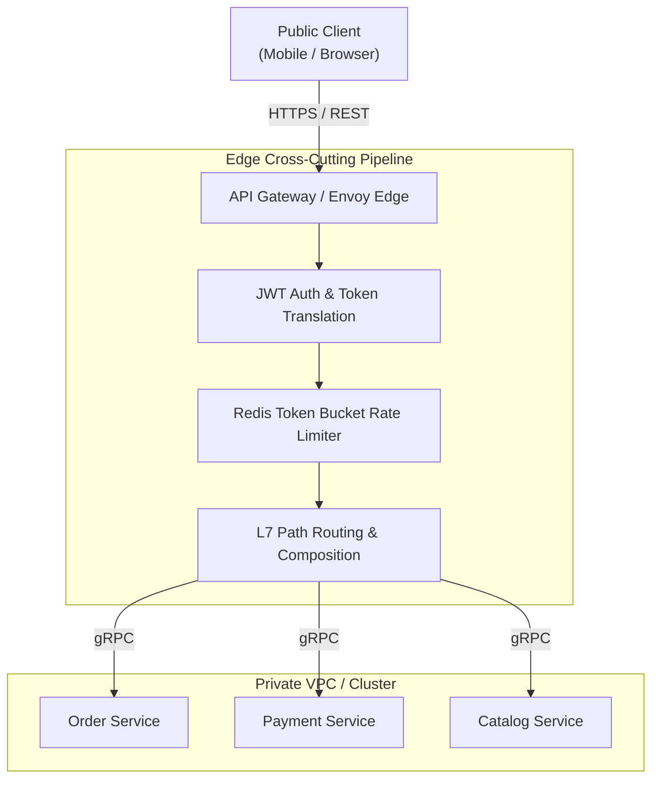

# Chapter 03: API Gateway, BFF & Service Discovery Topologies

> "The API Gateway pattern provides a single, unified entry point for all external clients. It encapsulates internal system architecture and provides an API that is tailored specifically to each client."  
> — *Chris Richardson, Microservice Patterns (Manning)*
>
> "Having a single, monolithic API gateway owned by a separate gateway team recreates the exact organizational bottlenecks of the monolith. Instead, align gateways with user experiences using the Backend For Frontend (BFF) pattern."  
> — *Sam Newman, Building Microservices (2nd Ed, O'Reilly)*
>
> "Service discovery is the phonebook of distributed systems. Whether resolved client-side or server-side, it decouples consumers from the ephemeral IP addresses of dynamic container fleets."  
> — *Brendan Burns, Designing Distributed Systems (O'Reilly)*

---

## 🚪 1. The Edge Problem & API Gateway Foundations

Direct client-to-microservice communication across public mobile and browser networks is an anti-pattern:
1. **Network Chatiness & WAN Latency:** A single mobile screen rendering an e-commerce dashboard would require calling 10 distinct microservices sequentially over high-latency cellular networks.
2. **Protocol Incompatibilities:** Internal microservices communicate via high-performance binary gRPC or Kafka, which browsers and legacy clients cannot natively invoke.
3. **Massive Attack Surface:** Exposing hundreds of microservices directly to the public internet requires securing, auditing, and TLS-terminating every single pod.
4. **Cross-Cutting Drift:** Each service would need to implement its own rate limiting, CORS headers, API key validation, and JWT verification.

```
===================================================================================================
                                 API GATEWAY EDGE ARCHITECTURE
===================================================================================================

  Mobile / Web Clients (Public WAN)
                │
                ▼ (TLS Termination / WAF / DDoS Protection)
  +-----------------------------------------------------------------------------------------------+
  |                                         API GATEWAY                                           |
  |                                                                                               |
  |  +-------------------+   +--------------------+   +--------------------+   +---------------+  |
  |  |  Authentication   |   |   Rate Limiting    |   |  Response Caching  |   |  L7 Routing   |  |
  |  |  (JWT / OAuth2)   |   | (Token Bucket/Redis|   |  (HTTP Headers)    |   | (/api/orders) |  |
  |  +-------------------+   +--------------------+   +--------------------+   +---------------+  |
  +-----------------------------------------------+-----------------------------------------------+
                                                  │
                 +--------------------------------+--------------------------------+
                 │ (Internal High-Speed Cluster Network: gRPC / HTTP/2 / mTLS)      │
                 ▼                                                                 ▼
      +----------------------+                                          +----------------------+
      |    Order Service     |                                          |   Customer Service   |
      +----------------------+                                          +----------------------+
```



---

## 📱 2. The Backend-for-Frontend (BFF) Pattern

As consumer devices diversify (iOS, Android, Responsive Web, Smart TVs, Partner APIs), a single monolithic gateway becomes bloated and fraught with competing requirements:
- **Mobile Devices:** Constrained bandwidth, high battery drain $\implies$ Require compact payloads with only essential UI fields.
- **Desktop Web:** High bandwidth, rich widescreen viewports $\implies$ Require extensive nested JSON aggregations.
- **Third-Party Partner APIs:** Strict enterprise versioning, API key billing, XML/JSON backward compatibility.

Under the **BFF Pattern** (*Sam Newman*), each client interface is paired with its own dedicated gateway maintained by the client application team:

```
===================================================================================================
                               BACKEND-FOR-FRONTEND (BFF) TOPOLOGY
===================================================================================================

    [ Mobile App (iOS/Android) ]                [ Desktop Browser Web ]            [ 3rd-Party Partners ]
                 │                                         │                                  │
                 ▼                                         ▼                                  ▼
     +-----------------------+                 +-----------------------+          +-----------------------+
     |      Mobile BFF       |                 |        Web BFF        |          |      Public API       |
     | - Strips unused fields|                 | - Aggregates large UI |          | - API Key Quotas      |
     | - Single-request data |                 |   dashboards          |          | - Strict semantic     |
     |   composition         |                 | - High-res graphics   |          |   versioning          |
     +-----------+-----------+                 +-----------+-----------+          +-----------+-----------+
                 │                                         │                                  │
                 +─────────────────────────┬───────────────┴──────────────────────────────────+
                                           │
                                           ▼ (Internal Service Mesh / gRPC)
                 +-------------------------+-------------------------+
                 |                         |                         |
                 v                         v                         v
          [ Order Service ]       [ Inventory Service ]     [ Pricing Service ]
```

---

## 🔍 3. Service Discovery Topologies: Client-Side vs. Server-Side

In dynamic cloud environments (Kubernetes, AWS ECS), service instances are ephemeral: pods scale out, crash, and relocate to new nodes with dynamic IP addresses. **Service Discovery** provides automated registration and lookup.

```
===================================================================================================
                               SERVICE DISCOVERY TOPOLOGY COMPARISON
===================================================================================================

[ Model 1: Client-Side Discovery (e.g. Netflix Eureka + Ribbon) ]
Client ──(1. Query Registry)──► Service Registry (Eureka/Consul)
Client ◄──(2. IP List: [10.0.1.5, 10.0.1.8])──┘
Client ──(3. Internal Load Balancing: Round Robin)──► Service Instance (10.0.1.8)
- Pros: Direct connection; zero intermediate network hops.
- Cons: Language-dependent SDK required in every microservice client.

[ Model 2: Server-Side Discovery (e.g. Kubernetes ClusterIP / AWS ALB / Envoy) ]
Client ──(1. Request to Stable DNS: order-service.prod.svc)──► Server-Side Proxy (kube-proxy / Envoy)
                                                                     │
                                                 (2. Balances to Pod)│
                                                                     ▼
                                                          Service Pod (10.244.1.15)
- Pros: Language-agnostic; transparent to client application code.
- Cons: Extra network hop through proxy/load balancer.
```

---

## 💻 4. Inline Implementations: API Gateway, BFF & Composition

To demonstrate concrete production patterns, we implement:
1. **Spring Cloud Gateway (Java / Spring Boot 3)**: Reactive non-blocking gateway route configuration with JWT header enrichment and rate limiting.
2. **Golang High-Performance Edge Proxy (Go 1.22+)**: `httputil.ReverseProxy` with token-bucket rate limiter and request correlation ID injection.
3. **FastAPI Mobile BFF Aggregator (Python 3.11+)**: Concurrent asynchronous aggregation using `asyncio.gather()` and `httpx`.

---

### 4.1 Spring Boot 3 (Spring Cloud Gateway Reactive Pipeline)

```java
package com.enterprise.gateway.config;

import org.springframework.cloud.gateway.route.RouteLocator;
import org.springframework.cloud.gateway.route.builder.RouteLocatorBuilder;
import org.springframework.context.annotation.Bean;
import org.springframework.context.annotation.Configuration;
import org.springframework.http.HttpMethod;

// 1. Reactive Gateway Route Locator configuring L7 routing and filters
@Configuration
public class GatewayRoutesConfig {

    @Bean
    public RouteLocator customRouteLocator(RouteLocatorBuilder builder) {
        return builder.routes()
                // Route 1: Orders Service with path rewriting and header enrichment
                .route("order-service-route", r -> r.path("/api/v1/orders/**")
                        .filters(f -> f
                                .rewritePath("/api/v1/orders/(?<segment>.*)", "/orders/${segment}")
                                .addRequestHeader("X-Gateway-Enriched", "SpringCloudGateway-v3")
                                .addResponseHeader("X-Response-Time", String.valueOf(System.currentTimeMillis())))
                        .uri("lb://ORDER-SERVICE"))
                
                // Route 2: Catalog Service with read-only restriction for GET
                .route("catalog-service-route", r -> r.path("/api/v1/catalog/**")
                        .and().method(HttpMethod.GET)
                        .filters(f -> f.stripPrefix(2))
                        .uri("http://catalog-service.internal:8080"))
                .build();
    }
}
```

```java
package com.enterprise.gateway.filters;

import org.springframework.cloud.gateway.filter.GatewayFilterChain;
import org.springframework.cloud.gateway.filter.GlobalFilter;
import org.springframework.core.Ordered;
import org.springframework.http.HttpStatus;
import org.springframework.stereotype.Component;
import org.springframework.web.server.ServerWebExchange;
import reactor.core.publisher.Mono;

import java.util.UUID;

// 2. Global Pre-Filter: Correlation ID Injection and Authorization Verification
@Component
public class SecurityAndTracingGlobalFilter implements GlobalFilter, Ordered {

    @Override
    public Mono<Void> filter(ServerWebExchange exchange, GatewayFilterChain chain) {
        // Inject or propagate W3C Correlation ID
        String correlationId = exchange.getRequest().getHeaders().getFirst("X-Correlation-ID");
        if (correlationId == null) {
            correlationId = UUID.randomUUID().toString();
        }

        // Mutate request headers
        ServerWebExchange mutatedExchange = exchange.mutate()
                .request(r -> r.header("X-Correlation-ID", correlationId))
                .build();

        // Enforce Authentication Header Presence
        if (!exchange.getRequest().getHeaders().containsKey("Authorization")) {
            exchange.getResponse().setStatusCode(HttpStatus.UNAUTHORIZED);
            return exchange.getResponse().setComplete();
        }

        return chain.filter(mutatedExchange);
    }

    @Override
    public int getOrder() {
        return Ordered.HIGHEST_PRECEDENCE;
    }
}
```

---

### 4.2 Golang High-Throughput Edge Reverse Proxy (Go 1.22+)

```go
package main

import (
	"log"
	"net/http"
	"net/http/httputil"
	"net/url"
	"strings"
	"time"

	"github.com/google/uuid"
	"golang.org/x/time/rate"
)

// In-memory Token Bucket rate limiter (100 req/sec, burst 20)
var limiter = rate.NewLimiter(rate.Limit(100), 20)

func rateLimitMiddleware(next http.Handler) http.Handler {
	return http.HandlerFunc(func(w http.ResponseWriter, r *http.Request) {
		if !limiter.Allow() {
			http.Error(w, `{"error":"Too Many Requests"}`, http.StatusTooManyRequests)
			return
		}
		next.ServeHTTP(w, r)
	})
}

func correlationMiddleware(next http.Handler) http.Handler {
	return http.HandlerFunc(func(w http.ResponseWriter, r *http.Request) {
		correlationID := r.Header.Get("X-Correlation-ID")
		if correlationID == "" {
			correlationID = uuid.New().String()
			r.Header.Set("X-Correlation-ID", correlationID)
		}
		w.Header().Set("X-Correlation-ID", correlationID)
		next.ServeHTTP(w, r)
	})
}

func newSingleHostReverseProxy(target *url.URL) *httputil.ReverseProxy {
	proxy := httputil.NewSingleHostReverseProxy(target)
	proxy.Transport = &http.Transport{
		MaxIdleConns:        1000,
		MaxIdleConnsPerHost: 100,
		IdleConnTimeout:     90 * time.Second,
	}
	return proxy
}

func main() {
	orderServiceURL, _ := url.Parse("http://order-service.internal:8080")
	paymentServiceURL, _ := url.Parse("http://payment-service.internal:8081")

	orderProxy := newSingleHostReverseProxy(orderServiceURL)
	paymentProxy := newSingleHostReverseProxy(paymentServiceURL)

	mux := http.NewServeMux()

	mux.HandleFunc("/api/orders/", func(w http.ResponseWriter, r *http.Request) {
		r.URL.Path = strings.TrimPrefix(r.URL.Path, "/api")
		orderProxy.ServeHTTP(w, r)
	})

	mux.HandleFunc("/api/payments/", func(w http.ResponseWriter, r *http.Request) {
		r.URL.Path = strings.TrimPrefix(r.URL.Path, "/api")
		paymentProxy.ServeHTTP(w, r)
	})

	handler := correlationMiddleware(rateLimitMiddleware(mux))

	server := &http.Server{
		Addr:         ":8000",
		Handler:      handler,
		ReadTimeout:  5 * time.Second,
		WriteTimeout: 10 * time.Second,
	}

	log.Println("Go API Gateway listening on :8000...")
	if err := server.ListenAndServe(); err != nil {
		log.Fatalf("Server failed: %v", err)
	}
}
```

---

### 4.3 Python / FastAPI Mobile BFF (Concurrent Aggregator)

```python
"""
Mobile Backend-For-Frontend (BFF) Aggregator in Python.
Uses FastAPI and httpx with asyncio.gather() to compose customer, order,
and loyalty data into a single lightweight mobile payload.
"""

import asyncio
from typing import Any, Dict
import httpx
from fastapi import FastAPI, HTTPException, status
from pydantic import BaseModel


class MobileOrderSummary(BaseModel):
    order_id: str
    total_cents: int
    status: str


class MobileDashboardResponse(BaseModel):
    customer_id: str
    name: str
    loyalty_tier: str
    points: int
    recent_orders: list[MobileOrderSummary]


app = FastAPI(title="Mobile BFF Gateway")

# Shared connection-pooled async HTTP client
client = httpx.AsyncClient(timeout=httpx.Timeout(2.5, connect=0.5))


async def fetch_customer_profile(customer_id: str) -> Dict[str, Any]:
    url = f"http://customer-service.internal:8080/customers/{customer_id}"
    resp = await client.get(url)
    resp.raise_for_status()
    return resp.json()


async def fetch_recent_orders(customer_id: str) -> list[Dict[str, Any]]:
    url = f"http://order-service.internal:8081/orders?customerId={customer_id}&limit=5"
    resp = await client.get(url)
    resp.raise_for_status()
    return resp.json().get("items", [])


async def fetch_loyalty_points(customer_id: str) -> Dict[str, Any]:
    url = f"http://loyalty-service.internal:8082/loyalty/{customer_id}"
    resp = await client.get(url)
    resp.raise_for_status()
    return resp.json()


@app.get("/mobile/v1/dashboard/{customer_id}", response_model=MobileDashboardResponse)
async def get_mobile_dashboard(customer_id: str):
    try:
        # Fan-out: Execute all 3 downstream requests concurrently!
        customer_task = fetch_customer_profile(customer_id)
        orders_task = fetch_recent_orders(customer_id)
        loyalty_task = fetch_loyalty_points(customer_id)

        customer_data, orders_data, loyalty_data = await asyncio.gather(
            customer_task, orders_task, loyalty_task
        )

        # Compose lightweight response stripped of redundant fields
        summarized_orders = [
            MobileOrderSummary(
                order_id=o["id"],
                total_cents=o["totalCents"],
                status=o["status"],
            )
            for o in orders_data
        ]

        return MobileDashboardResponse(
            customer_id=customer_id,
            name=customer_data["name"],
            loyalty_tier=loyalty_data.get("tier", "STANDARD"),
            points=loyalty_data.get("pointsBalance", 0),
            recent_orders=summarized_orders,
        )

    except httpx.HTTPStatusError as exc:
        raise HTTPException(
            status_code=exc.response.status_code,
            detail=f"Downstream service failed: {exc}",
        )
    except Exception as exc:
        raise HTTPException(
            status_code=status.HTTP_500_INTERNAL_SERVER_ERROR,
            detail=f"BFF aggregation failure: {exc}",
        )
```

---

## 🚨 5. Failure Modes, Concurrency Anomalies & Production Triage

```
===================================================================================================
                               API GATEWAY ANOMALY TRIAGE RUNBOOK
===================================================================================================

  Anomaly: Gateway Single Point of Failure (SPOF)
  ├── Symptom: Whole platform unreachable; DNS health check fails on gateway endpoint.
  ├── Root Cause: API Gateway deployed as a singleton without multi-AZ autoscaling.
  └── Triage: Deploy API Gateway as a stateless horizontal deployment behind Cloud NLB/ALB;
              distribute across at least 3 Availability Zones.

  Anomaly: BFF Cascading Request Amplification
  ├── Symptom: BFF CPU spikes to 100%; event loop thread starvation during traffic surges.
  ├── Root Cause: Unbounded concurrent downstream calls via asyncio.gather() or Unbounded ThreadPool.
  └── Triage: Enforce client timeout budgets; apply circuit breakers and semaphore concurrency limits.

  Anomaly: Memory Leak in Gateway Lua / JVM Filter Chains
  ├── Symptom: Gateway memory increases monotonically until OOMKilled every 12 hours.
  ├── Root Cause: Custom interceptor caching request/response payloads in unbounded hash maps.
  └── Triage: Replace in-memory state with Redis cluster; enforce streaming response pipelines.
===================================================================================================
```
