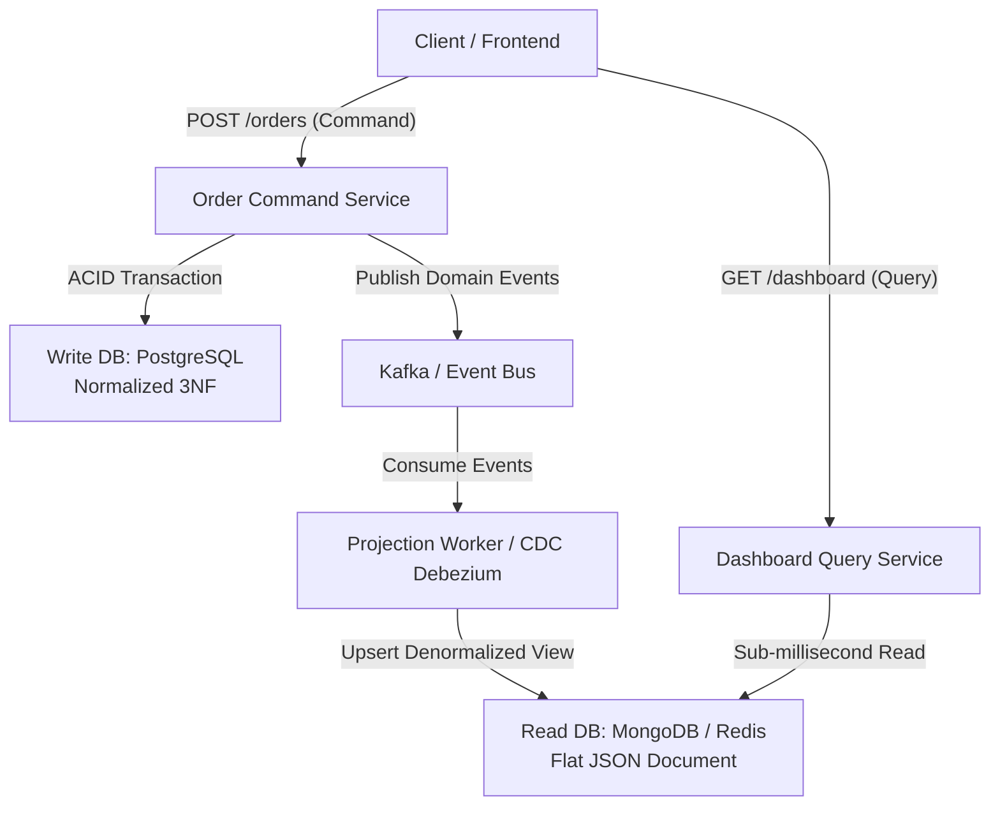

# Chapter 04: Distributed Data — Database-per-Service & CQRS

> "In a microservice architecture, each service must have its own private database. Loose coupling requires that a service’s persistent data can only be accessed via its API, never directly by other services."  
> — *Chris Richardson, Microservice Patterns (Manning)*
>
> "At its heart, CQRS is about separating the path used to mutate data from the path used to read data. The models that are optimal for writing and enforcing invariants are almost never optimal for querying."  
> — *Martin Fowler, CQRS (2011)*
>
> "When data is distributed across multiple databases, the concept of a single 'source of truth' dissolves. We must embrace eventual consistency and design systems around asynchronous event streams."  
> — *Martin Kleppmann, Designing Data-Intensive Applications (O'Reilly)*

---

## 💾 1. The Distributed Data Dilemma & Database-per-Service

In a traditional monolithic architecture, a single relational database acts as the universal integration point. All modules execute cross-table SQL `JOIN`s, enforce foreign key constraints, and rely on ACID transactions.

When decomposing into microservices, sharing a single database destroys service autonomy:
- **Schema Coupling:** Modifying a column in `customers` breaks 5 independent microservices simultaneously.
- **Resource Contention:** A heavy analytics query initiated by Reporting locks database rows needed by the high-throughput Payment service.
- **Technology Lock-In:** Every microservice is forced to use the same database engine, preventing services from choosing optimal storage (e.g., Neo4j for graphs, Redis for key-value, PostgreSQL for relational ledgers).

```
===================================================================================================
                             SHARED DATABASE VS. DATABASE-PER-SERVICE
===================================================================================================

[ Anti-Pattern: Shared Database ]
Order Service ───────┐
Payment Service ─────┼────► [ Single Monolithic Database (PostgreSQL) ]
Catalog Service ─────┘      - Broken autonomy; schema lock; table contention.

[ Best Practice: Database-per-Service ]
Order Service    ──► [ PostgreSQL: orders_db ]   (Relational ACID guarantees)
Payment Service  ──► [ PostgreSQL: payments_db ] (Private PCI-compliant ledger)
Catalog Service  ──► [ MongoDB / Redis ]         (Denormalized document read cache)
- Strict boundary: Services NEVER execute SQL queries against another service's database!
```

---

## ⚡ 2. The Distributed Query Problem & CQRS Architecture

With private databases, how do we query data that spans multiple microservices?
For example, an administrative dashboard requires:
$$\text{Order Details} \ (\text{Order Service}) + \text{Customer Name} \ (\text{Customer Service}) + \text{Payment Status} \ (\text{Payment Service})$$

We cannot execute:
```sql
-- IMPOSSIBLE IN MICROSERVICES:
SELECT * FROM orders o 
JOIN customers c ON o.customer_id = c.id 
JOIN payments p ON o.id = p.order_id;
```

Attempting to resolve this via **API Composition** (making 3 synchronous network calls and joining in memory) introduces severe tail latency and poor availability ($A_{\text{total}} = A_1 \times A_2 \times A_3$).

### The Solution: Command Query Responsibility Segregation (CQRS)
Under **CQRS** (*Greg Young, Martin Fowler*), the application separates the **Write Model (Command)** from the **Read Model (Query)**:

```
===================================================================================================
                                      CQRS DATA PIPELINE
===================================================================================================

                    [ Client Application ]
                      │               ▲
    1. Write Command  │               │ 4. Read Query
    (POST /orders)    │               │ (GET /dashboard/orders)
                      ▼               │
           +--------------------+     │     +--------------------+
           |   Command Engine   |     │     |    Query Engine    |
           |   (Write Model)    |     │     |    (Read Model)    |
           +---------+----------+     │     +---------+----------+
                     │                │               │
                     v Local ACID     │               ▲ Fast Key/Doc Read
           +--------------------+     │     +--------------------+
           | Orders Write DB    |     │     | Denormalized Views |
           | (PostgreSQL 3NF)   |     │     | (Elastic / Mongo)  |
           +---------+----------+     │     +---------+----------+
                     │                │               ▲
                     v Outbox / CDC   │               │ 3. Asynchronously
           +--------------------+     │               │    Projects Events
           | Event Stream Broker|─────┴───────────────┘
           |  (Apache Kafka)    |
           +--------------------+
```



---

## 💻 3. Inline Implementations: CQRS Write & Read Projections

To illustrate real-world CQRS engineering, we implement:
1. **Spring Boot 3 (Java 21 Virtual Threads)**: Command entity writing to PostgreSQL + Event-driven Projector updating a MongoDB read model.
2. **Golang (Go 1.22+)**: Command handler mutating SQLite/Postgres + Async projection worker updating an in-memory read cache.
3. **Python / FastAPI (Python 3.11+)**: Separate Command and Query endpoints using Async SQLAlchemy and Redis.

---

### 3.1 Spring Boot 3 CQRS Implementation (Java 21)

```java
package com.enterprise.order.command;

import jakarta.persistence.Entity;
import jakarta.persistence.Id;
import jakarta.persistence.Table;
import org.springframework.context.ApplicationEventPublisher;
import org.springframework.stereotype.Service;
import org.springframework.transaction.annotation.Transactional;

import java.math.BigDecimal;
import java.util.UUID;

// 1. Command Side: Normalized Relational Entity
@Entity
@Table(name = "orders")
public class OrderCommandEntity {
    @Id
    private UUID id;
    private UUID customerId;
    private BigDecimal totalAmount;
    private String status;

    protected OrderCommandEntity() {}

    public OrderCommandEntity(UUID id, UUID customerId, BigDecimal totalAmount) {
        this.id = id;
        this.customerId = customerId;
        this.totalAmount = totalAmount;
        this.status = "CREATED";
    }

    public UUID getId() { return id; }
    public UUID getCustomerId() { return customerId; }
    public BigDecimal getTotalAmount() { return totalAmount; }
    public String getStatus() { return status; }
}
```

```java
package com.enterprise.order.query;

import org.springframework.data.annotation.Id;
import org.springframework.data.mongodb.core.mapping.Document;

import java.math.BigDecimal;
import java.util.UUID;

// 2. Query Side: Denormalized Flat Document for High-Speed Read Retrieval
@Document(collection = "order_dashboard_views")
public class OrderDashboardView {
    @Id
    private UUID orderId;
    private String customerName;
    private String customerEmail;
    private BigDecimal totalAmount;
    private String status;

    public OrderDashboardView(UUID orderId, String customerName, String customerEmail, BigDecimal totalAmount, String status) {
        this.orderId = orderId;
        this.customerName = customerName;
        this.customerEmail = customerEmail;
        this.totalAmount = totalAmount;
        this.status = status;
    }

    public UUID getOrderId() { return orderId; }
    public String getCustomerName() { return customerName; }
    public BigDecimal getTotalAmount() { return totalAmount; }
}
```

```java
package com.enterprise.order.projection;

import com.enterprise.order.query.OrderDashboardView;
import org.springframework.data.mongodb.repository.MongoRepository;
import org.springframework.kafka.annotation.KafkaListener;
import org.springframework.stereotype.Component;

import java.math.BigDecimal;
import java.util.UUID;

// 3. Background Projector: Consumes domain events and updates Read Model
@Component
public class OrderDashboardProjector {

    private final MongoRepository<OrderDashboardView, UUID> readRepository;

    public OrderDashboardProjector(MongoRepository<OrderDashboardView, UUID> readRepository) {
        this.readRepository = readRepository;
    }

    @KafkaListener(topics = "orders.events", groupId = "cqrs-projector-group")
    public void onOrderCreatedEvent(String eventPayload) {
        // Parse event and enrich with customer details from cache
        UUID orderId = UUID.randomUUID();
        OrderDashboardView view = new OrderDashboardView(
                orderId,
                "Alice Smith",
                "alice@enterprise.io",
                BigDecimal.valueOf(149.99),
                "CREATED"
        );
        readRepository.save(view); // Atomic upsert into MongoDB read view
    }
}
```

---

### 3.2 Golang CQRS Implementation (Go 1.22+)

```go
package main

import (
	"context"
	"database/sql"
	"encoding/json"
	"fmt"
	"log"
	"net/http"
	"sync"
	"time"

	_ "github.com/mattn/go-sqlite3"
)

// 1. Command Model: Write Side
type OrderCommand struct {
	ID         string  `json:"id"`
	CustomerID string  `json:"customer_id"`
	Total      float64 `json:"total"`
}

// 2. Query Model: Denormalized Read View
type OrderReadView struct {
	OrderID      string  `json:"order_id"`
	CustomerName string  `json:"customer_name"`
	Total        float64 `json:"total"`
	Status       string  `json:"status"`
}

// In-memory read cache representing projected Read Store
type ReadStore struct {
	sync.RWMutex
	views map[string]OrderReadView
}

var readStore = &ReadStore{views: make(map[string]OrderReadView)}

// 3. Command Handler: Persists to ACID DB and emits event to channel
func handleCreateOrder(db *sql.DB, eventChan chan<- OrderCommand) http.HandlerFunc {
	return func(w http.ResponseWriter, r *http.Request) {
		var cmd OrderCommand
		if err := json.NewDecoder(r.Body).Decode(&cmd); err != nil {
			http.Error(w, err.Error(), http.StatusBadRequest)
			return
		}
		cmd.ID = fmt.Sprintf("ORD-%d", time.Now().UnixNano())

		// Write to Command Database
		_, err := db.Exec("INSERT INTO orders (id, customer_id, total) VALUES (?, ?, ?)",
			cmd.ID, cmd.CustomerID, cmd.Total)
		if err != nil {
			http.Error(w, "database error", http.StatusInternalServerError)
			return
		}

		// Asynchronously emit event to Projector channel
		eventChan <- cmd

		w.WriteHeader(http.StatusCreated)
		json.NewEncoder(w).Encode(map[string]string{"order_id": cmd.ID})
	}
}

// 4. Background Projector: Updates Read Store asynchronously
func runProjector(ctx context.Context, eventChan <-chan OrderCommand) {
	for {
		select {
		case <-ctx.Done():
			return
		case cmd := <-eventChan:
			// Project and denormalize
			view := OrderReadView{
				OrderID:      cmd.ID,
				CustomerName: "Customer-" + cmd.CustomerID,
				Total:        cmd.Total,
				Status:       "CONFIRMED",
			}
			readStore.Lock()
			readStore.views[cmd.ID] = view
			readStore.Unlock()
			log.Printf("Projected Order ID: %s to Read Store", cmd.ID)
		}
	}
}

// 5. Query Handler: High-speed O(1) lock-free read
func handleGetOrderView(w http.ResponseWriter, r *http.Request) {
	orderID := r.URL.Query().Get("id")
	readStore.RLock()
	view, found := readStore.views[orderID]
	readStore.RUnlock()

	if !found {
		http.Error(w, "Order view not found", http.StatusNotFound)
		return
	}
	w.Header().Set("Content-Type", "application/json")
	json.NewEncoder(w).Encode(view)
}

func main() {
	db, err := sql.Open("sqlite3", ":memory:")
	if err != nil {
		log.Fatal(err)
	}
	defer db.Close()

	db.Exec("CREATE TABLE orders (id TEXT PRIMARY KEY, customer_id TEXT, total REAL)")

	eventChan := make(chan OrderCommand, 100)
	go runProjector(context.Background(), eventChan)

	http.HandleFunc("/api/orders", handleCreateOrder(db, eventChan))
	http.HandleFunc("/api/orders/view", handleGetOrderView)

	log.Println("Golang CQRS service running on :8080...")
	http.ListenAndServe(":8080", nil)
}
```

---

### 3.3 Python / FastAPI Implementation (Asyncio + Redis Read View)

```python
"""
CQRS Architecture in Python with FastAPI.
Command writes to relational DB (SQLite/PostgreSQL);
Query reads from high-speed Redis JSON cache.
"""

import json
from uuid import uuid4
from fastapi import APIRouter, FastAPI, HTTPException, status
from pydantic import BaseModel
import redis.asyncio as aioredis


class CreateOrderCommand(BaseModel):
    customer_id: str
    amount: float


class OrderDashboardReadModel(BaseModel):
    order_id: str
    customer_name: str
    amount: float
    status: str


app = FastAPI(title="FastAPI CQRS Engine")
redis_client = aioredis.from_url("redis://localhost:6379", decode_responses=True)

# ----------------- COMMAND SIDE -----------------
@app.post("/commands/orders", status_code=status.HTTP_202_ACCEPTED)
async def create_order_command(cmd: CreateOrderCommand):
    order_id = f"ORD-{uuid4()}"

    # 1. Commit to relational database (simulated)
    # await db.execute("INSERT INTO orders ...")

    # 2. Asynchronously update CQRS Read Projection in Redis
    read_projection = {
        "order_id": order_id,
        "customer_name": f"Customer-{cmd.customer_id}",
        "amount": cmd.amount,
        "status": "SETTLED",
    }
    await redis_client.set(
        f"order_view:{order_id}",
        json.dumps(read_projection),
        ex=3600,  # 1 hour TTL
    )

    return {"order_id": order_id, "status": "COMMAND_ACCEPTED"}


# ----------------- QUERY SIDE -----------------
@app.get("/queries/orders/{order_id}", response_model=OrderDashboardReadModel)
async def get_order_query(order_id: str):
    # O(1) Sub-millisecond Read from Denormalized Store
    raw_data = await redis_client.get(f"order_view:{order_id}")
    if not raw_data:
        raise HTTPException(
            status_code=status.HTTP_404_NOT_FOUND,
            detail="Order read view not found or projection lagging",
        )
    return json.loads(raw_data)
```

---

## 🚨 4. Failure Modes, Concurrency Anomalies & Production Triage

```
===================================================================================================
                                    CQRS ANOMALY TRIAGE RUNBOOK
===================================================================================================

  Anomaly: Eventual Consistency Projection Lag ("Read-Your-Own-Writes" Hazard)
  ├── Symptom: User creates an order, redirects to dashboard, but the new order is missing!
  ├── Root Cause: Background projector lag; Kafka consumer is 200ms behind the commit log.
  └── Triage: (1) Client optimistic UI rendering; or (2) Gateway inspects version header and routes
              to Primary Write DB if read timestamp < write timestamp.

  Anomaly: Out-of-Order Event Processing
  ├── Symptom: 'OrderCancelled' arrives before 'OrderCreated', leaving read view stuck in 'CANCELLED'.
  ├── Root Cause: Messages published with different partition keys; network interleaving across partitions.
  └── Triage: Enforce strict partition keying in Kafka: ALWAYS use order_id as partition key!

  Anomaly: Poison Pill / Corrupt Projection Deadlock
  ├── Symptom: Projector service crashes repeatedly; read model becomes progressively stale.
  ├── Root Cause: Missing field in new schema version throws unhandled exception in projector.
  └── Triage: Implement Dead Letter Queue (DLQ) with idempotency wrapper; alert on projector lag metric.
===================================================================================================
```
