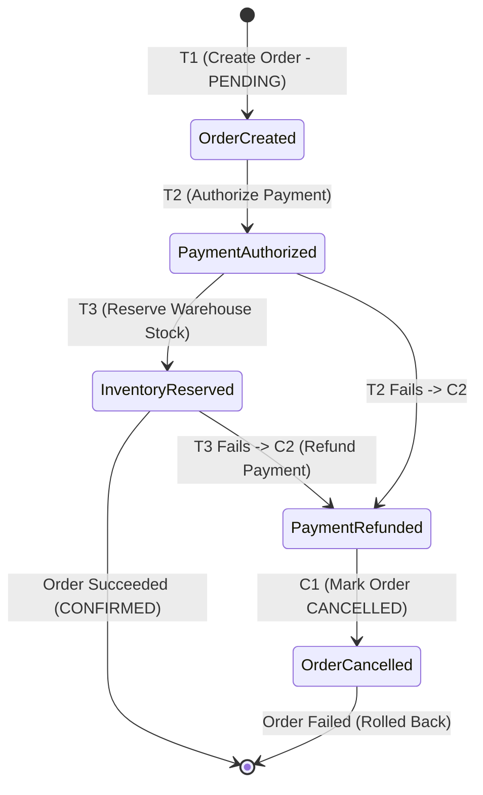

# Chapter 05: Distributed Transactions & Saga Orchestration

> "A saga is a sequence of local transactions. Each local transaction updates the database and publishes a message or event to trigger the next local transaction in the saga. If a local transaction fails, the saga executes a series of compensating transactions that undo the changes that were made."  
> — *Chris Richardson, Microservice Patterns (Manning)*
>
> "Two-phase commit is the anti-availability protocol. By holding database locks across network boundaries, it couples the availability of all participants and turns a minor network glitch into a catastrophic distributed deadlock."  
> — *Neal Ford et al., Software Architecture: The Hard Parts (O'Reilly)*
>
> "Long-lived transactions holding locks across multiple systems are unacceptable in high-performance environments. Sagas replace strict serializability with compensating transactions and eventual consistency."  
> — *Hector Garcia-Molina & Kenneth Salem, Sagas (ACM 1987)*

---

## 💥 1. Why Two-Phase Commit (2PC / XA) Fails in Microservices

In monolithic architectures, multi-table consistency is maintained via ACID transactions. In microservices with **Database-per-Service**, an operation spanning multiple services cannot use a single database transaction.

Historically, distributed systems used **Two-Phase Commit (2PC / XA standard)**:

```
===================================================================================================
                                 TWO-PHASE COMMIT (2PC) BOTTLENECK
===================================================================================================

  Transaction Coordinator                Order DB (Node 1)                 Payment DB (Node 2)
             │                                   │                                  │
             ├── 1. Prepare (Vote Request) ─────►│                                  │
             ├── 1. Prepare (Vote Request) ──────┼─────────────────────────────────►│
             │                                   │ (Acquires Row Lock)              │ (Acquires Row Lock)
             │◄─ 2. Vote: Commit ────────────────┤                                  │
             │◄─ 2. Vote: Commit ────────────────┼──────────────────────────────────┤
             │                                   │                                  │
             ├── 3. Commit Broadcast ───────────►│ (Commits & Releases Lock)        │
             ├── 3. Commit Broadcast ────────────┼─────────────────────────────────►│ (Commits & Releases)
```

### The Fatal Flaws of 2PC:
1. **The Blocking Coordinator Hazard:** If the coordinator crashes after phase 1, all participating databases must hold row locks indefinitely, causing cascading thread pool exhaustion.
2. **Network Partition Latency:** Row locks are held across wide-area network (WAN) round trips. Throughput drops by orders of magnitude:
$$\text{Max Throughput} \propto \frac{1}{\text{Network RTT} \times \text{Lock Duration}}$$
3. **Cloud & NoSQL Incompatibility:** Modern cloud datastores (MongoDB, DynamoDB, Cassandra, Apache Kafka) do not support XA protocols.

---

## 📜 2. The Saga Pattern & Transaction Classifications

A **Saga** breaks a distributed transaction into a sequence of isolated **local ACID transactions**:

$$T_1, T_2, T_3, \dots, T_n$$

If step $T_i$ fails, the Saga executes **Compensating Transactions** in reverse order to restore semantic consistency:

$$C_{i-1}, C_{i-2}, \dots, C_1$$

```
===================================================================================================
                                     SAGA TRANSACTION PHASES
===================================================================================================

  Happy Path:      [ T1: Create Order ] ──► [ T2: Reserve Credit ] ──► [ T3: Reserve Inventory ]
                         (Success)                (Success)                 (Success) -> Order Completed

  Failure Path:    [ T1: Create Order ] ──► [ T2: Reserve Credit ] ──► [ T3: Inventory FAILS! ]
                         (Success)                (Success)                 │
                             ▲                        ▲                     ▼
                             │                        │             Trigger Compensations
                   [ C1: Cancel Order ] ◄── [ C2: Refund Credit ] ◄─────────┘
```



### 2.1 The Three Saga Transaction Categories
1. **Compensable Transactions ($T_1 \dots T_{p-1}$):** Steps that can be semantically undone by executing a corresponding compensating transaction ($C_k$).
2. **Pivot Transaction ($T_p$):** The point-of-no-return. If $T_p$ commits, the Saga is guaranteed to proceed to completion. If $T_p$ aborts, all prior steps are compensated.
3. **Retriable Transactions ($T_{p+1} \dots T_n$):** Steps executed after the pivot transaction that **cannot fail** and must be retried with exponential backoff until successful.

---

## 🔀 3. Choreography vs. Orchestration Sagas

| Dimension | Choreography (Decentralized Events) | Orchestration (Central State Machine) |
| :--- | :--- | :--- |
| **Coordination** | Services publish and subscribe to events via Kafka/RabbitMQ without a coordinator. | A centralized **Saga Orchestrator** sends command messages to participant services. |
| **Coupling** | Low coupling; services know only about event schemas. | Medium coupling; orchestrator must invoke participant commands. |
| **Observability** | **Poor.** Difficult to trace the state of a distributed transaction without distributed tracing. | **Excellent.** The orchestrator state machine is the single point of truth for transaction state. |
| **Cyclic Dependency**| **High Risk.** High risk of cyclic event storms ("distributed spaghetti"). | **Zero Risk.** Central coordinator directs the workflow sequence linearly. |
| **Ideal Use Case** | Simple 2–3 step workflows. | Complex enterprise multi-step transactions (e.g. 5+ services with compensation). |

---

## 💻 4. Inline Implementations: Saga Orchestration & Compensation

To illustrate production engineering, we implement an **Order Checkout Saga Orchestrator** managing Order, Payment, and Inventory steps with automatic compensating rollbacks in:
1. **Spring Boot 3 (Java 21 Virtual Threads)**
2. **Golang (Go 1.22+ Concurrency)**
3. **Python / FastAPI (Asyncio State Machine)**

---

### 4.1 Spring Boot 3 Saga Orchestrator (Java 21)

```java
package com.enterprise.saga.orchestrator;

import org.slf4j.Logger;
import org.slf4j.LoggerFactory;
import org.springframework.stereotype.Service;

import java.util.UUID;

// 1. Saga Orchestrator coordinating Order, Payment, and Inventory with Compensation
@Service
public class OrderSagaOrchestrator {
    private static final Logger log = LoggerFactory.getLogger(OrderSagaOrchestrator.class);

    private final OrderServiceClient orderClient;
    private final PaymentServiceClient paymentClient;
    private final InventoryServiceClient inventoryClient;

    public OrderSagaOrchestrator(OrderServiceClient o, PaymentServiceClient p, InventoryServiceClient i) {
        this.orderClient = o;
        this.paymentClient = p;
        this.inventoryClient = i;
    }

    public boolean executeOrderSaga(UUID orderId, UUID customerId, long amountCents, String sku, int qty) {
        log.info("Starting Saga for Order ID: {}", orderId);

        // Step 1: Compensable - Create Pending Order
        if (!orderClient.createPendingOrder(orderId, customerId)) {
            log.error("Saga Step 1 Failed: Could not create order");
            return false;
        }

        // Step 2: Compensable - Authorize Payment
        if (!paymentClient.authorizePayment(orderId, customerId, amountCents)) {
            log.warn("Saga Step 2 Failed: Payment denied. Triggering Compensation C1...");
            orderClient.cancelOrder(orderId); // C1: Cancel Order
            return false;
        }

        // Step 3: Pivot / Critical - Reserve Inventory
        if (!inventoryClient.reserveInventory(orderId, sku, qty)) {
            log.warn("Saga Step 3 Failed: Out of stock! Triggering Compensations C2 -> C1...");
            paymentClient.refundPayment(orderId, customerId, amountCents); // C2: Refund
            orderClient.cancelOrder(orderId);                             // C1: Cancel Order
            return false;
        }

        // Step 4: Retriable - Finalize Order
        orderClient.confirmOrder(orderId);
        log.info("Saga Completed Successfully for Order ID: {}", orderId);
        return true;
    }
}

// Dummy client interfaces
interface OrderServiceClient {
    boolean createPendingOrder(UUID id, UUID customerId);
    void cancelOrder(UUID id);
    void confirmOrder(UUID id);
}

interface PaymentServiceClient {
    boolean authorizePayment(UUID id, UUID customerId, long amount);
    void refundPayment(UUID id, UUID customerId, long amount);
}

interface InventoryServiceClient {
    boolean reserveInventory(UUID id, String sku, int qty);
}
```

---

### 4.2 Golang Saga Orchestrator (Go 1.22+)

```go
package main

import (
	"context"
	"errors"
	"fmt"
	"log"
	"time"
)

// SagaStep defines an executable action and its compensating reversal
type SagaStep struct {
	Name       string
	Execute    func(ctx context.Context) error
	Compensate func(ctx context.Context) error
}

type OrderSagaOrchestrator struct {
	steps []SagaStep
}

func NewOrderSaga(orderID string, amount int64) *OrderSagaOrchestrator {
	return &OrderSagaOrchestrator{
		steps: []SagaStep{
			{
				Name: "CreatePendingOrder",
				Execute: func(ctx context.Context) error {
					log.Printf("[%s] Step 1: Order marked PENDING in database", orderID)
					return nil
				},
				Compensate: func(ctx context.Context) error {
					log.Printf("[%s] C1: Order marked CANCELLED in database", orderID)
					return nil
				},
			},
			{
				Name: "AuthorizePayment",
				Execute: func(ctx context.Context) error {
					log.Printf("[%s] Step 2: Payment authorized for %d cents", orderID, amount)
					return nil
				},
				Compensate: func(ctx context.Context) error {
					log.Printf("[%s] C2: Payment refunded for %d cents", orderID, amount)
					return nil
				},
			},
			{
				Name: "ReserveInventory",
				Execute: func(ctx context.Context) error {
					// Simulate out-of-stock failure
					log.Printf("[%s] Step 3: Checking inventory...", orderID)
					return errors.New("insufficient inventory stock")
				},
				Compensate: func(ctx context.Context) error {
					log.Printf("[%s] C3: Stock released back to warehouse", orderID)
					return nil
				},
			},
		},
	}
}

func (s *OrderSagaOrchestrator) Run(ctx context.Context) error {
	executedSteps := make([]SagaStep, 0)

	for _, step := range s.steps {
		log.Printf("Executing Saga Step: %s", step.Name)
		if err := step.Execute(ctx); err != nil {
			log.Printf("Saga Step %s FAILED: %v. Initiating Compensation Pipeline...", step.Name, err)
			s.rollback(ctx, executedSteps)
			return fmt.Errorf("saga failed at step %s: %w", step.Name, err)
		}
		executedSteps = append(executedSteps, step)
	}

	log.Println("Saga Executed Successfully!")
	return nil
}

func (s *OrderSagaOrchestrator) rollback(ctx context.Context, executed []SagaStep) {
	// Execute compensations in strict REVERSE order
	for i := len(executed) - 1; i >= 0; i-- {
		step := executed[i]
		log.Printf("Executing Compensation: %s", step.Name)
		if err := step.Compensate(ctx); err != nil {
			log.Printf("CRITICAL: Compensation %s failed: %v", step.Name, err)
		}
	}
}

func main() {
	ctx, cancel := context.WithTimeout(context.Background(), 5*time.Second)
	defer cancel()

	saga := NewOrderSaga("ORD-98124", 15000)
	if err := saga.Run(ctx); err != nil {
		log.Printf("Order checkout aborted: %v", err)
	}
}
```

---

### 4.3 Python / FastAPI Saga State Machine (Asyncio)

```python
"""
Distributed Saga Orchestrator in Python using FastAPI & Asyncio.
Provides automatic rollback and compensating transactions.
"""

from typing import Callable, Coroutine, List
from uuid import uuid4
from fastapi import FastAPI, HTTPException, status
from pydantic import BaseModel


class Step:
    def __init__(
        self,
        name: str,
        action: Callable[[], Coroutine],
        compensation: Callable[[], Coroutine],
    ):
        self.name = name
        self.action = action
        self.compensation = compensation


class CheckoutSaga:
    def __init__(self, order_id: str, amount: float):
        self.order_id = order_id
        self.amount = amount
        self.executed_steps: List[Step] = []

    async def step_create_order(self):
        print(f"[{self.order_id}] Step 1: Order created (PENDING)")

    async def compensate_cancel_order(self):
        print(f"[{self.order_id}] C1: Order status set to CANCELLED")

    async def step_charge_card(self):
        print(f"[{self.order_id}] Step 2: Charged ${self.amount} to credit card")

    async def compensate_refund_card(self):
        print(f"[{self.order_id}] C2: Refunded ${self.amount} to credit card")

    async def step_allocate_inventory(self):
        print(f"[{self.order_id}] Step 3: Checking warehouse stock...")
        # Simulate inventory out of stock
        raise RuntimeError("Out of Stock: Item unavailable")

    async def compensate_release_inventory(self):
        print(f"[{self.order_id}] C3: Released inventory allocation")

    async def execute(self) -> bool:
        pipeline = [
            Step("OrderCreation", self.step_create_order, self.compensate_cancel_order),
            Step("PaymentCharge", self.step_charge_card, self.compensate_refund_card),
            Step("InventoryAllocation", self.step_allocate_inventory, self.compensate_release_inventory),
        ]

        for step in pipeline:
            try:
                print(f"Executing: {step.name}")
                await step.action()
                self.executed_steps.append(step)
            except Exception as exc:
                print(f"FAILED: {step.name} with error: {exc}. Starting Rollback...")
                await self.rollback()
                return False
        return True

    async def rollback(self):
        # Compensate in reverse order
        for step in reversed(self.executed_steps):
            print(f"Compensating: {step.name}")
            await step.compensation()


app = FastAPI(title="Saga Orchestrator API")


@app.post("/checkout", status_code=status.HTTP_200_OK)
async def checkout_endpoint():
    order_id = f"ORD-{uuid4()}"
    saga = CheckoutSaga(order_id, 149.99)
    success = await saga.execute()
    if not success:
        raise HTTPException(
            status_code=status.HTTP_409_CONFLICT,
            detail="Checkout failed: Transaction compensated successfully",
        )
    return {"order_id": order_id, "status": "CONFIRMED"}
```

---

## 🚨 5. Failure Modes, Concurrency Anomalies & Production Triage

```
===================================================================================================
                                   SAGA ANOMALY TRIAGE RUNBOOK
===================================================================================================

  Anomaly: Lack of Isolation (ACID 'I') & Dirty Reads
  ├── Symptom: Customer sees Order as 'CONFIRMED', but it is cancelled 2 seconds later by a compensation!
  ├── Root Cause: Local transactions commit immediately before downstream saga steps finish.
  └── Triage: Apply Semantic Locking: Mark resource with status 'PENDING' until Pivot transaction commits;
              forbid external updates while resource is in PENDING state.

  Anomaly: Zombie Compensation Failure (Compensation Crashes)
  ├── Symptom: A compensating transaction fails with HTTP 500 or network timeout, leaving system corrupt!
  ├── Root Cause: Compensating transaction assumed 100% network reliability.
  └── Triage: Rule: Compensating transactions MUST be idempotent and MUST be retried indefinitely
              via a durable dead-letter queue or persistent outbox until HTTP 200 is confirmed.

  Anomaly: Concurrent Lost Updates
  ├── Symptom: Two parallel Sagas read the same account balance simultaneously and overwrite each other.
  ├── Root Cause: No distributed lock across separate local transactions.
  └── Triage: Apply Optimistic Concurrency Control (OCC) with version numbers ('WHERE version = 5')
              or enforce commutative updates ('UPDATE account SET balance = balance - 50').
===================================================================================================
```
