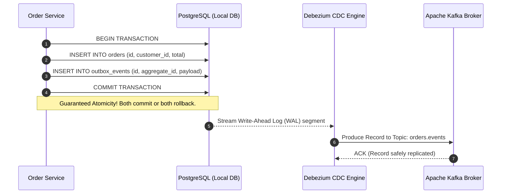

# Chapter 06: Transactional Outbox Pattern & CDC Ingestion

> "If you update a database and publish an event to a message broker in an application service, you have created a dual-write vulnerability. Without distributed transactions, one of those operations can fail while the other succeeds, corrupting system state."  
> — *Chris Richardson, Microservice Patterns (Manning)*
>
> "The database commit log is the ultimate source of truth. By tailing the Write-Ahead Log (WAL) through Change Data Capture (CDC), we can stream state changes directly into event brokers with zero dual-write vulnerabilities and zero polling overhead."  
> — *Martin Kleppmann, Designing Data-Intensive Applications (O'Reilly)*

---

## ⚡ 1. The Dual-Write Hazard: Why Application-Level Publishing Fails

In event-driven microservices, a service frequently needs to mutate its local database and emit an event to a message broker (e.g., creating an order and notifying downstream services via Kafka):

```python
# THE FATAL DUAL-WRITE ANTI-PATTERN:
db.commit()  # Step 1: Database transaction commits successfully
kafka.send("order-created", order_id)  # Step 2: Publish event to Kafka
```

```
===================================================================================================
                                  THE DUAL-WRITE FAILURE MATRIX
===================================================================================================

  Failure Mode A: Crash after Database Commit
  1. db.commit() commits to PostgreSQL.
  2. The server process crashes or loses network before kafka.send() executes.
  ==> CRITICAL BUG: Order exists in DB, but downstream services NEVER receive the event!

  Failure Mode B: Kafka Succeeds, Database Aborts
  1. Application calls kafka.send() first.
  2. db.commit() fails due to unique constraint or connection timeout and ROLLS BACK!
  ==> CRITICAL BUG: Ghost event sent to Kafka! Downstream charges credit card for non-existent order!
===================================================================================================
```

Because distributed two-phase commit (2PC) between relational databases and Apache Kafka is unsupported, application-level dual-writes inevitably cause permanent data corruption.

---

## 📦 2. The Transactional Outbox Pattern Architecture

The **Transactional Outbox Pattern** solves the dual-write hazard by leveraging the database's own local ACID transaction:
1. Instead of publishing directly to Kafka, the service writes the domain entity AND an `outbox` record into the **exact same database transaction**.
2. A separate message relay reads the `outbox` table and publishes events to the broker.

```
===================================================================================================
                             TRANSACTIONAL OUTBOX PATTERN TOPOLOGY
===================================================================================================

                                 [ Order Service ]
                                         │
                                         ▼ (Single Local ACID Transaction)
                    +--------------------+--------------------+
                    |                                         |
                    v INSERT INTO orders                      v INSERT INTO outbox_events
          +--------------------+                    +--------------------+
          |   orders table     |                    | outbox_events table|
          | - id: "ORD-101"    |                    | - id: uuid         |
          | - status: "PENDING"|                    | - aggregate: "ORD" |
          | - total: 15000     |                    | - type: "CREATED"  |
          +--------------------+                    | - payload: JSON    |
                                                    +---------+----------+
                                                              │
                                +─────────────────────────────+
                                │
                                ▼ [ Message Relay Engine ]
           +────────────────────┴────────────────────+
           │ Option A: Polling Publisher             │ Option B: Change Data Capture (CDC)
           │ (SELECT FOR UPDATE SKIP LOCKED)         │ (Debezium tailing PostgreSQL WAL)
           +────────────────────┬────────────────────+
                                │
                                ▼ (Guaranteed At-Least-Once Delivery)
                      [ Apache Kafka Broker ]
                                │
                                ▼
                     [ Downstream Services ]
```



---

## 🔍 3. Outbox Publishing: Polling Publisher vs. CDC (Debezium)

| Feature | Polling Publisher (`SELECT ...`) | Change Data Capture (CDC via Debezium) |
| :--- | :--- | :--- |
| **Mechanism** | Periodic scheduled query: `SELECT * FROM outbox WHERE status='PENDING' FOR UPDATE SKIP LOCKED`. | Tunnels directly into the database engine's **Write-Ahead Log (WAL)** or binary replication stream. |
| **Database Load** | **High.** Continuous polling stresses database CPU and creates table vacuum bloat. | **Near Zero.** Zero database query overhead; reads disk WAL sequentially. |
| **Event Latency** | Polling interval delay ($1\text{s} - 5\text{s}$). | **Sub-millisecond** ($< 10\text{ms}$ from commit to Kafka). |
| **Schema Coupling**| Requires adding and updating `status` and `processed_at` columns. | Completely non-invasive; can even drop outbox rows immediately. |
| **Operational Effort**| Simple (standard application code). | Requires Kafka Connect cluster and database replication privileges. |

---

## 💻 4. Inline Implementations: Transactional Outbox & Idempotent Consumer

To demonstrate production engineering, we implement:
1. **Spring Boot 3 (Java 21 Virtual Threads)**: JPA entity transaction writing to both tables atomically + Debezium-compatible Outbox schema.
2. **Golang (Go 1.22+)**: Atomic SQL transaction with a concurrent worker executing `SELECT ... FOR UPDATE SKIP LOCKED` and publishing to Kafka.
3. **Python / FastAPI (Python 3.11+)**: SQLAlchemy async atomic transaction + Idempotent consumer verifying duplicate event prevention.

---

### 4.1 Spring Boot 3 Transactional Outbox Implementation (Java 21)

```java
package com.enterprise.order.outbox;

import jakarta.persistence.*;
import org.springframework.stereotype.Service;
import org.springframework.transaction.annotation.Transactional;

import java.time.Instant;
import java.util.UUID;

// 1. Outbox Database Entity
@Entity
@Table(name = "outbox_events")
public class OutboxEvent {
    @Id
    private UUID id;
    
    @Column(nullable = false)
    private String aggregateType;
    
    @Column(nullable = false)
    private String aggregateId;
    
    @Column(nullable = false)
    private String eventType;
    
    @Column(columnDefinition = "TEXT", nullable = false)
    private String payload;
    
    @Column(nullable = false)
    private Instant createdAt;

    protected OutboxEvent() {}

    public OutboxEvent(String aggregateType, String aggregateId, String eventType, String payload) {
        this.id = UUID.randomUUID();
        this.aggregateType = aggregateType;
        this.aggregateId = aggregateId;
        this.eventType = eventType;
        this.payload = payload;
        this.createdAt = Instant.now();
    }
}
```

```java
package com.enterprise.order.service;

import com.enterprise.order.outbox.OutboxEvent;
import jakarta.persistence.EntityManager;
import org.springframework.stereotype.Service;
import org.springframework.transaction.annotation.Transactional;

import java.math.BigDecimal;
import java.util.UUID;

// 2. Order Service: Guaranteed Atomic Commit of Business State + Outbox Event
@Service
public class OrderApplicationService {

    private final EntityManager entityManager;

    public OrderApplicationService(EntityManager entityManager) {
        this.entityManager = entityManager;
    }

    @Transactional
    public UUID placeOrder(UUID customerId, BigDecimal totalAmount) {
        UUID orderId = UUID.randomUUID();

        // 1. Insert into business table 'orders'
        OrderEntity order = new OrderEntity(orderId, customerId, totalAmount, "PENDING");
        entityManager.persist(order);

        // 2. Insert into 'outbox_events' inside the EXACT SAME transaction
        String jsonPayload = String.format("{\"orderId\":\"%s\",\"total\":%s}", orderId, totalAmount);
        OutboxEvent outbox = new OutboxEvent("ORDER", orderId.toString(), "OrderCreatedEvent", jsonPayload);
        entityManager.persist(outbox);

        // Both persist calls commit atomically when the method exits!
        return orderId;
    }
}
```

---

### 4.2 Golang Polling Publisher with `SKIP LOCKED` (Go 1.22+)

```go
package main

import (
	"context"
	"database/sql"
	"encoding/json"
	"fmt"
	"log"
	"time"

	_ "github.com/lib/pq"
)

type OutboxEvent struct {
	ID        string
	Payload   string
	EventType string
}

// 1. Atomically insert Order and Outbox row
func CreateOrderWithOutbox(ctx context.Context, db *sql.DB, customerID string, totalCents int64) (string, error) {
	tx, err := db.BeginTx(ctx, &sql.TxOptions{Isolation: sql.LevelReadCommitted})
	if err != nil {
		return "", err
	}
	defer tx.Rollback()

	orderID := fmt.Sprintf("ORD-%d", time.Now().UnixNano())

	// Insert into orders table
	_, err = tx.ExecContext(ctx, "INSERT INTO orders (id, customer_id, total_cents) VALUES ($1, $2, $3)",
		orderID, customerID, totalCents)
	if err != nil {
		return "", fmt.Errorf("failed to insert order: %w", err)
	}

	payload, _ := json.Marshal(map[string]interface{}{"order_id": orderID, "total": totalCents})

	// Insert into outbox table
	_, err = tx.ExecContext(ctx, "INSERT INTO outbox_events (id, aggregate_id, event_type, payload, status) VALUES ($1, $2, $3, $4, 'PENDING')",
		fmt.Sprintf("EVT-%d", time.Now().UnixNano()), orderID, "OrderCreated", string(payload))
	if err != nil {
		return "", fmt.Errorf("failed to insert outbox: %w", err)
	}

	return orderID, tx.Commit() // Atomically committed!
}

// 2. High-Performance Worker Polling Outbox with SKIP LOCKED
func StartOutboxRelayWorker(ctx context.Context, db *sql.DB) {
	ticker := time.NewTicker(500 * time.Millisecond)
	defer ticker.Stop()

	for {
		select {
		case <-ctx.Done():
			return
		case <-ticker.C:
			// Lock batch of rows without blocking other concurrent workers!
			tx, err := db.BeginTx(ctx, nil)
			if err != nil {
				continue
			}

			rows, err := tx.QueryContext(ctx, `
				SELECT id, event_type, payload 
				FROM outbox_events 
				WHERE status = 'PENDING' 
				ORDER BY created_at ASC 
				LIMIT 50 
				FOR UPDATE SKIP LOCKED`)
			if err != nil {
				tx.Rollback()
				continue
			}

			var events []OutboxEvent
			for rows.Next() {
				var e OutboxEvent
				rows.Scan(&e.ID, &e.EventType, &e.Payload)
				events = append(events, e)
			}
			rows.Close()

			for _, e := range events {
				// Publish to Kafka here...
				log.Printf("Published to Kafka: ID=%s, Type=%s", e.ID, e.EventType)

				// Mark processed or delete row
				tx.ExecContext(ctx, "UPDATE outbox_events SET status = 'PUBLISHED' WHERE id = $1", e.ID)
			}
			tx.Commit()
		}
	}
}
```

---

### 4.3 Python / FastAPI Idempotent Event Consumer (aiopg + Redis)

Because the Outbox Pattern guarantees **At-Least-Once** delivery, message brokers may deliver duplicate events. Downstream services must implement the **Idempotent Consumer Pattern**:

```python
"""
Idempotent Consumer in Python with FastAPI and Redis.
Guarantees duplicate messages from Kafka/RabbitMQ do not cause duplicate side effects.
"""

import json
from fastapi import FastAPI, HTTPException, status
from pydantic import BaseModel
import redis.asyncio as aioredis


class OrderCreatedEvent(BaseModel):
    event_id: str
    order_id: str
    amount_cents: int


app = FastAPI(title="Idempotent Payment Consumer")
redis_client = aioredis.from_url("redis://localhost:6379", decode_responses=True)


@app.post("/events/order-created", status_code=status.HTTP_200_OK)
async def consume_order_created(event: OrderCreatedEvent):
    dedup_key = f"processed_event:{event.event_id}"

    # Atomic SETNX (Set if Not eXists) with 24-hour expiration window
    is_new = await redis_client.set(dedup_key, "1", ex=86400, nx=True)

    if not is_new:
        # Duplicate message detected! Safely ACK and ignore without re-processing!
        return {"status": "DUPLICATE_IGNORED", "event_id": event.event_id}

    # Execute business logic (e.g., charge payment)
    print(f"Processing unique order event: {event.order_id} for {event.amount_cents} cents")

    return {"status": "PROCESSED", "order_id": event.order_id}
```

---

## 🚨 5. Failure Modes, Concurrency Anomalies & Production Triage

```
===================================================================================================
                                  OUTBOX ANOMALY TRIAGE RUNBOOK
===================================================================================================

  Anomaly: Outbox Table Bloat & Deadlock Contention
  ├── Symptom: High disk usage; query performance on outbox degrades sharply over time.
  ├── Root Cause: Accumulation of millions of 'PUBLISHED' rows without automated table purging.
  └── Triage: Either: (1) Use Debezium CDC and configure it to DROP rows on publish;
              or (2) Partition the outbox table by day and drop old partition tables via cron.

  Anomaly: Debezium CDC WAL Accumulation & Disk Exhaustion
  ├── Symptom: PostgreSQL disk fills up to 100%; database halts writes.
  ├── Root Cause: Debezium connector crashed or Kafka is down; PostgreSQL replication slot holds WAL files.
  └── Triage: Check replication slot lag: 'SELECT * FROM pg_replication_slots;';
              if connector is dead, drop stuck replication slot before restarting DB.

  Anomaly: Duplicate Side-Effects (Double-Charging Credit Cards)
  ├── Symptom: Customer charged twice for a single purchase.
  ├── Root Cause: Consumer re-processed an event after network timeout on offset commit.
  └── Triage: Rule: Every event consumer MUST enforce an Idempotency Table or Redis SETNX deduplication key.
===================================================================================================
```
