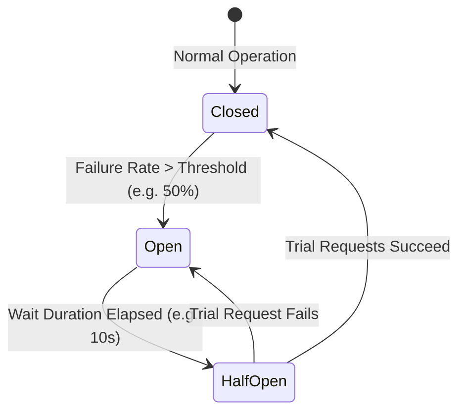

# Chapter 07: Resilience Patterns — Circuit Breakers, Bulkheads & Retries

> "A failure in a distributed system is inevitable. A cascading failure is an architectural choice. Circuit breakers, bulkheads, and timeouts protect your system from death by a thousand downstream cuts."  
> — *Michael T. Nygard, Release It! Design and Deploy Production-Ready Software (2nd Ed, Pragmatic Bookshelf)*
>
> "If you do not set timeouts on every single network call, you are gambling your uptime on the reliability of every other system on the network. The default timeout in software should never be infinite."  
> — *Sam Newman, Building Microservices (2nd Ed, O'Reilly)*

---

## ⚡ 1. The Cascading Failure Dynamics

In microservice architectures, services depend on other downstream services across a directed graph. If a low-level service (e.g., Recommendation Service) slows down from $50\text{ms}$ to $5\text{s}$ due to database lock contention:

```
===================================================================================================
                               CASCADING FAILURE PROPAGATION
===================================================================================================

  Client Requests (500 req/sec)
           │
           ▼
  +------------------+
  | API Gateway      |  - Worker threads wait for responses from Order Service.
  +--------+---------+
           │
           ▼
  +------------------+
  | Order Service    |  - Thread pool (200 threads) completely exhausted waiting on Inventory.
  +--------+---------+  - Incoming requests queue up, memory spikes, OOMKiller kills process!
           │
           ▼
  +------------------+
  | Inventory Svc    |  - Degraded (Slow disk I/O, responding in 5 seconds).
  +------------------+
```

Without resilience boundaries, **a latency spike in one non-critical service brings down the entire enterprise platform within seconds.**

---

## 🛡️ 2. The Core Resilience Triad: Circuit Breaker, Bulkhead & Jittered Retry

```
===================================================================================================
                                THE RESILIENCE PATTERN SUITE
===================================================================================================

  1. Circuit Breaker: Trippable Electrical Switch
     - Detects downstream failure rates.
     - Trips to OPEN to fail fast in 0ms, shielding downstream systems from load.

  2. Bulkhead Isolation: Watertight Ship Compartments
     - Partitions thread pools and connection sockets.
     - A failure in the Recommendation pool cannot exhaust the Payment pool.

  3. Exponential Backoff with Full Jitter: Anti-Thundering-Herd
     - Retries transient errors with randomized exponential delay.
     - Prevents synchronized retry waves from crushing recovering databases.
```

### 2.1 The Circuit Breaker State Machine



- **`CLOSED` (Normal):** All traffic passes to downstream. The breaker measures failure rate across a sliding window.
- **`OPEN` (Tripped):** Upstream fails fast immediately without executing network calls! Returns cached fallback or error in $< 1\text{ms}$.
- **`HALF-OPEN` (Probing):** Allows a limited trial batch of requests through. If they succeed, resets to `CLOSED`; if any fails, trips back to `OPEN`.

### 2.2 Exponential Backoff with Full Jitter Math
When 1,000 clients fail simultaneously, retrying at fixed intervals ($1\text{s}, 2\text{s}, 4\text{s}$) causes **Retry Amplification Storms** (Thundering Herd).

Under **Full Jitter** (*AWS Architecture Lab, Michael Nygard*):
$$T_{\text{sleep}} = \text{random}\left(0, \, \min(M, \, B \times 2^{\text{attempt}})\right)$$
Where $B$ is base backoff (e.g. $100\text{ms}$) and $M$ is max ceiling (e.g. $10\text{s}$). The randomized distribution completely flattens spike load on recovering services.

---

## 💻 3. Inline Implementations: Circuit Breaker, Bulkhead & Jitter

To demonstrate production resilience, we implement:
1. **Spring Boot 3 (Java 21 + Resilience4j)**: Circuit breaker with fallback, semaphore bulkhead, and jittered retry.
2. **Golang (Go 1.22+)**: Thread-safe Circuit Breaker state machine with mutex, sliding window, and exponential backoff retry.
3. **Python / FastAPI (Python 3.11+)**: Async Circuit Breaker decorator with asyncio semaphore bulkhead.

---

### 3.1 Spring Boot 3 Resilience4j Implementation (Java 21)

```java
package com.enterprise.order.infrastructure.resilience;

import io.github.resilience4j.bulkhead.annotation.Bulkhead;
import io.github.resilience4j.circuitbreaker.annotation.CircuitBreaker;
import io.github.resilience4j.retry.annotation.Retry;
import org.slf4j.Logger;
import org.slf4j.LoggerFactory;
import org.springframework.stereotype.Service;
import org.springframework.web.client.RestTemplate;

import java.util.Collections;
import java.util.List;

@Service
public class ResilientCatalogClient {
    private static final Logger log = LoggerFactory.getLogger(ResilientCatalogClient.class);
    private final RestTemplate restTemplate;

    public ResilientCatalogClient(RestTemplate restTemplate) {
        this.restTemplate = restTemplate;
    }

    // 1. Protected downstream call combining Circuit Breaker, Bulkhead, and Retry
    @CircuitBreaker(name = "catalogService", fallbackMethod = "getCatalogFallback")
    @Bulkhead(name = "catalogBulkhead", type = Bulkhead.Type.SEMAPHORE)
    @Retry(name = "catalogRetry")
    public List<String> getProductCatalog(String category) {
        log.info("Invoking downstream Catalog Service for category: {}", category);
        String url = "http://catalog-service.internal:8080/products?category=" + category;
        return restTemplate.getForObject(url, List.class);
    }

    // 2. Graceful Degraded Fallback: Executed in 0ms when Circuit is OPEN
    public List<String> getCatalogFallback(String category, Throwable t) {
        log.warn("Catalog Service UNREACHABLE (Circuit OPEN or Timeout). Triggering fallback. Cause: {}", t.getMessage());
        return List.of("Default-Product-A", "Default-Product-B"); // Safe cached response
    }
}
```

#### `application.yml` Production Configuration:
```yaml
resilience4j:
  circuitbreaker:
    instances:
      catalogService:
        slidingWindowType: COUNT_BASED
        slidingWindowSize: 20
        failureRateThreshold: 50.0        # Trip if 50% of last 20 calls fail
        waitDurationInOpenState: 10000ms  # Stay OPEN for 10 seconds before HALF-OPEN
        permittedNumberOfCallsInHalfOpenState: 5
        slowCallRateThreshold: 75.0       # Trip if calls take longer than slowCallDuration
        slowCallDurationThreshold: 2000ms
  bulkhead:
    instances:
      catalogBulkhead:
        maxConcurrentCalls: 25            # Max 25 concurrent threads dedicated to catalog
        maxWaitDuration: 100ms
  retry:
    instances:
      catalogRetry:
        maxAttempts: 3
        waitDuration: 200ms
        enableExponentialBackoff: true
        exponentialBackoffMultiplier: 2.0
```

---

### 3.2 Golang Thread-Safe Circuit Breaker (Go 1.22+)

```go
package main

import (
	"context"
	"errors"
	"fmt"
	"log"
	"math/rand"
	"sync"
	"time"
)

type State int

const (
	StateClosed State = iota
	StateOpen
	StateHalfOpen
)

type CircuitBreaker struct {
	sync.Mutex
	state            State
	failureThreshold int
	failureCount     int
	openTimeout      time.Duration
	lastStateChange  time.Time
}

func NewCircuitBreaker(threshold int, timeout time.Duration) *CircuitBreaker {
	return &CircuitBreaker{
		state:            StateClosed,
		failureThreshold: threshold,
		openTimeout:      timeout,
		lastStateChange:  time.Now(),
	}
}

func (cb *CircuitBreaker) Execute(fn func() error) error {
	cb.Lock()
	now := time.Now()

	switch cb.state {
	case StateOpen:
		if now.Sub(cb.lastStateChange) > cb.openTimeout {
			log.Println("Circuit transition: OPEN -> HALF-OPEN (Testing probe)")
			cb.state = StateHalfOpen
		} else {
			cb.Unlock()
			return errors.New("circuit breaker is OPEN: fast failing request")
		}
	}
	cb.Unlock()

	// Execute downstream function
	err := fn()

	cb.Lock()
	defer cb.Unlock()

	if err != nil {
		cb.failureCount++
		if cb.failureCount >= cb.failureThreshold || cb.state == StateHalfOpen {
			log.Println("Circuit transition: -> OPEN (Downstream failing)")
			cb.state = StateOpen
			cb.lastStateChange = time.Now()
		}
		return err
	}

	// Success
	if cb.state == StateHalfOpen {
		log.Println("Circuit transition: HALF-OPEN -> CLOSED (Recovered)")
		cb.state = StateClosed
		cb.failureCount = 0
	}
	return nil
}

// Exponential Backoff with Full Jitter
func RetryWithFullJitter(ctx context.Context, attempts int, base time.Duration, max time.Duration, fn func() error) error {
	for i := 0; i < attempts; i++ {
		err := fn()
		if err == nil {
			return nil
		}
		if i == attempts-1 {
			return err
		}

		// Calculate randomized exponential delay
		temp := float64(base) * float64(1<<i)
		if temp > float64(max) {
			temp = float64(max)
		}
		sleepDuration := time.Duration(rand.Int63n(int64(temp)))

		log.Printf("Attempt %d failed: %v. Retrying in %v...", i+1, err, sleepDuration)
		select {
		case <-ctx.Done():
			return ctx.Err()
		case <-time.After(sleepDuration):
		}
	}
	return nil
}

func main() {
	cb := NewCircuitBreaker(3, 5*time.Second)

	// Simulate calling unreliable service
	for i := 0; i < 8; i++ {
		err := cb.Execute(func() error {
			if i < 4 {
				return errors.New("503 Service Unavailable")
			}
			return nil
		})
		if err != nil {
			log.Printf("Call %d: %v", i+1, err)
		} else {
			log.Printf("Call %d: SUCCESS", i+1)
		}
		time.Sleep(1 * time.Second)
	}
}
```

---

### 3.3 Python / FastAPI Async Circuit Breaker & Bulkhead

```python
"""
Async Circuit Breaker & Bulkhead in Python with FastAPI and Asyncio.
"""

import asyncio
from enum import Enum
import time
from typing import Callable, Coroutine
from fastapi import FastAPI, HTTPException, status


class CircuitState(Enum):
    CLOSED = "CLOSED"
    OPEN = "OPEN"
    HALF_OPEN = "HALF_OPEN"


class AsyncCircuitBreaker:
    def __init__(self, failure_threshold: int = 3, recovery_time: float = 10.0):
        self.failure_threshold = failure_threshold
        self.recovery_time = recovery_time
        self.state = CircuitState.CLOSED
        self.failure_count = 0
        self.last_state_change = 0.0

    async def call(self, coro_func: Callable[[], Coroutine], fallback: Callable[[], Coroutine]):
        now = time.time()

        if self.state == CircuitState.OPEN:
            if now - self.last_state_change > self.recovery_time:
                print("Transition: OPEN -> HALF-OPEN (Testing probe)")
                self.state = CircuitState.HALF_OPEN
            else:
                print("Circuit is OPEN: Returning Fallback in 0ms")
                return await fallback()

        try:
            result = await coro_func()
            if self.state == CircuitState.HALF_OPEN:
                print("Transition: HALF-OPEN -> CLOSED (Service restored)")
                self.state = CircuitState.CLOSED
                self.failure_count = 0
            return result
        except Exception as exc:
            self.failure_count += 1
            if self.failure_count >= self.failure_threshold or self.state == CircuitState.HALF_OPEN:
                print("Transition: -> OPEN (Trip threshold exceeded)")
                self.state = CircuitState.OPEN
                self.last_state_change = now
            return await fallback()


# Bulkhead Semaphore (Limits concurrent outbound calls to 10)
bulkhead_semaphore = asyncio.Semaphore(10)
breaker = AsyncCircuitBreaker(failure_threshold=3, recovery_time=5.0)

app = FastAPI(title="Resilience Demo API")


async def call_downstream_inventory():
    # Acquire Bulkhead lease
    async with bulkhead_semaphore:
        # Simulate network latency and failure
        await asyncio.sleep(0.1)
        raise ConnectionError("Inventory database socket timeout")


async def inventory_fallback():
    return {"status": "DEGRADED", "items": ["Cached-Default-Item"]}


@app.get("/items")
async def get_items():
    return await breaker.call(call_downstream_inventory, inventory_fallback)
```

---

## 🚨 4. Failure Modes, Concurrency Anomalies & Production Triage

```
===================================================================================================
                                 RESILIENCE TRIAGE RUNBOOK
===================================================================================================

  Anomaly: Circuit Breaker Flapping (Half-Open Oscillation)
  ├── Symptom: Breaker alternates rapidly between OPEN and HALF-OPEN, causing intermittent errors.
  ├── Root Cause: Probe traffic volume in HALF-OPEN state too high; recovering service gets overwhelmed.
  └── Triage: Increase permittedNumberOfCallsInHalfOpenState gradually; increase waitDurationInOpenState.

  Anomaly: Retry Storm (Self-Inflicted DDoS)
  ├── Symptom: Database recovers from outage, but immediately crashes again from 100k incoming retries.
  ├── Root Cause: Retries implemented without jitter (fixed sleep); all clients hit database simultaneously.
  └── Triage: Rule: NEVER retry without Exponential Backoff + Full Jitter; enforce Global Rate Limiter.

  Anomaly: Bulkhead Semaphore Leakage
  ├── Symptom: Service stops making outbound calls; threads blocked indefinitely awaiting semaphore lease.
  ├── Root Cause: Exception thrown before semaphore.release() executed (missing finally/context manager).
  └── Triage: Always use language context managers ('try-with-resources' in Java, 'defer' in Go, 'async with' in Python).
===================================================================================================
```
