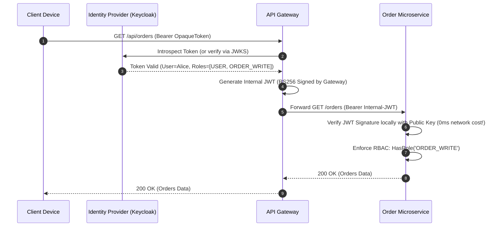

# Chapter 08: Security & Identity — OAuth2, OIDC, JWT & Zero-Trust mTLS

> "The perimeter security model—hard on the outside, soft on the inside—is obsolete. In microservices, we must assume the internal network is already hostile. Every service must verify identity, authenticate every packet, and enforce least privilege."  
> — *Evan Gilman & Doug Barth, Zero Trust Networks (O'Reilly)*
>
> "To prevent downstream microservices from continually reaching back to a centralized Identity Provider, the API Gateway validates external credentials once and forwards an internally signed JSON Web Token (JWT)."  
> — *Chris Richardson, Microservice Patterns (Manning)*

---

## 🔒 1. The Death of Perimeter Security & Zero-Trust Foundations

Historically, enterprise networks relied on **Perimeter Defense**: firewalls guarded the outer perimeter, while internal microservices communicated unauthenticated over plain HTTP.

This model collapses under real-world threats:
- **Lateral Movement:** If an attacker compromises a single non-critical microservice (e.g. through a vulnerable Python library), they gain unrestricted access to all internal databases and services.
- **Insider Threats & Cloud Multi-Tenancy:** In shared Kubernetes clusters, rogue containers or misconfigured pods can intercept inter-service traffic.

Under **Zero Trust Architecture**, the core principle is:
$$\textbf{Never Trust, Always Verify.}$$

---

## 🔑 2. The Identity Pipeline: OAuth 2.0, OIDC & Gateway Token Translation

```
===================================================================================================
                             GATEWAY TOKEN TRANSLATION ARCHITECTURE
===================================================================================================

  [ Client Browser / Mobile ]
               │
               ├── 1. POST /oauth/token (Auth Code + PKCE) ──► [ Identity Provider (IdP) ]
               │◄── 2. Returns Opaque Access Token ────────────┤ (Keycloak / Okta / Auth0)
               │
               ▼ 3. HTTPS Request: [ Authorization: Bearer <opaque-token> ]
  +-----------------------------------------------------------------------------------------------+
  |                                         API GATEWAY                                           |
  |  - Validates token against IdP (or caches introspection)                                      |
  |  - Extracts User Identity, Roles, and Tenant ID                                              |
  |  - Signs an Internal Microservice JWT using Gateway's Private Key (RS256)                     |
  +-----------------------------------------------+-----------------------------------------------+
                                                  │
                 +--------------------------------+--------------------------------+
                 │ 4. Forwards Request: [ Authorization: Bearer <internal-jwt> ]    │
                 ▼                                                                 ▼
      +----------------------+                                          +----------------------+
      |    Order Service     |                                          |   Payment Service    |
      | - Verifies JWT local |                                          | - Verifies JWT local |
      |   using Gateway PK   |                                          |   using Gateway PK   |
      | - Enforces RBAC      |                                          | - Enforces RBAC      |
      +----------------------+                                          +----------------------+
```



### 2.1 Asymmetric Token Verification (Zero-Network Validation)
Downstream microservices verify internal JWTs using the Gateway's **Public Key (JWKS)**:
- **Private Key:** Guarded exclusively by the Gateway or IdP; used to cryptographically sign tokens.
- **Public Key:** Distributed or cached by microservices; verifies signature authenticity and expiration (`exp`) in **$< 0.1\text{ms}$** without making any outbound network calls!

---

## 🛡️ 3. Service-to-Service Zero-Trust with mTLS (SPIFFE/SPIRE)

While JWT establishes **User Identity (Who is making the request?)**, **Mutual TLS (mTLS)** establishes **Workload Identity (Which pod is talking?)**:

```
===================================================================================================
                                      MUTUAL TLS (mTLS) HANDSHAKE
===================================================================================================

  [ Order Pod (Client) ]                                              [ Payment Pod (Server) ]
  SPIFFE ID:                                                          SPIFFE ID:
  spiffe://cluster.local/ns/prod/sa/order-sa                          spiffe://cluster.local/ns/prod/sa/pay-sa
             │                                                                   │
             ├──────── 1. ClientHello (Proposes TLS 1.3 Ciphers) ───────────────►│
             │◄─────── 2. ServerHello + Server X.509 Certificate ────────────────┤
             │         (Order Pod verifies Payment Certificate against Root CA)  │
             │                                                                   │
             ├──────── 3. Client X.509 Certificate (Order Identity) ────────────►│
             │         (Payment Pod verifies Order Certificate against Root CA)  │
             │                                                                   │
             ◄════════ 4. Encrypted mTLS 1.3 Tunnel Established ═════════════════►
```

Each container receives an ephemeral **SVID (SPIFFE Verifiable Identity Document)** X.509 certificate automatically rotated by the Service Mesh (Istio / Linkerd) or SPIRE agent.

---

## 💻 4. Inline Implementations: JWT Verification & RBAC Authorization

To illustrate production security engineering, we implement asymmetric JWT verification and role-based access control (RBAC) in:
1. **Spring Boot 3 (Java 21 + Spring Security 6)**
2. **Golang (Go 1.22+ with `golang-jwt`)**
3. **Python / FastAPI (Python 3.11+ with PyJWT)**

---

### 4.1 Spring Boot 3 Implementation (Spring Security 6 + OAuth2 Resource Server)

```java
package com.enterprise.security.config;

import org.springframework.context.annotation.Bean;
import org.springframework.context.annotation.Configuration;
import org.springframework.security.config.annotation.method.configuration.EnableMethodSecurity;
import org.springframework.security.config.annotation.web.builders.HttpSecurity;
import org.springframework.security.config.annotation.web.configuration.EnableWebSecurity;
import org.springframework.security.oauth2.server.resource.authentication.JwtAuthenticationConverter;
import org.springframework.security.oauth2.server.resource.authentication.JwtGrantedAuthoritiesConverter;
import org.springframework.security.web.SecurityFilterChain;

@Configuration
@EnableWebSecurity
@EnableMethodSecurity // Enables @PreAuthorize on service methods
public class SecurityConfig {

    @Bean
    public SecurityFilterChain securityFilterChain(HttpSecurity http) throws Exception {
        return http
                .csrf(csrf -> csrf.disable())
                .authorizeHttpRequests(auth -> auth
                        .requestMatchers("/actuator/health").permitAll()
                        .requestMatchers("/api/v1/admin/**").hasRole("ADMIN")
                        .anyRequest().authenticated())
                .oauth2ResourceServer(oauth2 -> oauth2
                        .jwt(jwt -> jwt.jwtAuthenticationConverter(customJwtConverter())))
                .build();
    }

    // Maps custom JWT 'roles' claim to Spring Security GrantedAuthority
    private JwtAuthenticationConverter customJwtConverter() {
        JwtGrantedAuthoritiesConverter authoritiesConverter = new JwtGrantedAuthoritiesConverter();
        authoritiesConverter.setAuthoritiesClaimName("roles");
        authoritiesConverter.setAuthorityPrefix("ROLE_");

        JwtAuthenticationConverter converter = new JwtAuthenticationConverter();
        converter.setJwtGrantedAuthoritiesConverter(authoritiesConverter);
        return converter;
    }
}
```

```java
package com.enterprise.security.controller;

import org.springframework.security.access.prepost.PreAuthorize;
import org.springframework.security.core.annotation.AuthenticationPrincipal;
import org.springframework.security.oauth2.jwt.Jwt;
import org.springframework.web.bind.annotation.GetMapping;
import org.springframework.web.bind.annotation.RequestMapping;
import org.springframework.web.bind.annotation.RestController;

import java.util.Map;

@RestController
@RequestMapping("/api/v1/orders")
public class OrderSecureController {

    @GetMapping
    @PreAuthorize("hasRole('ORDER_READ')")
    public Map<String, Object> listOrders(@AuthenticationPrincipal Jwt jwt) {
        String userId = jwt.getSubject();
        String tenantId = jwt.getClaimAsString("tenant_id");
        return Map.of("user", userId, "tenant", tenantId, "orders", List.of("ORD-101", "ORD-102"));
    }
}
```

#### `application.yml` Production Configuration:
```yaml
spring:
  security:
    oauth2:
      resourceserver:
        jwt:
          # Automatically downloads and caches public keys from IdP / Gateway
          jwk-set-uri: http://identity-provider.internal:8080/realms/enterprise/protocol/openid-connect/certs
```

---

### 4.2 Golang JWT Verification Middleware (Go 1.22+)

```go
package main

import (
	"context"
	"crypto/rsa"
	"errors"
	"fmt"
	"log"
	"net/http"
	"strings"

	"github.com/golang-jwt/jwt/v5"
)

type UserContextKey string

const UserKey UserContextKey = "userClaims"

type CustomClaims struct {
	UserID   string   `json:"sub"`
	TenantID string   `json:"tenant_id"`
	Roles    []string `json:"roles"`
	jwt.RegisteredClaims
}

func JWTMiddleware(publicKey *rsa.PublicKey, requiredRole string, next http.Handler) http.Handler {
	return http.HandlerFunc(func(w http.ResponseWriter, r *http.Request) {
		authHeader := r.Header.Get("Authorization")
		if authHeader == "" || !strings.HasPrefix(authHeader, "Bearer ") {
			http.Error(w, `{"error":"Missing or malformed Authorization header"}`, http.StatusUnauthorized)
			return
		}

		tokenStr := strings.TrimPrefix(authHeader, "Bearer ")
		token, err := jwt.ParseWithClaims(tokenStr, &CustomClaims{}, func(t *jwt.Token) (interface{}, error) {
			if _, ok := t.Method.(*jwt.SigningMethodRSA); !ok {
				return nil, fmt.Errorf("unexpected signing method: %v", t.Header["alg"])
			}
			return publicKey, nil
		})

		if err != nil || !token.Valid {
			http.Error(w, `{"error":"Invalid or expired token"}`, http.StatusUnauthorized)
			return
		}

		claims, ok := token.Claims.(*CustomClaims)
		if !ok {
			http.Error(w, `{"error":"Invalid token claims"}`, http.StatusUnauthorized)
			return
		}

		// Enforce Role-Based Access Control (RBAC)
		hasRole := false
		for _, role := range claims.Roles {
			if role == requiredRole {
				hasRole = true
				break
			}
		}
		if !hasRole {
			http.Error(w, `{"error":"Forbidden: Insufficient privileges"}`, http.StatusForbidden)
			return
		}

		// Inject verified claims into request context
		ctx := context.WithValue(r.Context(), UserKey, claims)
		next.ServeHTTP(w, r.WithContext(ctx))
	})
}
```

---

### 4.3 Python / FastAPI Security Dependency (PyJWT + Cryptography)

```python
"""
Zero-Trust JWT Security Dependency in Python with FastAPI.
Performs RS256 asymmetric cryptographic signature verification.
"""

from typing import List
from fastapi import Depends, FastAPI, HTTPException, Security, status
from fastapi.security import HTTPAuthorizationCredentials, HTTPBearer
import jwt
from pydantic import BaseModel

security = HTTPBearer()

# Loaded from secure volume mount or environment variable
PUBLIC_RSA_KEY = """-----BEGIN PUBLIC KEY-----
MIIBIjANBgkqhkiG9w0BAQEFAAOCAQ8AMIIBCgKCAQEAyX...
-----END PUBLIC KEY-----"""


class AuthenticatedUser(BaseModel):
    user_id: str
    tenant_id: str
    roles: List[str]


async def get_current_user(
    credentials: HTTPAuthorizationCredentials = Security(security),
) -> AuthenticatedUser:
    token = credentials.credentials
    try:
        # Cryptographically verify RS256 signature, expiry (exp), and audience (aud)
        payload = jwt.decode(
            token,
            PUBLIC_RSA_KEY,
            algorithms=["RS256"],
            options={"require": ["exp", "sub"]},
        )
        return AuthenticatedUser(
            user_id=payload["sub"],
            tenant_id=payload.get("tenant_id", "default"),
            roles=payload.get("roles", []),
        )
    except jwt.ExpiredSignatureError:
        raise HTTPException(
            status_code=status.HTTP_401_UNAUTHORIZED,
            detail="Token has expired",
        )
    except jwt.InvalidTokenError as exc:
        raise HTTPException(
            status_code=status.HTTP_401_UNAUTHORIZED,
            detail=f"Token verification failed: {exc}",
        )


def require_role(role: str):
    def role_checker(user: AuthenticatedUser = Depends(get_current_user)):
        if role not in user.roles:
            raise HTTPException(
                status_code=status.HTTP_403_FORBIDDEN,
                detail=f"Operation requires role: {role}",
            )
        return user

    return role_checker


app = FastAPI(title="Secure Microservice API")


@app.get("/api/v1/admin/metrics")
async def get_admin_metrics(user: AuthenticatedUser = Depends(require_role("ADMIN"))):
    return {"message": f"Welcome Admin {user.user_id}", "tenant": user.tenant_id}
```

---

## 🚨 5. Failure Modes, Concurrency Anomalies & Production Triage

```
===================================================================================================
                                 SECURITY ANOMALY TRIAGE RUNBOOK
===================================================================================================

  Anomaly: Key Rotation Outage (Stale JWKS Cache)
  ├── Symptom: Microservices reject 100% of incoming JWTs immediately after IdP rotates keys!
  ├── Root Cause: Services cached public keys indefinitely; rejected tokens signed by new private key.
  └── Triage: Implement reactive JWKS cache invalidation: if token signature verification fails,
              refresh JWKS from IdP once before returning HTTP 401.

  Anomaly: Clock Skew Validation Rejections
  ├── Symptom: Valid tokens rejected with 'Token not yet valid (nbf)' or 'Token expired (exp)'.
  ├── Root Cause: NTP clock drift between IdP server and microservice worker nodes.
  └── Triage: Configure a 60-second clock skew tolerance window in JWT validator ('clockSkew: 60s');
              enforce chrony/systemd-timesyncd on all host nodes.

  Anomaly: Token Replay & Stolen Credentials
  ├── Symptom: Terminated employee continues making API requests using an unexpired 24-hour JWT.
  ├── Root Cause: JWTs are stateless; revoking a user in the IdP does not invalidate already-issued tokens.
  └── Triage: (1) Issue ultra-short-lived JWTs (5–15 minutes);
              (2) In emergencies, publish user revocation event to Redis blacklist checked by Gateway.
===================================================================================================
```
