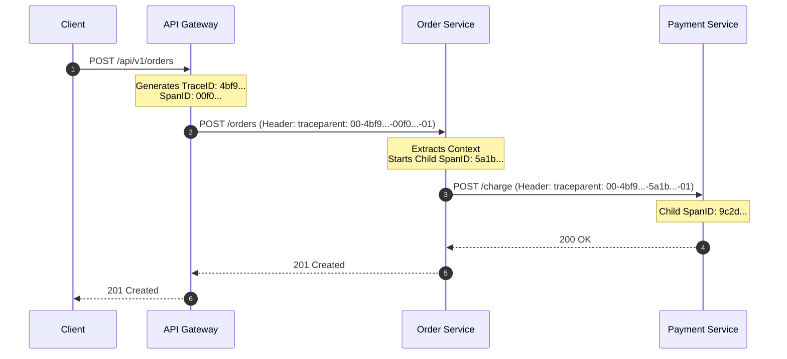

# Chapter 09: Observability — OpenTelemetry, Tracing & Metrics

> "In a monolith, you can attach a debugger or inspect a single stack trace. In microservices, a single user click triggers a cascade of 50 asynchronous network hops across 15 services. Without distributed tracing, debugging a production incident is like finding a needle in a distributed haystack."  
> — *Cindy Sridharan, Distributed Systems Observability (O'Reilly)*
>
> "OpenTelemetry provides a single, vendor-neutral standard for telemetry data. By separating instrumentation from telemetry storage, it liberates engineering organizations from vendor lock-in."  
> — *Ted Young & Matthew Wear, Cloud Native Observability with OpenTelemetry (O'Reilly)*

---

## 📊 1. The Three Pillars vs. High-Cardinality Observability

Traditional monitoring based on static server CPU checks and unstructured log files fails in dynamic containerized fleets. Modern cloud-native observability synthesizes three core data signals:

```
===================================================================================================
                               THE THREE PILLARS OF OBSERVABILITY
===================================================================================================

  1. Metrics (Time-Series Aggregations)
     - Numerically aggregated counters, gauges, and histograms.
     - Answers: "Is there a problem right now? What is the error rate or latency P99?"
     - Engine: Prometheus, VictoriaMetrics, Datadog.

  2. Distributed Tracing (Request Lifecycles)
     - A directed acyclic graph (DAG) of Spans representing an end-to-end user transaction.
     - Answers: "Where did the request spend 85% of its time? Which service threw the error?"
     - Engine: Jaeger, Grafana Tempo, AWS X-Ray.

  3. Structured Logging (Contextual Detail)
     - Machine-readable JSON logs carrying standardized correlation IDs.
     - Answers: "Why did the failure occur? What were the exact parameters and stack trace?"
     - Engine: Grafana Loki, Elasticsearch, OpenSearch.
```

---

## 🧭 2. Distributed Tracing Mechanics & W3C TraceContext

When a client initiates a request, the edge gateway creates a **Trace** comprising multiple causal **Spans**:

```
===================================================================================================
                                   DISTRIBUTED TRACE DAG TIMELINE
===================================================================================================

  [ Trace ID: 4bf92f3577b34da6a3ce929d0e0e4736 ]
  
  Span 1: [ Gateway: POST /api/orders ] ─────────────────────────────────────────► (Total: 250ms)
               │
               ├── Span 2: [ Order Service: createOrder() ] ──────────► (180ms)
               │                 │
               │                 ├── Span 3: [ PostgreSQL: INSERT INTO orders ] ─► (25ms)
               │                 │
               │                 └── Span 4: [ Kafka: Produce 'orders.events' ] ──► (15ms)
               │
               └── Span 5: (Async) [ Inventory Service: ReserveStock() ] ────────► (45ms)
```



### 2.1 The W3C `traceparent` Standard
To propagate context across network boundaries, OpenTelemetry uses the official W3C HTTP header:

$$\text{traceparent: } \underbrace{00}_{\text{version}} - \underbrace{4bf92f3577b34da6a3ce929d0e0e4736}_{\text{16-byte Trace ID}} - \underbrace{00f067aa0ba902b7}_{\text{8-byte Parent Span ID}} - \underbrace{01}_{\text{Trace Flags (01 = Sampled)}}$$

---

## 💻 3. Inline Implementations: OpenTelemetry Context Propagation & Tracing

To demonstrate concrete production observability, we implement:
1. **Spring Boot 3 (Java 21 + Micrometer Tracing + OpenTelemetry Bridge)**: Auto-instrumentation, custom manual spans, and MDC logging correlation.
2. **Golang (Go 1.22+ with `go.opentelemetry.io/otel`)**: Context carrier propagation and custom span lifecycle.
3. **Python / FastAPI (Python 3.11+ with OpenTelemetry SDK)**: Async tracing and span attributes.

---

### 3.1 Spring Boot 3 Tracing & Metrics (Java 21 Virtual Threads)

```java
package com.enterprise.order.service;

import io.micrometer.observation.Observation;
import io.micrometer.observation.ObservationRegistry;
import io.micrometer.tracing.Tracer;
import org.slf4j.Logger;
import org.slf4j.LoggerFactory;
import org.springframework.stereotype.Service;

import java.util.UUID;

@Service
public class ObservableOrderService {
    private static final Logger log = LoggerFactory.getLogger(ObservableOrderService.class);

    private final Tracer tracer;
    private final ObservationRegistry observationRegistry;

    public ObservableOrderService(Tracer tracer, ObservationRegistry observationRegistry) {
        this.tracer = tracer;
        this.observationRegistry = observationRegistry;
    }

    public UUID processOrder(UUID customerId, long amountCents) {
        // 1. Wrap critical business logic inside an OpenTelemetry Observation / Span
        return Observation.createNotStarted("order.processing", observationRegistry)
                .lowCardinalityKeyValue("customer.tier", "PLATINUM")
                .highCardinalityKeyValue("customer.id", customerId.toString())
                .observe(() -> {
                    // SLF4J MDC automatically carries 'traceId' and 'spanId' for structured logging!
                    log.info("Processing order for customer: {} within active trace", customerId);
                    
                    executeDatabaseStep();
                    
                    return UUID.randomUUID();
                });
    }

    private void executeDatabaseStep() {
        // Automatically traced child span
        log.info("Executing database write...");
    }
}
```

#### `application.yml` Production Configuration:
```yaml
management:
  tracing:
    sampling:
      probability: 1.0 # 100% in staging; 0.05 (5%) in high-throughput production
  otlp:
    tracing:
      endpoint: http://otel-collector.monitoring:4318/v1/traces
logging:
  pattern:
    level: "%5p [${spring.application.name:},%X{traceId:-},%X{spanId:-}]"
```

---

### 3.2 Golang Tracing with OpenTelemetry Go SDK (Go 1.22+)

```go
package main

import (
	"context"
	"log"
	"net/http"

	"go.opentelemetry.io/otel"
	"go.opentelemetry.io/otel/attribute"
	"go.opentelemetry.io/otel/propagation"
	"go.opentelemetry.io/otel/trace"
)

var tracer = otel.Tracer("order-service")

func handleOrderHTTP(w http.ResponseWriter, r *http.Request) {
	// 1. Extract W3C TraceContext from incoming HTTP Headers
	ctx := otel.GetTextMapPropagator().Extract(r.Context(), propagation.HeaderCarrier(r.Header))

	// 2. Start a new child span linked to the incoming Trace ID
	ctx, span := tracer.Start(ctx, "HandleOrderRequest",
		trace.WithSpanKind(trace.SpanKindServer),
		trace.WithAttributes(
			attribute.String("http.method", r.Method),
			attribute.String("http.route", "/api/orders"),
		),
	)
	defer span.End()

	log.Printf("Processing request within TraceID: %s, SpanID: %s",
		span.SpanContext().TraceID().String(),
		span.SpanContext().SpanID().String(),
	)

	// 3. Inject context into outbound downstream call
	outboundReq, _ := http.NewRequestWithContext(ctx, "POST", "http://payment.internal/charge", nil)
	otel.GetTextMapPropagator().Inject(ctx, propagation.HeaderCarrier(outboundReq.Header))

	w.WriteHeader(http.StatusOK)
	w.Write([]byte(`{"status":"SUCCESS"}`))
}

func main() {
	// Register global W3C TraceContext propagator
	otel.SetTextMapPropagator(propagation.NewCompositeTextMapPropagator(
		propagation.TraceContext{},
		propagation.Baggage{},
	))

	http.HandleFunc("/api/orders", handleOrderHTTP)
	log.Println("Go OpenTelemetry service listening on :8080...")
	http.ListenAndServe(":8080", nil)
}
```

---

### 3.3 Python / FastAPI Tracing Implementation

```python
"""
OpenTelemetry Tracing in Python with FastAPI.
Demonstrates custom span instrumentation and span attributes.
"""

from fastapi import FastAPI, Request
from opentelemetry import trace
from opentelemetry.trace import Status, StatusCode

# Obtain tracer instance
tracer = trace.get_tracer("ecommerce.order.service")

app = FastAPI(title="Observable Order API")


@app.post("/api/v1/orders")
async def create_order(request: Request):
    # Start manual span with attributes
    with tracer.start_as_current_span("CreateOrderOperation") as span:
        span.set_attribute("app.version", "2.1.0")
        span.set_attribute("customer.loyalty", "GOLD")

        trace_id = format(span.get_span_context().trace_id, "032x")
        span_id = format(span.get_span_context().span_id, "016x")

        print(f"Executing order in active TraceID={trace_id} SpanID={span_id}")

        try:
            # Simulate domain computation
            order_id = "ORD-9821"
            span.set_attribute("order.id", order_id)
            return {"order_id": order_id, "trace_id": trace_id}
        except Exception as exc:
            # Record exception and mark span as error
            span.record_exception(exc)
            span.set_status(Status(StatusCode.ERROR, str(exc)))
            raise
```

---

## 🚨 4. Failure Modes, Concurrency Anomalies & Production Triage

```
===================================================================================================
                               OBSERVABILITY ANOMALY TRIAGE RUNBOOK
===================================================================================================

  Anomaly: High-Cardinality Metric TSDB Collapse
  ├── Symptom: Prometheus / Thanos OOMKills; query latency spikes to minutes; disk consumption explodes.
  ├── Root Cause: Embedding user_id, order_id, or email addresses directly into metric label dimensions.
  └── Triage: Rule: NEVER put unbounded values in metric labels; store IDs in Tracing Span Attributes
              or Structured Log JSON fields instead!

  Anomaly: Context Propagation Loss in Background Threads / Goroutines
  ├── Symptom: Trace fragments into disjointed broken segments; child spans missing parent linkage.
  ├── Root Cause: Launching an async worker (goroutine or ExecutorService) without passing parent 'Context'.
  └── Triage: Always explicitly pass 'ctx' into background tasks; never use 'context.Background()'
              for operations spawned by an incoming request!

  Anomaly: Trace Ingestion Saturation & Network Throttling
  ├── Symptom: High network bandwidth consumption between microservices and OpenTelemetry Collector.
  ├── Root Cause: 100% head-based sampling configured in high-throughput production (100k req/sec).
  └── Triage: Configure Adaptive Tail-Based Sampling in OTel Collector: retain 100% of errors (5xx)
              and slow calls (latency > 1s), but sample only 1% of normal 200 OK responses.
===================================================================================================
```
