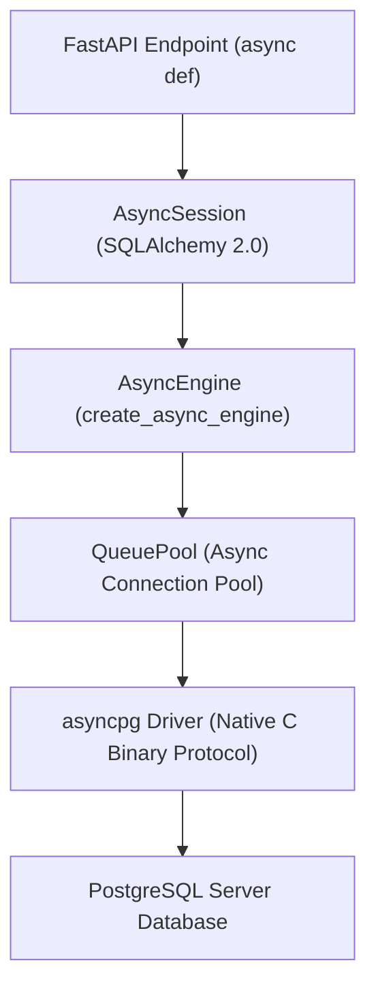
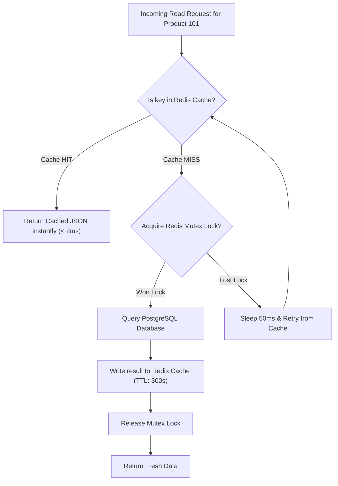

# 02. Async Database Architecture, SQLAlchemy 2.0 & Redis Cache Patterns

> "In an asynchronous Python microservice, database connectivity is the primary point of failure. Writing production async data layers requires mastering non-blocking driver internals (`asyncpg`), connection pool sizing mathematics, transactional session scoping via dependency injection, and cache-aside patterns with distributed locks."  
> — *Referencing Architecture Patterns with Python (Harry Percival & Bob Gregory) & SQLAlchemy 2.0 Documentation*

---

## 1. The Asynchronous Database Driver Pipeline

Traditional Python database drivers (e.g. `psycopg2`, `mysqlclient`) use blocking C extensions that block the OS thread during socket reads.
In asynchronous microservices, the connection pipeline uses **`asyncpg`** with **SQLAlchemy 2.0**:



### Why `asyncpg` Delivers Unmatched Throughput:
* **Native PostgreSQL Binary Protocol**: `asyncpg` speaks PostgreSQL's frontend/backend protocol directly at the binary level rather than using text-based query strings, bypassing character encoding/decoding overhead.
* **Prepared Statement Caching**: Automatically prepares and caches SQL statements on the database server, eliminating repeated SQL query planning phases.

---

## 2. Connection Pool Sizing Mathematics

A common production outage occurs when developers set database connection pool limits too high (`max_size: 200` per pod), causing PostgreSQL's backend processes to exhaust server RAM and context-switch into oblivion.

### The Canonical Formula:
$$\text{Pool Size} = \left( \frac{\text{PostgreSQL Active Cores} \times 2}{\text{Number of Service Pods}} \right) + \text{Spike Margin}$$

* A 16-core PostgreSQL instance performs optimally with approximately **32–40 total active connections**.
* If you run 4 replica pods of an Order Microservice:
  $$\text{Pool Size per Pod} = \frac{32}{4} = 8 \text{ connections (with max overflow: 4)}$$

---

## 3. Production SQLAlchemy 2.0 Asynchronous Repository

Below is a complete enterprise implementation featuring declarative models, type-safe queries, and transactional session management:

```python
from sqlalchemy.ext.asyncio import AsyncSession
from sqlalchemy import select, update, and_
from sqlalchemy.orm import DeclarativeBase, Mapped, mapped_column
from sqlalchemy import String, BigInteger, Numeric
from decimal import Decimal
from typing import Optional, Sequence
import uuid

# 1. Declarative Base
class Base(DeclarativeBase):
    pass

# 2. Domain Entity
class OrderEntity(Base):
    __tablename__ = "orders"

    id: Mapped[str] = mapped_column(String(36), primary_key=True, default=lambda: str(uuid.uuid4()))
    customer_id: Mapped[str] = mapped_column(String(36), index=True, nullable=False)
    total_amount: Mapped[Decimal] = mapped_column(Numeric(12, 2), nullable=False)
    status: Mapped[str] = mapped_column(String(30), nullable=False, default="CREATED")
    version: Mapped[int] = mapped_column(BigInteger, default=1) # Optimistic Locking

# 3. Asynchronous Repository
class OrderRepository:
    def __init__(self, session: AsyncSession):
        self.session = session

    async def get_by_id(self, order_id: str) -> Optional[OrderEntity]:
        statement = select(OrderEntity).where(OrderEntity.id == order_id)
        result = await self.session.execute(statement)
        return result.scalars().first()

    async def create(self, customer_id: str, amount: Decimal) -> OrderEntity:
        order = OrderEntity(
            customer_id=customer_id,
            total_amount=amount,
            status="PENDING_PAYMENT"
        )
        self.session.add(order)
        await self.session.flush() # Flushes SQL INSERT without committing transaction
        return order

    async def update_status_optimistic(self, order_id: str, current_version: int, new_status: str) -> bool:
        """
        Optimistic Concurrency Control: Prevents dirty writes without row locks!
        """
        statement = (
            update(OrderEntity)
            .where(and_(OrderEntity.id == order_id, OrderEntity.version == current_version))
            .values(status=new_status, version=current_version + 1)
        )
        result = await self.session.execute(statement)
        return result.rowcount > 0 # Returns True if successfully updated, False if conflict!
```

---

## 4. Cache-Aside Pattern with Redis & Mutex Lock

To prevent the **Cache Stampede (Thundering Herd)** problem when a hot cache key expires:



```python
import json
import redis.asyncio as aioredis
from typing import Optional, Callable, Awaitable

class DistributedCacheService:
    def __init__(self, redis_client: aioredis.Redis):
        self.redis = redis_client

    async def get_or_set(
        self,
        key: str,
        ttl_seconds: int,
        factory: Callable[[], Awaitable[dict]]
    ) -> dict:
        # 1. Fast Path: Cache Hit
        cached = await self.redis.get(key)
        if cached:
            return json.loads(cached)

        # 2. Cache Miss: Acquire Distributed Mutex to prevent Stampede
        lock_key = f"lock:{key}"
        lock_acquired = await self.redis.set(lock_key, "1", nx=True, ex=10) # 10s auto-expiry lock

        if lock_acquired:
            try:
                # Double-check cache in case another thread populated it while waiting
                double_check = await self.redis.get(key)
                if double_check:
                    return json.loads(double_check)

                # Fetch from authoritative database
                data = await factory()
                await self.redis.set(key, json.dumps(data), ex=ttl_seconds)
                return data
            finally:
                await self.redis.delete(lock_key)
        else:
            # Another worker is populating the cache; wait briefly and read from cache
            import asyncio
            await asyncio.sleep(0.05)
            fallback = await self.redis.get(key)
            if fallback:
                return json.loads(fallback)
            return await factory()
```

---

## 5. Do's, Don'ts & Production Gotchas

| Category | Rule | Deep Technical Rationale |
| :--- | :--- | :--- |
| **DON'T** | Never use `expire_on_commit=True` in asynchronous SQLAlchemy. | In sync code, accessing an expired attribute after commit triggers an implicit SQL query. In async code, accessing an expired attribute triggers a fatal `MissingGreenlet: greenlet_spawn has not been run` runtime exception! Always set `expire_on_commit=False`. |
| **DO** | Always set `pool_pre_ping=True` on your `create_async_engine`. | Cloud infrastructure (AWS RDS, Kubernetes network policies, NAT gateways) closes idle TCP sockets silently after a period of inactivity. Without `pool_pre_ping`, the service attempts to run queries on dead sockets, causing intermittent connection reset errors. |
| **GOTCHA** | Beware of using `session.commit()` inside repository methods. | Committing inside a repository method breaks the **Unit of Work** pattern. If a business use-case needs to update an order and write an outbox event in the same transaction, an inner commit prevents rolling back if the second operation fails. Keep transaction commits in the service/dependency boundary. |
| **DO** | Implement Optimistic Concurrency Control (OCC) for high-contention rows. | Using `SELECT FOR UPDATE` places pessimistic row-level database locks that serialize concurrent transactions and cause database lock queue backlogs. Optimistic locking with a `version` column allows lock-free high concurrency. |
| **DON'T** | Never cache sensitive PII (Personally Identifiable Information) in unencrypted Redis instances. | Ensure Redis is protected with TLS in-transit encryption and AUTH passwords, or tokenize credit card and identity fields before writing to cache keys. |
