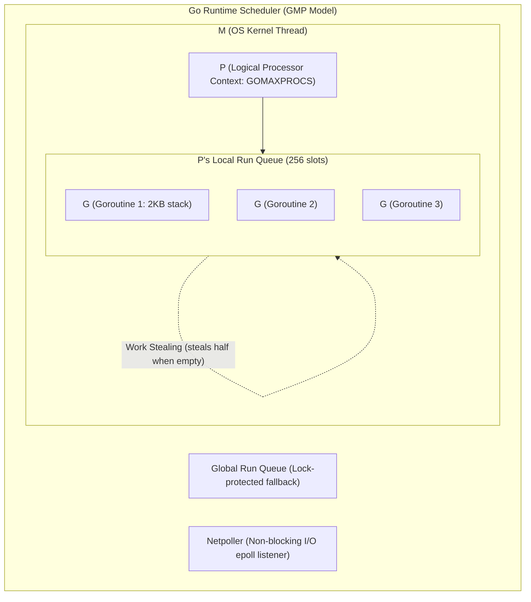
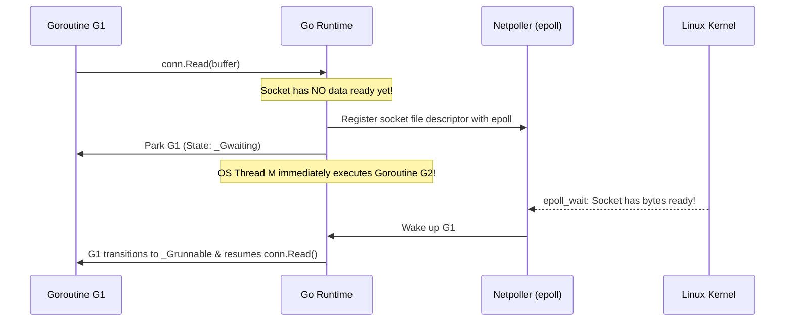
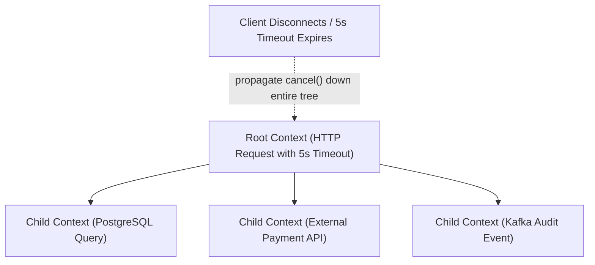

# 01. Go Runtime Internals, The M:N Scheduler & Zero-Allocation Pipelines

> "To write high-throughput Go microservices that handle 100,000 requests per second with sub-millisecond tail latency, an engineer must understand the Go runtime's core internals: the M:N scheduler (GMP model), the netpoller integration with OS epoll/kqueue, escape analysis, and memory-pooling techniques using sync.Pool."  
> — *Referencing Cloud Native Go (Matthew Titmus) & 100 Go Mistakes and How to Avoid Them (Teiva Harsanyi)*

---

## 1. The M:N Scheduler Deep Dive (GMP Architecture)

Operating systems schedule kernel threads (1:1 model). Switching kernel threads requires a full CPU context switch (saving CPU registers, updating page tables, cache line invalidation), taking approximately $1000\text{ns} - 2000\text{ns}$ and costing 1 MB of stack memory per thread.

Go replaces this with an **M:N User-Space Scheduler**:



### The Three Entities:
1. **G (Goroutine)**: The user-space execution unit. Contains a dynamically resizable stack (starting at only **2 KB**, compared to 1 MB for a Java/C++ OS thread), the program counter, and current scheduling status (`_Grunnable`, `_Grunning`, `_Gwaiting`).
2. **M (Machine)**: An operating system kernel thread created via `clone()` or `pthread_create()`. It executes the code of whichever Goroutine is currently assigned to its logical processor.
3. **P (Processor)**: A logical execution resource required to execute Go code. The count of `P` is strictly capped by `runtime.GOMAXPROCS(0)` (typically matching the physical CPU core count).

### Work-Stealing Algorithm
When a local run-queue on processor $P_1$ runs out of runnable goroutines:
1. It checks the netpoller to see if any network sockets have data.
2. It attempts to steal **half the runnable goroutines** from another processor $P_2$'s local run queue.
3. Only as a last resort does it acquire the global lock to pull from the Global Run Queue.
This guarantees high CPU cache locality and zero lock contention during steady-state processing.

---

## 2. Network Poller (Netpoller) & Non-Blocking Syscalls

How can Go provide synchronous-looking networking code (`conn.Read(buf)`) while maintaining non-blocking performance?



The underlying OS thread $M$ is **never blocked**. While Goroutine $G_1$ waits for network packets, $M$ executes hundreds of other goroutines uninterrupted.

---

## 3. Escape Analysis & Zero-Allocation Memory Optimization

Allocating objects on the heap triggers the Go tracing garbage collector, which pauses application execution during concurrent mark-sweep termination. Allocating on the **stack** is virtually free ($O(1)$ stack pointer adjustment with zero GC overhead).

### 3.1 What Causes Variables to Escape to the Heap?
* Returning a pointer from a function.
* Storing a value in an `interface{}` / `any` parameter (e.g. `fmt.Println(val)`).
* Slice sizes that are dynamic or unknown at compile time.

### 3.2 High-Throughput Memory Reuse with `sync.Pool`
To prevent allocating millions of temporary buffers in high-concurrency microservices, use **`sync.Pool`**:

```go
package bufferpool

import (
	"bytes"
	"sync"
)

// Global memory pool for JSON serialization buffers
var jsonBufferPool = sync.Pool{
	New: func() any {
		// Allocate 4 KB pre-warmed buffer
		return bytes.NewBuffer(make([]byte, 0, 4096))
	},
}

// AcquireBuffer gets a buffer from the pool without heap allocation
func AcquireBuffer() *bytes.Buffer {
	return jsonBufferPool.Get().(*bytes.Buffer)
}

// ReleaseBuffer resets and returns the buffer to the pool
func ReleaseBuffer(buf *bytes.Buffer) {
	// Guard against memory leaks: do not pool gigantic buffers that spiked
	if buf.Cap() > 65536 { // 64 KB threshold
		return
	}
	buf.Reset()
	jsonBufferPool.Put(buf)
}
```

---

## 4. Production Context Propagation & Cancellation DAG

Every network request in Go must carry a `context.Context`. A `Context` propagates cancellation signals, deadlines, and request metadata down the entire call tree:



### Production Context Enforcement Pattern:
```go
package service

import (
	"context"
	"errors"
	"time"
)

type OrderService struct {
	repo OrderRepository
}

func (s *OrderService) ProcessOrder(ctx context.Context, orderID string) error {
	// Enforce hard SLA: operation must complete within 2.5 seconds
	ctx, cancel := context.WithTimeout(ctx, 2500*time.Millisecond)
	defer cancel() // Guarantees resources are released when function exits

	// Check cancellation before initiating expensive database work
	if err := ctx.Err(); err != nil {
		return err
	}

	resultChan := make(chan error, 1)
	go func() {
		// Execute database mutation
		resultChan <- s.repo.CommitOrder(ctx, orderID)
	}()

	select {
	case <-ctx.Done():
		// Context deadline exceeded or client dropped connection
		return errors.New("request cancelled or deadline exceeded")
	case err := <-resultChan:
		return err
	}
}
```

---

## 5. Do's, Don'ts & Production Gotchas

| Category | Rule | Deep Technical Rationale |
| :--- | :--- | :--- |
| **DON'T** | Never store `context.Context` inside a struct. | A `Context` represents the boundary of a single execution call. Storing it inside a struct causes race conditions between concurrent invocations and prevents independent timeout cancellations. Always pass `ctx context.Context` as the **first explicit method argument**. |
| **DO** | Pass pointers to large structs ($> 64$ bytes) to avoid stack copy overhead. | Small structs ($\le 64$ bytes) are cheaper to pass by value because they fit directly in CPU registers. Large structs passed by value trigger `memmove` CPU memory copy instructions on every function call. |
| **GOTCHA** | Slices retain their underlying array in memory until the entire array is unreferenced. | Slicing a tiny 10-byte subslice from a 10 MB byte slice (`sub := massiveSlice[:10]`) **prevents the entire 10 MB array from being garbage-collected**! Clone the subslice: `sub = append([]byte(nil), massiveSlice[:10]...)`. |
| **DO** | Check escape analysis during CI builds using `go build -gcflags="-m"`. | Verifies whether critical path objects are staying on the stack or escaping to the heap. |
| **DON'T** | Never use `time.After()` in tight loops. | `time.After(5 * time.Second)` creates a new `time.Timer` channel on every iteration that cannot be garbage collected until the timer actually expires 5 seconds later, creating rapid heap memory bloat. Use `time.NewTimer()` and reuse or stop it. |
