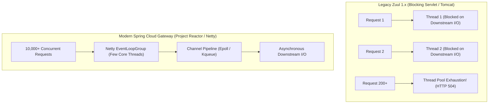
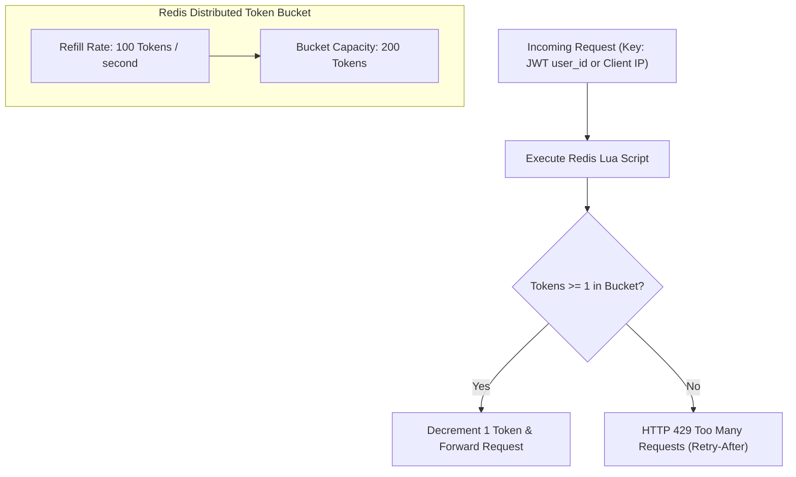

# 01. Spring Cloud Gateway, Routing, Rate Limiting & Token Relay

> "The API Gateway is the single point of entry and the frontline security perimeter for an enterprise microservice fleet. Building an edge gateway requires understanding non-blocking reactive event loops (Project Reactor), Netty connection pooling, cryptographic JWT validation, token relaying, and distributed token-bucket rate limiting."  
> — *Referencing Spring Microservices in Action (John Carnell) & Cloud Native Spring in Action (Thomas Vitale)*

---

## 1. Gateway Architecture: Blocking Zuul 1 vs Reactive Spring Cloud Gateway

Earlier Spring Cloud generations used Netflix Zuul 1.x, which operated on a blocking **one-thread-per-connection** model (blocking Servlet APIs):



### Architectural Superiority of Spring Cloud Gateway:
1. **Non-Blocking Reactive Streams**: Built upon **Spring WebFlux** and **Netty**. Threads never wait for downstream microservices to respond.
2. **Deterministic Memory Footprint**: Instead of allocating a 1 MB thread stack for each of 2,000 active connections (consuming 2 GB of RAM just in thread stacks), Netty handles thousands of connections on a handful of event loop threads sized to available CPU cores.

---

## 2. Gateway Processing Pipeline: Predicates & Filters

Spring Cloud Gateway coordinates requests through a three-stage pipeline:

```mermaid
flowchart LR
    ClientReq["Client HTTP Request"] --> GatewayHandler["Gateway Handler Mapping"]
    GatewayHandler --> RoutePredicate["Route Predicate (Path, Method, Header, Cookie)"]
    RoutePredicate --> PreFilters["Pre-Filters (Auth, Token Relay, Rate Limit)"]
    PreFilters --> DownstreamSvc["Proxied Downstream Microservice"]
    DownstreamSvc --> PostFilters["Post-Filters (Add Headers, Logging, Metrics)"]
    PostFilters --> ClientResp["Client HTTP Response"]
```



1. **Route Predicate Handler Mapping**: Matches incoming requests against configured routes based on HTTP methods, paths, host headers, query parameters, or remote IP addresses.
2. **Gateway Filter Chain (Pre)**: Executes logic *before* forwarding the request downstream (e.g., stripping path prefixes, decrypting cookies, checking rate limits, forwarding OAuth2 tokens).
3. **Gateway Filter Chain (Post)**: Executes logic *after* receiving the downstream response (e.g., adding security headers, calculating latency metrics, transforming response bodies).

---

## 3. Distributed Rate Limiting: Redis Token Bucket

To prevent denial-of-service attacks or runaway batch scripts from starving downstream services, enterprise gateways implement the **Token Bucket Algorithm** backed by Redis:



### Production Java Configuration for Custom Rate Limiter
```java
package com.enterprise.gateway.config;

import org.springframework.cloud.gateway.filter.ratelimit.KeyResolver;
import org.springframework.cloud.gateway.filter.ratelimit.RedisRateLimiter;
import org.springframework.context.annotation.Bean;
import org.springframework.context.annotation.Configuration;
import org.springframework.context.annotation.Primary;
import reactor.core.publisher.Mono;

import java.security.Principal;

@Configuration
public class RateLimiterConfig {

    /**
     * Resolves the rate-limiting key by authenticated User ID (JWT subject).
     * Falls back to client IP address for unauthenticated public endpoints.
     */
    @Bean
    @Primary
    public KeyResolver userKeyResolver() {
        return exchange -> exchange.getPrincipal()
                .map(Principal::getName)
                .defaultIfEmpty(
                    exchange.getRequest().getHeaders().getFirst("X-Forwarded-For") != null
                        ? exchange.getRequest().getHeaders().getFirst("X-Forwarded-For")
                        : exchange.getRequest().getRemoteAddress().getAddress().getHostAddress()
                );
    }

    /**
     * 100 requests per second steady-state refill rate, with 200 burst capacity.
     */
    @Bean
    public RedisRateLimiter redisRateLimiter() {
        return new RedisRateLimiter(100, 200, 1);
    }
}
```

---

## 4. OAuth2 Token Relay & Global Security Filtering

In a Zero-Trust architecture, the Gateway terminates TLS, validates the incoming JWT against the Identity Provider (Keycloak / Okta / Auth0), and relays the claims downstream:

```java
package com.enterprise.gateway.filter;

import org.slf4j.Logger;
import org.slf4j.LoggerFactory;
import org.springframework.cloud.gateway.filter.GlobalFilter;
import org.springframework.core.Ordered;
import org.springframework.http.server.reactive.ServerHttpRequest;
import org.springframework.stereotype.Component;
import org.springframework.web.server.ServerWebExchange;
import reactor.core.publisher.Mono;

import java.util.UUID;

@Component
public class CorrelationAndTracingFilter implements GlobalFilter, Ordered {

    private static final Logger log = LoggerFactory.getLogger(CorrelationAndTracingFilter.class);
    public static final String CORRELATION_ID_HEADER = "X-Correlation-ID";

    @Override
    public Mono<Void> filter(ServerWebExchange exchange, org.springframework.cloud.gateway.filter.GatewayFilterChain chain) {
        ServerHttpRequest request = exchange.getRequest();
        
        // 1. Check or generate correlation ID for distributed tracing
        String correlationId = request.getHeaders().getFirst(CORRELATION_ID_HEADER);
        if (correlationId == null || correlationId.isBlank()) {
            correlationId = UUID.randomUUID().toString();
            log.debug("Generated fresh correlation ID: {}", correlationId);
        }

        // 2. Mutate request headers in a non-blocking fashion
        ServerHttpRequest mutatedRequest = request.mutate()
                .header(CORRELATION_ID_HEADER, correlationId)
                .build();

        ServerWebExchange mutatedExchange = exchange.mutate()
                .request(mutatedRequest)
                .build();

        long startTime = System.currentTimeMillis();

        // 3. Chain downstream and record latency in post-filter callback
        return chain.filter(mutatedExchange).then(Mono.fromRunnable(() -> {
            long duration = System.currentTimeMillis() - startTime;
            log.info("Request path: {} | Method: {} | Status: {} | Latency: {}ms",
                    request.getPath(),
                    request.getMethod(),
                    mutatedExchange.getResponse().getStatusCode(),
                    duration);
        }));
    }

    @Override
    public int getOrder() {
        // High precedence: execute before security and routing filters
        return Ordered.HIGHEST_PRECEDENCE;
    }
}
```

---

## 5. Complete Declarative Routing Specification (`application.yml`)

```yaml
server:
  port: 8080

spring:
  application:
    name: enterprise-api-gateway
  data:
    redis:
      host: redis-cluster
      port: 6379
      timeout: 2000ms
  security:
    oauth2:
      resourceserver:
        jwt:
          jwk-set-uri: http://keycloak-auth:8080/realms/enterprise/protocol/openid-connect/certs

  cloud:
    gateway:
      default-filters:
        - TokenRelay # Automatically relays OAuth2 Bearer token downstream
        - RemoveRequestHeader=Cookie # Strip browser cookies to prevent downstream session pollution
      routes:
        # Route 1: Order Processing Microservice
        - id: order-service-route
          uri: lb://ORDER-SERVICE
          predicates:
            - Path=/api/v1/orders/**
            - Method=GET,POST,PUT,DELETE
          filters:
            - name: RequestRateLimiter
              args:
                redis-rate-limiter.replenishRate: 50
                redis-rate-limiter.burstCapacity: 100
                key-resolver: "#{@userKeyResolver}"
            - name: CircuitBreaker
              args:
                name: orderCircuitBreaker
                fallbackUri: forward:/fallback/orders

        # Route 2: Catalog Browsing Microservice (High-Throughput Public Access)
        - id: catalog-service-route
          uri: lb://CATALOG-SERVICE
          predicates:
            - Path=/api/v1/catalog/**
            - Method=GET
          filters:
            - name: RequestRateLimiter
              args:
                redis-rate-limiter.replenishRate: 500
                redis-rate-limiter.burstCapacity: 1000
                key-resolver: "#{@userKeyResolver}"

      # Global CORS Configuration
      globalcors:
        cors-configurations:
          '[/**]':
            allowedOrigins: "https://app.enterprise.com"
            allowedMethods:
              - GET
              - POST
              - PUT
              - DELETE
              - OPTIONS
            allowedHeaders: "*"
            allowCredentials: true
            maxAge: 3600
```

---

## 6. Do's, Don'ts & Production Gotchas

| Category | Rule | Deep Technical Rationale |
| :--- | :--- | :--- |
| **DON'T** | Never call blocking code (`Thread.sleep()`, JDBC queries, or blocking REST templates) inside Gateway filters. | Spring Cloud Gateway runs on Netty event loops. A single blocking call blocks the entire Netty worker thread, **stalling hundreds of concurrent HTTP connections**. Use non-blocking WebClient or reactive R2DBC. |
| **DO** | Strip sensitive internal headers (`X-User-Role`, `X-Internal-Secret`) at the gateway ingress. | If an attacker sends a crafted request with `X-User-Role: ADMIN`, and the gateway does not strip it, downstream microservices that trust this header will grant unauthorized administrative privileges. |
| **GOTCHA** | Beware of WebSocket connection timeouts in Netty. | By default, HTTP connection pools close idle connections after 60–120 seconds. WebSockets require explicit idle timeout overrides in Netty configuration (`spring.cloud.gateway.httpclient.websocket.max-frame-payload-length`). |
| **DO** | Configure fallback endpoints for every circuit breaker route. | Without a `fallbackUri`, when a downstream microservice fails and the circuit breaker trips, the gateway returns a raw `500 Internal Server Error`. A fallback endpoint returns a graceful cached response or structured `503 Service Unavailable`. |
| **DON'T** | Do not enable Eureka discovery if running inside Kubernetes. | Kubernetes DNS (`order-service.production.svc.cluster.local`) and kube-proxy handle service discovery and layer-4 load balancing natively. Running Eureka inside Kubernetes creates dual-registration race conditions and network split-brain hazards. |
