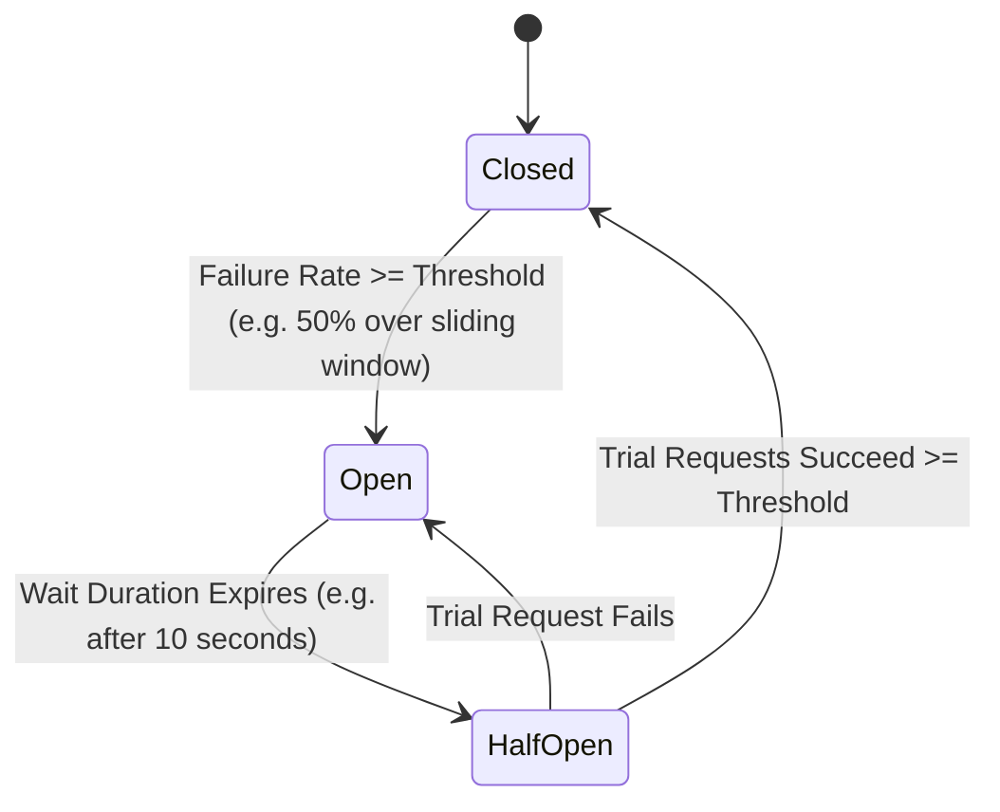
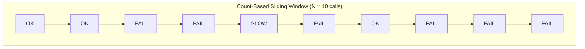
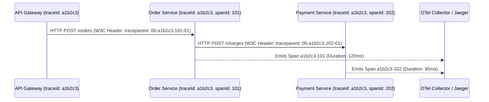

# 02. Resilience4j Fault Tolerance, Circuit Breakers & Distributed Tracing

> "In a distributed microservice mesh, network failures, database brownouts, and cascading thread exhaustion are inevitable. Resilient architectures assume everything will fail: they wrap remote calls in finite state machines (Circuit Breakers), shed load via Bulkheads, apply jittered backoff, and trace requests across boundaries using OpenTelemetry."  
> — *Referencing Release It! (Michael Nygard) & Resilience4j Production Architecture Guides*

---

## 1. Cascading Failure Dynamics & The Circuit Breaker State Machine

When a downstream dependency (e.g., Payment Gateway or Fraud Analysis Service) slows down from $50\text{ms}$ to $5000\text{ms}$, upstream callers hold open socket threads waiting for replies. Within seconds, upstream thread pools are completely saturated, causing the **entire microservice cluster to collapse like dominos**.

Resilience4j intercepts these failures using a 3-state finite state machine:



* **CLOSED**: Normal operation. Requests flow downstream. Failures and slow calls are recorded in an in-memory ring buffer (sliding window).
* **OPEN**: Trip threshold exceeded. All incoming calls are **short-circuited immediately** with a `CallNotPermittedException` without wasting network sockets. Fallback methods execute instantly.
* **HALF-OPEN**: Cooldown window expires. A configurable number of trial requests are permitted through to probe whether the downstream service has recovered.

---

## 2. Sliding Window Mechanics: Count-Based vs Time-Based

Resilience4j maintains an in-memory circular ring buffer to evaluate health metrics without lock contention:



* **Count-Based**: Evaluates the last $N$ calls (e.g., last 100 requests).
* **Time-Based**: Evaluates calls within a rolling time window (e.g., last 60 seconds).
* **Slow Call Rate**: Calls taking longer than `slowCallDurationThreshold` (e.g. $> 2000\text{ms}$) are categorized as failures, preventing slow degradation from locking threads.

---

## 3. Production Multi-Pattern Implementation: Circuit Breaker + Retry + Bulkhead

Below is an enterprise-grade Order Payment processor demonstrating the composition of **Circuit Breaker**, **Exponential Backoff with Jitter**, and **Thread-Pool Bulkhead Isolation**:

```java
package com.enterprise.order.service;

import io.github.resilience4j.bulkhead.annotation.Bulkhead;
import io.github.resilience4j.circuitbreaker.annotation.CircuitBreaker;
import io.github.resilience4j.retry.annotation.Retry;
import org.slf4j.Logger;
import org.slf4j.LoggerFactory;
import org.springframework.stereotype.Service;
import org.springframework.web.client.RestClient;

import java.time.Duration;
import java.util.UUID;
import java.util.concurrent.CompletableFuture;

public record ChargeCommand(String orderId, String customerId, long amountCents) {}
public record ChargeReceipt(String transactionId, String status, boolean isFallback) {}

@Service
public class ResilientPaymentService {

    private static final Logger log = LoggerFactory.getLogger(ResilientPaymentService.class);
    private final RestClient restClient;

    public ResilientPaymentService(RestClient.Builder builder) {
        this.restClient = builder
                .baseUrl("https://payment-service.production.internal")
                .build();
    }

    /**
     * Composed resilience:
     * 1. Bulkhead isolates execution to a dedicated thread pool of max 10 concurrent slots.
     * 2. Circuit breaker opens if failure rate exceeds 50% across the last 20 requests.
     * 3. Retry attempts 3 times with exponential backoff before triggering fallback.
     */
    @Bulkhead(name = "paymentBulkhead", type = Bulkhead.Type.THREADPOOL)
    @CircuitBreaker(name = "paymentCircuitBreaker", fallbackMethod = "chargeFallback")
    @Retry(name = "paymentRetry")
    public CompletableFuture<ChargeReceipt> processPaymentAsync(ChargeCommand command) {
        return CompletableFuture.supplyAsync(() -> {
            log.info("Dispatching charge request for order: {}", command.orderId());

            ChargeReceipt response = restClient.post()
                    .uri("/api/v1/charges")
                    .body(command)
                    .retrieve()
                    .body(ChargeReceipt.class);

            return response;
        });
    }

    /**
     * Fallback method executed when CircuitBreaker is OPEN, Bulkhead is FULL, or Retries fail.
     * Must have identical parameter signature + Throwable parameter!
     */
    public CompletableFuture<ChargeReceipt> chargeFallback(ChargeCommand command, Throwable t) {
        log.warn("Payment service call failed or short-circuited! Order: {} | Reason: {}",
                command.orderId(), t.getMessage());

        // Return a graceful queued response for asynchronous reconciliation
        ChargeReceipt deferredReceipt = new ChargeReceipt(
                "DEFERRED-" + UUID.randomUUID(),
                "QUEUED_FOR_OFFLINE_SYNC",
                true
        );
        return CompletableFuture.completedFuture(deferredReceipt);
    }
}
```

---

## 4. Resilience4j Configuration in `application.yml`

```yaml
resilience4j:
  circuitbreaker:
    instances:
      paymentCircuitBreaker:
        sliding-window-type: COUNT_BASED
        sliding-window-size: 20
        minimum-number-of-calls: 10
        failure-rate-threshold: 50.0
        slow-call-rate-threshold: 70.0
        slow-call-duration-threshold: 2000ms
        wait-duration-in-open-state: 10000ms
        permitted-number-of-calls-in-half-open-state: 5
        automatic-transition-from-open-to-half-open-enabled: true
        record-exceptions:
          - org.springframework.web.client.ResourceAccessException
          - java.io.IOException
          - java.util.concurrent.TimeoutException
        ignore-exceptions:
          - com.enterprise.common.exception.InvalidPaymentPayloadException

  retry:
    instances:
      paymentRetry:
        max-attempts: 3
        wait-duration: 500ms
        enable-exponential-backoff: true
        exponential-backoff-multiplier: 2.0
        exponential-max-wait-duration: 3000ms
        retry-exceptions:
          - org.springframework.web.client.HttpServerErrorException

  thread-pool-bulkhead:
    instances:
      paymentBulkhead:
        max-thread-pool-size: 10
        core-thread-pool-size: 5
        queue-capacity: 20
        keep-alive-duration: 20ms
```

---

## 5. Distributed Tracing with Micrometer & W3C Traceparent

In a microservice call graph, requests jump across multiple HTTP and message boundaries. Without unified distributed tracing, debugging a failure across 8 microservices is nearly impossible.

Spring Boot 3 integrates **Micrometer Tracing** directly with OpenTelemetry:



```yaml
# application.yml for Micrometer Tracing
management:
  tracing:
    sampling:
      probability: 1.0 # Sample 100% in staging; use 0.05 (5%) in high-traffic production
    propagation:
      type: W3C # Injects traceparent and tracestate standard headers
  otlp:
    tracing:
      endpoint: http://otel-collector:4318/v1/traces
```

---

## 6. Do's, Don'ts & Production Gotchas

| Category | Rule | Deep Technical Rationale |
| :--- | :--- | :--- |
| **DON'T** | Never retry non-idempotent operations without an idempotency key. | Retrying a network timeout on an unkeyed `POST /api/charges` will charge the customer multiple times if the first request succeeded on the server but the TCP response dropped in transit. Always send a unique `X-Idempotency-Key: <UUID>`. |
| **DO** | Always apply **Full Jitter** to retry backoffs. | Retrying with fixed exponential backoff causes the **Thundering Herd Problem**: thousands of failed clients retry simultaneously at exactly $500\text{ms}$, $1000\text{ms}$, and $2000\text{ms}$, repeatedly crashing the recovering database. Jitter randomizes retry intervals across a uniform distribution. |
| **GOTCHA** | Beware of fallback methods swallowing exceptions during debugging. | If a fallback method returns a dummy object without logging `t.getMessage()` and `t.getClass()`, error monitors (Sentry / Datadog) will record $100\%$ HTTP 200 success rates while customers complain their orders never processed. Always log and increment Prometheus error counters in fallbacks. |
| **DO** | Set `minimum-number-of-calls` sufficiently high in Circuit Breakers. | If `minimum-number-of-calls: 2`, two initial failed calls during deployment startup will trip the circuit breaker OPEN immediately, locking out all traffic before the service has warmed up. Set it to at least $10 - 20$ calls. |
| **DON'T** | Do not wrap database queries inside thread-pool bulkheads if using virtual threads. | Spawning thread-pool bulkheads creates unnecessary thread switching overhead when virtual threads already unmount cooperatively on blocking I/O. Use semaphore-based bulkheads instead. |
